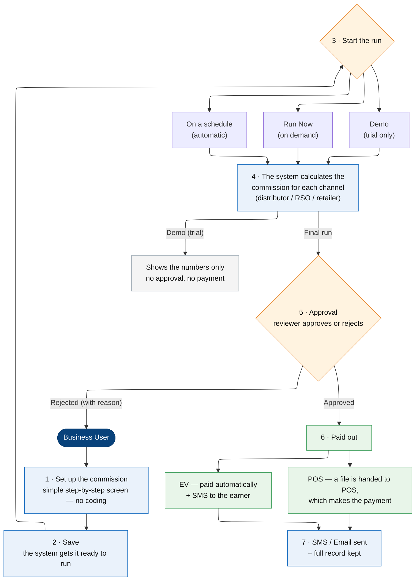

# How a Commission Runs in SalesCom — A Simple Guide

*This guide explains, in plain language, what happens from the moment a commission is set up to the moment it is paid. No technical background is needed.*

---

## The journey at a glance

---

## Step by step

**1. Set up the commission** *(Business User)*
A Business User opens SalesCom and builds the commission on a simple, step-by-step screen — no coding needed. They choose **what to measure** (for example, recharge amount or new connections) and **the reward rule** (for example, "earn this amount when the target is reached").

**2. Save it**
When the setup is complete, the user saves it. The system prepares it so it is ready to run.

**3. Start the run**
A commission can run in three ways:
- **On a schedule** — automatically at a set time (for example, at the end of the month).
- **Run Now** — the user starts it whenever they want.
- **Demo (trial)** — a test run to check the numbers. *A demo never pays anyone and never goes for approval — it just shows the result.*

**4. The system calculates**
The system takes the prepared sales data and works out — step by step, using the rules from step 1 — how much each channel (distributor, RSO, retailer, and so on) has earned. The result is the **commission amount for each channel**.

**5. Approval** *(maker–checker)*
The result is sent for approval. One or more approvers review it and **approve** it, or **reject** it with a reason. **Nothing is paid until it is fully approved.** For safety, the person who set up the commission cannot approve their own.

**6. Payment**
Once fully approved, the commission is paid in one of two ways, depending on how the commission was set up:
- **EV** — paid automatically, and the earner receives an **SMS** confirming the amount.
- **POS** — the system creates a file and hands it to the POS system, which makes the payment.

**7. Records and notifications**
Every step is recorded, and an **email or SMS** is sent at the important moments (approval requested, rejected, paid). The full history can be viewed at any time.

---

## Who does what

| Role | What they do |
|---|---|
| **Business User** | Sets up the commission and starts the run. |
| **Approver** | Reviews the result and approves or rejects it. |
| **The system** | Calculates the commission, routes it for approval, and pays it out. |

## A few good-to-know points

- A **Demo (trial) run** lets you check the numbers safely **before** anything is paid.
- An existing commission can be **copied (cloned)** to create a new one quickly.
- Money is paid **only after full approval**, and the system makes sure the same commission is **not paid twice**.
