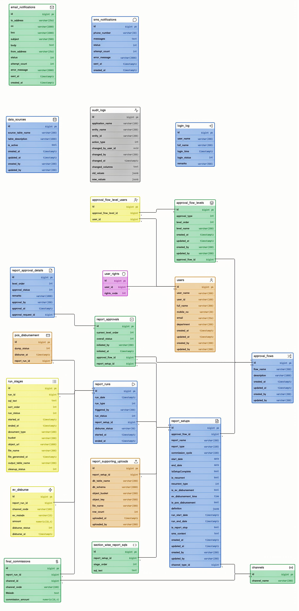

<!-- ===================== PAGE 1 — TITLE ===================== -->

<div align="center">

<br/><br/>


<br/><br/><br/><br/>

# Low-Level Design

**(LLD)**

<br/>

**For**

<br/>

# Sales Commission Automation 2026

<br/><br/><br/>

Banglalink — Sales Commission Automation Platform

</div>

<!-- PAGE BREAK -->
<!-- ===================== PAGE 2 — DOCUMENT HISTORY ===================== -->

## Document History

| SL | Date | Version | Description | Created / Modified by | Reviewed by |
|---|---|---|---|---|---|
| 01 | 17-Jun-2026 | 1.0 | Initial draft | | |
| 02 | 22-Jun-2026 | 2.0 | Final — grounded in the real `salescomdbtst` schema; consistency pass folded in | | |

**Document Information**

| | |
|---|---|
| **Document** | Low-Level Design (LLD) |
| **Version** | 2.0 — Final |
| **Status** | Build-ready |
| **Grounding** | Grounded in the real implemented database schema `salescomdbtst` (Section 3) — all table/column names, key types, and enum codes match it exactly. |
| **Audience** | Frontend (Next.js / React / TS), Backend (.NET / ASP.NET Core, Dapper + EF Core), Calc-engine (Python), DBA, QA. |

> **Consistency note.** A final consistency pass is folded directly into the sections below (phase-aware reject 7.4.6; EV recipient = `ev_msisdn` / `channel_code`; canonical HTTP codes; `int4` enums; one pagination envelope `{ items, page, pageSize, totalItems, totalPages }`). There is no separate errata section.

<!-- PAGE BREAK -->
<!-- ===================== PAGE 3 — TABLE OF CONTENTS ===================== -->

## Table of Contents

- **1 Introduction** — purpose, scope, audience, definitions
- **2 System Architecture** — layered overview, components, tech stack
- **3 Database Schema** — authoritative `salescomdbtst` DDL (21 tables), relationships, ERD
- **4 Authentication & Session** — Central Login SSO + OTP → JWT, RBAC, hourly POS sync
- **5 Data Source Management** — registry + supporting CSV → DB ingestion
- **6 Report Management** — the 5-step wizard, save/publish state machine, run lifecycle
- **7 Approval (Maker-Checker)** — flows, levels, sequential approval, reject→Maker
- **8 Dashboard** — read-only role-scoped views
- **9 Notification** — SMS + Email outbox
- **10 Disbursement** — EV (auto + SMS) / POS (CSV), reconciliation
- **11 Asynchronous Services & Events** — RabbitMQ topology, Python services, Hangfire workers
- **12 Cross-cutting Concerns** — audit, error envelope, pagination, retention
- **13 Module & Service Architecture** — .NET layering, workers, FE module map
- **Appendix A** — IR reference (full self-contained IR contract)

<!-- PAGE BREAK -->
<!-- ===================== PAGE 4+ — BODY ===================== -->

# 1 Introduction

## 1.1 Purpose

This Low-Level Design (LLD) is the **single, build-ready specification** for the Banglalink **SalesCom — Sales Commission Automation Platform**. It is written for a development team starting with zero prior context — Frontend (Next.js/React/TypeScript), Backend (.NET / ASP.NET Core), and Python (SQL Gen Engine). For every feature it covers the screens, the exact database tables and columns (3), the step-by-step process logic, the API contracts, and the validation rules. A developer should be able to build a module from its section alone.

SalesCom replaces the old manual SQL / SRF commission process. A Business User (Maker) builds a commission report through a **5-step no-code wizard**. At **Final Save**, the SQL Gen Engine compiles the configuration into SQL statements. A run trigger (schedule / demo / run-now) drives the SQL Executor, which runs the SQL step by step and produces the commission amount for each recipient. That output flows through a **sequential maker–checker approval**, then is paid via **EV** (automatic + SMS) or **POS** (CSV handoff).

## 1.2 Scope

This LLD covers the **whole platform**, end to end:

- **Authentication & session** — Central Login SSO + OTP → SalesCom JWT (3-hour inactivity logout), hourly user sync, login attempt logging.
- **Data source management** — registering the source tables a report may read. A data source is never deleted, only deactivated.
- **Report management** — the 5-step wizard, supporting-file uploads, and demo / run-now / scheduled runs.
- **SQL Gen Engine** — the Python service that compiles the report configuration into SQL statements, and the SQL Executor that runs those statements step by step to produce per-recipient commission amounts.
- **Approval** — configurable sequential maker–checker flows.
- **Disbursement** — EV (automatic + SMS) and POS (CSV handoff), mutually exclusive per report.
- **Dashboard** — run / approval / disbursement visibility.
- **Notification** — SMS for EV disbursement and ETL status; email and SMS for approval events.
- **Cross-cutting** — audit trail, RBAC, error handling, pagination.

**End-to-end flow:**

```
5-step wizard  →  report configuration saved
              →  Final Save: SQL Gen Engine compiles configuration → SQL statements stored
              →  run trigger (schedule / demo / run-now)
              →  SQL Executor runs step by step
              →  per-recipient commission amounts stored
              →  sequential maker–checker approval
              →  EV (auto + SMS)  OR  POS (CSV handoff)
```

The system is sized for **300–500 total users**, 30–50 peak concurrent, ~200 commission runs/month. This drives the **single-run** execution model (2, 11) with a priority queue (RunNow=high, Demo=mid, Schedule=low).

**Phasing.** The architecture supports all capabilities from day one, but the build is phased: **Phase 1** = the whole system + single-KPI and multi-KPI commission runs; **Phase 2** = more multi-KPI operation types; **Phase 3** = complex patterns (ranking/quartile, history-read, multipliers). Later phases *add* operation types without redesigning the configuration format or the pipeline.

## 1.3 Definitions and Acronyms

| Term | Meaning |
|---|---|
| **LLD** | Low-Level Design — this document. |
| **SRS / HLD** | Software Requirements Specification / High-Level Design — the higher-level specs this LLD implements. |
| **IR** | Intermediate Representation — the JSON form of a report's configuration, stored in the database. The full IR contract is in **Appendix A**. |
| **Block** | A pipeline of steps computing one performance number (**achievement block**) or one payout (**incentive block**). |
| **Stage** | One operation in a block: filter, combine, summarize, calculate, or modify (Phase 1); plus rank and others in later phases. Each stage is compiled into one SQL statement. |
| **Grain** | The row-identity a block resolves to — for example, "one row per RSO". Fixed by the block's final summarize step. |
| **Grain key** | The column(s) that define the grain (e.g. `RSO_CODE`). Block-to-block joins must be on the grain key (1:1 match). |
| **Maker / Checker** | Business User who builds and submits a report / Approver who reviews it. The same person cannot be both Maker and Checker for the same item. |
| **Demo Run / Final Run** | A preview run — never disbursed, skips pre-run checks — used to verify numbers before committing / The real run whose output is approved and paid. |
| **EV / POS** | Electronic Value (automatic payout + SMS) / Point-of-Sale (CSV handoff). Mutually exclusive per report. |
| **Channel type / channel code** | Channel type is a small lookup (Distributor / RSO / Retailer) — each report has one channel type. Channel code is the individual recipient identifier on each commission row. |
| **SQL Gen Engine** | Python service that compiles the report configuration (IR) into SQL statements. |
| **SQL Executor** | Python service that runs those SQL statements step by step and produces the commission amounts. |
| **SQLGlot** | Python SQL library used to build and validate SQL safely — no string concatenation. |
| **Guardrail (G1–G4)** | Multi-KPI safety checks: pre-join uniqueness (G1), post-join row-count check (G2), demo-run per-step row counts (G3), reconciliation (G4). |
| **OTP / SSO / JWT** | One-Time Password (2nd factor) / Single Sign-On (Central Login) / JSON Web Token (SalesCom session; 3-hour inactivity logout). |

---

# 2 System Architecture

## 2.1 Architecture Overview (layered)

SalesCom is a **layered, service-oriented** system. The request path is kept **thin**: the .NET API validates, persists state, and **publishes an event** — heavy or timed work (SQL generation, run execution, disbursement, user sync) happens off the request thread via RabbitMQ + Hangfire. This lets a wizard "Final Save" return instantly while the Python generator compiles SQL in the background, and lets the **single-run priority queue** (RunNow=high, Demo=mid, Schedule=low) serialize execution cleanly.

```
┌──────────────────────────────────────────────────────────────────────────┐
│  PRESENTATION — Next.js / React / TypeScript (App Router)                  │
│  Talks to the backend only over HTTPS /api/v1, carrying the SalesCom JWT.  │
│  No business logic: renders the wizard, lists, approval, dashboard.        │
└───────────────────────────────┬──────────────────────────────────────────┘
                                 │ HTTPS (JWT per request)
┌───────────────────────────────▼──────────────────────────────────────────┐
│  APPLICATION / API — .NET ASP.NET Core, 4 layers                          │
│  • Api          — controllers, DTOs, JWT + RBAC middleware, DI, Hangfire   │
│  • Application  — use-case handlers, validators, ports (interfaces)        │
│  • Domain       — entities, int enums, pure business rules                 │
│  • Infrastructure — Dapper + EF Core, SeaweedFS, RabbitMQ, Central Login,  │
│                     SMS/SMTP, Hangfire jobs                                │
│  Owns: auth, wizard save, the IR, trusted-path writes (final_commissions,  │
│         ev_disburse), approval state machine, notifications.              │
└───────┬───────────────────────────────┬─────────────────────┬────────────┘
        │ Dapper / EF Core              │ publish/consume       │ S3 API
┌───────▼──────────┐   ┌────────────────▼───────────┐   ┌──────▼───────────┐
│  PostgreSQL      │   │  RabbitMQ (event bus)       │   │  SeaweedFS (S3)  │
│  Percona PG 18   │   │  q.sql-generate             │   │  uploads,        │
│  schema          │   │  q.run.high/mid/low         │   │  stage outputs,  │
│  salescomdbtst   │   │  q.ev-disburse              │   │  stage outputs   │
│  (21 tables) +   │   └────────────┬───────┬────────┘   └──────────────────┘
│  per-run temp    │                │       │
└──────────────────┘   ┌────────────▼──┐ ┌──▼──────────────────────┐
                       │ SQL Generator │ │ SQL Executor            │  (Python:
                       │ IR → SQL →    │ │ run_stages → output →   │   SQLGlot +
                       │ section_wise_ │ │ final_commissions       │   SQLAlchemy)
                       │ report_sqls   │ └─────────────────────────┘
                       └───────────────┘

  Hangfire workers (in the .NET app): Scheduler, EV Disbursement, Notification.
  POS disbursement and user sync run via Airflow (daily / hourly schedule).

  EXTERNAL SYSTEMS (7 integration points, contracts-first):
  Central Login (SSO+OTP) · EV API (10.13.2.7:9898) · SMS (172.16.7.210:13082) ·
  Email/SMTP · Source systems via Airflow ETL (DWH/In-house/vPeople/POSDMSDB) ·
  POS (CSV handoff) · RSO App (consumes the public API).
```

Everything is deployed in **Docker** except the production database (bare-metal Percona PostgreSQL 18).

## 2.2 Component Responsibilities

| Component | Responsibility |
|---|---|
| **Web app (Next.js)** | Render UI; collect wizard input; call `/api/v1`; hold the JWT; show demo previews, run status, approval queues, dashboard. |
| **.NET API (4 layers)** | Auth & JWT issuance; CRUD for data sources, reports, flows; **own the IR** (validate shape before save into `report_setups.definition`); **trusted-path writes** of `final_commissions` and `ev_disburse`; approval state machine (`report_approvals.overall_status`); publish RabbitMQ events; host Hangfire workers; send SMS/email. |
| **SQL Generator (Python)** | Consume `report.saved`; compile the IR into per-stage SQL using **SQLGlot AST builders** (never string concat); write `section_wise_report_sqls` (one row per `stage_order`, frozen at Final Save). |
| **SQL Executor (Python)** | Consume `run.requested`; snapshot `section_wise_report_sqls` → `run_stages` (frozen `sql_text` per stage); **re-parse each stage's SQL through the allowlist** (only `SELECT/WITH/JOIN`, aggregates, `CASE`, and `CREATE/DROP TEMP TABLE`); execute stage-by-stage with a **least-privilege** DB role; create per-stage temp/output tables (`run_stages.output_table_name`), record row counts (guardrails G1–G4); hand the last stage's output to the .NET trusted path for `final_commissions`. |
| **RabbitMQ** | Decouple API from workers; carry `report.saved` (triggers SQL generation), `run.requested` (priority queues: RunNow/Demo/Schedule), `run.completed`, `ev.disburse` (triggers per-recipient EV payout). |
| **SeaweedFS (S3)** | Store raw uploads, per-stage outputs. |
| **Hangfire workers** | **Scheduler** (publish `run.requested` for due scheduled reports), **EV Disbursement** (on approval-complete, drive EV payout via `ev.disburse` queue), **Notification** (send SMS/email for approval events). |
| **Airflow (ETL + POS)** | Daily POS disbursement job (generate CSV, hand off to POS); hourly user sync from the **POS system** (direct DB connection → dump → upsert `users` + `user_rights`; Central Login handles auth only, no rights API); bring source data (DWH, In-house, vPeople, POSDMSDB) into prepared `data_sources` tables. |
| **PostgreSQL (Percona 18)** | Authoritative store: schema `salescomdbtst`, 21 tables + per-run temp tables; JSONB IR; hot (3-month) + archive split. |

## 2.3 Technology Stack

| Layer | Technology | Rationale |
|---|---|---|
| Frontend | **TypeScript · React · Next.js** (App Router) | Type-safe UI; server + client components. The wizard is stateful and form-heavy — React fits. |
| Backend API | **C# · .NET (ASP.NET Core)** | Strong typing, mature DI, first-class background-job and messaging ecosystem; 4-layer clean architecture isolates the IR / trusted-path logic from infrastructure. |
| Data access | **Dapper + EF Core** | Dapper for fast hand-tuned reads (lists, dashboard, big joins); **EF Core for the ORM + migrations** (schema as code, owns the `salescomdbtst` DDL). |
| Background jobs | **Hangfire** (PostgreSQL-backed) | Scheduling, retries, timed jobs (report scheduler, disbursement timing, notification-outbox drain, stale-run sweep) without a separate scheduler product. |
| Calc engine | **Python + SQLGlot + SQLAlchemy** | SQLGlot builds SQL as an **AST** (no string concatenation → no injection) and re-parses it to enforce a **read-only allowlist**. Python is the natural home for the dynamic IR→SQL compiler. |
| Event bus | **RabbitMQ** | Priority queues give the locked single-run model (RunNow > Demo > Schedule) for free; decouples the thin API from heavy Python work. |
| Database | **PostgreSQL (Percona 18, bare-metal)** | Window functions (`NTILE`, `PERCENT_RANK`) for Phase-3 ranking; JSONB for the IR; temp tables for stage outputs; `NUMERIC` for exact money. |
| Object storage | **SeaweedFS (S3-compatible)** | Self-hosted S3 for uploads, stage outputs, POS CSVs; no cloud dependency. |
| Auth | **Central Login SSO + OTP → SalesCom JWT** (3-hour inactivity logout) | Internal-only; reuses the company IdP; SalesCom issues its own JWT and never exposes the IdP token to the browser. |
| ETL | **Apache Airflow** (shared) | Brings source data (DWH, In-house, vPeople, POSDMSDB) into prepared `data_sources` tables; long cohorts pre-computed here. |
| Deployment | **Docker** (everything except the prod DB) | Each deployable (web, api, calc) ships as a container; local stack via `docker-compose`. |

---

# 3 Database Schema

This section is the authoritative, runnable physical schema for SalesCom. All objects live in the PostgreSQL schema `salescomdbtst`. The DDL below is the real implemented schema — copy it directly.

**Conventions (apply to every table):**
- **PK** = `id int8 GENERATED BY DEFAULT AS IDENTITY` (bigint identity — NOT `BIGSERIAL`, NOT UUID).
- **FK** columns = `int8` (bigint).
- **Money** = `numeric(18,4)` (BDT).
- **Timestamps** = `timestamptz` (stored UTC). Exception: user-facing date/time inputs such as `report_setups.start_date`, `end_date`, `run_start_date`, `run_end_date`, and `ev_disbursement_time` are stored as `date` or `time` in the DB exactly as the user enters them — no timezone conversion applied.
- Audit columns where present: `created_at` / `updated_at` (timestamptz), `created_by` / `updated_by` (varchar user_name).

### 3.1 Module grouping (21 tables)

| Module | Tables |
|---|---|
| Identity & Access | `users`, `user_rights`, `login_log` |
| Catalog | `data_sources`, `channels` |
| Report | `report_setups`, `report_supporting_uploads`, `section_wise_report_sqls` |
| Run & Output | `report_runs`, `run_stages`, `final_commissions` |
| Approval | `approval_flows`, `approval_flow_levels`, `approval_flow_level_users`, `report_approvals`, `report_approval_details` |
| Disbursement | `ev_disburse`, `pos_disbursement` |
| Notification | `email_notifications`, `sms_notifications` |
| Cross-cutting | `audit_logs` |

> `recurrent_type` and `approval_type` are `int4` enum columns (not separate lookup tables). Email and SMS notifications are stored in separate tables. POS disbursement is triggered by Airflow daily.

---

### 3.2 Identity & Access

```sql
-- ===== users =====
CREATE TABLE salescomdbtst.users (
	id int8 GENERATED BY DEFAULT AS IDENTITY( INCREMENT BY 1 MINVALUE 1 MAXVALUE 9223372036854775807 START 1 CACHE 1 NO CYCLE) NOT NULL,
	user_name varchar(200) NOT NULL,
	user_id varchar(100) NOT NULL,
	full_name varchar(300) NOT NULL,
	mobile_no varchar(30) NOT NULL,
	email varchar(256) NOT NULL,
	department varchar(200) NOT NULL,
	created_at timestamptz NOT NULL,
	updated_at timestamptz NULL,
	created_by varchar(200) NOT NULL,
	updated_by varchar(200) NULL,
	CONSTRAINT "PK_users" PRIMARY KEY (id)
);
CREATE UNIQUE INDEX ux_users_user_id ON salescomdbtst.users USING btree (user_id);

-- ===== user_rights =====
-- rights_code: a per-action PERMISSION code (e.g. 25=report_view, 26=report_create, ... see LLD 4.7).
-- One row per (user, permission). Roles are POS-defined bundles; the sync flattens a user's role into these rows.
CREATE TABLE salescomdbtst.user_rights (
	id int8 GENERATED BY DEFAULT AS IDENTITY( INCREMENT BY 1 MINVALUE 1 MAXVALUE 9223372036854775807 START 1 CACHE 1 NO CYCLE) NOT NULL,
	user_id int8 NOT NULL,
	rights_code int4 NOT NULL,
	CONSTRAINT "PK_user_rights" PRIMARY KEY (id),
	CONSTRAINT "FK_user_rights_users_user_id" FOREIGN KEY (user_id) REFERENCES salescomdbtst.users(id)
);
CREATE UNIQUE INDEX ux_user_rights_user_right ON salescomdbtst.user_rights USING btree (user_id, rights_code);

-- ===== login_log =====
-- Every sign-in attempt. login_status: 1=Success, 2=Failed
CREATE TABLE salescomdbtst.login_log (
	id int8 GENERATED BY DEFAULT AS IDENTITY( INCREMENT BY 1 MINVALUE 1 MAXVALUE 9223372036854775807 START 1 CACHE 1 NO CYCLE) NOT NULL,
	user_name varchar(200) NOT NULL,
	full_name varchar(300) NOT NULL,
	login_time timestamptz NOT NULL,
	login_status int4 NOT NULL,
	remarks varchar(500) NOT NULL,
	CONSTRAINT "PK_login_log" PRIMARY KEY (id)
);
```

---

### 3.3 Catalog

```sql
-- ===== channels =====
-- Channel-TYPE lookup: Distributor / RSO / Retailer etc. Small seeded table.
CREATE TABLE salescomdbtst.channels (
	id int8 GENERATED BY DEFAULT AS IDENTITY( INCREMENT BY 1 MINVALUE 1 MAXVALUE 9223372036854775807 START 1 CACHE 1 NO CYCLE) NOT NULL,
	channel_name varchar(200) NOT NULL,
	CONSTRAINT "PK_channels" PRIMARY KEY (id)
);
CREATE UNIQUE INDEX ux_channels_channel_name ON salescomdbtst.channels USING btree (channel_name);

-- ===== data_sources =====
-- Registered source tables the calc engine may read. Never deleted, only deactivated.
CREATE TABLE salescomdbtst.data_sources (
	id int8 GENERATED BY DEFAULT AS IDENTITY( INCREMENT BY 1 MINVALUE 1 MAXVALUE 9223372036854775807 START 1 CACHE 1 NO CYCLE) NOT NULL,
	source_table_name varchar(200) NOT NULL,
	table_description varchar(1000) NULL,
	is_active bool NOT NULL,
	created_at timestamptz NOT NULL,
	updated_at timestamptz NULL,
	created_by varchar(200) NOT NULL,
	updated_by varchar(200) NULL,
	CONSTRAINT "PK_data_sources" PRIMARY KEY (id)
);
CREATE UNIQUE INDEX ux_data_sources_source_table ON salescomdbtst.data_sources USING btree (source_table_name);
```

---

### 3.4 Report

```sql
-- ===== report_setups =====
-- The report definition. definition (JSONB) = the IR (the calc configuration).
-- is_report_stop: true = report is stopped (replaces the old ON/STOP status column).
-- run_start_date / run_end_date: schedule window for recurring reports.
-- sms_content: template for the EV payout SMS sent to the recipient.
CREATE TABLE salescomdbtst.report_setups (
	id int8 GENERATED BY DEFAULT AS IDENTITY( INCREMENT BY 1 MINVALUE 1 MAXVALUE 9223372036854775807 START 1 CACHE 1 NO CYCLE) NOT NULL,
	report_name varchar(200) NOT NULL,
	report_type varchar(100) NOT NULL,
	channel_type_id int8 NOT NULL,
	commission_cycle varchar(100) NOT NULL,
	start_date date NOT NULL,
	end_date date NOT NULL,
	is_setup_complete bool NOT NULL,
	is_recurrent bool NOT NULL,
	recurrent_type int4 NOT NULL,
	is_ev_disbursement bool NOT NULL,
	ev_disbursement_time time NULL,
	is_pos_disbursement bool NOT NULL,
	definition jsonb NULL,
	run_start_date timestamptz NULL,
	run_end_date timestamptz NULL,
	is_report_stop bool NOT NULL,
	sms_content text NULL,
	created_at timestamptz NOT NULL,
	updated_at timestamptz NULL,
	created_by varchar(200) NOT NULL,
	updated_by varchar(200) NULL,
	approval_flow_id int8 NOT NULL,
	CONSTRAINT "PK_report_setups" PRIMARY KEY (id),
	CONSTRAINT "FK_report_setups_approval_flows_approval_flow_id" FOREIGN KEY (approval_flow_id) REFERENCES salescomdbtst.approval_flows(id),
	CONSTRAINT "FK_report_setups_channels_channel_type_id" FOREIGN KEY (channel_type_id) REFERENCES salescomdbtst.channels(id)
);
CREATE INDEX "IX_report_setups_approval_flow_id" ON salescomdbtst.report_setups USING btree (approval_flow_id);
CREATE INDEX "IX_report_setups_channel_type_id" ON salescomdbtst.report_setups USING btree (channel_type_id);

-- ===== report_supporting_uploads =====
-- Files uploaded to support a report (e.g. target sheets, config tables). Stored in SeaweedFS.
CREATE TABLE salescomdbtst.report_supporting_uploads (
	id int8 GENERATED BY DEFAULT AS IDENTITY( INCREMENT BY 1 MINVALUE 1 MAXVALUE 9223372036854775807 START 1 CACHE 1 NO CYCLE) NOT NULL,
	report_setup_id int8 NOT NULL,
	db_table_name varchar(200) NOT NULL,
	db_schema varchar(2000) NOT NULL,
	object_bucket varchar(200) NOT NULL,
	object_key varchar(500) NOT NULL,
	file_name varchar(300) NOT NULL,
	row_count int4 NULL,
	uploaded_at timestamptz NOT NULL,
	uploaded_by varchar(200) NOT NULL,
	CONSTRAINT "PK_report_supporting_uploads" PRIMARY KEY (id),
	CONSTRAINT "FK_report_supporting_uploads_report_setups_report_setup_id" FOREIGN KEY (report_setup_id) REFERENCES salescomdbtst.report_setups(id)
);
CREATE INDEX ix_report_supporting_uploads_report_setup ON salescomdbtst.report_supporting_uploads USING btree (report_setup_id);

-- ===== section_wise_report_sqls =====
-- Compiled SQL for each stage of the report, frozen at Final Save.
-- One row per (report_setup_id, stage_order). Snapshotted into run_stages at run time.
CREATE TABLE salescomdbtst.section_wise_report_sqls (
	id int8 GENERATED BY DEFAULT AS IDENTITY( INCREMENT BY 1 MINVALUE 1 MAXVALUE 9223372036854775807 START 1 CACHE 1 NO CYCLE) NOT NULL,
	report_setup_id int8 NOT NULL,
	stage_order int4 NOT NULL,
	sql_text text NULL,
	CONSTRAINT "PK_section_wise_report_sqls" PRIMARY KEY (id),
	CONSTRAINT "FK_section_wise_report_sqls_report_setups_report_setup_id" FOREIGN KEY (report_setup_id) REFERENCES salescomdbtst.report_setups(id)
);
CREATE UNIQUE INDEX ux_section_wise_report_sqls_setup_order ON salescomdbtst.section_wise_report_sqls USING btree (report_setup_id, stage_order);
```

---

### 3.5 Run & Output

```sql
-- ===== report_runs =====
-- One row per run attempt. run_type: 1=Demo, 2=Final.
-- run_status: 0=Pending, 1=Running, 2=Completed, 3=Failed
-- disburse_status (varchar): NONE / PENDING / IN_PROGRESS / DONE / FAILED
CREATE TABLE salescomdbtst.report_runs (
	id int8 GENERATED BY DEFAULT AS IDENTITY( INCREMENT BY 1 MINVALUE 1 MAXVALUE 9223372036854775807 START 1 CACHE 1 NO CYCLE) NOT NULL,
	report_setup_id int8 NOT NULL,
	run_date timestamptz NOT NULL,
	run_type int4 NOT NULL,
	triggered_by varchar(200) NULL,
	run_status int4 NOT NULL,
	disburse_status varchar(50) NOT NULL,
	started_at timestamptz NULL,
	ended_at timestamptz NULL,
	CONSTRAINT "PK_report_runs" PRIMARY KEY (id),
	CONSTRAINT "FK_report_runs_report_setups_report_setup_id" FOREIGN KEY (report_setup_id) REFERENCES salescomdbtst.report_setups(id)
);
CREATE INDEX ix_report_runs_report_setup ON salescomdbtst.report_runs USING btree (report_setup_id);

-- ===== run_stages =====
-- Snapshot of each SQL stage for a specific run (frozen from section_wise_report_sqls).
-- sort_order: execution sequence. cleanup_status: 0=Pending, 1=Done, 2=Skipped.
-- run_status: 0=Pending, 1=Running, 2=Completed, 3=Failed
CREATE TABLE salescomdbtst.run_stages (
	id int8 GENERATED BY DEFAULT AS IDENTITY( INCREMENT BY 1 MINVALUE 1 MAXVALUE 9223372036854775807 START 1 CACHE 1 NO CYCLE) NOT NULL,
	run_id int8 NOT NULL,
	sql_text text NOT NULL,
	sort_order int4 NOT NULL,
	run_status int4 NOT NULL,
	started_at timestamptz NULL,
	ended_at timestamptz NULL,
	document_type varchar(100) NULL,
	bucket varchar(200) NULL,
	object_url varchar(1000) NULL,
	file_name varchar(300) NULL,
	file_generated_at timestamptz NOT NULL,
	output_table_name varchar(200) NULL,
	cleanup_status int4 NOT NULL,
	CONSTRAINT "PK_run_stages" PRIMARY KEY (id),
	CONSTRAINT "FK_run_stages_report_runs_run_id" FOREIGN KEY (run_id) REFERENCES salescomdbtst.report_runs(id)
);
CREATE INDEX ix_run_stages_run ON salescomdbtst.run_stages USING btree (run_id);

-- ===== final_commissions =====
-- Per-recipient commission output. Idempotent: UNIQUE(report_run_id, channel_code).
-- channel_id = channel TYPE (FK to channels). channel_code = individual recipient key.
CREATE TABLE salescomdbtst.final_commissions (
	id int8 GENERATED BY DEFAULT AS IDENTITY( INCREMENT BY 1 MINVALUE 1 MAXVALUE 9223372036854775807 START 1 CACHE 1 NO CYCLE) NOT NULL,
	report_run_id int8 NOT NULL,
	channel_id int8 NOT NULL,
	channel_code varchar(100) NOT NULL,
	msisdn text NOT NULL,
	commission_amount numeric(18, 4) NOT NULL,
	CONSTRAINT "PK_final_commissions" PRIMARY KEY (id),
	CONSTRAINT "FK_final_commissions_channels_channel_id" FOREIGN KEY (channel_id) REFERENCES salescomdbtst.channels(id),
	CONSTRAINT "FK_final_commissions_report_runs_report_run_id" FOREIGN KEY (report_run_id) REFERENCES salescomdbtst.report_runs(id)
);
CREATE INDEX ix_final_commissions_channel ON salescomdbtst.final_commissions USING btree (channel_id);
CREATE UNIQUE INDEX ux_final_commissions_run_channel_code ON salescomdbtst.final_commissions USING btree (report_run_id, channel_code);
```

---

### 3.6 Approval

```sql
-- ===== approval_flows =====
CREATE TABLE salescomdbtst.approval_flows (
	id int8 GENERATED BY DEFAULT AS IDENTITY( INCREMENT BY 1 MINVALUE 1 MAXVALUE 9223372036854775807 START 1 CACHE 1 NO CYCLE) NOT NULL,
	flow_name varchar(200) NOT NULL,
	description varchar(1000) NULL,
	created_at timestamptz NOT NULL,
	updated_at timestamptz NULL,
	created_by varchar(200) NOT NULL,
	updated_by varchar(200) NULL,
	CONSTRAINT "PK_approval_flows" PRIMARY KEY (id)
);

-- ===== approval_flow_levels =====
-- approval_type: 1=PRE_RUN (setup approval), 2=POST_RUN (result approval)
CREATE TABLE salescomdbtst.approval_flow_levels (
	id int8 GENERATED BY DEFAULT AS IDENTITY( INCREMENT BY 1 MINVALUE 1 MAXVALUE 9223372036854775807 START 1 CACHE 1 NO CYCLE) NOT NULL,
	approval_flow_id int8 NOT NULL,
	approval_type int4 NOT NULL,
	level_order int4 NOT NULL,
	level_name varchar(200) NOT NULL,
	created_at timestamptz NOT NULL,
	updated_at timestamptz NULL,
	created_by varchar(200) NOT NULL,
	updated_by varchar(200) NULL,
	CONSTRAINT "PK_approval_flow_levels" PRIMARY KEY (id),
	CONSTRAINT "FK_approval_flow_levels_approval_flows_approval_flow_id" FOREIGN KEY (approval_flow_id) REFERENCES salescomdbtst.approval_flows(id)
);
CREATE UNIQUE INDEX ux_approval_flow_levels_flow_order ON salescomdbtst.approval_flow_levels USING btree (approval_flow_id, level_order);

-- ===== approval_flow_level_users =====
-- Checkers assigned to each level. user_id is int8 FK to users.id.
CREATE TABLE salescomdbtst.approval_flow_level_users (
	id int8 GENERATED BY DEFAULT AS IDENTITY( INCREMENT BY 1 MINVALUE 1 MAXVALUE 9223372036854775807 START 1 CACHE 1 NO CYCLE) NOT NULL,
	approval_flow_level_id int8 NOT NULL,
	user_id int8 NOT NULL,
	CONSTRAINT "PK_approval_flow_level_users" PRIMARY KEY (id),
	CONSTRAINT "FK_approval_flow_level_users_approval_flow_levels_approval_flo~" FOREIGN KEY (approval_flow_level_id) REFERENCES salescomdbtst.approval_flow_levels(id),
	CONSTRAINT "FK_approval_flow_level_users_users_user_id" FOREIGN KEY (user_id) REFERENCES salescomdbtst.users(id)
);
CREATE INDEX "IX_approval_flow_level_users_user_id" ON salescomdbtst.approval_flow_level_users USING btree (user_id);
CREATE UNIQUE INDEX ux_approval_flow_level_users_level_user ON salescomdbtst.approval_flow_level_users USING btree (approval_flow_level_id, user_id);

-- ===== report_approvals =====
-- One live approval instance per report_setup (reused across its lifetime).
-- overall_status: 0=Draft/Pending-Edit, 1=Pre-Approval-Pending, 2=Pre-Approved,
--                 3=Post-Approval-Pending, 4=Post-Approved
CREATE TABLE salescomdbtst.report_approvals (
	id int8 GENERATED BY DEFAULT AS IDENTITY( INCREMENT BY 1 MINVALUE 1 MAXVALUE 9223372036854775807 START 1 CACHE 1 NO CYCLE) NOT NULL,
	report_setup_id int8 NOT NULL,
	approval_flow_id int8 NOT NULL,
	current_level_order int4 NOT NULL,
	overall_status int4 NOT NULL,
	initiated_by varchar(200) NOT NULL,
	initiated_at timestamptz NOT NULL,
	CONSTRAINT "PK_report_approvals" PRIMARY KEY (id),
	CONSTRAINT "FK_report_approvals_approval_flows_approval_flow_id" FOREIGN KEY (approval_flow_id) REFERENCES salescomdbtst.approval_flows(id),
	CONSTRAINT "FK_report_approvals_report_setups_report_setup_id" FOREIGN KEY (report_setup_id) REFERENCES salescomdbtst.report_setups(id)
);
CREATE INDEX ix_report_approvals_flow ON salescomdbtst.report_approvals USING btree (approval_flow_id);
CREATE INDEX ix_report_approvals_report_setup ON salescomdbtst.report_approvals USING btree (report_setup_id);

-- ===== report_approval_details =====
-- One row per individual approve/reject decision.
-- approval_status: 1=Approved, 2=Rejected
CREATE TABLE salescomdbtst.report_approval_details (
	id int8 GENERATED BY DEFAULT AS IDENTITY( INCREMENT BY 1 MINVALUE 1 MAXVALUE 9223372036854775807 START 1 CACHE 1 NO CYCLE) NOT NULL,
	approval_request_id int8 NOT NULL,
	level_order int4 NOT NULL,
	approval_status int4 NOT NULL,
	remarks varchar(1000) NULL,
	approval_by varchar(200) NOT NULL,
	approval_at timestamptz NOT NULL,
	CONSTRAINT "PK_report_approval_details" PRIMARY KEY (id),
	CONSTRAINT "FK_report_approval_details_report_approvals_approval_request_id" FOREIGN KEY (approval_request_id) REFERENCES salescomdbtst.report_approvals(id)
);
CREATE INDEX ix_report_approval_details_approval ON salescomdbtst.report_approval_details USING btree (approval_request_id);
```

---

### 3.7 Disbursement

```sql
-- ===== ev_disburse =====
-- Per-recipient EV payout. Idempotent: UNIQUE(report_run_id, channel_code).
-- ev_msisdn: recipient phone number for the EV API call and the payout SMS.
-- disburse_status: 0=Pending, 1=Sent, 2=Success, 3=Failed, 4=Retry
CREATE TABLE salescomdbtst.ev_disburse (
	id int8 GENERATED BY DEFAULT AS IDENTITY( INCREMENT BY 1 MINVALUE 1 MAXVALUE 9223372036854775807 START 1 CACHE 1 NO CYCLE) NOT NULL,
	report_run_id int8 NOT NULL,
	channel_code varchar(100) NOT NULL,
	ev_msisdn varchar(15) NOT NULL,
	amount numeric(18, 4) NOT NULL,
	disburse_status int4 NOT NULL,
	disburse_at timestamptz NULL,
	CONSTRAINT "PK_ev_disburse" PRIMARY KEY (id),
	CONSTRAINT "FK_ev_disburse_report_runs_report_run_id" FOREIGN KEY (report_run_id) REFERENCES salescomdbtst.report_runs(id)
);
CREATE INDEX ix_ev_disburse_report_run ON salescomdbtst.ev_disburse USING btree (report_run_id);

-- ===== pos_disbursement =====
-- One row per POS batch. Triggered by Airflow daily job; CSV stored in SeaweedFS.
-- dump_status: 0=Pending, 1=Dumped, 2=Failed
CREATE TABLE salescomdbtst.pos_disbursement (
	id int8 GENERATED BY DEFAULT AS IDENTITY( INCREMENT BY 1 MINVALUE 1 MAXVALUE 9223372036854775807 START 1 CACHE 1 NO CYCLE) NOT NULL,
	report_run_id int8 NOT NULL,
	dump_status int4 NOT NULL,
	disburse_at timestamptz NULL,
	CONSTRAINT "PK_pos_disbursement" PRIMARY KEY (id),
	CONSTRAINT "FK_pos_disbursement_report_runs_report_run_id" FOREIGN KEY (report_run_id) REFERENCES salescomdbtst.report_runs(id)
);
CREATE INDEX ix_pos_disbursement_report_run ON salescomdbtst.pos_disbursement USING btree (report_run_id);
```

---

### 3.8 Notification

```sql
-- ===== email_notifications =====
-- Outbound email queue (approval events). status: 0=Pending, 1=Sent, 2=Failed
CREATE TABLE salescomdbtst.email_notifications (
	id int8 GENERATED BY DEFAULT AS IDENTITY( INCREMENT BY 1 MINVALUE 1 MAXVALUE 9223372036854775807 START 1 CACHE 1 NO CYCLE) NOT NULL,
	to_address varchar(256) NOT NULL,
	cc varchar(1000) NULL,
	bcc varchar(1000) NULL,
	subject varchar(500) NULL,
	body text NOT NULL,
	from_address varchar(256) NULL,
	status int4 NOT NULL,
	attempt_count int4 NOT NULL,
	error_message varchar(2000) NULL,
	sent_at timestamptz NULL,
	created_at timestamptz NOT NULL,
	CONSTRAINT "PK_email_notifications" PRIMARY KEY (id)
);

-- ===== sms_notifications =====
-- Outbound SMS queue (EV payout confirmation + approval events). status: 0=Pending, 1=Sent, 2=Failed
CREATE TABLE salescomdbtst.sms_notifications (
	id int8 GENERATED BY DEFAULT AS IDENTITY( INCREMENT BY 1 MINVALUE 1 MAXVALUE 9223372036854775807 START 1 CACHE 1 NO CYCLE) NOT NULL,
	phone_number varchar(30) NOT NULL,
	messages text NOT NULL,
	status int4 NOT NULL,
	attempt_count int4 NOT NULL,
	error_message varchar(2000) NULL,
	sent_at timestamptz NULL,
	created_at timestamptz NOT NULL,
	CONSTRAINT "PK_sms_notifications" PRIMARY KEY (id)
);
```

---

### 3.9 Cross-cutting

```sql
-- ===== audit_logs =====
-- Full audit trail for every config change and state transition.
-- changed_by_user_id is uuid (Central-Login id type); all other ids are int8.
CREATE TABLE salescomdbtst.audit_logs (
	id int8 GENERATED BY DEFAULT AS IDENTITY( INCREMENT BY 1 MINVALUE 1 MAXVALUE 9223372036854775807 START 1 CACHE 1 NO CYCLE) NOT NULL,
	application_name varchar(100) NOT NULL,
	entity_name varchar(200) NOT NULL,
	entity_id varchar(200) NOT NULL,
	action_type int4 NOT NULL,
	changed_by_user_id uuid NULL,
	changed_by varchar(200) NOT NULL,
	changed_at timestamptz NOT NULL,
	changed_columns text NULL,
	old_values jsonb NULL,
	new_values jsonb NULL,
	CONSTRAINT "PK_audit_logs" PRIMARY KEY (id)
);
CREATE INDEX ix_audit_logs_entity ON salescomdbtst.audit_logs USING btree (entity_name, entity_id);
```

---

### 3.10 Entity Relationship Diagram



The ER diagram above shows all 21 tables, their columns, and FK relationships. The DDL in 3.2–3.9 is the authoritative source; this diagram is the visual companion.

---

# 4 Authentication & Session

## 4.1 Overview

SalesCom is internal-only. Sign-in is handled by Banglalink's **Central Login** (`blposapi.banglalink.net`) — username + password + **OTP**. SalesCom never stores passwords and never renders an OTP screen; it only mints its own **JWT** once Central Login confirms the user. Central Login is part of the **POS** system, which is the authoritative store of SalesCom users and their rights — synced into `users` / `user_rights` every hour (4.5).

**Login flow (one line):** web app → backend (holds the secret app name/key) calls Central Login → SSO redirect → user does OTP on Central Login → browser bounced to the frontend callback page with a single-use `authToken` → backend verifies the token server-to-server and mints the SalesCom JWT. The browser only ever holds the SalesCom JWT.

Two session mechanics: a **3-hour inactivity logout** (frontend drops the JWT) and the **hourly POS sync** (4.5). The exact `authToken` format and verify contract are pinned in the Central Login ICD.

## 4.2 Screens

| Screen | Owner | Contents |
|---|---|---|
| **Login** | SalesCom | Username, Password (show/hide), Remember-me, Sign In. Posts to the SalesCom backend, never straight to Central Login. |
| **OTP challenge** | Central Login | Central Login's own page (OTP input, resend, lockout). SalesCom has no OTP screen. |
| **Callback** | SalesCom | "Signing you in…" interstitial on `/login/callback` while the backend exchanges the `authToken` for a JWT. |
| **Dashboard** | SalesCom | Post-login landing; shows last successful + last refused sign-in (from `login_log`) and role KPI cards. |
| **Session expiry** | SalesCom | On 3-hour inactivity or JWT expiry → "Session expired" modal → Login. |

Every authenticated page is gated by a valid JWT; if `GET /auth/me` returns `401`, the app clears state and routes to Login.

## 4.3 Tables

Auth uses three tables from 3.2 (no new tables); all three are kept current by the hourly POS sync.

| Table | Role | Key columns |
|---|---|---|
| `users` | Local cache of POS identities. | `id` (PK, = JWT `sub`), `user_id` (external POS id, matched at login), `full_name`, `mobile_no`, `email`, `department` |
| `user_rights` | The user's **permission codes** (flattened from their POS role). One row per granted permission. | `user_id` (FK→`users.id`), `rights_code` (int4 = a permission code — 4.7) |
| `login_log` | Append-only log of every sign-in attempt. | `user_name`, `full_name`, `login_time`, `login_status` (1=Success, 2=Failed), `remarks` |

Essentials: `users` has **no `is_active` flag** — deactivation = the sync deletes the user's `user_rights` rows (no permissions → refused). No password / OTP / Central-Login token is ever stored. The JWT is **stateless** (no server-side store; logout and inactivity just discard it on the client).

## 4.4 Login flow

1. Web app → **`POST /api/v1/auth/login`** with `{ username, password, rememberMe }`.
2. Backend attaches the secret app name/key (server-side config) and calls Central Login `POST /account/v1/login`, which returns an **SSO redirect URL**. Backend generates a `state` nonce and returns `{ redirectUrl, state }`. Wrong credentials → `login_status = 2` row + `401`.
3. Browser goes to Central Login's OTP page (Central Login owns OTP entirely).
4. On correct OTP, Central Login redirects the browser to the frontend callback page: `https://salcomtst.banglalink.net/login/callback?authToken=<<token>>`.
5. The callback page reads `authToken` (+ the stored `state`) and calls **`POST /api/v1/auth/callback`** with `{ authToken, state }`. Backend checks `state`, then verifies the token via Central Login `POST /account/v1/verify-auth-token` and receives the user profile. Any token Central Login returns here is **ignored** — only the profile is used. `authToken` is single-use.
6. Backend finds the user in `users` by external `user_id`, loads the user's permission codes from `user_rights` (4.7), and mints the **JWT** — claims: `sub` (=`users.id`), `userName`, `iat`, `exp` (config), `iss`/`aud` = `salescom`, `jti`. (No role/permission is baked into the JWT — authority is the live `user_rights` lookup.) Missing user / inactive / no permissions → `login_status = 2` + `403`.
7. JWT returned (httpOnly+Secure cookie and/or body); a `login_status = 1` row is written. The web app then calls **`GET /api/v1/auth/permissions`** for the encrypted permission blob (4.7) and lands on the Dashboard.

## 4.5 Session, per-request check & sync

- **Per request:** backend verifies the JWT signature + `exp`/`iss`/`aud` (`401` on fail), reloads the user by `sub`, and confirms ≥1 `user_rights` row (`403` if none). For **every action endpoint** it checks the **specific permission code** that action requires **live against `user_rights`** by `users.id` — the JWT carries no authority (4.7). Read / own-scope endpoints (dashboard, lists, `/auth/me`) need only `report_view`-class permission.
- **Inactivity & logout:** after 3 hours of no activity the frontend discards the JWT and routes to Login. **`POST /api/v1/auth/logout`** clears the session on the client (stateless JWT → no server-side revocation in Phase 1).
- **Hourly POS sync (Airflow DAG):** Airflow connects to the **POS database directly** (DB connection string — no API), dumps only SalesCom-relevant users on the Airflow server, then upserts:
  - `users` — insert new; update `full_name` / `mobile_no` / `email` / `department` (matched on `user_id`).
  - `user_rights` — replace each user's rows to mirror POS; a user removed/deactivated in POS has their rows deleted.

  Idempotent (keyed on `user_id`); a change takes effect within an hour and is then honored by the per-request live check. Writes an `audit_logs` row.

## 4.6 API Endpoints

All paths are under `/api/v1`. Central Login's own endpoints (`/account/v1/login`, `/account/v1/verify-auth-token` at `blposapi.banglalink.net`) are called **server-to-server only**, never by the browser.

**`POST /auth/login`** — start login. *Anonymous.*
Req: `{ "username": "rso.ops01", "password": "********", "rememberMe": true }`
Res `200`: `{ "redirectUrl": "https://blposapi.../sso/authorize?...", "state": "8f1c..." }`
`200` redirect · `400` blank username/password · `401` rejected (`login_status=2`) · `502` Central Login down.

**`POST /auth/callback`** — exchange `authToken` for a JWT. *Anonymous (called by the `/login/callback` page).*
Browser-facing callback URL registered with Central Login = the frontend page `https://salcomtst.banglalink.net/login/callback?authToken=<<token>>`.
Req: `{ "authToken": "...", "state": "8f1c..." }`
Res `200` (JWT also set as httpOnly+Secure cookie):
```json
{ "token": "eyJ...", "expiresAt": "2026-06-17T09:32:00Z",
  "user": { "id": 412, "userName": "rso.ops01", "fullName": "Tarikul Islam",
            "email": "tarikul.islam@banglalink.net" } }
```
`200` JWT issued (`login_status=1`) · `400` missing `authToken`/`state` · `401` invalid/used token or `state` mismatch · `403` user not found / inactive / no rights (`login_status=2`) · `502` verify failed.

**`POST /auth/logout`** — clear the session. *Authenticated.* Empty body → `204`; `401` if no token.

**`GET /auth/me`** — current user profile (no permissions/role here — permissions come from `/auth/permissions`). *Authenticated.*
Res `200`:
```json
{ "id": 412, "userId": "BL-CL-90231", "userName": "rso.ops01", "fullName": "Tarikul Islam",
  "email": "tarikul.islam@banglalink.net", "mobileNo": "+8801XXXXXXXXX", "department": "Sales Commission",
  "lastLoginAt": "2026-06-16T09:32:00Z", "lastFailedLoginAt": "2026-06-15T22:14:00Z" }
```
`lastLoginAt` = latest `login_status=1` time; `lastFailedLoginAt` = latest `login_status=2` time (feeds the dashboard "last successful + last refused" card). `200` · `401` no/expired token · `403` no active permissions.

**`GET /auth/permissions`** — permission set as an **encrypted blob**. *Authenticated.*
Res `200`: `{ "permissions": "ENC:9c0a4f...e21b" }`. `401` · `403` (no rights). Usage in 4.7.

## 4.7 Permissions & Roles

SalesCom uses **fine-grained, permission-based access**: every user action maps to one **permission** (a numeric code), and **both the frontend and the backend check the specific permission code** before allowing the action. SalesCom does **not** authorize by role name — the role is only a convenient bundle of permissions.

**Permission catalog** (each action = one code; codes illustrative):

| Code | Permission | Guards |
|---|---|---|
| 25 | `report_view` | view report list / detail, run log |
| 26 | `report_create` | create a report (wizard Step 1) |
| 27 | `report_edit` | edit a report / its IR |
| 28 | `report_stop` | Stop / Start a report |
| 29 | `report_schedule` | create / edit / cancel a schedule |
| 30 | `report_clone` | clone a report |
| 31 | `report_approval` | approve / reject at an assigned level |
| 32 | `report_demo_run` | run a Demo |
| 33 | `report_final_run` | run Final / submit for approval |
| 34 | `report_upload` | upload supporting files |
| 35 | `report_disburse` | trigger disbursement |
| 40 | `datasource_manage` | register / edit / (de)activate data sources |
| 41 | `catalog_manage` | manage the channel catalog |
| 42 | `approvalflow_manage` | configure approval flows / levels / users |
| 43 | `user_view` | view the user list |

### Where roles live: the POS system (not SalesCom)

Roles are created and maintained in **POS**, not in SalesCom. The journey:

1. A POS admin **creates a role** (e.g. "Business User").
2. **Assigns permissions** (the right codes) to that role.
3. **Assigns the role to users.**

The hourly Airflow sync (4.5) flattens each SalesCom user's **effective permission codes** (from their POS role) into **`user_rights` — one row per (user, permission code)**. SalesCom stores **no role table**; it keeps only the resulting permission set per user. This keeps the model **fully flexible** — POS can define any role with any permission mix without a SalesCom change.

> `user_rights` = `(user_id int8 FK → users.id, rights_code int4 = a permission code)`, UNIQUE `(user_id, rights_code)`. A user has as many rows as permissions they hold.

### Standard roles (default bundles — a convention, not hardcoded)

The platform is **designed around three roles**; their **default** permission sets are below, but a POS admin may adjust any of them (the system stays flexible):

| Role | Default permissions |
|---|---|
| **Business User (Maker)** | `report_view`, `report_create`, `report_edit`, `report_clone`, `report_stop`, `report_schedule`, `report_upload`, `report_demo_run`, `report_final_run`, `report_disburse` |
| **Approver (Checker)** | `report_view`, `report_approval` |
| **Administrator** | all of the above + `datasource_manage`, `catalog_manage`, `approvalflow_manage`, `user_view` |

### Two-layer enforcement (per permission)

1. **Frontend (UI gating).** After login the app holds the encrypted permission-code set from `/auth/permissions`; for each page/control it asks the **Next.js BFF** (which holds the decryption key) whether the required code is present → show/hide.
2. **Backend (real enforcement).** Every action endpoint declares the permission code it needs and checks it **live against the user's `user_rights`** by `users.id`. Missing → `403`. The JWT carries no authority; `user_rights` does. This is what protects money / approval / config paths.

**Action → required permission** (and the default roles that include it):

| Action | Permission | Default roles |
|---|---|---|
| View reports / dashboard | `report_view` | Maker · Checker · Admin |
| Create / edit / upload | `report_create` / `report_edit` / `report_upload` | Maker · Admin |
| Demo / Final run, submit | `report_demo_run` / `report_final_run` | Maker · Admin |
| Approve / Reject | `report_approval` | Checker · Admin (assigned level only) |
| Disburse | `report_disburse` | Maker · Admin |
| Stop / schedule | `report_stop` / `report_schedule` | Maker · Admin |
| Data source / catalog / flow / user admin | `datasource_manage` / `catalog_manage` / `approvalflow_manage` / `user_view` | Admin |

> **No segregation of duties:** the report's own Maker **may also approve** it (if assigned to an approval level and holding `report_approval`) — there is no maker/checker separation (7.4).

Secrets (app name/key, JWT signing secret, Central Login endpoints) live in server-side config / Docker secrets — never sent to the browser.

---

# 5 Data Source Management

## 5.1 Overview

A **data source** is a registered, pre-loaded PostgreSQL table that a report's IR may read from. ETL (Airflow) lands cleaned sales / recharge / lifting / vPeople data into physical tables; an **Administrator registers** the ones Business Users may build reports on — registration is the gate between "a table exists" and "the wizard may select it."

Two consumers read the registry: the **wizard source-picker** (Report Step-3/4) and the **SQL Generator** (resolves each `data_source` ref to a physical table at Final Save). Generated SQL may only read from the **registered source schema(s) + the `salescom_upload` schema** (execute-time allowlist). An IR has exactly three input types: `data_source` (this registry), `upload` (a Step-2 CSV table, 5.6), and `block` (another block's in-run temp output).

**Module rules:**

- **Administrator only** manages (register / edit / activate / deactivate); everyone else is read-only (they need the active list to build reports).
- A source is **never hard-deleted** — only `is_active = false`.
- A source **referenced by any non-archived report's IR cannot be deactivated** (in-use guard, 5.4).
- `source_table_name` is **immutable** once registered.
- **Column metadata is not stored** — column names / types / labels are read **live** by introspection (`data_sources` has no alias column), so the IR always references the real physical column name (no alias drift).
- **ETL pre-check:** before a Scheduled / Run-Now **Final** run, each system source used must have ETL data up to the report End Date (6.10); Demo skips this.

## 5.2 Screens

**List** — `/admin/data-sources`: columns SL · Source Table · Description · #Columns (live) · Status toggle · Updated On · Actions. Toolbar: search (table + description), Status filter, "Register" button (Admin). Row actions View / Edit / Activate-Deactivate (toggle disabled with *"In use by N report(s)"* when referenced).

**Register / Edit drawer:** (1) pick a physical table from `GET …/db-tables` (unregistered candidates; fixed on Edit); (2) the system introspects and previews each column (physical name + PG type + suggested logical type + friendly label — display-only); (3) enter `table_description` + status; (4) save.

**Consumer view (Business User):** the wizard picker lists only `is_active = true` sources; expanding one shows the live column list. Business Users never reach the Register drawer.

## 5.3 Tables

Primary: **`data_sources`** (DDL 3.3) — `id`, `source_table_name` (system-wide unique; = the IR's `data_source` ref), `table_description`, `is_active` (soft-delete flag), audit columns. **No column-metadata columns** — the column list / types / friendly labels are introspected live from `information_schema.columns` (logical types collapse to `text · integer · numeric · date · timestamp · boolean`, same mapping as upload inference 5.6.2).

Related (not redefined): `report_supporting_uploads` (3.4, written by 5.6); `report_setups.definition` JSONB (holds the IR whose `source` refs are scanned for the in-use check). No new tables.

## 5.4 Register / edit / deactivate

**Register (Admin):** open drawer → `GET …/db-tables` (unregistered tables in the allowed schema) → pick one → `GET …/db-tables/{name}/columns` previews columns → enter description + status → **`POST /data-sources`** inserts one row + an `audit_logs` Create row.

**Edit (`PUT /data-sources/{id}`):** only `table_description` / `is_active` change; `source_table_name` is ignored (immutable). Audited (Update + diff).

**Activate / deactivate (`PATCH /data-sources/{id}/status`):**

- Activate → `is_active = true` (always allowed).
- Deactivate → **first the in-use check**: scan every non-archived `report_setups.definition` for a `data_source` ref equal to this table; any match → **`409 SOURCE_IN_USE`** (with offending report names); else set `is_active = false`. Audited.
- **No DELETE route exists.**

Deactivating does **not** break already-compiled SQL — a saved report's `section_wise_report_sqls` (frozen at Final Save) and a run's `run_stages` snapshot are unaffected; it only blocks **new** edits / Final Saves that re-select the source.

## 5.5 API Endpoints

All under `/api/v1`, JWT required. Endpoints 3–7 require **Administrator** (`403` otherwise); 1–2 open to any authenticated user. Standard error envelope `{ "error": { "code", "message", "details" } }`.

| # | Method / Path | Purpose | Success |
|---|---|---|---|
| 1 | `GET /data-sources` | List (search + paginate) | 200 |
| 2 | `GET /data-sources/{id}` | Read one + live columns | 200 |
| 3 | `GET /data-sources/db-tables` | Unregistered candidate tables | 200 |
| 4 | `GET /data-sources/db-tables/{tableName}/columns` | Introspect a table's columns | 200 |
| 5 | `POST /data-sources` | Register | 201 |
| 6 | `PUT /data-sources/{id}` | Edit description / status | 200 |
| 7 | `PATCH /data-sources/{id}/status` | Activate / deactivate | 200 |

**1) `GET /data-sources`** — query `search`, `status` (`active|inactive|all`, default `active`), `page` (1), `pageSize` (20, max 100). Returns `{ items: [{ id, sourceTableName, tableDescription, columnCount, isActive, updatedOn }], page, pageSize, totalItems, totalPages }`. `columnCount` is introspected, not stored.

**2) `GET /data-sources/{id}`** — same object plus live `columns: [{ column, pgType, logicalType, label }]` and audit fields. `404` if missing.

**3) `GET …/db-tables`** → `{ tables: [{ tableName, schema, estimatedRowCount }] }` — allowlisted source schema(s) only; excludes already-registered tables and SalesCom's own tables (`salescomdbtst.*`, `salescom_upload.*`).

**4) `GET …/db-tables/{tableName}/columns`** → `{ tableName, schema, columns: [{ column, pgType, logicalType, suggestedLabel }] }`. `404` if not in an allowed schema.

**5) `POST /data-sources`** — req `{ sourceTableName, tableDescription, isActive }` → `201` (full object). Errors `400 VALIDATION_ERROR`, `409 DUPLICATE_SOURCE`, `422 TABLE_NOT_FOUND`.

**6) `PUT /data-sources/{id}`** — req `{ tableDescription, isActive }` (`sourceTableName` ignored) → `200`. Errors `400`, `404`.

**7) `PATCH /data-sources/{id}/status`** — req `{ isActive: false }` → `200 { id, isActive }`. Errors `404`; **`409 SOURCE_IN_USE`** on deactivate while referenced:
```json
{ "error": { "code": "SOURCE_IN_USE",
  "message": "Data source is used by active reports and cannot be deactivated.",
  "details": { "reports": ["RSO Campaign GA Recharge LSO Apr26", "Deno Lifting May26"] } } }
```

**Key rules:** `sourceTableName` must match a real physical table in an allowed schema (`422 TABLE_NOT_FOUND`) and be system-wide unique (`409 DUPLICATE_SOURCE`); never deleted; an in-use source cannot be deactivated (`409 SOURCE_IN_USE`); the wizard and the SQL Generator only see / resolve `is_active = true` sources.

## 5.6 Supporting CSV → DB ingestion (Report Step-2)

Report Step-2 lets the Maker attach CSV files (external B2C target / config files, slab tables, agent / exclusion lists, prior-commission outputs for priority de-dup). Each CSV is loaded into a **physical table** the IR references with `source.type: "upload"`. The **BE owns** this pipeline (not the Python engine) and writes **one `report_supporting_uploads` row per file**.

### 5.6.1 Naming

Schema `salescom_upload` (separate from source data + operational tables; readable by generated SQL via the allowlist). Table `up_<reportId>_<slug>` (`<slug>` = sanitised file name, lowercased, ≤ 40 chars, `_<n>` suffix on collision). E.g. report 812, `RSO Agent Target (Apr).csv` → `salescom_upload.up_812_rso_agent_target_apr`. Columns are sanitised from the header (5.6.3); the IR / `combine.match_on` references the sanitised name.

### 5.6.2 Type inference

The ingester samples up to **10,000 rows/column** and picks the **narrowest type that fits** (any misfit falls back to the next wider, ultimately `TEXT`):

| Detected (in order) | Test | PG type |
|---|---|---|
| boolean | all ∈ {true,false,t,f,0,1,yes,no,y,n} (case-insensitive) | `BOOLEAN` |
| integer | all match `^-?\d{1,18}$` | `BIGINT` |
| numeric | all match a decimal / scientific number | `NUMERIC(38,10)` |
| date | all parse as `YYYY-MM-DD` (or configured `DD-MMM-YYYY`) | `DATE` |
| timestamp | all parse as ISO-8601 datetime | `TIMESTAMPTZ` |
| fallback | mixed / empty | `TEXT` |

Null-tokens (`""`, `NULL`, `N/A`) → SQL `NULL`, ignored for inference; a fully-null column → `TEXT`. **Leading-zero strings (MSISDN, codes) stay `TEXT`** so join keys aren't silently turned into integers. The Maker may override a column **only to `TEXT`** (widen only, never narrow).

### 5.6.3 Column-name sanitisation

Per header cell, in order: trim + lowercase → replace each non-`[a-z0-9_]` run with `_` (strip leading / trailing) → empty ⇒ `col_<index>` → leading digit ⇒ prefix `c_` → PG reserved word ⇒ suffix `_col` (`order` → `order_col`) → duplicates ⇒ `_2`, `_3`… → truncate to 59 chars. The original → sanitised map is returned to the FE.

### 5.6.4 Limits (checked before COPY)

≤ **30 columns** (`422 TOO_MANY_COLUMNS`) · ≤ **500 MB** (`413 FILE_TOO_LARGE`) · `.csv` UTF-8, comma-delimited, first row = header (`415 UNSUPPORTED_FORMAT`) · non-empty header + ≥ 1 data row (`422 EMPTY_OR_BAD_HEADER`) · per-report file cap default 10 (`422 TOO_MANY_FILES`).

### 5.6.5 Load mechanics (COPY-based, transactional, idempotent per (report, schema, table))

1. **Stage** the raw CSV in SeaweedFS (`object_bucket` / `object_key`) — survives retries, is the audit copy.
2. **Parse + sanitise** the header; enforce limits.
3. **Infer types** (sample 10k rows).
4. **DDL** — `DROP TABLE IF EXISTS` then `CREATE TABLE salescom_upload.up_…` with the inferred columns (all nullable) + an internal `_row_no BIGINT` (load order, for fan-out debugging).
5. **Bulk load** — `COPY … FROM STDIN (FORMAT csv, HEADER true, NULL '', QUOTE '"', ESCAPE '"')` streamed via the Npgsql binary COPY API — **one transaction**; any malformed row → full rollback + `422 LOAD_FAILED` with the line number (no half-loaded table).
6. **Index** — none here (join keys unknown yet); the SQL Generator adds `CREATE INDEX` on the `match_on` columns at Final Save.
7. **Registry row** — upsert one `report_supporting_uploads` row (`report_setup_id`, `db_schema`, `db_table_name`, `object_bucket` / `object_key`, `file_name`, `row_count`, `uploaded_at`, `uploaded_by`). Re-upload of the same file **updates in place** (drop + reload, no duplicate row). *Recommended:* add UNIQUE `ux_report_supporting_uploads_setup_table (report_setup_id, db_schema, db_table_name)` as the idempotency guard; else the BE enforces the same in-transaction.
8. **Audit** — `audit_logs` row (Create on first upload / Update on re-upload).

### 5.6.6 Upload endpoints & rules

| Method / Path | Purpose | Role | Success |
|---|---|---|---|
| `POST /reports/{reportId}/uploads` | Upload + ingest one CSV (multipart `file`) | Maker (owner) / Admin | 201 |
| `GET /reports/{reportId}/uploads` | List a report's upload tables | Maker / Approver / Admin | 200 |
| `DELETE /reports/{reportId}/uploads/{uploadId}` | Drop the table + row (pre-lock only) | Maker / Admin | 204 |

`POST` → `201` returns `{ id, reportSetupId, dbSchema, dbTableName, fileName, rowCount, columns: [{ original, loaded, type }], uploadedAt, uploadedBy }`. Errors `413`, `415`, `422 (TOO_MANY_COLUMNS | EMPTY_OR_BAD_HEADER | LOAD_FAILED | TOO_MANY_FILES)`, `403`, `409 REPORT_LOCKED` (setup at / past approval — uploads frozen).
`DELETE` → `204`; errors `403`, `404`, `409 REPORT_LOCKED` / `409 UPLOAD_IN_USE` (referenced by the current IR — remove the ref first).

**Rules:** only the report's Maker (owner = `COALESCE(updated_by, created_by)`) or an Admin may upload / delete. Uploads / deletes are allowed only while the setup is **not yet approval-locked** (`report_approvals.overall_status = 0` Draft, no instance, or sent-back) — otherwise frozen (`409 REPORT_LOCKED`). An upload table is **dropped** when its row is deleted (pre-lock) or on report archival — never left orphaned in `salescom_upload`.

---

# 6 Report Management (Core)

> **Scope.** The heart of SalesCom: the **5-step no-code wizard**, the **Save/Publish state machine**, and the **run execution lifecycle**. Tables: `report_setups`, `report_supporting_uploads`, `section_wise_report_sqls`, `report_runs`, `run_stages`, `final_commissions` (all 3). The wizard's achievement/incentive configuration **is** the IR (`report_setups.definition` JSONB) — this section says which IR part each step writes; the full IR contract is in **Appendix A**.

---

## 6.1 Overview

A **Maker** turns commission logic into an automated report with no SQL, through a 5-step wizard. The wizard's whole output is one `report_setups` row whose `definition` (JSONB) holds the IR.

**Lifecycle:**

1. **Draft Save** — partial work persisted (`is_setup_complete = false`); no SQL, demo, or approval yet.
2. **Final Save** — the IR is validated, then the Python **SQL Generator** compiles it to per-stage SQL in `section_wise_report_sqls` (`is_setup_complete = true`). Now Demo-runnable and approval-eligible.
3. **Approval** — the report walks its bound flow (7). It stays **editable while approval is pending** (any edit re-validates + regenerates SQL); once **fully approved it is LOCKED**.
4. **Run** — a trigger (Run-Now / scheduled / demo) creates a `report_runs` row, snapshots the SQL into `run_stages`, executes each stage into temp tables, writes per-recipient `final_commissions`, and (for an approved Final run) hands off to **EV** or **POS**.

**Roles:** **Maker** creates/edits/demo-runs/submits/runs-now/schedules/clones/stops reports they own · **Checker** only acts in Approval (7) but may view detail · **Administrator** may do anything a Maker can, on any report.

## 6.2 Screens

**Report List** (`/reports`) — paginated table: serial, report name, channel (type), start/end date, recurrence, EV flag, POS flag, a **derived status label**, Action menu. Filters: date range, status, channel; search by name. "Create a New Report" opens the wizard at Step 1.

The **status label is derived** from approval progress (not stored), computed from `report_approvals.current_level_order` + `report_approval_details` (7). Examples: `"Draft"` (`is_setup_complete = false`) · `"Approved by L1, now Pending at L2"` · `"Rejected by L2, now Pending at L1"` · `"Rejected by L1, now pending for edit & resend"` · `"Pre Approved"` / `"Post Approved"`.

Per-row actions (shown by state): **View** (always) · **Edit** (not LOCKED) · **Clone** (always) · **Demo Run** (IR compiled) · **Approval History** (a `report_approvals` row exists) · **Run Now** (fully approved AND not stopped) · **Stop/Start** (approved + scheduled — toggles `is_report_stop`).

**Wizard** (one route, 5 panels + stepper): `Step 1 Basic → Step 2 Uploads → Step 3 Achievements → Step 4 Incentives → Step 5 Review/Run/Schedule`. Footer: **Save as Draft** (always) + **Next** (1–4) / **Final Save** (5). Keyed by the draft id from Step 1; every later step PUTs into that same row.

**Report Detail** (`/reports/{id}`) — read-only tabs: Basic, Supporting Uploads, Achievements, Incentives, Run Log, and one Disbursement tab (EV *or* POS). Run Log lists each `report_runs` row newest-first with per-stage file downloads + Download All.

## 6.3 Tables

Six tables (3):

| Table | Role |
|---|---|
| **`report_setups`** | One row per report. `definition` (JSONB) = IR. Holds basics (`report_name`, `report_type`, `channel_type_id`, `commission_cycle`, `start_date`, `end_date`), recurrence (`is_recurrent`, `recurrent_type`), disbursement flags (`is_ev_disbursement`, `ev_disbursement_time`, `is_pos_disbursement`, `sms_content`), run window (`run_start_date`, `run_end_date`), `is_report_stop` (true = stopped), `is_setup_complete` (wizard done + compiled), `approval_flow_id`. |
| **`report_supporting_uploads`** | One row per Step-2 CSV turned into a real table (`db_schema`.`db_table_name`) with SeaweedFS location, `file_name`, `row_count`. |
| **`section_wise_report_sqls`** | Compiled per-stage SQL, frozen at Final Save: `(report_setup_id, stage_order, sql_text)`; UNIQUE `(report_setup_id, stage_order)`. |
| **`report_runs`** | One execution. `run_type` (1=Demo, 2=Final), `triggered_by` (user_name; NULL when system/schedule), `run_status int4` (0=Pending, 1=Running, 2=Completed, 3=Failed), `disburse_status varchar` (NONE/PENDING/IN_PROGRESS/DONE/FAILED), `started_at`/`ended_at`. |
| **`run_stages`** | Per-run snapshot of each `section_wise_report_sqls` row (`sql_text` copied at run start) + result: `run_status int4` (0–3), `sort_order`, `output_table_name`, export fields (`document_type`, `bucket`, `object_url`, `file_name`, `file_generated_at`), `cleanup_status int4`. |
| **`final_commissions`** | Per-recipient output: `(report_run_id, channel_id, channel_code, msisdn, commission_amount)`; UNIQUE `(report_run_id, channel_code)`. Written by the **trusted backend path**, never by generated SQL. |

**Channel model.** `channels` is a channel-TYPE lookup (Distributor / RSO / Retailer). A report has one type via `report_setups.channel_type_id`. On `final_commissions`/`ev_disburse`, `channel_id` carries that constant type while **`channel_code`** is the per-recipient payee key produced by the IR `final_mapping`. (`channels` has no `channel_code` column — the executor writes the report's `channel_id` literally + the recipient code from the final block.)

**Relationships:** `report_setups` (1)→ uploads/SQLs/runs (N). `report_runs` (1)→ `run_stages` (N)→ `final_commissions` (N, one per recipient)→ then EV (`ev_disburse`, N) **or** POS (`pos_disbursement`, 1). **EV and POS are mutually exclusive per report** (app-enforced: `is_ev_disbursement` and `is_pos_disbursement` never both true).

## 6.4 The Five-Step Wizard

Steps 1–2 set up the shell + data; **Steps 3–4 build the IR**; Step 5 reviews, compiles, schedules. Each step has its own save endpoint (resume from draft).

**Step 1 — Basic Details.** Creates the draft `report_setups` row and returns its `id` (keys the rest of the wizard). Fields: Report Name (unique system-wide), Report Type, Commission Cycle, Channel (type), Start/End Date; **Recurrent** switch → `is_recurrent` + `recurrent_type` (1=Daily, 2=Weekly, 3=Monthly, 4=Quarterly, 5=Yearly); **Disbursement** radio EV *or* POS (EV → pick `ev_disbursement_time` + `sms_content`); **Approval Flow** (`approval_flow_id`). First save sets `is_setup_complete = false`, `is_report_stop = false`, and an IR skeleton (`definition.report` = name/channel/cycle/dates). **Validation:** report name unique → **409**; `end_date ≥ start_date` → **422**; EV XOR POS → **422** if both; recurrent ON needs a type → **422**; channel must exist → **422**.

**Step 2 — Supporting Uploads.** Maker uploads CSVs (targets, slab tables, agent/exclusion lists, prior-run outputs for de-dup); each becomes a real DB table Steps 3–4 read as a `source` (the engine's #1 capability — external-config join). Drag-drop CSV, type preview with optional override. Mechanics + rules: **5.6**. Removing an upload before lock drops the registry row + the physical table.

**Step 3 — Achievements (writes `definition.achievements[]`).** Builds one or more **Achievement blocks** (`ACH1`, `ACH2`…), each computing a per-recipient performance figure (Recharge %, GA %…). Each block picks a **source** (a `data_source`, a Step-2 `upload`, or another block) and is a pipeline of cards that map 1:1 to IR ops:

- **Filter** (`filter`) — Column, Operator (Is one of / Equals / Not equals / >, <, ≥, ≤ / Between / Is null / Not null), Value(s); AND/OR; optional negate.
- **Combine Data** (`combine`) — get-data-from (source/upload/block), join condition, how (inner/left/right/full), columns to bring.
- **Summarize** (`summarize`) — group-by column(s), result name, calc (Count / Count Distinct / Sum / Avg / Min / Max). **Sets the block's grain.**
- **Calculate** (`calculate`, mode `formula`/`ifcase`/`map`) — math formula, IF/CASE (slab/category/tier), or rounding/map.
- **Modify** (`modify`) — cast / rename.

Blocks can only be removed from the end. **Save** (`PUT …/achievements`) merges into `definition.achievements` (still `false`, no SQL yet). **Rules:** every block's last stage must be a `summarize` (grain = its group-by); block-to-block joins must match on the grain key (guardrail G1 at run time); all referenced columns must resolve (else **422** with `{blockId, stageIndex, message}`); ≥1 achievement block required before Final Save.

**Step 4 — Incentives (writes `definition.incentives[]` + `final_mapping`).** Builds **Incentive blocks** (`INC1`…) turning achievements into a payout, then the **Final mapping** producing `final_commissions`. Same 5 cards. Typical shape: `combine` ACH1↔ACH2 on grain key → `ifcase` Category → `ifcase` Amount. **Final mapping** card → `definition.final_mapping` (`from_block`, `channel_code_column` = per-recipient payee key, `commission_amount_column`, `channel_scope`). At run time the engine groups `from_block` by `channel_code_column` and writes one `final_commissions` row per recipient (`channel_code` = grouped key, `channel_id` = the report's `channel_type_id`). **Save** (`PUT …/incentives`). **Rules:** `from_block` must exist; the two mapped columns must exist in its outputs (else **422**); `channel_code_column` must be **unique per row** (one commission per recipient — guardrail G1); incentive blocks also end in `summarize`.

**Step 5 — Review / Run / Schedule.** Read-only summary + final-block outputs. **Final Save** runs the Draft→Final transition (6.5: validate IR → compile to `section_wise_report_sqls` → `is_setup_complete = true`). Then **Demo Run**, **Submit for Approval**, or **Schedule** (6.9, 6.6).

## 6.5 Save / Publish State Machine

Driven by `is_setup_complete`, the presence of `section_wise_report_sqls` rows, and approval progress (`report_approvals.overall_status`, 7). The list status label is derived (6.2).

| State | Flag / approval | Allowed |
|---|---|---|
| **DRAFT** | `is_setup_complete = false`, no SQL | Edit any step; Save as Draft; soft-delete. No SQL/demo/approval. |
| **FINAL-SAVED** | `true`, SQL populated, no `report_approvals` | Edit (→ re-validate + regenerate SQL); Demo Run; Submit for Approval. |
| **APPROVAL PENDING** | `overall_status` = 1 (Pre) or 3 (Post) | Editable — any IR edit re-validates, **regenerates** SQL, and voids the in-flight approval (→ 0). |
| **APPROVED (LOCKED)** | `overall_status` = 2 (Pre Approved) / 4 (Post Approved) | **No IR edits.** Run Now / Schedule / Demo / Clone / Stop-Start only. |
| **REJECTED / DRAFT-FOR-EDIT** | `overall_status` = 0 | Approver rejected (comment required); Maker edits + resubmits → restarts the pending phase. |

**Transitions:** Draft Save persists fragments (no validate/compile). **Final Save** (`POST …/final-save`): (a) validate IR against the annex schema + semantics (every block ends in `summarize`; columns resolve; `final_mapping` targets exist; grain-join) → **422** on failure (nothing compiled); (b) publish `report.saved` → SQL Generator builds SQL per stage with **SQLGlot (AST, no string concat)** and replaces `section_wise_report_sqls` transactionally; (c) set `is_setup_complete = true`. **Submit** (`POST …/submit`) needs `true` + a bound flow → opens one `report_approvals` row (`overall_status = 1`, first level). **Edit while pending** regenerates SQL + voids approval (→ 0). **Final approval → LOCKED** (event from 7): `overall_status` → 2 or 4; wizard PUTs + `final-save` then return **409**. **Reject** (from 7): `overall_status = 0`; Maker edits + resubmits.

> **SQL freeze:** a run does not read `section_wise_report_sqls` live — 6.6 step 4 snapshots it into `run_stages`, so editing the setup after a run starts never affects a run in flight (D2).

## 6.6 Run Execution Lifecycle

Runs are **single-at-a-time** with a priority queue (D1): **Run Now = high, Demo = mid, Schedule = low**. (Worker mechanics in 11.)

| # | Step | What happens | Tables |
|---|---|---|---|
| 1 | **Trigger** | Run Now (after full approval), Demo, or Scheduler fires. Sets `run_type` (1=Demo/2=Final), `triggered_by` (user_name or NULL for system). | — |
| 2 | **Queue** | Publish `run.requested` to a priority queue. The Executor runs **one at a time** platform-wide (single advisory lock); others wait. | — |
| 3 | **Create run** | Insert `report_runs` (`run_status` 0→1, `started_at`, `disburse_status = 'NONE'`). | `report_runs` |
| 4 | **Snapshot SQL** | Copy every `section_wise_report_sqls` row into `run_stages` (`sql_text` copied, `sort_order` from `stage_order`, `run_status = 0`). **Freezes SQL for this run.** | `run_stages` |
| 5 | **Execute stages** | Run each `sql_text` sequentially under a **least-privilege** role after an **execute-time allowlist re-parse** (D2: only SELECT/WITH/JOIN/aggregate/CASE + CREATE/DROP TEMP TABLE, bound literals, identifier whitelist). Each stage materialises a temp/output table → `output_table_name`; `run_status` 0→1→2/3. Guardrails G1 (pre-join uniqueness) / G2 (post-join fan-out). | `run_stages` |
| 6 | **Export outputs** | Each succeeded stage → CSV in SeaweedFS (`bucket`, `object_url`, `file_name`, `file_generated_at`, `document_type`). (Demo: powers per-stage row-count visibility, G3.) | `run_stages` |
| 7 | **Write final commissions** | The **trusted backend path** (not generated SQL) reads the final block's output, groups by `final_mapping.channel_code_column`, inserts one `final_commissions` row per recipient (`channel_id` = constant type, `channel_code` = grouped key, `commission_amount` rounded). Idempotent: `INSERT … ON CONFLICT DO NOTHING` on UNIQUE `(report_run_id, channel_code)`. G4 reconciliation (disbursed total == sum of block outputs). | `final_commissions` |
| 8 | **Cleanup** | Drop temp tables; set each `run_stages.cleanup_status`; set `report_runs.run_status` = 2 (Completed) + `ended_at`, or 3 (Failed). | `run_stages`, `report_runs` |
| 9 | **Disbursement** (Final + fully approved only) | EV: enqueue payout → `ev_disburse` per recipient + SMS. POS: build CSV → `pos_disbursement`. `disburse_status` walks NONE → PENDING → DONE/FAILED. (Chain in 10.) | `ev_disburse` **or** `pos_disbursement` |

**Failure / recovery.** A failed stage sets `run_stages.run_status = 3`, aborts the run, sets `report_runs.run_status = 3`, and **still runs cleanup**. **No `final_commissions` on failure** (no partial payout). **Stale run:** a row left Running (1) after an Executor crash is detected (no active lease), marked Failed, temp tables dropped, queue resumes. Re-running creates a **new** `report_runs` row (runs are never resumed mid-way).

## 6.7 Demo Run

Exercises the full compile→execute pipeline **without approval and without disbursement**, so the Maker can verify numbers and catch fan-out before submitting.

- Requires FINAL-SAVED; available in any state from there (incl. LOCKED). `run_type = 1`; `triggered_by` = the Maker; `disburse_status` stays `'NONE'`; **never** triggers Step 9.
- Writes `final_commissions` for the demo run id (Maker sees results) but **skips all pre-run checks** (6.10) — no approval / period / ETL needed.
- **G3:** per-stage `output_table_name` row counts show in the Run Log, so unexpected row multiplication is visible before any real run.

## 6.8 Clone

Copies a whole setup into a **new draft**.

- **Copies:** basics, the full `definition` IR, EV/POS settings, recurrence, `approval_flow_id`.
- **Does NOT copy:** uploads, `section_wise_report_sqls`, past runs, approvals, disbursements.
- Starts in DRAFT with a **new unique `report_name`** (Maker confirms a non-colliding name). Any IR `upload` source is flagged "needs re-upload" until re-added in Step 2.
- `POST /reports/{id}/clone` → new draft `{ id }` (201).

## 6.9 Schedule

Only the **Maker (owner)** or **Administrator** can create/edit/cancel a schedule, and **every change is audited** (an `audit_logs` row per call).

- Requires the report **fully approved (LOCKED)**.
- **Non-recurrent** → runs once at one date/time. **Recurrent** → runs on its `recurrent_type` frequency between `run_start_date` and `run_end_date`.
- Scheduled runs enter the queue at **low** priority with **`triggered_by = NULL`**.
- **Stop/Start** toggles `is_report_stop` (true = stopped → scheduled runs don't fire). Audited.
- **Schedule date ≥ report `end_date`** (a report can only run after its measurement period ends) — checked on `POST …/schedules` for the single date and the recurrent `run_start_date`; else **422**.

## 6.10 Pre-Run Checks (Final runs only)

Before a **Scheduled** or **Run-Now FINAL** run enqueues, all must pass, else the trigger is rejected and **no `report_runs` row is created**. A **Demo run skips every check**.

1. **Period ended** — `end_date ≤ today`. Else **422**.
2. **Fully approved** — `overall_status` = 2 or 4 (money only moves after full approval). Else **409 NOT_APPROVED** (an illegal-transition precondition; `403` is reserved for role denials).
3. **Source ETL complete** — every `data_source` used has ETL loaded up to `end_date`. Else **422**.
4. **Active** — `is_report_stop = false`. Else **409**.
5. **Compiled** — `section_wise_report_sqls` rows exist. Else **409**.
6. **Uploads present** — every IR `upload` source has a `report_supporting_uploads` row. Else **422**.
7. **Single-run guard** — no run for this report already Pending/Running (duplicate click) → **409**.

> A Demo run needs only gates 5–6.

## 6.11 Idempotency

| Concern | Mechanism |
|---|---|
| Run creation | Single-run queue + Executor lease → one run/report at a time; duplicate Run-Now while Pending/Running → **409**. |
| Final commission output | UNIQUE `(report_run_id, channel_code)`, `ON CONFLICT DO NOTHING`. Recipient key is `channel_code` (not `channel_id`, the constant type). |
| EV disbursement | UNIQUE `(report_run_id, channel_code)`, `ON CONFLICT DO NOTHING`. |
| POS disbursement | UNIQUE `(report_run_id)` — one CSV handoff per run, `ON CONFLICT DO NOTHING`. |
| Compile | Final Save rebuilds `section_wise_report_sqls` transactionally (UNIQUE `(report_setup_id, stage_order)`). |

Together with "disburse only after full approval", these guarantee **at-most-once payout per recipient per run**.

> The EV/POS/run-stage UNIQUE constraints are the idempotency design; the real schema (3) ships the `section_wise_report_sqls` and `final_commissions` ones — add the EV/POS ones as DB UNIQUE indexes, or the trusted write path enforces the same.

## 6.12 API Endpoints

All under `/api/v1`, JWT required. Role: **M** = Maker (owner), **A** = Admin, **C** = Checker.

| Method | Path | Purpose | Role | Success |
|---|---|---|---|---|
| GET | `/reports` | List (filter + search + page) | M/A/C | 200 |
| POST | `/reports` | Create draft (Step 1) → draft id | M/A | 201 |
| GET | `/reports/{id}` | Read report + IR + derived status | M/A/C | 200 |
| PUT | `/reports/{id}/basics` | Save Step 1 | M/A | 200 |
| POST | `/reports/{id}/uploads` | Ingest a supporting CSV | M/A | 201 |
| DELETE | `/reports/{id}/uploads/{uploadId}` | Remove an upload (pre-lock) | M/A | 204 |
| PUT | `/reports/{id}/achievements` | Save Step 3 (IR `achievements[]`) | M/A | 200 |
| PUT | `/reports/{id}/incentives` | Save Step 4 (IR `incentives[]` + `final_mapping`) | M/A | 200 |
| POST | `/reports/{id}/final-save` | Validate IR → compile SQL → `is_setup_complete=true` | M/A | 200 |
| POST | `/reports/{id}/submit` | Submit for approval (alias of `/submit-approval`, 7.5) | M/A | 201 |
| POST | `/reports/{id}/clone` | Clone to a new draft | M/A | 201 |
| POST | `/reports/{id}/runs` | Run Now (Final) or Demo | M/A | 202 |
| POST | `/reports/{id}/schedules` | Create / edit / cancel schedule | M/A | 200 |
| PATCH | `/reports/{id}/status` | Stop / Start (`is_report_stop`) | M/A | 200 |
| GET | `/runs/{id}` | Read a run + its `run_stages` | M/A/C | 200 |
| GET | `/runs/{id}/stages/{stageId}/output` | Download a stage output CSV | M/A/C | 200 |

**`POST /reports`** (Step 1):
```json
// Request
{ "reportName": "RSO Campaign GA Recharge LSO Apr26", "reportType": "COMMISSION",
  "channelTypeId": 2, "commissionCycle": "Apr 2026",
  "startDate": "2026-04-01", "endDate": "2026-04-30",
  "isRecurrent": false, "recurrentType": null,
  "disbursement": "EV", "evDisbursementTime": "18:00:00",
  "smsContent": "Apnar commission {amount} BDT credit kora hoyeche.", "approvalFlowId": 3 }
// Response 201
{ "id": 1187, "isSetupComplete": false, "isReportStop": false, "derivedStatus": "Draft" }
```
Errors: **409** (duplicate name), **422** (end<start; EV+POS both; recurrent without type; unknown channel), **403**.

**`PUT /reports/{id}/achievements`** — `{ "achievements": [ /* annex Block objects */ ] }` → `200 { id, blockCount, valid, issues }`. Errors **422** (`{blockId, stageIndex, message}` — unresolved column, block not ending in `summarize`, schema-invalid), **409** (LOCKED).

**`PUT /reports/{id}/incentives`** — `{ "incentives": [...], "finalMapping": { "fromBlock": "INC1", "channelCodeColumn": "RSO_CODE", "commissionAmountColumn": "Incentive", "channelScope": "RSO" } }` → `200`. Errors **422** (`fromBlock`/columns not found; grain-join violation), **409** (LOCKED).

**`POST /reports/{id}/final-save`** — body `{}` → `200 { id, irValid: true, stagesGenerated, isSetupComplete: true, demoRunnable: true }`. On invalid IR → **422** `{ irValid: false, issues: [{ path, code, message }] }` (nothing compiled). **409** (LOCKED).

**`POST /reports/{id}/runs`** — `{ "runType": "FINAL" | "DEMO" }` → `202 { runId, runType, runStatus, queuePriority }`. Errors (Final, 6.10): **403** (not approved), **422** (end>today / ETL incomplete / missing upload), **409** (stopped / not compiled / run active). Demo skips period/approval/ETL.

**`POST /reports/{id}/schedules`** — `{ "action": "CREATE", "runStartDate": "...", "runEndDate": "..." }` → `200`. Errors **403** (not Maker/Admin), **409** (not fully approved), **422** (date < `end_date`).

**`GET /runs/{id}`** → `200`:
```json
{ "runId": 90412, "reportId": 1187, "runType": "FINAL", "runStatus": 2, "disburseStatus": "DONE",
  "triggeredBy": "muntakim.r", "startedAt": "...", "endedAt": "...",
  "stages": [ { "sortOrder": 1, "runStatus": 2, "outputTableName": "tmp_ach1_filter_90412",
    "fileName": "stage_1.csv", "objectUrl": "s3://salescom/runs/90412/stage_1.csv", "cleanupStatus": 1 } ],
  "finalCommissionRowCount": 318 }
```

---

# 7 Approval (Maker-Checker)

## 7.1 Overview

Every commission report passes a **maker-checker approval** before its money can move. The **Maker** (creator / last editor) submits; one or more **Checkers** review **level by level** in strict order. Only after the last required level approves does the report become runnable (setup approval) and, for non-recurrent reports, its run results become disbursable (result approval).

The engine is **flow-driven and reusable**: an Administrator defines named **Approval Flows** (`approval_flows`); each is an ordered list of **Levels** (`approval_flow_levels`); each level is staffed by **Users** (`approval_flow_level_users`) and carries a phase code **`approval_type`**:

- **PRE_RUN** (`1`) — approve the **setup** (IR configuration) **before** the report may run.
- **POST_RUN** (`2`) — approve the **results** of one specific Final run **after** it produces `final_commissions` and **before** disbursement.

A report binds exactly one flow (`report_setups.approval_flow_id`). On submit, the system opens **one** `report_approvals` row and walks it up the levels in ascending `level_order`; each decision is recorded in `report_approval_details`. (Phase is an int enum on `approval_flow_levels.approval_type`, no lookup table.)

**`report_approvals.overall_status` (int4) is the single lifecycle driver:**

| Code | Meaning | When |
|---|---|---|
| **0** | Pending for Edit & Resubmission | After a request is rejected, or while the Maker is modifying and preparing it for resubmission. |
| **1** | Pre Approval Pending | When a PRE_RUN setup request is going through the configured approval levels. |
| **2** | Pre Approved | When all PRE_RUN approval levels have been successfully completed, making the report runnable. |
| **3** | Post Approval Pending | When a POST_RUN final-result request is going through the configured approval levels. |
| **4** | Post Approved | When all POST_RUN approval levels have been successfully completed, clearing the run for disbursement. |

**Locked behaviours:**

| Topic | Decision |
|---|---|
| **Reject destination** | A reject returns the request to the **previous approval level** (one step back), **not** to the start (level 1). A reject at the **first level** of the phase returns it to the **Maker** (`overall_status = 0`) for edit & resubmission. |
| **Resubmit / re-review** | A deeper-level reject simply steps back one level for that approver to re-review (no full restart). A first-level reject sends it to the Maker; the Maker fixes and resubmits, re-entering at level 1. |
| **Edit while pending** | Any edit to a pending report **voids** the in-flight progress (status → 0). A Pre-Approved setup is not editable. |
| **POST_RUN target** | A POST_RUN approval is tied to **one specific Final run** (carried on `report_runs`/the event). |
| **Recurrent report** | Must use a **PRE_RUN-only** flow. Setup approved once (status 2); every later scheduled run pays out automatically. |
| **Non-recurrent report** | May use PRE_RUN and/or POST_RUN. After a Final run, POST_RUN approves the results (3 → 4) before disbursement. |
| **Demo run** | **Never** needs approval, **never** disburses; the orchestrator skips approval for `run_type = 1`. |
| **Segregation** | **Not enforced** — the report's **Maker can also be an approver** of the same report. A user assigned to a level may approve it even if they are the report's Maker. |

## 7.2 UI

Four screens. The first three are **Administrator-only** flow setup; the fourth is the **Approver** workspace.

- **(a) Approval Flow list** — flow name, description, actions (Edit, Manage Levels, Deactivate). "Add Flow" asks a unique name + description (`approval_flows`).
- **(b) Approval Level list** (inside a flow) — level name, **order** (unique whole number within the flow), **phase** (PRE_RUN / POST_RUN). "Add Level" asks name, order, phase; rendered sorted by `level_order` (`approval_flow_levels`).
- **(c) Approval Level Users** (inside a level) — assigned approvers (full name, username, email), Add/Remove. Users come from synced `users`; the assignment stores `users.id` in `approval_flow_level_users.user_id` (`approval_flow_level_users`).
- **(d) Approver queue** — the signed-in user's pending approvals: one card per `report_approvals` row sitting at a level they staff. Shows report name, Maker, **phase badge** (Setup / Result), submitted-at, **level X of N**, and for POST_RUN a results summary (recipient count, total, link to run detail + G3 row counts). Buttons **Approve** / **Reject** (comment **mandatory** on Reject). An **Approval History** view lists every decision.

The Maker sees a **derived status label** on the report list/detail (7.4.8). **Edit is hidden once Pre-Approved** (`overall_status ≥ 2`); **Run Now / schedule** enabled after Pre Approval (2); **Disburse** only after Post Approval (4), or immediately for recurrent PRE_RUN-only reports.

## 7.3 Data Model

Six tables (3.6):

| Table | Role |
|---|---|
| **`approval_flows`** | A reusable named flow (`flow_name`, `description`); bound via `report_setups.approval_flow_id`. |
| **`approval_flow_levels`** | One ordered level. `level_order` (unique per flow), `level_name`, **`approval_type` (1=PRE_RUN, 2=POST_RUN)**. A flow may mix both phases. |
| **`approval_flow_level_users`** | Eligible approvers per level. **`user_id int8` FK → `users.id`**; UNIQUE `(approval_flow_level_id, user_id)`. |
| **`report_approvals`** | The **one live instance** per report: `report_setup_id`, `approval_flow_id`, `current_level_order`, **`overall_status` (0–4)**, `initiated_by`, `initiated_at`. |
| **`report_approval_details`** | One row per decision: `approval_request_id` (→ `report_approvals.id`), `level_order`, **`approval_status` (1=Approved, 2=Rejected)**, `remarks` (required on reject), `approval_by`, `approval_at`. The audit trail + source of the derived label. |

**Phase resolution.** For a live row, the **active phase = the `approval_type` of the level at `current_level_order`**. The engine never assumes phase from anything else (this lets one flow mix phases): `overall_status = 1` ⇒ current level is PRE_RUN; `= 3` ⇒ POST_RUN.

**Flow well-formedness** (checked at flow-save and at report Final-Save / binding): all PRE_RUN levels order strictly before all POST_RUN levels; each in-use level has ≥1 active user; a flow bound to a **recurrent** report must be **PRE_RUN-only**.

**One live instance.** A non-recurrent report with both phases uses **one row across its lifetime**: walks PRE_RUN (1) → Pre Approved (2); then after a Final run the same row advances into POST_RUN (3) → Post Approved (4).

## 7.4 Process Logic

**7.4.1 Flow setup (Admin).** Create an `approval_flows` row → add `approval_flow_levels` (order 1..N, each with a phase) → assign `approval_flow_level_users` (≥1 user per level, by `users.id`). On save, run well-formedness checks.

**7.4.2 Bind a flow.** The Maker picks `approval_flow_id` at create/edit. At Final Save, a recurrent report's flow must be **PRE_RUN-only** (else `FLOW_NOT_WELLFORMED`).

**7.4.3 Submit (open the PRE_RUN setup request).** Maker clicks Submit on a completed report (`is_setup_complete = true`) with no live instance (or one at status 0):
1. **Validate** IR shape, flow well-formedness, dates, EV/POS exclusivity. (No maker/approver segregation check — the Maker may also be an approver.)
2. Open/reset the `report_approvals` row: `current_level_order` = lowest, `overall_status = 1`, `initiated_by`/`initiated_at`. (Reuse an existing status-0 row, else insert.)
3. Publish `approval.requested` → email level-1 users; write `audit_logs`.

**7.4.4 Approve.** An eligible user of the **current** level calls the decision endpoint with Approve:
1. **Authorize:** caller's `users.id` must be in `approval_flow_level_users` for the level at `current_level_order` → else `403 NOT_CURRENT_LEVEL_APPROVER`. (No segregation check — the Maker may approve too.)
2. **Sequential guard:** request must sit at this level (under `SELECT … FOR UPDATE`) → else `409 STALE_LEVEL`.
3. Insert `report_approval_details` (`approval_status = 1`, `approval_by`, `approval_at`).
4. **Advance:**
   - Next level in the same phase → set `current_level_order` = next; `overall_status` stays 1 or 3; publish `approval.level.advanced` → email next-level users.
   - Last **PRE_RUN** level → `overall_status = 2` (Pre Approved); report runnable; publish `approval.completed` (phase 2). (Recurrent → done.)
   - Last **POST_RUN** level → `overall_status = 4` (Post Approved); publish `approval.completed` (phase 4) carrying `report_run_id` → the **DisbursementWorker** consumes it; the API sets `report_runs.disburse_status = 'PENDING'` (10).
5. Write `audit_logs`.

**7.4.5 Trigger the POST_RUN (result) request.** For a non-recurrent report with POST_RUN levels, after a Final run finishes (`run_status = 2`, `final_commissions` written): the orchestrator advances the row from `overall_status = 2` to **3**, sets `current_level_order` = the first POST_RUN level, records the run being approved, keeps `disburse_status = 'NONE'`, and publishes `approval.requested` (result phase). It then advances via 7.4.4. *(Recurrent reports have no POST_RUN block — on each Final run the orchestrator sets `disburse_status = 'PENDING'` directly, still gated on `overall_status = 2`.)*

**7.4.6 Reject — returns to the previous level (one step back), not the start.** An eligible current-level user calls Reject **with a non-empty comment** (authorize + sequential guard as in 7.4.4):
1. Insert `report_approval_details` (`approval_status = 2`, `remarks` required); publish `approval.rejected` → email the previous-level approver / Maker; `audit_logs`.
2. **Step back one level** (the phase/status is preserved):
   - **Reject at a level that is *not* the first of its phase** → set `current_level_order` = the **previous level** in the same phase; `overall_status` stays **1** (PRE_RUN) or **3** (POST_RUN). That previous-level approver re-reviews; if they approve again it moves forward as normal. No full restart, no Maker step.
   - **Reject at the *first* PRE_RUN level** → no previous level → return to the **Maker**: `overall_status = 0` (Pending for Edit & Resubmission), `current_level_order` = first level. The Maker fixes and resubmits (7.4.3), re-entering at level 1.
   - **Reject at the *first* POST_RUN level** → no previous POST level → return to the **Maker**, but the **setup approval (status 2) is kept** (never dropped to PRE); set `disburse_status = 'NONE'`. The Maker re-runs a new Final run (or edits), which re-opens the POST block at **status 3** — setup approval is never re-required.

**7.4.7 Edit-while-pending (void + restart).** Editing a not-yet-Pre-Approved report (`overall_status < 2`; Edit hidden once ≥ 2) voids the in-flight progress: set `overall_status = 0`, append a system reject detail (`approval_by = 'SYSTEM'`, `remarks = 'Voided: setup edited while pending'`), reset `current_level_order`. The Maker must Submit again (restart at level 1). *(Editing a report with a POST_RUN-pending run, status 3, voids that result approval the same way and returns `disburse_status` to `'NONE'`.)*

**7.4.8 Derived status label.** Computed (not stored) from `report_approvals.current_level_order` + `report_approval_details` (newest decision per level), using `overall_status` + the level's phase:

| Situation | Label |
|---|---|
| Status 1, L1 approved, now at L2 | "Approved by L1, now Pending at L2" |
| Status 3, L2 rejected, returned to L1 | "Rejected by L2, now Pending at L1" |
| Status 0, L1 rejected | "Rejected by L1, now pending for edit & resend" |
| Status 1, no decisions | "Pending at L1" |
| Status 2 / 4 | "Pre Approved" / "Post Approved" |

The FE may render this from `GET /approvals/{id}` or a precomputed `statusLabel` on the report-list DTO.

**7.4.9 Demo runs.** A Demo (`run_type = 1`) never touches `report_approvals` and never disburses. A Final run requires the report Pre Approved (`overall_status ≥ 2`).

## 7.5 API Endpoints

Base `/api/v1`, JWT required, role enforced per endpoint. Money fields are `numeric(18,4)` BDT (serialized as strings).

### Flow / level / user administration (Administrator)

**`GET /approval-flows`** — list (`?isActive`, paging) → `{ items:[{ id, flowName, levelCount, phases:["PRE_RUN","POST_RUN"], description }], totalItems, totalPages }`.

**`POST /approval-flows`** — `{ flowName, description }` → `201 { id, flowName }`. `409 DUPLICATE_FLOW_NAME`, `422 VALIDATION_ERROR`.

**`GET /approval-flows/{id}`** — flow + levels + users:
```json
{ "id": 4, "flowName": "EV Standard 2-Level", "description": "...",
  "levels": [
    { "id": 11, "levelOrder": 1, "levelName": "Setup Review", "approvalType": 1, "phase": "PRE_RUN",
      "users": [ { "userId": 41, "userName": "rahim.u", "fullName": "Rahim Uddin", "email": "rahim@bl.net" } ] },
    { "id": 12, "levelOrder": 2, "levelName": "Result Sign-off", "approvalType": 2, "phase": "POST_RUN",
      "users": [ { "userId": 52, "userName": "karim.h", "fullName": "Karim Hasan", "email": "karim@bl.net" } ] } ] }
```
`404 FLOW_NOT_FOUND`.

**`POST /approval-flows/{id}/levels`** — `{ levelName, levelOrder, approvalType }` (`approvalType` 1|2) → `201 { id, levelOrder }`. `409 DUPLICATE_LEVEL_ORDER`, `422 PHASE_ORDER_VIOLATION` (a PRE_RUN level ordered after a POST_RUN level).

**`PUT /approval-flows/{flowId}/levels/{levelId}`** — edit name/order/type → `200`. Same `409`/`422`, `404`.

**`DELETE /approval-flows/{flowId}/levels/{levelId}`** → `204`. `409 LEVEL_IN_USE`, `404`.

**`POST /approval-flows/{flowId}/levels/{levelId}/users`** — `{ "userIds": [41, 52] }` (values = `users.id`) → `200 { added }`. `422 UNKNOWN_OR_INACTIVE_USER`, `409 DUPLICATE_USER_ON_LEVEL`.

**`DELETE /approval-flows/{flowId}/levels/{levelId}/users/{userId}`** → `204`. `409 LAST_USER_ON_LEVEL`, `404`.

### Submission, queue & decisions (Maker / Approver)

**`POST /reports/{reportId}/submit-approval`** — Maker submits a completed report's setup (7.4.3). Body `{}` → `201 { approvalId, reportSetupId, phase:"PRE_RUN", currentLevelOrder:1, overallStatus:1 }`. `409 ALREADY_PENDING`, `422 FLOW_NOT_WELLFORMED | IR_INVALID | SETUP_INCOMPLETE`, `404`.
> 6.12's `POST /reports/{id}/submit` is the same handler — implement once, alias the route.

**`GET /approvals/queue`** — the signed-in user's pending cards (`?phase`, paging):
```json
{ "items": [ { "approvalId": 88, "reportSetupId": 17, "reportName": "EV Recharge June",
  "phase": "POST_RUN", "overallStatus": 3, "reportRunId": 540, "levelOrder": 2, "levelCount": 2,
  "maker": "rahim.u", "submittedAt": "...",
  "resultSummary": { "recipientCount": 312, "totalAmount": "1875400.0000", "currency": "BDT" } } ],
  "totalItems": 3, "totalPages": 1 }
```
Membership matched on the caller's `users.id`.

**`GET /approvals/{approvalId}`** — header + decision trail + derived label:
```json
{ "approvalId": 88, "reportSetupId": 17, "reportName": "EV Recharge June", "approvalFlowId": 4,
  "currentLevelOrder": 2, "overallStatus": 3, "phase": "POST_RUN", "reportRunId": 540, "maker": "rahim.u",
  "initiatedAt": "...", "statusLabel": "Approved by L1, now Pending at L2",
  "decisions": [ { "levelOrder": 1, "approvalStatus": 1, "approvalBy": "salim.k", "approvalAt": "...", "remarks": null } ] }
```
Roles: any party (Maker, staffed Approver, Admin). `404`.

**`POST /approvals/{approvalId}/decisions`** — Approve or Reject (7.4.4 / 7.4.6). `{ "approvalStatus": 2, "comments": "Cluster GA target wrong for North." }` (`approvalStatus` 1|2; `comments` **required** when 2). Response (approve, not final): `{ approvalId, approvalStatus:1, newOverallStatus:3, currentLevelOrder:2, phase, completed:false }`; final-level approve → `newOverallStatus` 2 or 4 + `completed:true`; reject → `newOverallStatus:0, returnedToMaker:true`. Errors `400 COMMENT_REQUIRED`, `403 NOT_CURRENT_LEVEL_APPROVER`, `409 REQUEST_NOT_IN_PROGRESS`, `409 STALE_LEVEL`, `404`.
> **Concurrency:** the decision handler re-reads the row `FOR UPDATE` and re-checks `current_level_order` + `overall_status`; if either changed (another approver acted, or an edit-void fired) → `409 STALE_LEVEL` / `REQUEST_NOT_IN_PROGRESS`. Prevents double-advancing.

**`GET /reports/{reportId}/approval-history`** — every decision across the report's lifetime (setup + result), newest first → `{ items:[{ levelOrder, approvalStatus, approvalBy, approvalAt, remarks, phase }], totalItems, totalPages }`. `404`.

**Cross-references:** approval tables/constraints — 3.6. Events `approval.requested` / `.level.advanced` / `.completed` / `.rejected` are RabbitMQ contracts (11), consumed by Notification and the **DisbursementWorker** (`approval.completed` → 10, gated by `is_ev_disbursement` / `is_pos_disbursement` + `ev_disbursement_time`).

---

# 8 Dashboard

## 8.1 Overview

The **Dashboard** is the read-only landing screen after login. It gives each role an at-a-glance view: how many reports and runs exist and in what state, how much commission was computed vs disbursed, who logged in (and who failed), and short trends. It is **purely a read model** — no writes, no business action. Every figure derives from operational tables other modules own (`report_runs`, `run_stages`, `final_commissions`, `ev_disburse`, `pos_disbursement`, `report_approvals`, `report_approval_details`, `login_log`, `audit_logs`). Because it only reads, it is **role-scoped, not role-gated**: every role can open it but sees a different slice of the same queries (8.4).

## 8.2 UI

One responsive page, three bands:

1. **KPI cards** (clickable to drill into the filtered list):
   - **My / Total Reports** — `report_setups` owned (Maker) or all (Admin), with a `is_setup_complete = true` sub-count.
   - **Runs Today** — `report_runs` with `run_date::date = today`, split Demo (`run_type=1`) / Final (`run_type=2`).
   - **Pending Approvals** — Approver: count of `report_approvals` at a level they can act on; Maker/Admin: total in-flight (`overall_status IN (1,3)`).
   - **Commission This Cycle** — `SUM(final_commissions.commission_amount)` for the current `commission_cycle`.
   - **Disbursed vs Pending** — paid (`ev_disburse.disburse_status = 2` Success + `pos_disbursement.dump_status = 1` Dumped) against `report_runs.disburse_status = 'PENDING'`.
   - **Failed Runs (7d)** — `report_runs.run_status = 3` (Failed) in the last 7 days (red tile → failures list).
2. **Login-attempt card (security)** — from `login_log`: today's Success (`login_status=1`) / Failed (`login_status=2`) counts + last 5 attempts. Admin sees all users; non-Admin only their own.
3. **Trend charts** (default 30 days, selectable 7/30/90): **Runs** (daily Final vs Demo, success/failure overlay), **Commission** (daily `SUM(commission_amount)`), **Disbursement** (daily disbursed vs computed — the gap = outstanding).
4. **Recent activity feed** — latest ~20 `audit_logs` rows (`action_type`, `entity_name`, `changed_by`, `changed_at`), role-scoped.

Money renders as a BDT string (2 decimals); counts are integers; empty states show "No data for this period."

## 8.3 Data Model

No new tables. Reads:

| Card / chart | Source | Key columns |
|---|---|---|
| Reports | `report_setups` | `created_by`, `is_setup_complete`, `commission_cycle` |
| Runs | `report_runs` | `run_date`, `run_type`, `run_status`, `disburse_status`, `triggered_by` |
| Commission | `final_commissions` | `commission_amount`, `report_run_id` |
| Disbursement | `ev_disburse`, `pos_disbursement` | `amount`, `disburse_status`, `dump_status`, `disburse_at` |
| Approval backlog | `report_approvals`, `report_approval_details` | `overall_status`, `current_level_order`, `approval_status` |
| Login card | `login_log` | `user_name`, `login_time`, `login_status`, `remarks` |
| Activity feed | `audit_logs` | `action_type`, `entity_name`, `changed_by`, `changed_at` |

> **Performance.** Read-only aggregations; keep cheap with the 3 indexes (`ix_report_runs_report_setup`, `ix_final_commissions_channel`, `ix_ev_disburse_report_run`) plus an index on `report_runs(run_date)` for the date-bucketed trends (`GROUP BY run_date::date`). At ~200 runs/month no materialized view is needed; a nightly summary table is the later upgrade path.

## 8.4 Process Logic (role scoping)

The same SQL templates run for every role; a **scope predicate** is injected from the JWT identity + `user_rights`:

1. Resolve caller from JWT → `users.id`, `user_name`, rights.
2. Build the scope filter:
   - **Administrator** — no owner filter (all reports/runs/commissions, all `login_log`, full feed).
   - **Maker** — `report_setups.created_by = :userName`, cascaded into runs/commissions; login card shows only their own rows.
   - **Checker** — reports/runs they participate in (their `users.id` appears in an `approval_flow_level_users` row for that report's flow); the Pending-Approvals card counts only levels they can act on.
3. Run KPI + trend queries (parameterised) and assemble one `DashboardDto`.

**Rules:** every query is filtered server-side by the caller's role — never trust a client-supplied scope; the Dashboard issues `SELECT` only (never writes/disburses/advances approvals); `days` is bounded to `{7,30,90}` (else `422`); only Admin sees system-wide login totals. A short server-side cache (30–60s per role+window) is acceptable.

## 8.5 API Endpoints

All under `/api/v1`, JWT required. Money fields are BDT decimal strings.

| Method | Path | Purpose | Role | Success |
|---|---|---|---|---|
| GET | `/dashboard/summary` | All KPI cards in one payload | M/A/C | 200 |
| GET | `/dashboard/logins?days=7` | Login-attempt card | M/A/C | 200 |
| GET | `/dashboard/trends?metric=runs\|commission\|disbursement&days=30` | One trend series | M/A/C | 200 |
| GET | `/dashboard/activity?limit=20` | Recent `audit_logs` feed | M/A/C | 200 |

**`GET /dashboard/summary`** →
```json
{ "scope": "MAKER", "reports": { "total": 41, "complete": 33 },
  "runsToday": { "demo": 6, "final": 2 }, "pendingApprovals": 3,
  "commissionThisCycle": "1245000.0000",
  "disbursement": { "disbursed": "1180500.0000", "pending": "64500.0000" }, "failedRuns7d": 1 }
```

**`GET /dashboard/logins?days=7`** →
```json
{ "windowDays": 7, "today": { "success": 18, "failed": 2 },
  "recent": [ { "userName": "tarik.h", "loginTime": "...", "loginStatus": 1, "remarks": "OTP verified" },
    { "userName": "rajib.m", "loginTime": "...", "loginStatus": 2, "remarks": "OTP expired" } ] }
```
(`loginStatus`: 1=Success, 2=Failed.)

**`GET /dashboard/trends?metric=runs&days=30`** → `{ metric, windowDays, points:[{ date, final, demo, succeeded, failed }] }`. For `metric=commission`: `{ date, amount }`; for `disbursement`: `{ date, computed, disbursed }`.

**`GET /dashboard/activity?limit=20`** → `{ items:[{ actionType, entityName, entityId, changedBy, changedAt }] }` (`actionType`: 1=Create, 2=Update, 3=Delete).

Errors: `401` (no/expired JWT), `403` (non-Admin requesting a widened scope), `422` (bad `metric`/`days`).

---

# 9 Notification

## 9.1 Overview

SalesCom sends two kinds of outbound messages through one internal **Notification path** owned by the Web API (no separate worker — the API enqueues, a Hangfire job drains). The two channels live in **two separate tables** (3.8): **`email_notifications`** and **`sms_notifications`**. Every message is persisted before and after sending, so delivery is auditable and retryable.

**Scope:**
- **Email** — **approval events only** (to internal staff).
- **SMS** — **EV payout** (recipient-facing) + **ETL status** (ops) + optional approval SMS.

| Event | Channel | Recipient | Trigger |
|---|---|---|---|
| **Approval requested** | Email | current-level approver(s) | report submitted / advances a level (7) |
| **Approval rejected** | Email | the Maker | an approver rejects (`approval_status = 2`) |
| **Approval completed** | Email | the Maker | final level approves (`overall_status` reaches 2 or 4) |
| **EV payout (per recipient)** | SMS | the paid channel recipient | each `ev_disburse` row reaches `disburse_status = 2` Success (10) |
| **ETL status** | SMS | ops | an Airflow ETL job finishes / fails |

The **EV-payout SMS** is the only recipient-facing message; its text comes from the report's `report_setups.sms_content` template. Email bodies come from server-side templates (chosen in code, not stored as a column).

## 9.2 UI

- **SMS template field** in the wizard (Step 1 / disbursement settings) → `report_setups.sms_content`. Supports placeholders `{amount}`, `{channel_code}`, `{cycle}` resolved at send time, with a live preview.
- **Notification log viewer (Admin)** — a filterable table over `email_notifications` + `sms_notifications` (`type`, `status`, date range) showing the recipient (`to_address` / `phone_number`), `status`, `attempt_count`, `error_message`, `sent_at`. Failed rows expose **Retry** (Admin only).
- Optional in-app toast/badge for in-product events; not part of the persisted notification path.

## 9.3 Data Model

Two tables (3.8), each with `status int4` (**0=Pending, 1=Sent, 2=Failed**), `attempt_count`, `error_message`, `sent_at`, `created_at`:

- **`email_notifications`** — `to_address`, `cc`, `bcc`, `subject`, `body`, `from_address`.
- **`sms_notifications`** — `phone_number`, `messages` (the rendered SMS text).

There is **no `channel` column** (the two tables separate the channels), **no `template_code` / `scheduled_at` column**, and **no FK to `users`** — recipients are stored denormalised so a later user rename/deactivation never rewrites delivery history.

## 9.4 Process Logic

**Enqueue (fast):** when a business event occurs, the Web API renders the message and **inserts one row** (`status = 0`, `attempt_count = 0`, `created_at = now()`) into the matching table — as an after-commit step, so a rolled-back business action never emits a message.

**Send (Hangfire drain job):** a recurring job picks Pending rows (`WHERE status = 0` ordered by `created_at`, small batch) and routes:
- **`sms_notifications`** → SMS gateway (`172.16.7.210:13082`) with `phone_number` + `messages`.
- **`email_notifications`** → SMTP with `to_address`/`cc`/`bcc`/`subject`/`body`/`from_address`.

On success → `status = 1`, `sent_at = now()`. On failure → `status = 2`, `attempt_count++`, store `error_message`; eligible for retry while `attempt_count < MAX_ATTEMPTS` (config, e.g. 3) with backoff; an exhausted row stays `status = 2` and surfaces in the log viewer for manual Retry.

**EV-payout SMS (cross-link 10):** after an `ev_disburse` row reaches `disburse_status = 2` Success, the disburser enqueues one `sms_notifications` row using `report_setups.sms_content` with `{amount}` and `{channel_code}` bound. **SMS is a side-channel:** a failed SMS is logged but never changes money state or `disburse_status` — the payout already succeeded. One SMS per successful payee (keyed off the idempotent `ev_disburse` row); approval emails are enqueued once per state transition.

## 9.5 API Endpoints

All under `/api/v1`, JWT required.

| Method | Path | Purpose | Role | Success |
|---|---|---|---|---|
| GET | `/notifications?type=email\|sms&status=&from=&to=&page=` | List/filter the notification log | A (Maker: own-report scoped) | 200 |
| GET | `/notifications/{type}/{id}` | Read one row | A | 200 |
| POST | `/notifications/{type}/{id}/retry` | Re-queue a failed row | A | 202 |
| POST | `/reports/{id}/sms-preview` | Render `sms_content` against sample values | M/A | 200 |

**`GET /notifications`** → paged:
```json
{ "page": 1, "pageSize": 25, "totalItems": 312, "totalPages": 13,
  "items": [
    { "type": "sms", "id": 88120, "status": 1, "phoneNumber": "8801XXXXXXXXX",
      "attemptCount": 1, "sentAt": "...", "errorMessage": null },
    { "type": "email", "id": 4410, "status": 2, "toAddress": "checker@banglalink.net",
      "subject": "Approval needed: RSO Apr26", "attemptCount": 3, "errorMessage": "SMTP 451 greylisted" } ] }
```
(`status`: 0=Pending, 1=Sent, 2=Failed.)

**`POST /notifications/{type}/{id}/retry`** — Admin; valid only when `status = 2`. Sets `status = 0` (does **not** reset `attempt_count`). `202`; `409 NOT_RETRYABLE`; `404`. Recorded in `audit_logs`.

**`POST /reports/{id}/sms-preview`** — `{ "sample": { "amount": "500.00", "channel_code": "RSO-10231", "cycle": "Apr 2026" } }` → `200 { "rendered": "Apnar commission 500.00 BDT credit kora hoyeche." }`. `422` (unknown placeholder).

**Rules:** every message is persisted (`status = 0`) before any gateway call (persist-before-send); email requires subject + recipient, SMS requires a phone number (validated before insert); retry is bounded with backoff; an EV-payout SMS failure never reverses or blocks a successful disbursement; delivery targets are stored denormalised.

---

# 10 Disbursement

## 10.1 Overview

Disbursement is the **final, money-moving step**: after a Final run's results are fully approved, SalesCom pays each recipient the amount in **`final_commissions`**. Two mutually exclusive routes per report:

- **EV** — automatic per-recipient electronic payout via the EV API, then a confirmation **SMS** to each recipient. Event-driven (RabbitMQ + Hangfire).
- **POS** — a **CSV** built from `final_commissions` and dumped to the POS location by a **nightly Airflow job** (no automated payment from SalesCom).

The hard rule: **disburse only after full approval.** Disbursement is **never** part of the run — it is a separate, gated, idempotent step. Amounts come from `final_commissions` (trusted-path output); `ev_disburse` / `pos_disbursement` are written by a **trusted backend path under a least-privilege role — never by generated SQL**.

## 10.2 EV vs POS

| Aspect | EV | POS |
|---|---|---|
| Setup flag | `is_ev_disbursement = true` | `is_pos_disbursement = true` |
| Driver | Hangfire DisbursementWorker → RabbitMQ `q.ev-disburse` → EV Worker | **Nightly Airflow job** (no RabbitMQ) |
| Timing | At `ev_disbursement_time` after post-approval | Nightly scan |
| Action | EV API call per recipient | Build one CSV, dump to POS location |
| Output table | `ev_disburse` (one row per `channel_code`) | `pos_disbursement` (one row per run) |
| Idempotency key | UNIQUE `(report_run_id, channel_code)` | UNIQUE `(report_run_id)` |
| External | EV API `10.13.2.7:9898` | CSV dump to POS location |
| Recipient notify | SMS per recipient after success (9) | none |

**Mutual exclusion:** exactly one of `is_ev_disbursement` / `is_pos_disbursement` is true per report (app-enforced at wizard save, re-checked by the disburser; neither-set = `DISBURSE_MODE_CONFLICT`).

## 10.3 Data Model

- **`final_commissions`** — source of truth for amounts owed: `report_run_id`, `channel_id` (the report's channel TYPE constant), `channel_code` (the individual payee key), `msisdn` (recipient phone), `commission_amount`. UNIQUE `(report_run_id, channel_code)`.
- **`ev_disburse`** — `report_run_id`, `channel_code` (payee), **`ev_msisdn varchar(15)`** (recipient phone for the EV API call + payout SMS), `amount`, **`disburse_status int4`** (0=Pending, 1=Sent, 2=Success, 3=Failed, 4=Retry), `disburse_at`. (No `channel_id` column.)
- **`pos_disbursement`** — `report_run_id`, **`dump_status int4`** (0=Pending, 1=Dumped, 2=Failed), `disburse_at`. (The CSV is written to the agreed POS location; the table only tracks the dump.)
- **`report_runs.disburse_status varchar`** — NONE / PENDING / IN_PROGRESS / DONE / FAILED — the run's overall disbursement lifecycle.

> **Recipient key = `channel_code`, not `channel_id`.** `channel_id` is the report's channel TYPE (constant per report); the individual payee is `channel_code`. Idempotency UNIQUEs are on `(report_run_id, channel_code)` — using `channel_id` would collapse all payees into one row. The EV payout phone is `ev_msisdn` (seeded from `final_commissions.msisdn`).

## 10.4 EV path (event-driven)

**Canonical chain:**
```
post-run approval completes (report_approvals.overall_status = 4)
   → API sets report_runs.disburse_status = PENDING        (gate satisfied; no payout yet)
   → Hangfire DisbursementWorker, at report_setups.ev_disbursement_time, publishes ev.disburse → q.ev-disburse
   → EV Worker pays each recipient idempotently, sends SMS, reconciles
```

**Gate (precondition):** proceed only when the run is Final (`run_type = 2`) + `run_status = 2` (Completed), post-run approval complete (`overall_status = 4`), and `disburse_status = 'PENDING'` (or `IN_PROGRESS` on retry). **Demo runs never disburse** (`disburse_status` stays `NONE`). Gate fail → no rows written.

**EV Worker steps:**
1. Set `disburse_status = 'IN_PROGRESS'`.
2. **Seed `ev_disburse` idempotently** — one Pending row per `channel_code`:
   ```sql
   INSERT INTO salescomdbtst.ev_disburse (report_run_id, channel_code, ev_msisdn, amount, disburse_status)
   SELECT fc.report_run_id, fc.channel_code, fc.msisdn, fc.commission_amount, 0
   FROM salescomdbtst.final_commissions fc
   WHERE fc.report_run_id = :runId
   ON CONFLICT (report_run_id, channel_code) DO NOTHING;
   ```
3. For each Pending row, call the **EV API** (`10.13.2.7:9898`) with `ev_msisdn` + `amount`. On submit → `disburse_status = 1` (Sent); on confirmed payment → `2` (Success), `disburse_at = now()`; on failure → `3` (Failed). A bounded retry sweep re-attempts only that same `(report_run_id, channel_code)` row (status `4` Retry) — **never** a new row, so no double-pay.
4. For each Success row, enqueue an **EV-payout SMS** (9) to `ev_msisdn` from `report_setups.sms_content`. SMS failure never affects money state.
5. After all recipients resolve, run **reconciliation** (10.6). Pass → `disburse_status = 'DONE'` + a completion email; mismatch → hard-block.

## 10.5 POS path (nightly Airflow job — D6)

POS disbursement is **not** event-driven. A **nightly Airflow job** scans for reports needing a POS dump and checks **three conditions**:

1. `report_setups.is_pos_disbursement = true`,
2. the report is fully approved (`report_approvals.overall_status = 4`),
3. `report_runs.disburse_status != 'DONE'`.

If all three pass → build the CSV from `final_commissions` for that run (one line per `channel_code`: `channel_code, commission_amount (2-dp), commission_cycle, report_name`) → **dump it to the POS location** → upsert one `pos_disbursement` row (`dump_status = 1` Dumped, `disburse_at = now()`), reconcile (CSV total + row count vs `final_commissions`), and set `report_runs.disburse_status = 'DONE'`. Idempotent on `(report_run_id)` — a run already `DONE` is skipped. No Hangfire / RabbitMQ involvement.

## 10.6 Reconciliation

Runs at the **end of the disbursement step** (worker / job enforced). Invariant per run: `SUM(final_commissions.commission_amount) == money actually disbursed`.

- **EV:** `SUM(final_commissions.commission_amount WHERE report_run_id = :r)` == `SUM(ev_disburse.amount WHERE report_run_id = :r AND disburse_status IN (1, 2))`.
- **POS:** the same sum == the CSV total, and the CSV row count == `COUNT(*)` of `final_commissions` for the run.

**Match** → `disburse_status = 'DONE'` + completion email. **Mismatch (hard block)** → do not mark DONE, do not auto-retry; set `disburse_status = 'FAILED'`, write an `audit_logs` row (entity `report_runs`, `RECONCILE_FAILED`), and alert ops + the Maker. A human must investigate before any further disbursement on that run.

## 10.7 API Endpoints

All under `/api/v1`, JWT required. EV is mostly system-triggered (Hangfire at `ev_disbursement_time`); POS is Airflow-driven. These endpoints expose status, an Admin manual EV trigger/retry, and the POS file.

| Method | Path | Purpose | Role | Success |
|---|---|---|---|---|
| GET | `/runs/{runId}/disbursement` | Disbursement status + reconciliation | M(own)/A/C | 200 |
| POST | `/runs/{runId}/disburse` | Manually trigger EV (gated, idempotent) | A (M own per config) | 202 |
| POST | `/runs/{runId}/ev/{channelCode}/retry` | Retry one failed EV recipient | A | 202 |
| GET | `/runs/{runId}/pos-file` | Download the dumped POS CSV | A, M(own) | 200/302 |

**`GET /runs/{runId}/disbursement`** → (EV run):
```json
{ "reportRunId": 9921, "mode": "EV", "disburseStatus": "DONE",
  "reconciliation": { "status": "MATCHED", "commissionTotal": "1245000.0000", "disbursedTotal": "1245000.0000" },
  "ev": { "recipients": 1820, "success": 1816, "failed": 4, "pending": 0 }, "pos": null }
```
POS: `"mode":"POS"`, `"ev":null`, `"pos":{ "dumpStatus": 1, "disburseAt": "..." }`.

**`POST /runs/{runId}/disburse`** — manual EV trigger (Admin; Maker for own per config). `{ "mode": "EV" }` optional. Enforces the approval gate + mutual exclusion; idempotent (only re-fills unpaid recipients). `202`; `409 NOT_APPROVED | ALREADY_DISBURSED | DISBURSE_MODE_CONFLICT`; `403`.

**`POST /runs/{runId}/ev/{channelCode}/retry`** — retry one failed EV recipient (Admin); valid only when that `ev_disburse` row is `disburse_status = 3`. Re-uses the same `(report_run_id, channel_code)` row → no double pay. `202`; `409 NOT_RETRYABLE`; `404`.

**`GET /runs/{runId}/pos-file`** — download the dumped POS CSV (Admin, Maker own) → `302` to the file location, or `404` if not yet dumped.

**Rules:** disburse only after full approval (`overall_status = 4`, Final run, `run_status = 2`); Demo never disburses; EV/POS mutually exclusive; idempotent via the `(report_run_id, channel_code)` / `(report_run_id)` UNIQUEs + `ON CONFLICT DO NOTHING` (recipient key = `channel_code`); money tables written only by the trusted path; reconciliation is a hard gate; an EV-payout SMS failure never reverses a payout; all disbursement actions are audited.

> The EV/POS idempotency UNIQUE indexes are the design; the real schema (3) ships indexes on `report_run_id` — add the `(report_run_id, channel_code)` / `(report_run_id)` UNIQUEs, or the trusted write path enforces the same.

---

# 11 Asynchronous Services & Events

SalesCom is **event-driven** for everything slow, retriable, or that must survive a restart: IR→SQL generation, run execution, and EV disbursement. The Web API never blocks — it writes a row, publishes a **RabbitMQ** message, and returns `202`. Background workers consume. **Hangfire** is only a *trigger* (cron schedules, disbursement timing, the notification-outbox drain, stale-run sweeps); it never runs heavy SQL. **POS disbursement and user-sync are Airflow jobs, not RabbitMQ** (10.5, 4.5). **Notifications are a DB outbox** drained by Hangfire (9), not a queue.

This section is **normative** for the broker: producers/consumers must match these exact names and JSON contracts.

## 11.1 Broker topology

One **durable direct exchange per domain**. Messages are persistent (`delivery_mode=2`); consumers use **manual ack** (ack only after the work commits to PostgreSQL). Every work queue declares a dead-letter exchange + paired DLQ.

| Exchange (direct, durable) | Routing key | Queue | Consumer | Server |
|---|---|---|---|---|
| `salescom.report` | `report.saved` | `q.sql-generate` | SQL Generator (Python) | AI01 |
| `salescom.run` | `run.runnow` / `run.demo` / `run.schedule` | `q.run.high` / `q.run.mid` / `q.run.low` | SQL Executor (Python) | AI01 |
| `salescom.run` | `run.completed` | `q.run-completed` | Web API | APP01/02 |
| `salescom.approval` | `approval.completed` | `q.approval-completed` | Web API (disbursement-arming) | APP01/02 |
| `salescom.disburse` | `ev.disburse` | `q.ev-disburse` | EV Worker (Python) | AI01 |
| (dead-letter) | — | `q.<name>.dlq` (one per work queue) | Ops / manual replay | AI02 |

> **Not queues:** POS disbursement is a nightly Airflow job (10.5); approval emails + EV SMS are written to the `email_notifications` / `sms_notifications` outbox by the Web API / EV Worker and drained by Hangfire (9); user-sync is an Airflow DAG (4.5).

**Three run lanes, not one priority field (D1).** One run executes at a time, ordered RunNow > Demo > Schedule. The Executor drains `q.run.high` → `q.run.mid` → `q.run.low` (a **weighted drain** so Schedule never starves) while holding **one PostgreSQL advisory lock** (11.7) — only one run is ever in flight platform-wide. `eventType` is the constant `"run.requested"` for all three lanes; the lane is carried only in the routing key + `payload.lane`.

## 11.2 Message envelope

```json
{ "messageId": "uuid",            // unique per publish; a redelivery REUSES it
  "eventType": "report.saved",    // constant per logical event
  "occurredAt": "2026-06-17T09:00:00Z",
  "correlationId": "uuid",        // ties back to the originating HTTP request (Loki)
  "actor": "rahman.m",            // user_name snapshot, or "SYSTEM"
  "payload": { /* per-contract */ } }
```

## 11.3 Event contracts

**`report.saved`** — Web API at Final Save, after the IR is persisted. Triggers IR→SQL generation.
`payload: { reportSetupId, irVersion, regenerate }`

**`run.requested`** (lanes `run.runnow`/`run.demo`/`run.schedule`) — the Web API has already inserted the `report_runs` row (`run_status = 0`). `runType` 1=Demo/2=Final; `lane` high|mid|low.
`payload: { reportRunId, reportSetupId, runType, lane, triggeredBy }`

**`run.completed`** — Executor → Web API (`q.run-completed`) to surface status and, for a POST_RUN result flow, open the result approval.
`payload: { reportRunId, status: 2, lastStageTable, rowCount }`  *(status = `report_runs.run_status` int4)*

**`approval.completed`** — Web API when a `report_approvals` instance reaches a terminal state (`overall_status = 2` PRE_RUN setup, or `4` POST_RUN result). Consumed by `q.approval-completed` (arm disbursement). `reportRunId` is null for a PRE_RUN-only setup approval.
`payload: { reportSetupId, reportRunId, approvalRequestId, phase: 4 }`

**`ev.disburse`** — Hangfire `DisbursementWorker` once a Final run is approved, EV-mode, and `ev_disbursement_time <= now()`. One message per run; the worker fans out per recipient.
`payload: { reportRunId, reportSetupId }`

*(Approval emails — requested / rejected / completed — are written directly to the `email_notifications` outbox by the Web API state machine, 9; they need no RabbitMQ hop.)*

## 11.4 At-least-once delivery & idempotency

RabbitMQ is **at-least-once**, so any message can be redelivered. Every consumer is idempotent, two ways:

1. **DB unique constraints make a replayed write a no-op** — `(report_setup_id, stage_order)` on `section_wise_report_sqls`; `(report_run_id, channel_code)` on `final_commissions` and `ev_disburse`; `(report_run_id)` on `pos_disbursement`. Recipient key is **`channel_code`** (not `channel_id`). Writes use `INSERT … ON CONFLICT DO NOTHING`.
2. **State guards** — a consumer re-reads the row and skips work a previous delivery finished (e.g. `report_runs.run_status` already 2; `ev_disburse.disburse_status` already 2 Success). `messageId` is for log correlation; the DB constraints are the source of truth.

## 11.5 Retry & dead-lettering

- **Transient failures** (DB deadlock, broker blip, EV timeout): nack (`requeue=false`) with an attempt count + delayed retry. Caps: **run** = 1 then DLQ (a failed run is a business event → `report_runs.run_status = 3` surfaced to the Maker); **sql-generate** = 3; **EV per recipient** = 3 (via `ev_disburse.disburse_status = 4` Retry).
- **Backoff:** exponential with jitter (≈ 30 s → 2 min → 10 min) via a delayed-message setup.
- **DLQ:** after the cap → `q.<name>.dlq`. DLQ messages are **never auto-replayed** — an operator inspects + replays after fixing the root cause; the DB row already reflects the failure.
- **Poison message:** anything that throws on parse goes straight to DLQ.

## 11.6 SQL Generator service (Python, AI01)

Compiles the IR into per-stage SQL and persists `section_wise_report_sqls` (frozen at Final Save). Consumes `q.sql-generate`.

1. Read `report_setups.definition` (IR) + `report_supporting_uploads` (to resolve `upload` sources → their `db_schema`/`db_table_name`).
2. **Validate the IR** against the JSON Schema (Appendix A). Schema error → failure notification + `audit_logs`, stop.
3. **Build SQL with the SQLGlot AST — never string concatenation (D2).** Each block compiles to ordered stages, each materialising a temp `output_table_name`; every block ends in a `summarize` fixing its grain; block-to-block joins emit only on the grain key + the **G1** pre-join uniqueness guard.
4. **Re-parse safety pass (D2 allowlist).** Re-parse each statement and assert only allowed nodes: `SELECT/WITH/JOIN/GROUP BY/aggregates/CASE/window functions` + `CREATE TEMP TABLE`/`DROP TABLE`. Block any other DML/DDL, non-allowlisted functions, and non-whitelisted identifiers — only registered `data_sources` + this report's upload tables are reachable. **All literals are bound parameters.**
5. Write one `section_wise_report_sqls` row per stage; UNIQUE `(report_setup_id, stage_order)` makes regeneration an idempotent upsert (delete orphaned higher orders).
6. Emit `audit_logs` + a success notification; the Web API may set `is_setup_complete = true`.

> **`final_commissions` is never produced by generated SQL.** The last stage produces the final per-recipient projection; the trusted Executor path (11.7) reads it and writes `final_commissions` itself (D2).

## 11.7 SQL Executor service (Python, AI01)

Runs a report end-to-end: snapshot the frozen SQL, execute stage-by-stage in an isolated temp namespace, write `final_commissions`, clean up. Consumes the three `q.run.*` lanes (weighted drain).

**Single-active-run lock (D1).** Before executing, take a PostgreSQL session advisory lock `pg_try_advisory_lock(hashtext('salescom:global-run-slot'))`. If `false`, another run holds the slot → nack with requeue (retried when the slot frees). Released in `finally` and auto-released if the session dies (crash safety).

**Pre-run checks (Scheduled / Run-Now FINAL only — Demo skips all):** `end_date <= today`; the report's setup approval done (`overall_status` reached 2); every system `data_sources` table has ETL finished up to the report End Date. Fail on a FINAL run → mark `FAILED`, release the slot.

**Run lifecycle:**
1. **Claim.** Re-read `report_runs`; if already `run_status` 2/3, ack + stop (redelivery). Else 0 → 1 (Running), `started_at`.
2. **Snapshot SQL.** Copy each `section_wise_report_sqls` row into `run_stages` (`sql_text`, `sort_order`, `run_status = 0`, `cleanup_status = 0`). **Freezes** the SQL for this run.
3. **Temp namespace.** Create `run_<reportRunId>` schema (or session temps); every `output_table_name` lives here → no collisions; cleanup is one `DROP SCHEMA … CASCADE`.
4. **Execute in `sort_order`.** Per stage: 0 → 1, run the bound-parameter SQL under a **least-privilege role** (read-only on source/upload schemas, write only in the temp namespace, **no access to money tables**), record `output_table_name`, run **G1/G2** guardrails, set 2 (or 3 + abort on error).
5. **Write `final_commissions` (trusted path).** Read the final projection; per recipient `INSERT (report_run_id, channel_id, channel_code, msisdn, commission_amount) ON CONFLICT (report_run_id, channel_code) DO NOTHING`. `channel_id` = the report's constant type; `channel_code` = the IR `final_mapping` recipient key. Null/unmapped/duplicate `channel_code` = hard error → run fails (no partial output).
6. **Demo vs Final.** A Demo (`run_type = 1`) writes `final_commissions` for preview + per-stage row counts (**G3**) but never touches approval/disbursement. **Demo cap:** ≤ 5 demo runs per report → `429` at the API.
7. **Complete.** `run_status = 2`, `ended_at`. For a FINAL run leave `disburse_status = 'NONE'` (disbursement armed later on approval, 11.8). Publish `run.completed`.
8. **Cleanup.** `DROP SCHEMA run_<id> CASCADE`; set each `run_stages.cleanup_status`. Then unlock + ack.

**Crash / stale-run recovery.** If the Executor dies, the advisory lock auto-releases and the un-acked message redelivers. A **Hangfire stale-run sweeper** (every 5 min) finds runs stuck Running past a threshold (≈ 30 min) with no heartbeat, marks them `FAILED`, drops orphan temp schemas + uncleaned stages. All writes being idempotent, a redelivered-but-finished run is detected + skipped.

## 11.8 Disbursement arming & EV worker (canonical chain)

**RabbitMQ arms it → Hangfire enforces timing & publishes → the EV worker executes** (POS is the separate Airflow job, 10.5):

1. **`approval.completed`** (RabbitMQ) → Web API `q.approval-completed` consumer sets `report_runs.disburse_status = 'PENDING'` on the Final run (for a recurrent PRE_RUN-only setup, each scheduled Final run is created disburse-eligible).
2. **Hangfire `DisbursementWorker`** (~5 min) selects runs with `disburse_status = 'PENDING'` AND `ev_disbursement_time <= now()`, publishes `ev.disburse`, sets `disburse_status = 'IN_PROGRESS'`.
3. **EV Worker** executes; full success → `'DONE'`, else `'FAILED'`.

**EV disbursement worker (Python, AI01)** — consumes `q.ev-disburse`; gated on full approval + EV-mode:
1. Re-read `report_runs`; require `run_status = 2`, `disburse_status = 'IN_PROGRESS'`, report fully approved.
2. Seed `ev_disburse` from `final_commissions`: `INSERT (report_run_id, channel_code, ev_msisdn, amount, disburse_status) SELECT report_run_id, channel_code, msisdn, commission_amount, 0 … ON CONFLICT (report_run_id, channel_code) DO NOTHING`.
3. For each Pending/Retry row: call the EV API with `ev_msisdn` + amount. Success → `disburse_status = 2`, `disburse_at`, then enqueue the EV-payout SMS (`sms_notifications`, body from `sms_content`). Failure → 3 (Failed) / 4 (Retry).
4. **Reconciliation (G4):** `SUM(ev_disburse.amount WHERE disburse_status IN (1,2)) == SUM(final_commissions.commission_amount)`. All recipients paid → `report_runs.disburse_status = 'DONE'`, else `'FAILED'`.
5. **Idempotency:** a redelivered message re-reads statuses and re-attempts only rows not already Success.

## 11.9 Scheduled / background jobs summary

- **Hangfire (APP01):** report scheduler (publishes `run.requested` for due reports); disbursement-arming timer + EV publish (11.8); notification-outbox drain (9); stale-run sweeper (11.7).
- **Airflow (shared):** hourly **user-sync** from the POS database (4.5); nightly **POS disbursement** (10.5); the monthly **RSO/Retailer commission dump** to the RSO App; source-data ETL (DWH / In-house / vPeople / POSDMSDB) into the `data_sources` tables.

---

# 12 Cross-cutting Concerns

## 12.1 Audit log (`audit_logs`) — append-only

- **Append-only.** The app does `INSERT` only — no UPDATE/DELETE path; worker DB roles get `INSERT`-only on this table. (An optional hash-chain can be added later without a schema change.)
- **Actor is a snapshot.** `changed_by` (a `user_name`) is immutable with **no FK** — a later rename/deactivation never breaks history. `changed_by_user_id` is **`uuid`** (the external identity, not a FK to `users.id`) — the one deliberate type exception in 3.
- **Coverage (all changes audited).** One row for every: config create/update/soft-delete (`report_setups`, `data_sources`, `channels`, approval-flow tables, `users`/`user_rights`); IR Final Save + SQL generation; run trigger/completion/failure; each approval decision (in addition to the `report_approval_details` row); each disbursement (EV per recipient, POS batch); schedule change. Login events live separately in `login_log`.
- **Shape (3.8).** `application_name`, `entity_name`, `entity_id`, `action_type` (1=Create, 2=Update, 3=Delete), `changed_columns`, `old_values`/`new_values` (JSONB), `changed_by`, `changed_at`. The audit row is written in the **same DB transaction** as the change (atomic commit).

## 12.2 Error handling

All non-2xx responses use one **standard error envelope** with the matching HTTP status; `correlationId` echoes the request id (also logged to Loki).

```json
{ "error": {
    "code": "VALIDATION_ERROR", "message": "One or more fields are invalid.", "correlationId": "uuid",
    "fieldErrors": [ { "field": "endDate", "message": "endDate must be on or after startDate." } ] } }
```
`fieldErrors` appears only for 400/422; omitted otherwise.

| Status | `error.code` | When |
|---|---|---|
| 200 / 201 / 202 / 204 | — | OK / Created / Async accepted / No content |
| 400 | `VALIDATION_ERROR` | Malformed body / bad params / business-rule violation |
| 401 | `UNAUTHENTICATED` | Missing / expired / invalid JWT (incl. 3-hour inactivity) |
| 403 | `FORBIDDEN` | Authenticated but lacks the required permission |
| 404 | `NOT_FOUND` | Unknown id |
| 409 | `CONFLICT` | Duplicate unique key, illegal state transition, run already active |
| 422 | `UNPROCESSABLE_ENTITY` | IR / SQL validation failure, reconciliation mismatch |
| 429 | `RATE_LIMITED` | Throttle (demo-run cap, OTP retries) |
| 500 | `INTERNAL_ERROR` | Unhandled fault (no internals leaked; `correlationId` only) |
| 502 / 503 | `UPSTREAM_ERROR` / `SERVICE_UNAVAILABLE` | EV / SMS / Central Login / SMTP failure |

Canonical codes: `VALIDATION_ERROR, UNAUTHENTICATED, FORBIDDEN, NOT_FOUND, CONFLICT, UNPROCESSABLE_ENTITY, RATE_LIMITED, INTERNAL_ERROR, UPSTREAM_ERROR, SERVICE_UNAVAILABLE`.

## 12.3 Pagination, filtering & sorting

All list endpoints share one model.

**Request:** `?page=1&pageSize=25&sort=createdAt:desc&filter[status]=ON&filter[search]=campaign`
- `page` (1-based, default 1), `pageSize` (default 25, max 100).
- `sort` = `field:asc|desc` (comma-separated for multi-sort); only **whitelisted** sortable fields per endpoint.
- `filter[<field>]` = equality; `filter[search]` = free-text over searchable columns; date ranges via `filter[from]`/`filter[to]`.

**Response envelope:** `{ "items": [...], "page": 1, "pageSize": 25, "totalItems": 134, "totalPages": 6, "sort": "createdAt:desc" }`

Filtering/sorting are always server-side with parameterized queries (never string-built); field names map through a per-endpoint allowlist to real columns.

## 12.4 Data retention

- **Hot window — 3 months.** Source/operational data for runs stays in the active (hot) source tables; older data is moved to archive by the Airflow ETL. Reports needing >3-month history (cohort M1–M12) read pre-computed archive/DWH tables.
- **Object purge — 30 days.** Transient run artifacts in SeaweedFS (`run_stages` outputs, Demo exports) are purged after 30 days by a **daily Hangfire job (`ObjectPurgeWorker`, 13.2)** that deletes any object older than 30 days. **Disbursement artifacts are excluded:** the POS dump CSVs (at the POS location) are retained per finance policy.
- **DB rows retained (never hard-deleted)** for `report_setups`, `final_commissions`, `ev_disburse`, `pos_disbursement`, the approval tables, `audit_logs`, `login_log`, `email_notifications`, `sms_notifications` — the financial/audit record. `data_sources.is_active = false` hides config rows from pick-lists without losing history.
- **Temp namespaces** (`run_<id>`) are dropped at end-of-run; the stale-run sweeper drops any orphans within minutes.

---

# 13 Module & Service Architecture

## 13.1 Backend Layering (.NET 4-layer, Clean Architecture)

Each layer depends only on the one below; the inner layers (Domain, Application) have **no infrastructure dependencies** — keeping IR handling, the approval state machine, and the trusted-path money writes testable and isolated.

| Layer | Project | Responsibility |
|---|---|---|
| **Presentation** | `SalesCom.Api` | Controllers (one per feature), DTOs, JWT + RBAC middleware, exception → error-envelope filter, DI root, Hangfire server, Swagger. |
| **Use-case** | `SalesCom.Application` | Command/query handlers, validators, and the **ports** (interfaces): `IReportRepository`, `IRunRepository`, `IApprovalService`, `IEventPublisher`, `IObjectStore`, `ICentralLoginClient`, `INotificationGateway`, `IIrValidator`. Publishes events; enforces the business rules. |
| **Core model** | `SalesCom.Domain` | Pure entities (`ReportSetup`, `SectionSql`, `ReportRun`, `RunStage`, `FinalCommission`, `ApprovalFlow`, `ReportApproval`, `ReportApprovalDetail`, `EvDisburse`, `PosDisbursement`), value objects (`Money`, `GrainKey`), int enums (`RunType`, `RunStatus`, `OverallStatus`, `ApprovalStatus`, `ApprovalType`, `RecurrentType`). No external deps. |
| **Adapters** | `SalesCom.Infrastructure` | Port implementations: PostgreSQL (**Dapper** reads, **EF Core** `SalesComDbContext` + migrations against `salescomdbtst`), SeaweedFS S3, RabbitMQ publisher/consumers, Central Login client, SMS + SMTP gateways, Hangfire jobs. |

**Dependency direction:** `Api → Application → Domain`; `Infrastructure → Application/Domain` (implements the ports). The API composes everything via DI at startup.

**One thin controller per feature** (bind DTO → dispatch handler → map response; no business logic in controllers):

| Controller | Base route | Owns |
|---|---|---|
| `AuthController` | `/api/v1/auth` | login, SSO callback, logout, `/me`, `/permissions` |
| `DataSourcesController` | `/api/v1/data-sources` | register / list / read / update / activate-deactivate |
| `ReportsController` | `/api/v1/reports` | wizard steps, uploads, Final Save, clone, list/details |
| `RunsController` | `/api/v1/runs` | demo / run-now, schedule, run status, stage outputs, disbursement status |
| `ApprovalsController` | `/api/v1/approvals` | flow config, queue, approve/reject, history |
| `DisbursementsController` | `/api/v1/disbursements` (+ `/runs/{id}/disburse`) | EV status, retry, POS CSV download |
| `DashboardController` | `/api/v1/dashboard` | summary, logins, trends, activity |
| `NotificationsController` | `/api/v1/notifications` | log, retry, SMS preview |

## 13.2 Background Workers (Hangfire)

Hangfire runs **inside the .NET app** (PostgreSQL-backed). Workers are timed/triggered; they never run the calc SQL (that's the Python Executor). **User-sync and POS disbursement are Airflow, not Hangfire** (4.5, 10.5).

| Worker | Trigger | Owns | Publishes / calls |
|---|---|---|---|
| **SchedulerWorker** | Cron (per recurrent report) | For each due, approved, scheduled report: run the pre-run checks, then create a `report_runs` row (`run_type=2`, `triggered_by=NULL`) and enqueue it. | `run.requested` → `q.run.low` |
| **DisbursementWorker** | Approval completed (`overall_status=4`, arming `disburse_status=PENDING`) + `ev_disbursement_time` reached | For an approved EV Final run: publish to the EV worker (per-recipient `ev_disburse` keyed on `channel_code` + SMS). (POS is the separate Airflow job.) | `ev.disburse` → `q.ev-disburse` |
| **NotificationWorker** | Enqueue / retry timer | Drain `email_notifications` + `sms_notifications` rows in `status=0`, send via SMTP / SMS, update `status` / `attempt_count` / `error_message` / `sent_at`. | SMS + SMTP gateways |
| **StaleRunSweeper** | Every 5 min | Mark runs stuck Running past threshold as Failed; drop orphan temp schemas + uncleaned stages (11.7). | — |
| **ObjectPurgeWorker** | **Daily (cron)** | Delete SeaweedFS objects older than **30 days** — `run_stages` outputs + Demo exports (retention policy, 12.4). **Disbursement artifacts (POS dump CSVs) are excluded.** | SeaweedFS (S3) |

> The two **Python services** (SQL Generator, SQL Executor) are separate RabbitMQ-consumer processes, not Hangfire workers. The .NET side only *publishes* `report.saved` / `run.requested` and *consumes* `run.completed` / `approval.completed`.

## 13.3 Frontend Module Map (Next.js, App Router)

```
salescom-web/
├─ app/
│  ├─ (auth)/login/page.tsx            # username/password → POST /auth/login
│  ├─ (auth)/login/callback/page.tsx   # SSO return → exchanges authToken via POST /auth/callback, stores JWT
│  ├─ (app)/                           # authenticated shell (JWT guard, 3h inactivity)
│  │  ├─ dashboard/page.tsx
│  │  ├─ data-sources/                 # list + add/edit (Admin)
│  │  ├─ reports/
│  │  │  ├─ page.tsx                   # list (DERIVED status label, filters, row actions)
│  │  │  ├─ new/step-1..5/             # the 5-step wizard (basics, uploads, achievements, incentives, review)
│  │  │  └─ [id]/                      # read-only detail tabs + run history
│  │  ├─ approvals/                    # queue + decision + history
│  │  └─ disbursements/                # EV/POS status, POS CSV download
│  └─ api/                             # Next route handlers (BFF: holds the permission decryption key)
├─ src/
│  ├─ features/{wizard, approvals, data-sources, runs, dashboard}/
│  ├─ lib/apiClient.ts                 # typed fetch, attaches JWT, parses error envelope
│  ├─ lib/ir/                          # IR TS types (mirror IR_Schema), client-side validation
│  └─ lib/auth/                        # JWT storage, 3h inactivity logout, permission-blob handling
```

- `(auth)` routes are unauthenticated; `(app)` is JWT-guarded (3h inactivity → token cleared → re-login). The Next `api/` BFF holds the **permission decryption key** (4.6).
- The **wizard** builds the **IR object** client-side (typed from Appendix A), validates shape locally, shows the Demo preview + guardrail warnings (G1–G3), and posts the IR per step / Final Save.
- The report-list **status is a DERIVED label** computed from `report_approvals.current_level_order` + `report_approval_details` — not a stored column.
- `src/lib/ir/` types must stay in sync with the IR schema and the `salescomdbtst` column names (3).

---

# Appendix A — IR Reference

> This appendix is the **complete, self-contained IR contract** for `report_setups.definition` (JSONB) — shape, the operation set, the multi-KPI join rule, guardrails, and a worked example. No separate file is needed.

## A.1 Top-level shape

```jsonc
{
  "ir_version": "1.0",
  "report":      { "name": "...", "channel": "RSO", "cycle": "Apr 2026",
                   "start_date": "2026-04-01", "end_date": "2026-04-30" },   // mirrors Step-1
  "achievements": [ /* Block, ... */ ],   // Step-3: performance figures (≥1 required)
  "incentives":   [ /* Block, ... */ ],   // Step-4: payout logic
  "final_mapping": {                       // Step-4: how the last block becomes final_commissions
    "from_block": "INC1",
    "channel_code_column": "RSO_CODE",     // → final_commissions.channel_code (per-recipient payee key)
    "commission_amount_column": "Incentive",
    "channel_scope": "RSO" }
}
```
The report's **channel TYPE** comes from `report_setups.channel_type_id` → `final_commissions.channel_id` (constant). The **per-recipient code** is `final_mapping.channel_code_column` → `final_commissions.channel_code` (6.3).

## A.2 Block shape

A Block (same shape for achievement & incentive) — a `source` plus ordered `stages`, ending in a `summarize` that fixes the **grain**:
```jsonc
{
  "block_id": "ACH1",                                  // ^(ACH|INC)[0-9]+$
  "source": { "type": "data_source" | "upload" | "block", "ref": "ev_recharge_daily" },
  "stages": [ /* filter, combine, summarize, calculate, modify (in order) */ ],
  "output_grain": ["RSO_CODE"],                        // = the final summarize group_by
  "outputs": [ { "name": "RSO_CODE", "type": "text" }, { "name": "RE_PCT", "type": "numeric" } ]
}
```

## A.3 Operation set (stage `op` types)

Every stage is `{ "op": "<type>", ... }`. Phase 1 ships these; later phases *add* ops without changing the structure.

| op | Purpose | Key fields | Value lists |
|---|---|---|---|
| `filter` | keep matching rows | `combine`, `conditions:[{column, operator, value, negate?}]` | `combine` ∈ AND/OR · `operator` ∈ equals, not_equals, gt, lt, gte, lte, between, is_one_of, not_in, is_null, not_null |
| `combine` | join in more data | `join_with:{type, ref}`, `how`, `match_on:[{left, operator, right}]`, `bring:[...]` | `type` ∈ data_source/upload/block · `how` ∈ inner/left/right/full. A **block** join must be on the grain key (A.4). |
| `summarize` | aggregate — **sets the block grain** | `group_by:[...]`, `aggregations:[{result_column, calc, source_column}]` | `calc` ∈ count, count_distinct, sum, avg, min, max |
| `calculate` | derive a column | `result_column`, `mode`, + mode body | `mode` ∈ formula / ifcase / map |
| `modify` | cast / rename | `changes:[{column, cast / rename}]` | cast ∈ text/numeric/integer/date/boolean |
| `rank` *(Phase 3)* | top-N% / quartile | `partition_by`, `order_by`, `method`, `buckets`, `result_column` | `method` ∈ ntile/rank/row_number/percent_rank → PG window fn |

**`calculate` modes:**
- **`formula`** — safe math only: `+ - * /`, parentheses, numbers, column names, and `round, floor, ceil, abs, least, greatest, coalesce, nullif` (anything else is rejected). E.g. `round((ACHIEVEMENT/nullif(TARGET,0))*100)`; `least(x,200)` caps at 200 %.
- **`ifcase`** — slab/category/tier: `cases:[{combine, when:[{column,operator,value}], then}]` + `else`. First match wins; `then` is a literal or `{ "column": "X" }` (`else` often `0` for amounts).
- **`map`** — round/cast for output: `map:{value, decimals, rounding}` (e.g. `half_up`).

## A.4 Multi-KPI join rule (how double-paying is prevented)

- **Every block ends in a `summarize`** fixing its grain (e.g. "1 row per RSO"); `output_grain` = that group_by.
- **A block-to-block join (`combine` with `join_with.type = "block"`) must match on the grain key** → 1 row ↔ 1 row (no fan-out).
- Raw-data joins happen **inside** a block, before its summarize, so any fan-out is absorbed by the aggregation.

By forcing *summarize → then key-join*, the dangerous "1-per-RSO value × many-per-RSO rows then sum" case cannot occur.

## A.5 Guardrails (G1–G4)

| Guard | Checks | When |
|---|---|---|
| **G1** | Pre-join uniqueness of the grain key on each side (else block the run) | Generated into the SQL; execute time |
| **G2** | Post-join fan-out didn't exceed the expected grain cardinality | Execute time, per stage |
| **G3** | Demo per-stage `output_table_name` row counts surfaced in the Run Log | Demo runs (6.7) |
| **G4** | Reconciliation — disbursed total == `SUM(final_commissions.commission_amount)` | End of disbursement (10.6) |

## A.6 final_mapping → final_commissions

```json
{ "from_block": "INC1", "channel_code_column": "RSO_CODE",
  "commission_amount_column": "Incentive", "channel_scope": "RSO" }
```
The engine groups `from_block` per `channel_code_column` → one `final_commissions` row per recipient. **Money:** `commission_amount` is `NUMERIC(18,4)`, rounded 2-dp half-up at write; a null / unmapped / duplicate `channel_code` = hard error → run fails (no partial payout).

**IR → schema mapping:**

| IR element | Lands in |
|---|---|
| `report.*` | `report_setups` basics (mirror of Step-1) |
| `achievements[]`, `incentives[]`, `final_mapping` | `report_setups.definition` (JSONB) |
| each compiled stage | one `section_wise_report_sqls` row (`stage_order`, `sql_text`) |
| `final_mapping.channel_code_column` | `final_commissions.channel_code` |
| `final_mapping.commission_amount_column` | `final_commissions.commission_amount` |
| report's `channel_type_id` | `final_commissions.channel_id` (constant TYPE) |

## A.7 Worked example (condensed) — "RSO Campaign GA Recharge LSO Apr26"

Two achievement blocks (Recharge %, GA %) both summarized to **1 row per RSO_CODE**, joined 1:1 in an incentive block → category → amount. (`outputs` arrays omitted for brevity.)

```jsonc
{
  "ir_version": "1.0",
  "report": { "name": "RSO Campaign GA Recharge LSO Apr26", "channel": "RSO",
              "commission_cycle": "Apr 2026", "start_date": "2026-04-01", "end_date": "2026-04-30" },

  "achievements": [
    { "block_id": "ACH1", "name": "Recharge Achievement",
      "source": { "type": "data_source", "ref": "ev_lifting_daily_com" },
      "stages": [
        { "op": "filter", "combine": "AND", "conditions": [
            { "column": "RECHARGE_DATE", "operator": "between", "value": ["2026-04-01","2026-04-30"] },
            { "column": "CHANNEL_TYPE", "operator": "is_one_of", "value": ["D2RT","R2RT","SUD12AGENT"] } ] },
        { "op": "combine", "join_with": { "type": "upload", "ref": "temp_for_rso_agent" }, "how": "inner",
          "match_on": [ { "left": "receiver_number", "operator": "=", "right": "ret_msisdn" } ],
          "bring": ["RSO_CODE","RECHARGE_TARGET","SEND_AMOUNT"] },
        { "op": "summarize", "group_by": ["RSO_CODE"], "aggregations": [
            { "result_column": "ACHIEVEMENT", "calc": "sum", "source_column": "SEND_AMOUNT" },
            { "result_column": "TARGET", "calc": "max", "source_column": "RECHARGE_TARGET" } ] },
        { "op": "calculate", "result_column": "RE_PCT", "mode": "formula",
          "formula": "round( (ACHIEVEMENT / nullif(TARGET,0)) * 100 )" } ],
      "output_grain": ["RSO_CODE"] },

    { "block_id": "ACH2", "name": "GA Achievement",
      "source": { "type": "data_source", "ref": "simrepository" },
      "stages": [
        { "op": "filter", "combine": "AND", "conditions": [
            { "column": "FCD", "operator": "between", "value": ["2026-04-01","2026-04-30"] },
            { "column": "SERVICE_TYPE", "operator": "is_one_of", "value": ["PREPAID","MNP_REGISTRATION"] } ] },
        { "op": "combine", "join_with": { "type": "upload", "ref": "temp_rso_tar_camp_bundle" }, "how": "inner",
          "match_on": [ { "left": "RETAILER_CODE", "operator": "=", "right": "retailer_code" } ],
          "bring": ["RSO_CODE","GA_TARGET","MSISDN"] },
        { "op": "summarize", "group_by": ["RSO_CODE"], "aggregations": [
            { "result_column": "ACHIEVEMENT", "calc": "count_distinct", "source_column": "MSISDN" },
            { "result_column": "TARGET", "calc": "max", "source_column": "GA_TARGET" } ] },
        { "op": "calculate", "result_column": "GA_PCT", "mode": "formula",
          "formula": "round( (ACHIEVEMENT / nullif(TARGET,0)) * 100 )" } ],
      "output_grain": ["RSO_CODE"] }
  ],

  "incentives": [
    { "block_id": "INC1", "name": "Categorisation Incentive",
      "source": { "type": "block", "ref": "ACH1" },
      "stages": [
        { "op": "combine", "join_with": { "type": "block", "ref": "ACH2" }, "how": "inner",
          "match_on": [ { "left": "ACH1.RSO_CODE", "operator": "=", "right": "ACH2.RSO_CODE" } ],
          "bring": ["ACH2.GA_PCT"] },
        { "op": "calculate", "result_column": "Category", "mode": "ifcase", "else": "None", "cases": [
            { "combine": "AND", "when": [ { "column": "GA_PCT", "operator": "gte", "value": 100 },
                { "column": "RE_PCT", "operator": "gte", "value": 100 } ], "then": "Platinum" },
            { "combine": "AND", "when": [ { "column": "GA_PCT", "operator": "gte", "value": 95 },
                { "column": "RE_PCT", "operator": "gte", "value": 95 } ], "then": "Gold" } ] },
        { "op": "calculate", "result_column": "Incentive", "mode": "ifcase", "else": 0, "cases": [
            { "when": [ { "column": "Category", "operator": "equals", "value": "Platinum" } ], "then": 8000 },
            { "when": [ { "column": "Category", "operator": "equals", "value": "Gold" } ], "then": 7000 } ] } ],
      "output_grain": ["RSO_CODE"] }
  ],

  "final_mapping": { "from_block": "INC1", "channel_code_column": "RSO_CODE",
                     "commission_amount_column": "Incentive", "channel_scope": "RSO" }
}
```
**Why it's safe:** ACH1 and ACH2 both summarize to grain `RSO_CODE`; INC1 joins them on `RSO_CODE` (block-to-block, 1:1) → no fan-out. G1 checks `RSO_CODE` is unique in both before the join.

---

*End of SalesCom Low-Level Design (LLD) v2.0 — FINAL. Grounded in the real `salescomdbtst` schema (3). Full IR contract: Appendix A.*
