# SalesCom — System Design Document

| | |
|---|---|
| **Document** | SalesCom Platform — System Design Document (SDD) |
| **Version** | v1.1 (Draft — post critic-review; §11 errata applied) |
| **তারিখ** | 14 June 2026 |
| **Status** | Internal — development শুরুর আগে §9-এর open item lock pending |
| **ভিত্তি (authoritative)** | `F:\Claude Root\Salescom Automaton\SRS\Salescom_System_Documentation_Bangla.md` (full SRS + LLD, Bangla — authoritative spec) |
| **সহায়ক** | `F:\Claude Root\Salescom Automaton\SRS\salescom-deployment-plan.md` (6-server Docker deployment plan); UI PDF (wizard/listing/approval screens); locked decision D1–D4 |

> **পাঠ-নির্দেশনা:** এই document SalesCom platform-এর official system design। ভাষা Bangla (Bengali script), technical term English-এ। সব design locked decision **D1 (Run model)**, **D2 (Calc engine)**, **D3 (Infra/HA/DR)**, **D4 (Process/open-item lock)** এবং recommended default-এর উপর ভিত্তি করে — এগুলো §0-এ সংক্ষেপে দেওয়া আছে। প্রতিটি subsection নিজের scope-এ গভীর; অন্য section-এর কাজ পুনরাবৃত্তি না করে cross-reference করা হয়েছে। `CONFIRM` চিহ্নিত প্রতিটি item §9-এর consolidated checklist-এ একত্র করা — development শুরুর আগে lock হবে। **⚠️ Schema authority:** §1–§8-এর কোনো DDL / IR field-name / enum **§11 (Schema Reconciliation & Errata)**-এর canonical সংজ্ঞার সাথে বিরোধ করলে **§11 জেতে** — v1.0 review-তে ধরা পড়া duplicate table-সংজ্ঞা (report, report_run, approval, ev_disburse) ও gap (channel_master, cutoff_at) সেখানে চূড়ান্তভাবে resolve করা হয়েছে। Migration লেখার আগে §2 + §11 একসাথে পড়ো।

---

## সূচিপত্র (Table of Contents)

- **§0** Executive Summary ও Locked Decisions
- **§1** Architecture ও Topology
- **§2** Data Model ও Database Design
- **§3** Calculation Engine (IR → SQL)
- **§4** Run Orchestration ও Concurrency
- **§5** Report State Machine, Approval ও Money Integrity
- **§6** Security, Authentication ও Audit
- **§7** External Integration ও ICD Templates
- **§8** DevOps, DR, Observability ও Capacity
- **§9** Build শুরুর আগে যা LOCK করতে হবে (Consolidated Checklist)
- **§10** Glossary (পরিভাষা)
- **§11** Schema Reconciliation & Errata (v1.0 review — canonical schema decisions)

> **Section cross-reference convention (এই document জুড়ে):** "§Calc Engine" = §3; "§Run Model"/"§Run Orchestration" = §4; "§Disbursement"/"§Reconciliation" = §5 + §7.10; "§Security"/"§Auth"/"§Audit" = §6; "§ETL"/"§Run-gate" = §4.6 + §7.5; "§Data Model"/"§DB" = §2; "§Infra"/"§Deployment"/"§Observability"/"§CI-CD"/"§DR" = §8; "§Approval module" = §5.3। মূল specialist section-গুলোতে যে ভিন্ন নম্বর ব্যবহৃত হয়েছিল (যেমন "§১০", "§১১", "§৫.৮") সেগুলো এই final numbering-এ ম্যাপ করা হলো; intent অপরিবর্তিত।

---

## ০. Executive Summary ও Locked Decisions

### ০.১ System সারসংক্ষেপ

SalesCom একটি **internal-only Sales Commission Automation Platform** যা manual SQL/SRF process-কে replace করে। Business User (Maker) একটি **5-step wizard**-এ কোনো কোড না লিখে achievement + incentive pipeline তৈরি করে। এই কনফিগ একটি **JSON IR (Intermediate Representation)** হিসেবে PostgreSQL-এ store হয়; run-এর সময় IR→SQL generate হয়ে stage-by-stage temp টেবিলে execute হয় → per-channel `final_commission` তৈরি হয় → sequential **maker-checker approval** → **EV (auto + SMS)** বা **POS (CSV handoff)** disbursement।

**Stack:** Next.js (Web), .NET / ASP.NET Core (API), Percona PostgreSQL 18 (bare-metal), SeaweedFS (object storage), Hangfire (orchestration), RabbitMQ (messaging), Python + SQLGlot (calc/executor engine), Apache Airflow (ETL: DWH / In-house / POS / DMS / vPeople)।

**Auth:** Central Login SSO + OTP → single-use authToken → SalesCom-issued JWT।

**Scale:** ~200 concurrent interactive user (~40–60 heavy session)। Run concurrency সম্পূর্ণ আলাদা ও ছোট — platform-wide N≈3–4 Final run একসাথে। সব resource sizing real 200-user load test দিয়ে validate করতে হবে (assumption নয়; §8.6)।

### ০.২ Locked Decisions (চূড়ান্ত — design-এর ভিত্তি)

| ID | বিষয় | চূড়ান্ত সিদ্ধান্ত |
|---|---|---|
| **D1** | **Run model** | Global single-run বাদ। Per-report serialization (PG advisory lock keyed on `report_id`) + platform-wide bounded parallelism (N≈3–4 Final run একসাথে) via RabbitMQ competing-consumer; multi-instance-ready executor worker pool (AI01)। Demo run আলাদা low-priority read-only lane (disburse/approve করে না)। Priority queue-তে aging — Schedule=Low, Demo=Med, RunNow=High; Schedule যেন starve না করে। |
| **D2** | **Calc engine** | IR(JSON) → SQLGlot AST builder (raw string concat নিষিদ্ধ) → execute-আগে SQLGlot re-parse করে allowlisted node-type validate (শুধু SELECT/CTE/JOIN/aggregate/CASE; কোনো DDL/DML/multi-statement নয়)। সব literal bound-parameter; সব identifier snapshot-করা source schema-র বিরুদ্ধে whitelist। User Math Formula ও IF/CASE value সীমিত safe-expression grammar দিয়ে parse হয়ে AST-এ যায় (unknown identifier/function reject)। Executor least-privilege per-run DB role; ledger টেবিলে generated SQL কখনো write করে না (system-controlled trusted path)। |
| **D3** | **Infra / HA / DR** | 6-server primary DC + 6-server DR site (active-passive standby) = 12 মেশিন। Placement: APP01/APP02 (Web+API+Hangfire), AI01 (executor pool + EV disbursement), AI02 (RabbitMQ+SeaweedFS+Loki+monitoring), Airflow server, bare-metal Percona PG (Docker ছাড়া)। Load Balancer = client-এর existing network LB/F5 (redundant + TLS termination)। DC→DR async replication: DB streaming replication + SeaweedFS cross-site replication; RabbitMQ replicate **নয়** (transient — failover-এ idempotent re-run)। Failover GSLB/F5 + manual confirm (RPO/RTO target §9-এ CONFIRM)। |
| **D4** | **Process** | 6 SRS open item ও 7 external integration ICD development শুরুর আগে lock হবে — design-এ এগুলো explicit "Build-আগে fill করতে হবে" হিসেবে রাখা (§9)। |

### ০.৩ Recommended Defaults (CONFIRM-চিহ্নিত, §9-এ একত্রিত)

সংক্ষেপে: Reject → Maker (resubmit-এ L1 restart + full re-validation); Approval Pending-এ material edit → approval void → L1 restart (optimistic version দিয়ে edit-vs-approve race guard); BR5 (maker = creator/last-editor, কোনো level approve নয়, per-run এক user এক level); Recurrency Monthly + rolling window; Money NUMERIC(18,4) compute → 2dp round half-up, div-by-zero NULLIF-guard, per-channel SUM, unmapped/null/duplicate channel = hard fail; Run all-or-nothing + run-namespaced temp schema DROP CASCADE; CSV streaming COPY load (≤30 col, ≤500MB); JWT short-lived access + rotating refresh, RS256+kid, server-side revocation, sensitive action-এ live DB role check; Secrets Vault/Docker file-secrets + mTLS + 90-day rotation; Reconciliation per run (final_commission SUM == EV SUM == POS CSV SUM) + mismatch hard block; Audit append-only + hash-chain + 7y; DB PgBouncer transaction-pooling + ledger monthly partition + read-replica routing + ≥32GB host; Idempotency key everywhere + RabbitMQ consumer dedupe; Run-gate (business_date ≥ End AND transform success AND manifest match, cutoff = hard fail); Observability day-1 (Prometheus/Grafana/Loki + critical alerts wired); CI/CD private registry + versioned image + rolling deploy + version-controlled migration + ≥1 staging।

> এই default-গুলো প্রতিটি প্রাসঙ্গিক section-এ প্রয়োগ করা হয়েছে এবং প্রতিটির পাশে CONFIRM mark আছে; চূড়ান্ত lock list §9-এ।

---

## ১. Architecture ও Topology (আর্কিটেকচার ও টপোলজি)

> এই section SalesCom platform-এর structural blueprint — layer, component responsibility, physical placement, request/data flow, DC↔DR replication ও inter-service communication। DB schema, IR→SQL pipeline-এর ভেতরের detail, security control ও observability stack-এর full configuration যথাক্রমে §2 (Data Model), §3 (Calc Engine), §6 (Security) ও §8 (Observability) section-এ বিস্তারিত আছে — এখানে শুধু cross-reference করা হলো। সব locked decision (D1–D4) এই design-এর ভিত্তি।

---

### ১.১ Layered Architecture Overview

SalesCom একটি **6-layer service-oriented architecture** অনুসরণ করে। প্রতিটি layer-এর একটি স্পষ্ট দায়িত্ব আছে এবং উপরের layer শুধু নিচের layer-এর সাথে নির্ধারিত contract (HTTPS REST, AMQP message, SQL) দিয়ে কথা বলে। এটি SRS §২.১-এর layered model-কে production-grade করে তোলে।

| # | Layer | Component (container/process) | মূল দায়িত্ব | কোথায় চলে |
|---|---|---|---|---|
| L1 | **Presentation** | Web (Next.js/React SSR+CSR) | UI render, 5-step wizard, dashboard, listing; JWT httpOnly cookie ধারণ; কোনো business logic নেই | APP01, APP02 |
| L2 | **API / Application** | API (.NET / ASP.NET Core, `/api/v1`) | সব business rule (BR1–BR9), RBAC live-check, validation orchestration, IR persist, run enqueue, approval state machine, reconciliation trigger | APP01, APP02 |
| L3 | **Orchestration** | Hangfire (in-process .NET server) | schedule trigger (shared-lock exactly-once), run-gate sensor poll, periodic temp-schema sweeper, disbursement-time scheduler | APP01, APP02 |
| L4 | **Messaging** | RabbitMQ (competing-consumer queues) | run request transport, priority lane (Schedule/Demo/RunNow), consumer dedupe; transient — DR-এ replicate হয় না (D3) | AI02 |
| L5 | **Compute / Calc** | Executor Service + SQLGlot (Python) worker pool; EV Disbursement (আলাদা process) | IR(JSON)→SQLGlot AST→validate→bound-param execute (D2); per-run least-privilege DB role; final_commission লেখা; EV auto+SMS / POS CSV handoff | AI01 |
| L6 | **Data / Storage** | Percona PostgreSQL 18 (bare-metal); SeaweedFS (S3-compat); Loki | সব state, ledger, IR, audit_log (append-only); raw CSV + per-stage detail CSV; centralized log | DB host; AI02 |
| — | **ETL (sidecar pipeline)** | Airflow scheduler+web + load tasks | DWH/In-house/POS/DMS/vPeople ingest → finished table; manifest marker + Airflow sensor (run-gate input, §4) | Airflow host |

**Component responsibility — boundary rules (locked):**
- **API কখনো generated SQL execute করে না।** API শুধু IR (JSON) PostgreSQL-এ persist করে এবং run enqueue করে। IR→SQL→execute সম্পূর্ণ Executor-এর দায়িত্ব (L5)। এটি least-privilege boundary (D2): API-এর DB role-এ source/finished table-এ read নেই; Executor-এর per-run role-এ ledger table-এ write নেই।
- **Hangfire decision নেয় না, শুধু trigger করে।** "কোন run চলবে, কোন priority" — সেই সিদ্ধান্ত RabbitMQ priority queue + PG advisory lock দেয়, Hangfire শুধু সঠিক সময়ে একটি message enqueue করে (D1)।
- **Executor stateless ও multi-instance-ready** (D1, AI01)। কোনো run-এর state Executor-এর memory-তে রাখা হয় না — সব state report_run + run-namespaced temp schema-তে। ফলে যেকোনো Executor instance যেকোনো run নিতে পারে এবং failover-এ idempotent re-run সম্ভব।
- **EV Disbursement আলাদা process** (deployment plan: "আলাদা process রাখো")। money-moving path-কে calc path থেকে আলাদা করা হয়েছে যাতে blast radius ছোট থাকে এবং আলাদা DB role + আলাদা reconciliation gate (§5) প্রয়োগ করা যায়।

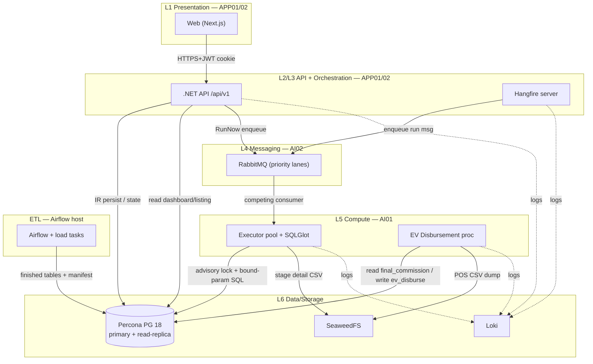

**200-user-এর আলোকে কোন tier scale করে:** Interactive load (peak ~200 active session, ~40–60 heavy) সম্পূর্ণভাবে **L1+L2 (APP01/APP02)**-এ পড়ে — তাই এই tier দুটি node দিয়ে horizontally scaled এবং প্রয়োজনে আরো APP node যোগ করা যায় (stateless, LB-এর পেছনে)। **L5 (Executor) আলাদা ও ছোট concurrency** — N≈3–4 Final run একসাথে (D1), তাই AI01 vertically/pool-size দিয়ে tuned হয়, interactive load-এর সাথে এর কোনো সম্পর্ক নেই। **L6 PostgreSQL** হলো true bottleneck: dashboard/listing read **read-replica**-তে, run execution **primary**-তে (DB default), PgBouncer transaction-pooling বাধ্যতামূলক। **এই সব sizing (APP RAM/CPU, Executor pool size, PG host ≥32GB, PgBouncer cap, replica কয়টি) real 200-user load test দিয়ে validate করতে হবে — deployment plan-এর সংখ্যাগুলো শুধু starting point, assumption নয়।** [CONFIRM: load-test-derived final sizing]

---

### ১.২ Physical Topology — 6-server Primary DC + 6-server DR Standby

মোট **১২ মেশিন** = ৬-server primary DC (active) + ৬-server DR site (active-passive warm standby) (D3)। প্রতি মেশিন baseline ৮ core / ১৫GB (deployment plan); তবে DB host ≥32GB target-এ re-size করতে হবে (15GB undersized, 50-user baseline)। **Database বাদে সব container-ized (Docker Compose per host); DB bare-metal** যাতে পুরো resource পায়।

#### Primary DC placement

| Host | Container / Process | দায়িত্ব | Layer | Volume / state |
|---|---|---|---|---|
| **APP01** | Web, API, Hangfire | UI + business logic + schedule trigger | L1/L2/L3 | stateless (no volume) |
| **APP02** | Web, API, Hangfire | APP01-এর identical clone (LB-এর পেছনে) | L1/L2/L3 | stateless |
| **AI01** | Executor pool, EV Disbursement, SQLGlot | IR→SQL execute, money disbursement | L5 | stateless (run state → PG/SeaweedFS) |
| **AI02** | RabbitMQ, SeaweedFS, Loki, Prometheus+Grafana | message broker, object store, log, monitoring | L4/L6 | **named volumes** (rabbitmq, seaweed, loki, prometheus data) |
| **Airflow** | Airflow scheduler+web, load tasks | ETL ingest → finished table + manifest | ETL | SFTP drop bind-mount `/data/sftp:/data/sftp` |
| **DB (PG)** | Percona PostgreSQL 18 (no Docker) | primary write + read-replica source | L6 | direct disk, `shared_buffers` tuned |

> **Topology note (read-replica placement) [CONFIRM]:** DB default অনুযায়ী dashboard/listing read একটি **read-replica**-তে যেতে হবে। বর্তমান 6-server plan-এ আলাদা replica host নেই। দুটি option: (a) DR site-এর standby DB-কে hot-standby read-replica হিসেবে ব্যবহার (cross-DC read latency খেয়াল রাখতে হবে), অথবা (b) primary DC-তে একটি ৭ম DB host যোগ। load-test result অনুযায়ী চূড়ান্ত করতে হবে। ততক্ষণ পর্যন্ত read traffic primary-তে route করা যাবে কিন্তু PgBouncer cap কঠোরভাবে enforce করতে হবে।

#### DR site placement (active-passive standby)

DR site primary-এর **byte-for-byte placement mirror** — একই ৬ host (APP01-DR, APP02-DR, AI01-DR, AI02-DR, Airflow-DR, DB-DR), একই Docker Compose ও image version। পার্থক্য শুধু runtime state:

| DR Host | Standby অবস্থা |
|---|---|
| DB-DR | PostgreSQL **streaming replication standby** (async, read-only, continuous apply) |
| AI02-DR | SeaweedFS **cross-site replication target** (volume sync); RabbitMQ container deployed কিন্তু **খালি** (replicate নয়) |
| APP01/02-DR, AI01-DR | container deployed, image present, কিন্তু **idle/scaled-to-minimal** (failover-এ activate); কোনো traffic নেই কারণ F5 শুধু primary-তে route করে |
| Airflow-DR | scheduler **paused** (failover-এ SFTP drop redirect হলে resume) |

#### LB placement

Load Balancer = **client-এর existing network LB / F5** (redundant pair + TLS termination) (D3) — এটি SalesCom-এর নিজস্ব container নয়। F5 APP01+APP02-এর সামনে বসে (health-check + drain-aware, §8 CI/CD rolling deploy), এবং DC→DR failover-এর সময় GSLB/F5 routing flip করে। TLS client-এর F5-এ terminate হয়; F5→APP internal hop-এ mutual TLS বা internal TLS (§১.৫)।

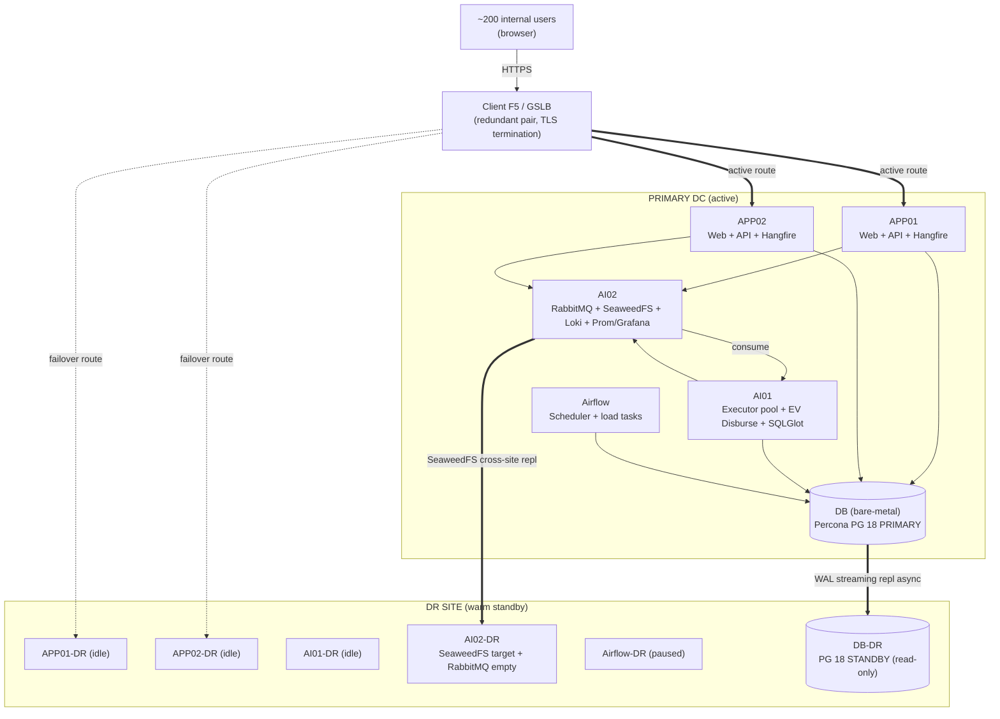

---

### ১.৩ Request / Data Flow

তিনটি প্রধান flow। প্রতিটিতে কোন layer ছুঁয়ে যায় তা দেখানো হলো; ভেতরের state-machine detail অন্য section-এ।

#### (a) Interactive flow — UI → API → DB (synchronous)

```mermaid
sequenceDiagram
    participant U as Browser (Next.js)
    participant F as F5 LB
    participant A as API (.NET, APP0x)
    participant PB as PgBouncer
    participant PG as PostgreSQL
    U->>F: HTTPS request (JWT httpOnly cookie)
    F->>A: forward (TLS, drain-aware)
    A->>A: validate JWT (RS256+kid); sensitive action → live role DB check
    A->>PB: query (transaction pooling)
    PB->>PG: dashboard/listing → read-replica; write → primary
    PG-->>A: rows
    A-->>U: JSON {items,page,size,total}
```

- Dashboard/listing/detail = read-mostly → read-replica (DB default)। Report create/edit (IR persist), approval action, schedule manage = write → primary।
- Wizard Final Save এ API validation চালায় ও IR persist করে (SQL এখানে generate হয় না — Final Save-এ IR freeze, run-এ Executor generate করে; §3, §4)।

#### (b) Run execution flow — Hangfire → RabbitMQ → Executor → DB → SeaweedFS (asynchronous, D1+D2)

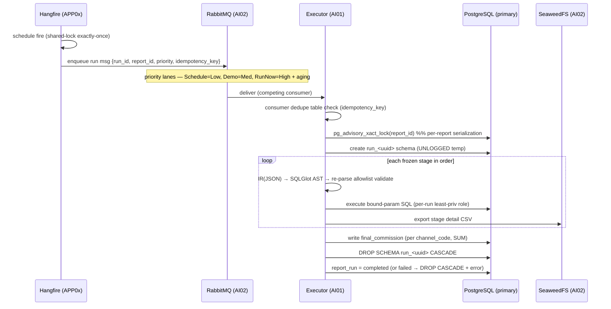

- Demo run **আলাদা low-priority read-only lane** — disburse/approve করে না (D1)।
- platform-wide bounded parallelism N≈3–4 (D1) RabbitMQ prefetch + Executor pool size দিয়ে enforce; একই report-এর দুটি run কখনো একসাথে নয় (advisory lock)।
- all-or-nothing: যেকোনো stage fail বা stop → run_id-namespaced temp schema DROP CASCADE, partial commission নয় (Run default)।

#### (c) Disbursement flow (full approval-এর পর — BR8)

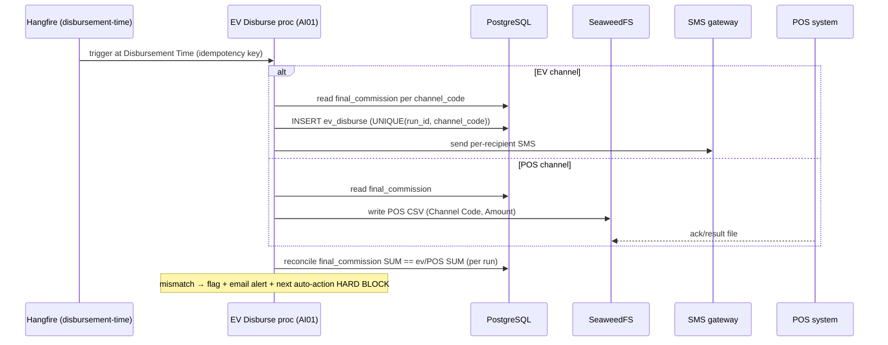

reconciliation, idempotency key ও mismatch handling-এর full rule §5 (Disbursement Integrity) ও §7.10 (Reconciliation matrix)-এ।

---

### ১.৪ DC ↔ DR Replication ও Failover Model (D3)

**Active-passive warm standby।** প্রতিটি stateful component-এর replication আলাদা strategy অনুযায়ী, কারণ recovery characteristics ভিন্ন:

| Component | Replication strategy | Failover-এ আচরণ |
|---|---|---|
| **PostgreSQL** | **Streaming replication (async WAL)** DB → DB-DR; continuous apply, read-only standby | promote standby → primary (`pg_promote`); APP/Executor connection string DR DB-তে point |
| **SeaweedFS** | **Cross-site replication** (volume sync) AI02 → AI02-DR | DR SeaweedFS read-write হিসেবে activate; raw CSV + detail CSV available |
| **RabbitMQ** | **Replicate করা হয় না** (transient by design) | DR-এর খালি broker activate; in-flight run **idempotent re-run** (consumer dedupe + advisory lock দিয়ে double-execute আটকানো) |
| **Hangfire jobs** | PostgreSQL-backed → DB replication-এর সাথেই যায় | standby promote-এর পর schedule state DR DB থেকে resume |
| **Routing** | GSLB / F5 | **manual confirm failover** — auto-detect + human approve flip |

**কেন RabbitMQ replicate নয় (rationale):** RabbitMQ-তে শুধু transient run-trigger message থাকে, কোনো durable business state নয় (সব state PG + temp schema)। failover-এ হারানো message মানে শুধু একটি run re-trigger করতে হবে — যা idempotency key + advisory lock-এর কারণে নিরাপদ (double-disburse অসম্ভব, ledger UNIQUE constraint দিয়ে guarded)। এটি cross-site broker mirroring-এর complexity ও latency বাঁচায়।

**Failover model — manual confirm (D3):** GSLB/F5 primary DC unhealthy detect করতে পারে, কিন্তু flip **automatic নয়** — একজন operator CONFIRM করে route DR-এ পাঠায়। কারণ async replication-এ split-brain ও সাম্প্রতিক un-replicated write হারানোর ঝুঁকি আছে; money-moving system-এ accidental auto-failover অগ্রহণযোগ্য। Failover runbook (§8) order: (1) primary write fence/stop, (2) `pg_promote` DB-DR, (3) SeaweedFS-DR activate, (4) RabbitMQ-DR start, (5) APP/AI containers scale-up, (6) F5/GSLB flip, (7) smoke-test, (8) ETL SFTP drop redirect।

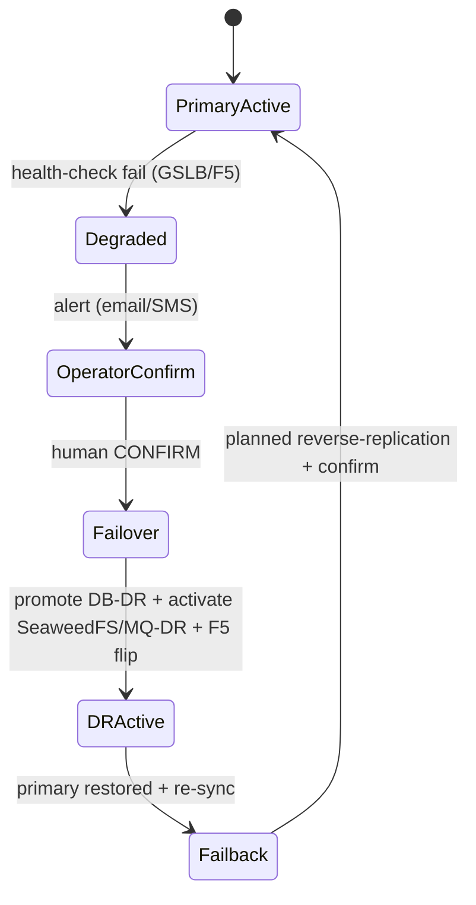

> **RPO / RTO target [CONFIRM — locked open]:** async replication-এ RPO > 0 (DR DB primary-এর কয়েক সেকেন্ড/মিনিট পিছিয়ে থাকতে পারে, replication lag-এর উপর নির্ভর); manual-confirm failover-এ RTO operator response + promote time-এর উপর নির্ভর। প্রস্তাবিত প্রাথমিক target **RPO ≤ 5 min, RTO ≤ 60 min** — কিন্তু এটি client-এর সাথে চূড়ান্ত করতে হবে এবং replication-lag alert (critical, §8) দিয়ে monitor করতে হবে। Synchronous replication চাইলে RPO=0 সম্ভব কিন্তু write latency বাড়বে — business decision। money-mismatch বা lag threshold ছাড়ালে hard alert।

---

### ১.৫ Inter-Service Communication

deployment plan-এর routing convention locked:

| Path | Address scheme | Transport / security |
|---|---|---|
| same-host container ↔ container (যেমন AI02-তে executor→`loki:3100`, বা EV proc ↔ AI01 local) | **Docker service name** | internal Docker network; sensitive hop-এ internal TLS |
| cross-host (APP→AI02 RabbitMQ, APP→DB, AI01→DB, AI01→AI02 SeaweedFS) | **IP / hostname** (যেমন `amqp://10.x.x.x:5672`) | **mTLS / authenticated** (D3); DB-তে TLS + per-service least-priv role |
| Browser → F5 → APP | F5 VIP, hostname | HTTPS (TLS terminate at F5), JWT httpOnly+Secure+SameSite cookie |
| APP/AI → DB | DB host IP (Docker-এর বাইরে, তাই সরাসরি IP) | TLS; PgBouncer transaction-pooling বাধ্যতামূলক, max_connections cap ~150–200 |

**নিয়ম (D3 + Secrets default):**
- কোনো plaintext credential `.env`/compose-এ নয় — **Vault বা Docker file-secrets**; inter-service auth/mTLS; 90-day key rotation।
- Executor RabbitMQ ও DB-তে authenticated; Executor-এর DB role **per-run least-privilege** (ledger-তে write নেই, source schema whitelist) — full rule §6/§3।
- JWT validation, RS256+kid rotation, refresh-token, server-side revocation, authToken callback (state+nonce, single-use ~90s, callback allowlist) — সম্পূর্ণ §6; এখানে শুধু transport boundary উল্লেখ।

---

### ১.৬ Environment List

| Environment | Footprint | উদ্দেশ্য |
|---|---|---|
| **Production — Primary DC** | 6 servers (APP01/02, AI01, AI02, Airflow, DB) | live active traffic |
| **Production — DR Site** | 6 servers (mirror), warm standby | failover target (§১.৪) |
| **Staging** | ≥1 environment (CI/CD default), scaled-down single-host বা minimal multi-host | release validation, DB migration dry-run (Flyway/Liquibase/EF), 200-user load test target, rolling-deploy rehearsal |

- CI/CD: private registry (build→scan→test→tag→push, versioned image `:x.y.z`, কখনো `:latest` নয়); APP node rolling deploy (F5 drain→update→health→rejoin); DB migration আলাদা version-controlled step। সম্পূর্ণ pipeline §8।
- **Load test environment requirement:** §১.১-এর সব sizing assertion (APP tier scale, Executor pool N≈3–4, PG ≥32GB, PgBouncer cap, read-replica প্রয়োজন কিনা) staging-এ real 200-concurrent-user load test দিয়ে validate করতে হবে — production sizing assumption-ভিত্তিক নয়।

---

### ১.৭ Build-আগে Lock করতে হবে (D4 — architecture-impacting open items)

এই section-এর যে সিদ্ধান্তগুলো development শুরুর আগে চূড়ান্ত করতেই হবে (consolidated §9-এ):

1. **[CONFIRM] RPO/RTO target** (§১.৪) — async vs sync replication business decision।
2. **[CONFIRM] Read-replica host placement** (§১.২ note) — DR standby reuse vs ৭ম DB host vs primary-only-with-cap।
3. **[CONFIRM] Final resource sizing** — load-test-derived, deployment plan-এর সংখ্যা starting point মাত্র; DB host ≥32GB target।
4. **[CONFIRM] F5/GSLB integration contract** — client-এর existing LB-এর health-check probe path, drain API, TLS cert ownership, GSLB failover trigger mechanism (এটি ৭ external integration ICD-র একটি হিসেবে lock করতে হবে — D4)।

---

**§১ cross-references:** IR JSON structure ও allowlist validation → §3 (Calc Engine); report_run/final_commission/ev_disburse/audit_log schema ও partitioning → §2 (Data Model); run state machine ও run-gate → §4 (Run Orchestration); JWT/secrets/role detail → §6 (Security); replication-lag/queue-backlog alert wiring → §8 (Observability); rolling deploy ও migration → §8 (CI/CD)।

---

## ২. Data Model ও Database Design

> এই section-টি SalesCom-এর persistent state-এর single source of truth — সব টেবিল, key, constraint, partition ও index plan এখানে। Run lifecycle/state machine §4/§5-এ, calc engine IR→SQL pipeline §3-এ, security/JWT §6-এ, infra placement §8-এ এবং disbursement reconciliation flow §5/§7.10-এ বিস্তারিত আছে — এখানে শুধু সেগুলোর **data shape** ও **storage contract** ধরা হলো (cross-reference, repeat নয়)।

ডিজাইন nucleus হলো **config-as-IR**: report definition একটি version-করা JSON IR হিসেবে বসে, run সেই IR snapshot করে নিজস্ব `run_<uuid>` schema-তে temp টেবিল বানিয়ে stage-by-stage চালায়, এবং কেবল **system-controlled trusted path** (executor) দিয়ে `final_commission` → `ev_disburse`/`pos_dump`-এ লেখে। কোনো generated SQL কখনো ledger টেবিলে যায় না [D2]।

---

### ২.১ Design Principles (টেবিল লেখার আগে যে নিয়ম সব টেবিলে প্রযোজ্য)

| Convention | নিয়ম |
|---|---|
| Primary key | সব business entity-তে `id UUID DEFAULT gen_random_uuid()` (app-generated UUIDv7 preferred — time-ordered, B-tree-friendly)। |
| Timestamp | সব `*_at` column `TIMESTAMPTZ`, UTC-তে store (§2 conventions, §1.2.2 spec)। DB session `timezone='UTC'`; Asia/Dhaka শুধু presentation layer-এ। |
| Money | compute-পথে `NUMERIC(18,4)`; persisted final value `NUMERIC(18,2)` round half-up; per-`channel_code` SUM; div-by-zero `NULLIF`-guard। unmapped/null/duplicate channel = hard validation error → run fail (partial নয়)। **CONFIRM**: scale 4 যথেষ্ট কিনা (sub-paisa FX নেই বলে ধরা হয়েছে)। |
| Soft-delete | `data_source`, `report`, approval config = `is_active BOOLEAN` (BR2); ledger টেবিলে কখনো DELETE নয়। |
| Audit | append-only `audit_log` (UPDATE/DELETE privilege REVOKE + hash-chain) — §2.7। |
| Naming | snake_case, lowercase; user-উৎপন্ন identifier (table/column/alias) ≤30 char, space/special char নিষিদ্ধ (spec §5.2 ধাপ-২)। |
| FK on delete | reference টেবিলে `ON DELETE RESTRICT` (config), ledger-এ FK কিন্তু কখনো cascade-delete নয়; temp schema-তে কোনো cross-schema FK নয়। |
| Optimistic lock | mutable config/state টেবিলে `version INT` (edit-vs-approve race আটকাতে — §4/§5)। |

`gen_random_uuid()` `pgcrypto`-তে থাকে; application-side UUIDv7 না দিলে এটি default।

---

### ২.২ Logical Schema — Module-wise (~22 core টেবিল)

প্রতিটি টেবিলের key column, PK/FK, ও load-bearing constraint দেওয়া হলো। DDL sketch concrete কিন্তু illustrative (final migration Flyway/Liquibase-এ — §8)।

#### Module A — Auth / User (2 টেবিল)

POS থেকে প্রতি ঘণ্টায় sync হওয়া user + role (spec §3.3)। Central Login authoritative; SalesCom শুধু projection রাখে যাতে FK ও offline role-check করা যায়।

```sql
-- A1. app_user  — POS/Central-sync projection
CREATE TABLE app_user (
    id            UUID PRIMARY KEY,                 -- SalesCom internal id
    external_user_id TEXT NOT NULL UNIQUE,          -- Central Login userId
    username      TEXT NOT NULL UNIQUE,
    full_name     TEXT NOT NULL,
    email         CITEXT,
    mobile        TEXT,
    user_group_id TEXT NOT NULL,                    -- maps → role
    role          TEXT NOT NULL CHECK (role IN ('MAKER','CHECKER','ADMIN')),
    is_locked     BOOLEAN NOT NULL DEFAULT FALSE,   -- isLocked='Y'
    user_status   TEXT NOT NULL DEFAULT 'ACTIVE',
    last_synced_at TIMESTAMPTZ NOT NULL,
    created_at    TIMESTAMPTZ NOT NULL DEFAULT now(),
    updated_at    TIMESTAMPTZ NOT NULL DEFAULT now()
);

-- A2. login_audit  — Dashboard "Login Attempts" card + denied-access audit feed
CREATE TABLE login_audit (
    id          UUID PRIMARY KEY,
    user_id     UUID REFERENCES app_user(id),       -- NULL = unknown username
    username    TEXT NOT NULL,
    outcome     TEXT NOT NULL CHECK (outcome IN ('SUCCESS','DECLINE')),
    ip_address  INET,
    user_agent  TEXT,
    attempted_at TIMESTAMPTZ NOT NULL DEFAULT now()
);
CREATE INDEX ix_login_audit_user_time ON login_audit (user_id, attempted_at DESC);
```

> JWT issuance/refresh/revocation list, kid-rotation key store — runtime/secret concern, DB-তে শুধু optional `jwt_revocation` (jti, expires_at) থাকে; বিস্তারিত §6 (Auth)।

#### Module B — Data Source + Registered Column + Alias (2 টেবিল)

Admin-curated whitelist (≈121 row, spec §4 + UI)। **এটিই [D2]-এর identifier-whitelist-এর authoritative store** — executor snapshot-করা source schema-র বিরুদ্ধে এখান থেকেই validate করে, এবং **column alias এখানে define হয় → SQL-gen-এ সরাসরি প্রভাব ফেলে** (UI-delta address নিচে)।

```sql
-- B1. data_source  — registered source table (System Source)
CREATE TABLE data_source (
    id            UUID PRIMARY KEY,
    source_table  TEXT NOT NULL UNIQUE,             -- physical finished/processed table name
    display_name  TEXT NOT NULL,
    description   TEXT,
    is_active     BOOLEAN NOT NULL DEFAULT FALSE,    -- default Inactive (spec §4.2)
    schema_snapshot JSONB,                           -- {col,type} captured at registration
    version       INT NOT NULL DEFAULT 1,
    created_by    UUID REFERENCES app_user(id),
    created_at    TIMESTAMPTZ NOT NULL DEFAULT now(),
    updated_at    TIMESTAMPTZ NOT NULL DEFAULT now()
);

-- B2. data_source_column  — per-source registered columns + alias
CREATE TABLE data_source_column (
    id            UUID PRIMARY KEY,
    data_source_id UUID NOT NULL REFERENCES data_source(id) ON DELETE RESTRICT,
    real_column   TEXT NOT NULL,                     -- physical column name
    data_type     TEXT NOT NULL CHECK (data_type IN ('STRING','NUMBER','DATE')),
    alias         TEXT,                              -- UI "alias" — logical name used in IR/SQL-gen
    is_nullable   BOOLEAN NOT NULL DEFAULT TRUE,
    ordinal       INT NOT NULL,
    UNIQUE (data_source_id, real_column),
    UNIQUE (data_source_id, alias)                   -- alias unique within a source
);
```

**Alias UI-delta (address):** IR/safe-expression grammar-তে user **alias** দিয়ে column রেফার করে; executor SQL-gen-এ alias→`real_column` resolve করে `SELECT real_column AS alias` বসায়। Validation: IR-এর প্রতিটি referenced alias অবশ্যই `data_source_column`-এ থাকতে হবে (নাহলে [D2] "unknown identifier reject")। এতে physical rename হলেও IR অপরিবর্তিত থাকে — শুধু mapping update। **CONFIRM**: alias কি per-source unique না global; এখানে per-source ধরা হয়েছে (UNIQUE constraint উপরে)।

#### Module C — Report + Stage/IR + Schedule (3 টেবিল)

```sql
-- C1. report  — wizard ধাপ-১ + lifecycle state
CREATE TABLE report (
    id              UUID PRIMARY KEY,
    name            TEXT NOT NULL UNIQUE,            -- BR3 system-wide unique
    commission_cycle TEXT NOT NULL,                  -- "July 2025"
    channel_code    TEXT NOT NULL,                   -- channel (see §2.8 list note)
    approval_flow_id UUID REFERENCES approval_flow(id),
    start_date      DATE NOT NULL,
    end_date        DATE NOT NULL,
    is_recurrent    BOOLEAN NOT NULL DEFAULT FALSE,
    recurrence_freq TEXT CHECK (recurrence_freq IN ('DAILY','WEEKLY','MONTHLY')),
    ev_enabled      BOOLEAN NOT NULL DEFAULT FALSE,
    ev_sms_text     TEXT,
    ev_disburse_time TIME,
    pos_enabled     BOOLEAN NOT NULL DEFAULT FALSE,  -- UI-delta: POS toggle in Basic Input
    remarks         TEXT,
    status          TEXT NOT NULL DEFAULT 'DRAFT'
        CHECK (status IN ('DRAFT','FINAL_SAVED','APPROVAL_PENDING','APPROVED','REJECTED','STOPPED')),
    approved_config_version INT,                     -- persisted on final approval (§5)
    version         INT NOT NULL DEFAULT 1,          -- optimistic lock
    created_by      UUID NOT NULL REFERENCES app_user(id),  -- BR5 maker = creator/last-editor
    last_edited_by  UUID REFERENCES app_user(id),
    created_at      TIMESTAMPTZ NOT NULL DEFAULT now(),
    updated_at      TIMESTAMPTZ NOT NULL DEFAULT now(),
    CHECK (start_date <= end_date)                   -- BR4
);

-- C2. report_stage  — Achievement/Incentive block + per-stage IR (JSON IR store)
CREATE TABLE report_stage (
    id            UUID PRIMARY KEY,
    report_id     UUID NOT NULL REFERENCES report(id) ON DELETE CASCADE,
    block_kind    TEXT NOT NULL CHECK (block_kind IN ('ACHIEVEMENT','INCENTIVE')),
    block_ordinal INT NOT NULL,                      -- ACH#1, INC#2 ...
    block_name    TEXT NOT NULL,                     -- renamable
    data_source_id UUID REFERENCES data_source(id),  -- system source ...
    upload_id     UUID REFERENCES supporting_upload(id), -- ... or uploaded source
    depends_on_stage_id UUID REFERENCES report_stage(id),-- ACH→ACH / ACH→INC chaining
    stage_ir      JSONB NOT NULL,                    -- IR: pipeline stages (see §2.2.1)
    config_version INT NOT NULL DEFAULT 1,           -- bumped on Final Save regenerate
    UNIQUE (report_id, block_kind, block_ordinal)
);
CREATE INDEX ix_report_stage_ir_gin ON report_stage USING GIN (stage_ir jsonb_path_ops);

-- C3. report_schedule  — Schedule modal + recurrence
CREATE TABLE report_schedule (
    id            UUID PRIMARY KEY,
    report_id     UUID NOT NULL REFERENCES report(id) ON DELETE CASCADE,
    next_fire_at  TIMESTAMPTZ,                       -- NULL when stopped/non-recurrent done
    recurrence_freq TEXT CHECK (recurrence_freq IN ('DAILY','WEEKLY','MONTHLY')),
    run_window_start DATE,
    run_window_end   DATE,
    is_active     BOOLEAN NOT NULL DEFAULT TRUE,     -- Report Stop → FALSE (cancel future)
    created_by    UUID REFERENCES app_user(id),      -- BR9 maker-only manage
    version       INT NOT NULL DEFAULT 1,
    updated_at    TIMESTAMPTZ NOT NULL DEFAULT now()
);
CREATE INDEX ix_schedule_due ON report_schedule (next_fire_at) WHERE is_active;
```

**Edit/approval-race handling (default, CONFIRM):** approve action → `report.approved_config_version = current config_version`; material edit while `APPROVAL_PENDING` → existing `approval_request` void + status back to L1 restart + `report.version` bump। edit-vs-approve race optimistic `version` দিয়ে আটকানো (`UPDATE ... WHERE version = :seen`)। Reject → Maker, resubmit = L1 থেকে full re-validation। বিস্তারিত state machine §5.1/§5.3।

##### ২.২.১ Stage IR — JSON sketch (`report_stage.stage_ir`)

IR হলো calc engine-এর input contract [D2]। Raw SQL নয় — declarative pipeline; executor এটিকে SQLGlot AST-এ build করে, re-parse করে allowlist validate করে, তবেই চালায় (বিস্তারিত §3)।

```jsonc
{
  "block": "ACH#1",
  "source": { "ref": "data_source", "id": "…uuid…" },   // বা { "ref":"upload", "id":"…" }
  "pipeline": [
    { "op": "filter",
      "predicates": [ { "col": "channel_code", "cond": "EQUALS", "value": "RSO" } ] },
    { "op": "combine",                                    // JOIN
      "from": { "ref": "data_source", "id": "…agent_map…" },
      "on": [ { "left": "recharge.retailer_msisdn", "right": "agent_map.ret_msisdn" } ],
      "select": [ "agent_map.distributor_code" ],
      "join_type": "MATCHED_ONLY" },                      // বা ALL_ROWS (left join)
    { "op": "summarize",
      "result_col": "hit", "agg": "SUM", "of": "amount",
      "group_by": [ "distributor_code" ] },
    { "op": "calculate",
      "result_col": "ach_pct",
      "expr": "DIVIDE(hit, NULLIF(hit_target, 0))" },     // safe-expression grammar
    { "op": "modify",
      "casts": [ { "col": "ach_pct", "to": "NUMBER" } ] }
  ],
  "outputs": [ { "name": "ach_pct", "type": "NUMBER" } ]
}
```

Incentive IR-এর `calculate` op স্ল্যাব IF/CASE ও final MAP ধারণ করে:

```jsonc
{ "op": "case",
  "result_col": "incentive_amt",
  "cases": [
    { "when": [ { "col":"ach_pct","op":"GE","val":100 },
                { "col":"ach_pct","op":"LT","val":120 } ], "then": 500 },
    { "when": [ { "col":"ach_pct","op":"GE","val":120 } ], "then": 800 }
  ],
  "else": 0 },
{ "op": "map_final",                                       // ধাপ-৪ Final mapping
  "channel_code_col": "distributor_code",
  "amount_col": "incentive_amt",
  "decimals": 2 }
```

safe-expression grammar: শুধু whitelisted function (`DIVIDE, MULTIPLY, ADD, SUB, ROUND, NULLIF, COALESCE`), column ref অবশ্যই upstream output বা registered alias; unknown identifier/function → reject [D2]। সব literal পরে bound-parameter হয়।

#### Module D — Supporting Upload (1 টেবিল)

CSV upload metadata; raw bytes SeaweedFS-এ (straight-to-object-storage, API in-memory full-file নয় — default), parsed row report-lifecycle-bound আলাদা schema-তে।

```sql
-- D1. supporting_upload
CREATE TABLE supporting_upload (
    id            UUID PRIMARY KEY,
    report_id     UUID NOT NULL REFERENCES report(id) ON DELETE CASCADE,
    original_filename TEXT NOT NULL,                 -- <40 char
    object_key    TEXT NOT NULL,                     -- SeaweedFS key (raw CSV)
    staged_table  TEXT,                              -- physical table in upload schema
    column_meta   JSONB NOT NULL,                    -- [{name,type,nullable}] ≤30 col
    row_count     BIGINT,
    byte_size     BIGINT CHECK (byte_size <= 524288000), -- ≤500 MB
    upload_status TEXT NOT NULL DEFAULT 'PENDING'
        CHECK (upload_status IN ('PENDING','PARSED','CONFIRMED','REMOVED')),
    uploaded_by   UUID REFERENCES app_user(id),
    created_at    TIMESTAMPTZ NOT NULL DEFAULT now()
);
```

COPY bulk-load → `staged_table`; chunked/streaming parse। Upload-derived টেবিল report-lifecycle-bound আলাদা schema-তে (`upload_<report_id>`), report archive/purge-এর সাথে যায় (§2.6)।

#### Module E — Run + Stage Status (2 টেবিল)

[D1] per-report serialization + bounded platform parallelism-এর state। run idempotency key + advisory-lock coordination এখানে রেকর্ড হয়। (Run lifecycle state machine §4/§5; এই টেবিলের একটি বিকল্প/সম্প্রসারিত রূপ §4.2-এ আছে — final migration-এ দুটি একীভূত হবে, §9 CONFIRM।)

```sql
-- E1. report_run
CREATE TABLE report_run (
    id            UUID PRIMARY KEY,
    report_id     UUID NOT NULL REFERENCES report(id),
    run_kind      TEXT NOT NULL CHECK (run_kind IN ('FINAL','DEMO')),
    triggered_by_kind TEXT NOT NULL CHECK (triggered_by_kind IN ('USER','SYSTEM')),
    triggered_by  UUID REFERENCES app_user(id),
    priority      TEXT NOT NULL CHECK (priority IN ('LOW','MED','HIGH')), -- Sched/Demo/RunNow
    idempotency_key TEXT NOT NULL UNIQUE,            -- dedupe re-trigger / failover re-run
    config_snapshot JSONB NOT NULL,                  -- frozen IR of all stages at trigger
    temp_schema   TEXT NOT NULL,                     -- run_<uuid>
    status        TEXT NOT NULL DEFAULT 'PENDING'
        CHECK (status IN ('PENDING','QUEUED','RUNNING','COMPLETED','FAILED','CANCELLED')),
    run_ordinal   INT NOT NULL,                      -- "Final Run 2" / "Demo Run 5"
    error_detail  TEXT,
    started_at    TIMESTAMPTZ,
    finished_at   TIMESTAMPTZ,
    created_at    TIMESTAMPTZ NOT NULL DEFAULT now()
);
CREATE INDEX ix_run_report_kind ON report_run (report_id, run_kind, created_at DESC);
-- Demo cap ≤5 enforced in app via COUNT(*) WHERE run_kind='DEMO' under per-report advisory lock

-- E2. run_stage_status  — per stage execution telemetry + output handle
CREATE TABLE run_stage_status (
    id            UUID PRIMARY KEY,
    run_id        UUID NOT NULL REFERENCES report_run(id) ON DELETE CASCADE,
    stage_id      UUID NOT NULL REFERENCES report_stage(id),
    exec_order    INT NOT NULL,
    status        TEXT NOT NULL DEFAULT 'NOT_RUN'
        CHECK (status IN ('NOT_RUN','RUNNING','SUCCEEDED','FAILED')),
    temp_table    TEXT,                              -- run_<uuid>.stage_<n>
    output_object_key TEXT,                          -- per-stage CSV in SeaweedFS (Run Log Download)
    row_count     BIGINT,
    started_at    TIMESTAMPTZ,
    finished_at   TIMESTAMPTZ,
    error_detail  TEXT,
    UNIQUE (run_id, exec_order)
);
```

Demo run আলাদা low-priority read-only lane — disburse/approve করে না [D1]; এটি `run_kind='DEMO'` + downstream disbursement টেবিলে কোনো row না লেখার invariant দিয়ে enforce। per-report serialization = per `report_id` PG advisory lock + RabbitMQ competing-consumer (multi-instance executor pool, AI01) — runtime detail §4।

#### Module F — Disbursement: final_commission + ev_disburse + pos_dump (3 টেবিল)

System-controlled trusted path-এর terminal টেবিল [D2]। Executor generated SQL দিয়ে কখনো এখানে লেখে না — শুধু validated, parameterized INSERT।

```sql
-- F1. final_commission  — per-channel run output (ledger, partitioned)
CREATE TABLE final_commission (
    id            UUID NOT NULL DEFAULT gen_random_uuid(),
    run_id        UUID NOT NULL REFERENCES report_run(id),
    report_id     UUID NOT NULL,
    channel_code  TEXT NOT NULL,
    commission_amount NUMERIC(18,2) NOT NULL,        -- rounded half-up final
    created_at    TIMESTAMPTZ NOT NULL DEFAULT now(),
    PRIMARY KEY (id, created_at),
    UNIQUE (run_id, channel_code, created_at)        -- per-channel SUM, no dup channel
) PARTITION BY RANGE (created_at);

-- F2. ev_disburse  — EV auto+SMS disbursement
CREATE TABLE ev_disburse (
    id            UUID NOT NULL DEFAULT gen_random_uuid(),
    run_id        UUID NOT NULL,
    channel_type  TEXT,                              -- EV CSV: Channel Type
    channel_code  TEXT NOT NULL,
    amount        NUMERIC(18,2) NOT NULL,
    idempotency_key TEXT NOT NULL,                   -- per-disbursement unique
    disbursed_at  TIMESTAMPTZ NOT NULL DEFAULT now(),
    ev_status     TEXT NOT NULL DEFAULT 'PENDING'
        CHECK (ev_status IN ('PENDING','SENT','FAILED')),
    ev_message    TEXT,                              -- gateway response
    PRIMARY KEY (id, disbursed_at),
    UNIQUE (run_id, channel_code, disbursed_at)      -- exactly-once per channel
) PARTITION BY RANGE (disbursed_at);
-- Global dedupe across partitions: also UNIQUE INDEX on idempotency_key (non-partitioned aux or
-- enforced via app + RabbitMQ consumer dedupe table); see §2 idempotency note below.

-- F3. pos_dump  — POS CSV handoff manifest
CREATE TABLE pos_dump (
    id            UUID PRIMARY KEY,
    run_id        UUID NOT NULL REFERENCES report_run(id),
    object_key    TEXT NOT NULL,                     -- POS CSV (Channel Code, Amount)
    record_count  BIGINT NOT NULL,
    total_amount  NUMERIC(18,2) NOT NULL,
    ack_object_key TEXT,                             -- POS ack/result file ingest
    ack_status    TEXT DEFAULT 'AWAITING'
        CHECK (ack_status IN ('AWAITING','ACKED','MISMATCH')),
    created_at    TIMESTAMPTZ NOT NULL DEFAULT now()
);
```

> **Partitioned UNIQUE caveat:** PG-তে partitioned টেবিলে UNIQUE অবশ্যই partition key (`*_at`) include করতে হবে। `(run_id, channel_code)` exactly-once একই microsecond-এ guaranteed নয় শুধু এই constraint-এ — তাই dedupe app-side per-run idempotency_key + RabbitMQ consumer dedupe টেবিল + per-run advisory lock দিয়েও enforce হয় (default: idempotency)। **CONFIRM**: যদি hard cross-time DB-level uniqueness চাই, `ev_disburse` partition না করে plain টেবিল রাখা যায় (volume কম — per run × channel only)। নিচে §2.3-এ recommendation দেওয়া আছে।

**Reconciliation invariant (default):** প্রতি disbursement-এর পর per run — `SUM(final_commission.commission_amount) == SUM(ev_disburse.amount) == pos_dump.total_amount`। mismatch → flag + email alert + পরবর্তী auto-action hard block (§5/§7.10)। এটি stored procedure/scheduled check নয় — disbursement transaction-এর শেষে executor enforce করে।

#### Module G — Approval (5 টেবিল)

Config (flow/level/level_user) + per-run state (request/decision)। B2B/B2C delta address নিচে। (Approval state machine + BR5/BR6/BR7 enforcement detail §5.3।)

```sql
-- G1. approval_flow
CREATE TABLE approval_flow (
    id          UUID PRIMARY KEY,
    name        TEXT NOT NULL UNIQUE,                -- Flow Name unique
    flow_type   TEXT NOT NULL CHECK (flow_type IN ('B2B','B2C')),
    is_active   BOOLEAN NOT NULL DEFAULT TRUE,
    created_at  TIMESTAMPTZ NOT NULL DEFAULT now()
);

-- G2. approval_level
CREATE TABLE approval_level (
    id          UUID PRIMARY KEY,
    flow_id     UUID NOT NULL REFERENCES approval_flow(id) ON DELETE RESTRICT,
    level_name  TEXT NOT NULL,
    level_order INT NOT NULL CHECK (level_order > 0), -- ascending sequential (BR6)
    UNIQUE (flow_id, level_order)                     -- per-flow unique positive order
);

-- G3. approval_level_user  — who acts at each level
CREATE TABLE approval_level_user (
    id          UUID PRIMARY KEY,
    level_id    UUID NOT NULL REFERENCES approval_level(id) ON DELETE CASCADE,
    user_id     UUID NOT NULL REFERENCES app_user(id),
    UNIQUE (level_id, user_id)                        -- same user may span levels/flows
);

-- G4. approval_request  — per-run, per-level open request
CREATE TABLE approval_request (
    id            UUID PRIMARY KEY,
    report_id     UUID NOT NULL REFERENCES report(id),
    run_id        UUID REFERENCES report_run(id),    -- run this approval gates
    flow_id       UUID NOT NULL REFERENCES approval_flow(id),
    current_level_id UUID NOT NULL REFERENCES approval_level(id),
    overall_status TEXT NOT NULL DEFAULT 'PENDING'
        CHECK (overall_status IN ('PENDING','APPROVED','REJECTED','VOID')),
    config_version_at_submit INT NOT NULL,           -- voided if report edited (race guard)
    created_at    TIMESTAMPTZ NOT NULL DEFAULT now(),
    updated_at    TIMESTAMPTZ NOT NULL DEFAULT now()
);
CREATE UNIQUE INDEX uq_one_open_request_per_report
    ON approval_request (report_id) WHERE overall_status = 'PENDING';

-- G5. approval_decision  — append-only per-level action (combined Approve/Reject)
CREATE TABLE approval_decision (
    id            UUID PRIMARY KEY,
    request_id    UUID NOT NULL REFERENCES approval_request(id) ON DELETE CASCADE,
    level_id      UUID NOT NULL REFERENCES approval_level(id),
    decision      TEXT NOT NULL CHECK (decision IN ('APPROVE','REJECT')),
    remarks       TEXT,                              -- mandatory if REJECT (BR7)
    decided_by    UUID NOT NULL REFERENCES app_user(id),  -- approver userId persist
    decided_at    TIMESTAMPTZ NOT NULL DEFAULT now(),
    CHECK (decision = 'APPROVE' OR remarks IS NOT NULL)
);
-- BR5: decided_by must not equal report.created_by/last_edited_by; one user ≤ one level per run
-- — enforced in app (live DB role check, not JWT claim).
```

**B2B/B2C UI-delta (address):** `approval_flow.flow_type` = enum store করা হলো। **CONFIRM**: এটি কি কেবল label/categorization, নাকি routing logic (যেমন channel B2B হলে শুধু B2B flow eligible)? Default ধরা হয়েছে = **categorization + selectable filter** (routing নয়), কারণ flow report-এ explicitly select হয় (`report.approval_flow_id`)। যদি routing চাই, তাহলে `report.channel_code → flow_type` mapping rule যোগ করতে হবে — design-এ placeholder রাখা (§5.4)।

**Reject default (CONFIRM):** Reject → Maker (LLD), previous-level নয় (SRS open item §6.3 resolve)। resubmit = নতুন `approval_request`, L1 থেকে full re-validation।

#### Module H — Notification + Audit (2 টেবিল)

```sql
-- H1. notification_log  (ledger, partitioned)
CREATE TABLE notification_log (
    id            UUID NOT NULL DEFAULT gen_random_uuid(),
    channel       TEXT NOT NULL CHECK (channel IN ('SMS','EMAIL')),
    event_type    TEXT NOT NULL,                     -- APPROVAL_REQUESTED, REJECTED,
                                                     -- DISBURSEMENT_COMPLETE, RUN_FAILED, GATE_FAIL...
    recipient     TEXT NOT NULL,
    cc            TEXT,
    related_run_id UUID,
    related_report_id UUID,
    status        TEXT NOT NULL DEFAULT 'PENDING'
        CHECK (status IN ('PENDING','SENT','FAILED')),
    attempt_count INT NOT NULL DEFAULT 0,
    scheduled_at  TIMESTAMPTZ,
    sent_at       TIMESTAMPTZ,
    error_message TEXT,
    created_at    TIMESTAMPTZ NOT NULL DEFAULT now(),
    PRIMARY KEY (id, created_at)
) PARTITION BY RANGE (created_at);

-- H2. audit_log  (ledger, partitioned, append-only WORM)
CREATE TABLE audit_log (
    id            BIGINT GENERATED ALWAYS AS IDENTITY,
    actor_user_id UUID,
    actor_ip      INET,
    action        TEXT NOT NULL,                     -- CREATE/UPDATE/DELETE/APPROVE/DISBURSE/DENIED
    entity_type   TEXT NOT NULL,
    entity_id     UUID,
    before_state  JSONB,
    after_state   JSONB,
    prev_hash     BYTEA,                             -- hash-chain
    row_hash      BYTEA NOT NULL,                    -- sha256(prev_hash || canonical(row))
    occurred_at   TIMESTAMPTZ NOT NULL DEFAULT now(),
    PRIMARY KEY (id, occurred_at)
) PARTITION BY RANGE (occurred_at);
-- REVOKE UPDATE, DELETE ON audit_log FROM ALL app roles; INSERT-only. 7y retention.
```

#### Module I — ETL Source-Tracking / Manifest (2 টেবিল)

Run-gate-এর authoritative state [defaults: run-gate]। per-source SFTP drop + manifest marker (row count + business date + checksum); Airflow sensor wait।

```sql
-- I1. etl_source_load  — per-source latest load state (run-gate read path)
CREATE TABLE etl_source_load (
    id              UUID PRIMARY KEY,
    source_system   TEXT NOT NULL,                   -- DWH/In-house/POS/DMS/vPeople
    finished_table  TEXT NOT NULL,
    max_business_date DATE NOT NULL,                 -- gate: >= report.end_date
    transform_status TEXT NOT NULL
        CHECK (transform_status IN ('SUCCESS','RUNNING','FAILED')),
    loaded_row_count BIGINT,
    last_loaded_at  TIMESTAMPTZ NOT NULL DEFAULT now(),
    UNIQUE (source_system, finished_table)
);

-- I2. etl_manifest  — per drop marker file ingest (row count match check)
CREATE TABLE etl_manifest (
    id              UUID PRIMARY KEY,
    source_system   TEXT NOT NULL,
    business_date   DATE NOT NULL,
    declared_row_count BIGINT NOT NULL,
    actual_row_count   BIGINT,
    checksum        TEXT NOT NULL,
    sftp_object_key TEXT,
    ingest_status   TEXT NOT NULL DEFAULT 'RECEIVED'
        CHECK (ingest_status IN ('RECEIVED','VERIFIED','MISMATCH')),
    received_at     TIMESTAMPTZ NOT NULL DEFAULT now(),
    UNIQUE (source_system, business_date)
);
```

**Run-gate check (read-only, pre-run):** `finished max(business_date) ≥ End Date AND per-source transform_status='SUCCESS' AND etl_manifest.declared==actual`। cutoff পার = hard gate fail + email/SMS alert (silent skip নয়); gate-fail → cutoff পর্যন্ত backoff-retry (default)। gate logic detail §4.6/§7.5।

**টেবিল গণনা:** A(2)+B(2)+C(3)+D(1)+E(2)+F(3)+G(5)+H(2)+I(2) = **22 core টেবিল**। `jwt_revocation` optional/auxiliary।

##### ERD (mermaid)

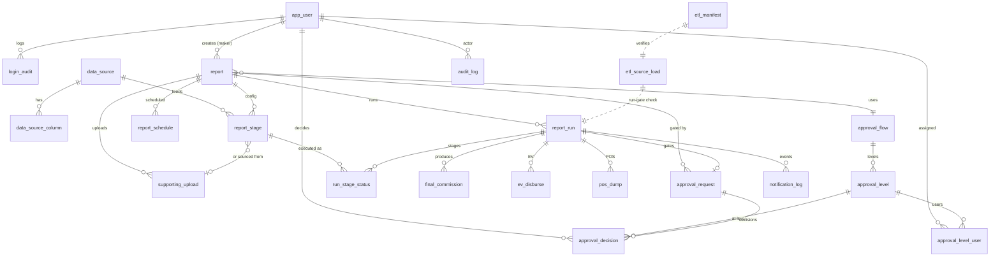

---

### ২.৩ High-Write / High-Volume টেবিল — Partition ও Index Plan

**High-write / high-volume হিসেবে চিহ্নিত (ledger):** `audit_log`, `notification_log`, `final_commission`। এদের monthly RANGE-partition (default DB policy)। `ev_disburse` borderline (per run × channel — মাঝারি volume কিন্তু financial)।

| টেবিল | Volume driver | Strategy |
|---|---|---|
| `audit_log` | প্রতিটি mutation + auth + denied-access | **Monthly RANGE partition** on `occurred_at`; 7y retention → detach+archive পুরনো partition |
| `notification_log` | প্রতি EV recipient SMS + email events | **Monthly RANGE** on `created_at`; পুরনো partition detach→archive |
| `final_commission` | per run × channel (run ঘন হলে বাড়ে) | **Monthly RANGE** on `created_at`; financial → 7y |
| `ev_disburse` | per run × channel | financial; কম volume — **CONFIRM**: plain টেবিল রাখাই recommended (cross-time DB-level `UNIQUE(run_id,channel_code)` exactly-once পেতে — partition করলে এটা হারায়)। |
| `run_stage_status` | per run × stage | plain; index on `(run_id)` |
| `login_audit` | per login attempt | plain initially; volume বাড়লে monthly partition |

**Partition mechanics:**
- Native declarative partitioning; `pg_partman` দিয়ে monthly partition auto-create + retention detach automate (Hangfire sweeper-এও fallback)।
- Default partition (`PARTITION ... DEFAULT`) safety-net যাতে missing-partition INSERT fail না করে; alert on default-partition row count > 0।
- প্রতি partition-এ নিজস্ব local index (নিচে)।

**Index plan (load-bearing):**

```sql
-- final_commission: reconciliation SUM per run, dashboard channel rollup
CREATE INDEX ix_fc_run        ON final_commission (run_id);
CREATE INDEX ix_fc_report_ch  ON final_commission (report_id, channel_code);

-- audit_log: entity timeline + actor lookups
CREATE INDEX ix_audit_entity  ON audit_log (entity_type, entity_id, occurred_at DESC);
CREATE INDEX ix_audit_actor   ON audit_log (actor_user_id, occurred_at DESC);

-- notification_log: pending retry sweep, per-run trace
CREATE INDEX ix_notif_pending ON notification_log (status, scheduled_at) WHERE status='PENDING';
CREATE INDEX ix_notif_run     ON notification_log (related_run_id);

-- report_run: listing "latest runs", scheduler scan
CREATE INDEX ix_run_report    ON report_run (report_id, created_at DESC);
CREATE INDEX ix_run_active    ON report_run (status) WHERE status IN ('PENDING','QUEUED','RUNNING');

-- report listing filters (Start/End/Status/Channel/name prefix)
CREATE INDEX ix_report_status ON report (status);
CREATE INDEX ix_report_name_prefix ON report (name text_pattern_ops);  -- prefix search
CREATE INDEX ix_report_dates  ON report (start_date, end_date);

-- stage_ir containment queries (alias/source impact analysis)
-- (GIN already declared in §2.2 C2)
```

Partition-pruning কাজে লাগাতে সব ledger query-তে time-range predicate বাধ্যতামূলকভাবে include করা — listing/dashboard default "current + previous month" window দেয়, তাই natural fit। সব index/partition choice **real 200-user load test দিয়ে validate** করতে হবে (assumption নয়) — read-amplification ও write-overhead সেখানে মাপা হবে।

---

### ২.৪ Temp-Table Strategy (run scratch space)

[D1]+[default: temp tables] — প্রতি run নিজস্ব isolated schema, all-or-nothing, run failure/stop-এ DROP CASCADE (runtime detail §4.4/§4.8)।

```
trigger → CREATE SCHEMA run_<uuid>;                 -- report_run.temp_schema
  per stage (in exec_order):
     CREATE UNLOGGED TABLE run_<uuid>.stage_<n> (...);   -- crash-safe নয়, fast; run idempotent re-run করে
     -- executor: IR → SQLGlot AST → re-parse allowlist validate → execute INSERT...SELECT (bound params)
     COPY (for upload/source ingest) bulk load
     export succeeded stage → CSV → SeaweedFS (run_stage_status.output_object_key)
  final stage → INSERT INTO final_commission (run_id, channel_code, commission_amount) ...  -- trusted path
  on success OR failure OR cancel:
     DROP SCHEMA run_<uuid> CASCADE;                 -- namespaced, no leftover
```

- **UNLOGGED** — WAL skip, dramatically faster; data run-scoped ও re-runnable, তাই crash-loss acceptable (failover-এ idempotent re-run — [D3])।
- **Schema-per-run namespacing** — name collision impossible; cleanup = single `DROP SCHEMA ... CASCADE`; concurrent N≈3-4 run isolated।
- **Least-privilege per-run DB role** [D2] — executor connection-এর role শুধু নিজের `run_<uuid>` schema-তে CREATE/INSERT/SELECT + `final_commission`-এ INSERT; `audit_log`/config টেবিলে কোনো write নয়।
- **Cleanup sweeper (Hangfire periodic)** — orphan `run_<uuid>` schema (process crash-এ leftover): `report_run.status` terminal AND `finished_at < now()-interval '1 hour'` হলে DROP; safety net। `upload_<report_id>` schema report archive/purge-এর সাথে (§2.6)।
- Demo run একই strategy কিন্তু `final_commission`/disbursement INSERT skip — read-only lane invariant [D1]।

Stop semantics (default): Report Stop = future schedule cancel (`report_schedule.is_active=FALSE`); চলমান run আলাদা explicit cancel → `status='CANCELLED'` + DROP SCHEMA CASCADE।

---

### ২.৫ PgBouncer + Connection Budget

[default: DB] — PgBouncer **transaction-pooling বাধ্যতামূলক**; `max_connections` ~150-200 cap; per-service bounded pool।

```
                ┌──────────────┐
 APP01 API ─────┤              │
 APP02 API ─────┤              │
 APP01 Hangfire─┤  PgBouncer   │── (transaction pooling) ──► Percona PG (primary)
 APP02 Hangfire─┤  (txn mode)  │
 AI01 executor ─┤              │
 AI01 EV ───────┤              │
 Airflow load ──┤              │
                └──────────────┘
 dashboard/listing reads ──────────────────────────────────► PG read-replica
```

**Connection budget (server-side actual PG connections, transaction-pooled):**

| Consumer | Instances | App-side pool | PG-side (pooled) | নোট |
|---|---|---|---|---|
| API (.NET) | 2 (APP01/02) | 20 each | ~10–15 each | interactive request-bound; short txn |
| Hangfire | 2 | 10 each | ~5 each | schedule trigger + light DB |
| Executor pool | AI01 (multi-worker, N≈3-4 concurrent run) | 4–6 | ~8–12 | primary only; long stage txn — **transaction-pooling NOT for executor long-running stage**; executor uses **session pool / direct** with dedicated cap |
| EV disbursement | AI01 (separate process) | 4 | ~4 | financial; small bounded |
| Airflow load | Airflow server | pool 3 | ~3 | byte-pump COPY; primary write |
| **Total (primary)** | | | **~45–55 steady, ≤80 burst** | well under 150–200 cap |

- **Executor caveat:** long-running stage transaction transaction-pooling-এর সাথে conflict করে (server connection হাতে রাখে)। তাই executor-কে **আলাদা PgBouncer pool (session mode বা ছোট direct pool)** দেওয়া হয়, bounded N≈3-4×(stages-in-flight); interactive traffic থেকে আলাদা DB user → আলাদা pool quota। এতে heavy run interactive session-কে starve করে না। (advisory-lock + transaction-pool সংগততার বিস্তারিত §4 CONFIRM-নোট।)
- **Read/write split:** dashboard KPI, report/approval **listing**, Run Log read → **read-replica** (DC streaming replica, [D3])। **Run execution, disbursement, audit write, approval decision → primary**। App-level routing: read-only DbContext/connection string → replica DSN।
- `max_connections` PG-তে ~150-200 cap; PgBouncer `default_pool_size` per (user,db) tuned to budget উপরে। **200-user load test-এ actual pool saturation মাপতে হবে** — উপরের সংখ্যা starting point।

---

### ২.৬ Retention / Archival

| Data class | Active retention | তারপর | মেকানিজম |
|---|---|---|---|
| Source/finished (processed) ETL টেবিল | **3 months** active DB | archive টেবিলে move (delete নয়, spec §11.2) | monthly batch (Airflow/Hangfire) → `*_archive` টেবিল বা cheaper storage |
| dump + per-stage detail object (SeaweedFS) | **30 days** | purge | object lifecycle policy / Hangfire purge job (~100GB initial cap) |
| `final_commission`, `ev_disburse`, `pos_dump`, `audit_log`, `notification_log` | hot partition | **partition-detach → archive**; financial+audit **7y retention** | `pg_partman` retention: detach old monthly partition, move to archive tablespace/cold storage |
| `upload_<report_id>` schema | report-lifecycle-bound | report archive/purge-এর সাথে DROP | report soft-delete/archive trigger |
| `run_<uuid>` schema | run lifetime only | run শেষে DROP CASCADE | inline + sweeper (§2.4) |

- **Partition-detach over DELETE** — ledger-এ row-by-row DELETE নিষিদ্ধ (audit append-only; financial immutability)। Detach = O(1) metadata, hot table ছোট রাখে।
- **3-month active → archive** boundary spec-mandated; archive টেবিল same schema, read-only role, query-on-demand।
- ESI report retention এখনো নির্ধারিত হয়নি (spec open item) — **CONFIRM** (placeholder policy = financial 7y ধরা)।

---

### ২.৭ Audit Integrity (append-only WORM)

- `audit_log`-এ app role থেকে **UPDATE/DELETE privilege REVOKE**; শুধু INSERT। superuser-ও যাতে tamper না করে — periodic external hash-chain verification।
- **Hash-chain:** `row_hash = sha256(prev_hash || canonical_json(row_without_hash))`; verification job chain integrity check করে, break → critical alert (DB saturation/replication lag-এর মতো same wired email/SMS channel — §8 Observability)।
- Coverage (default): money action, auth event, **denied-access** attempt, approval decision, schedule change (BR9), disbursement। actor `userId`/`IP`/before-after JSONB/UTC timestamp। (full coverage matrix §6.8।)

---

### ২.৮ DB Sizing Re-calc (200-user target)

Deployment plan-এর 15GB DB host **50-user baseline-এর জন্য undersized** এবং 200-user target-এর জন্য অপর্যাপ্ত। Re-size target **≥32GB RAM**, bare-metal Percona PG 18 (Docker ছাড়া — [D3])।

| Parameter | 15GB baseline (current) | ≥32GB target (proposed) | যুক্তি |
|---|---|---|---|
| `shared_buffers` | 4 GB | **8 GB** (~25% RAM) | hot ledger/index page cache |
| `effective_cache_size` | ~10 GB | **~22 GB** (~70% RAM) | planner OS-cache estimate |
| `work_mem` | default | **32–64 MB** (per-op) | aggregate/sort heavy stage SQL; ×concurrent ops bound by executor pool (N≈3-4) — total ভাবতে হবে |
| `maintenance_work_mem` | default | **1–2 GB** | partition create, index build, vacuum |
| `max_connections` | — | **150–200 cap** | PgBouncer-এর পিছনে; per-service bounded |
| `wal` / checkpoint | default | tuned for write burst | run + disbursement write spike |
| `huge_pages` | — | try | shared_buffers efficiency |

- `work_mem` × (parallel ops × concurrent runs) যাতে RAM blow না করে — N≈3-4 run bounded থাকায় safe; তবু **200-user load test-এ peak `work_mem` × concurrency মাপা বাধ্যতামূলক**।
- 200 concurrent = ~200 interactive session (40–60 heavy), কিন্তু **run concurrency ছোট ও আলাদা** (N≈3-4) — তাই DB pressure মূলত (a) listing/dashboard read (replica-তে offload) ও (b) 3-4 heavy run primary-তে। Sizing দুই profile আলাদা করে load-test করতে হবে।
- ≥32GB একটি **target floor, assumption নয়** — final number real 200-user load test (interactive + concurrent-run mix) থেকে।

---

### ২.৯ UI-driven Delta সমাধানের সারসংক্ষেপ (data-model অংশ)

| Delta | Data-model resolution | CONFIRM |
|---|---|---|
| Approval Flow Type B2B/B2C | `approval_flow.flow_type` enum; default = categorization/label (routing নয়) | routing দরকার হলে channel→flow_type rule যোগ |
| Data Source column **alias** | `data_source_column.alias`; IR alias দিয়ে রেফার, SQL-gen alias→real_column resolve; validation against snapshot | per-source unique ধরা হয়েছে |
| Achievement block **Duplicate** | নতুন `report_stage` row, পরের `block_ordinal`, `stage_ir` deep-copy, new id | — |
| Run Log **Download Summary** | per-run aggregate (`final_commission` per channel) → on-demand CSV; কোনো নতুন টেবিল লাগে না | summary contents confirm |
| Combined Approve/Reject modal | একই `approval_decision` row; `decision` enum + mandatory remarks-on-reject CHECK | — |
| **Channel** fixed-list vs configurable | `report.channel_code`/`final_commission.channel_code` = free TEXT (configurable-ready), কিন্তু validation-এ allowlist (Distributor/RSO/RSO Sup/Retailer/COPS) | fixed enum না lookup টেবিল — **CONFIRM**; lookup টেবিল হলে `channel(code,name,is_active)` যোগ |

---

**§২ খোলা CONFIRM আইটেম (Build-আগে lock — [D4], consolidated §9):** (1) money scale 4 যথেষ্ট কিনা; (2) `ev_disburse` partition-vs-plain (exactly-once DB-level uniqueness trade-off); (3) alias per-source vs global unique; (4) B2B/B2C routing-vs-label; (5) channel fixed-enum vs lookup টেবিল; (6) ESI retention policy। এগুলো spec-এর 6 SRS open item + UI-delta-র data-model projection — schema migration লেখার আগে চূড়ান্ত হতে হবে।

---

## ৩. Calculation Engine (IR → SQL)

### ৩.০ ভূমিকা ও দায়িত্বের সীমা (Scope)

Calculation Engine হলো SalesCom-এর সেই অংশ যেটা Business User-এর তৈরি no-code কনফিগারেশনকে নিরাপদ, deterministic SQL-এ রূপান্তর করে এবং stage-by-stage execute করে per-channel `final_commission` তৈরি করে। এটি দুই ভাগে বিভক্ত:

- **IR Compiler (build-time / Final Save-time):** কনফিগ → IR(JSON) → SQLGlot AST → validate → generated SQL store। চলে `.NET API` থেকে trigger হয়ে (Final Save), তবে SQLGlot-নির্ভর অংশ Python engine-এ (AI01)।
- **Executor (run-time):** stored IR/SQL → re-parse validate → snapshot-freeze → temp schema-তে sequential execute → CSV export → `final_commission` write। চলে AI01-এর executor worker pool-এ, RabbitMQ competing-consumer হিসেবে (cf. §4 Run Orchestration — D1)।

> Locked decision অনুযায়ী (D2): raw string concat নিষিদ্ধ; সব literal bound-parameter; সব identifier snapshot-করা source schema-র বিরুদ্ধে whitelist; allowlisted node-type ছাড়া কিছু execute হয় না; executor least-privilege role-এ চলে এবং ledger টেবিলে generated SQL **কখনো** write করে না।

এই section IR schema, IR→SQL pipeline, safe expression grammar, pre-execute validation, stage execution model, money rule এবং executor least-privilege model বর্ণনা করে। Run queue/priority/parallelism, advisory lock, disbursement mechanics ও approval — এগুলো §4 (Run Orchestration), §5 (Disbursement) ও §5.3 (Approval)-এ; এখানে শুধু cross-reference।

---

### ৩.১ IR (Intermediate Representation) — কেন এবং কী

UI wizard (ধাপ ৩ Achievement, ধাপ ৪ Incentive) যা produce করে তা সরাসরি SQL নয় — এটি একটি **declarative, version-করা JSON document** যাকে আমরা IR বলি। IR-ই হলো single source of truth: UI render হয় IR থেকে, validation চলে IR-এর উপর, SQL generate হয় IR থেকে। Generated SQL একটি **derived artifact** (cache), IR নয়।

IR-এর তিনটি মূল কারণ:
1. **নিরাপত্তা:** UI কখনো SQL পাঠায় না; backend কখনো user-typed SQL গ্রহণ করে না। সব কিছু structured node, যা allowlist-যোগ্য।
2. **Determinism + Freeze:** Final Save-এ IR + generated SQL একসাথে version-করা (`config_version`) হয়ে store হয়; run-এ সেই version snapshot হয় (D1 step "Snapshot stages"), পরে কনফিগ বদলালেও চলমান run অপরিবর্তিত।
3. **Re-generation:** Final Saved রিপোর্ট edit→save করলে IR বদলায়, validation আবার চলে, SQL আবার generate ও store হয় (SRS §৫.৮)।

#### IR কোথায় থাকে (টেবিল)

> এই `report_config_version` টেবিল §2-এর `report_stage.stage_ir` ও `report.approved_config_version`-এর সাথে সম্পূরক — final migration-এ একীভূত config-version model হবে (§9 CONFIRM)। এখানে compiled artifact + snapshot-এর shape দেখানো হলো।

```sql
-- রিপোর্টের চূড়ান্ত কনফিগ + compiled artifact, version-করা (append, কখনো in-place overwrite নয়)
CREATE TABLE report_config_version (
    id                 UUID PRIMARY KEY DEFAULT gen_random_uuid(),
    report_id          UUID NOT NULL REFERENCES report(id),
    version_no         INT  NOT NULL,                 -- 1,2,3... per report
    ir                 JSONB NOT NULL,                -- নিচের IR schema
    generated_sql      JSONB,                         -- stage_id → {sql, params_meta, out_columns} (Final Save-এ পূর্ণ হয়)
    source_schema_snap JSONB NOT NULL,                -- whitelist: টেবিল→column→type, যার বিরুদ্ধে identifier resolve হয়েছে
    compiler_version   TEXT NOT NULL,                 -- IR compiler-এর semver (reproducibility)
    ir_hash            BYTEA NOT NULL,                -- sha256(canonical-json(ir)) — tamper/dup detect
    status             TEXT NOT NULL,                 -- 'draft' | 'final' | 'superseded'
    created_by         UUID NOT NULL,
    created_at         TIMESTAMPTZ NOT NULL DEFAULT now(),
    UNIQUE (report_id, version_no)
);
-- approve action-এ এই version persist হয় (approved_config_version, cf. §5.3) — edit-vs-approve race
-- optimistic version দিয়ে আটকানো; material edit = existing approval void → L1 restart (CONFIRM, D4 default).
```

> Draft অবস্থায় `ir` থাকতে পারে কিন্তু `generated_sql` NULL এবং `status='draft'` — কারণ Draft-এ SQL generate হয় না (SRS §৫.৮)। Final Save-এ নতুন `version_no` row, `status='final'`, পুরনো final → `superseded`।

---

### ৩.২ IR JSON Schema — Sketch

IR-এর top-level structure (conceptual; production-এ JSON Schema / Pydantic model দিয়ে validate হবে):

```jsonc
{
  "ir_schema": "salescom.ir/v1",
  "report_id": "f1e2...uuid",
  "channel_scope": "Distributor",          // Basic Input-এর Channel (cf. CONFIRM channel-list নিচে)
  "datasources": [                          // resolved + frozen, snapshot schema-র subset
    {
      "ds_id": "ds_recharge",
      "kind": "system",                     // 'system' (registered Data Source) | 'upload' (ধাপ-২ CSV)
      "phys_table": "fin_recharge",         // snapshot-এ whitelisted physical table
      "columns": [                          // alias → real column + type (UI-driven delta, নিচে দেখুন)
        { "alias": "RETAILER_MSISDN", "real": "ret_msisdn", "type": "string" },
        { "alias": "AMOUNT",          "real": "rchg_amt",   "type": "number" },
        { "alias": "BIZ_DATE",        "real": "business_date","type": "date" }
      ]
    },
    { "ds_id": "ds_agent_map", "kind": "upload", "phys_table": "up_<reportid>_agent_map",
      "columns": [ { "alias": "RET_MSISDN", "real": "ret_msisdn", "type": "string" },
                   { "alias": "CHANNEL_CODE", "real": "channel_code", "type": "string" } ] }
  ],

  "achievements": [                         // ধাপ ৩ — ACH#n blocks
    {
      "block_id": "ach_1",
      "name": "Recharge Hit",
      "input": { "ref": "datasource", "ds_id": "ds_recharge" },   // OR { "ref":"block", "block_id":"ach_0" }
      "stages": [ /* pipeline stage list — নিচে */ ],
      "outputs": [                          // Outputs panel — declared output contract
        { "name": "CHANNEL_CODE", "type": "string" },
        { "name": "HIT",          "type": "number" },
        { "name": "ACH_PCT",      "type": "number" }
      ]
    }
  ],

  "incentives": [                           // ধাপ ৪ — INC#n blocks
    {
      "block_id": "inc_1",
      "name": "Slab Payout",
      "input": { "ref": "block", "block_id": "ach_1" },           // achievement বা অন্য incentive পড়ে
      "stages": [ /* ... Calculate stage-এ IF/CASE slab */ ],
      "outputs": [
        { "name": "CHANNEL_CODE", "type": "string" },
        { "name": "PAYOUT",       "type": "number" }
      ]
    }
  ],

  "final_mapping": {                        // ধাপ ৪ শেষ — per-channel commission (গুরুত্বপূর্ণ)
    "source_block_id": "inc_1",
    "channel_code_col": "CHANNEL_CODE",
    "commission_col":   "PAYOUT",
    "decimals": 2,                          // MAP EACH INPUT — Decimals
    "rounding": "half_up"
  }
}
```

#### ৩.২.১ Pipeline Stage node (পাঁচ ধরনের)

প্রতিটি stage একটি tagged union (`op` discriminator)। প্রতিটি stage তার আগের stage-এর virtual output relation কে input ধরে নেয় (প্রথম stage block input ধরে); execution-এ প্রতিটি stage একটি temp table হয় (§৩.৬)।

**(a) Filter** — `WHERE` predicate তৈরি করে:
```jsonc
{ "op": "filter", "stage_id": "s1",
  "predicates": [                          // AND-যুক্ত; প্রতিটি leaf safe-expr
    { "col": "BIZ_DATE", "cond": "between", "lo": {"lit":"@start"}, "hi": {"lit":"@end"} },
    { "col": "AMOUNT",   "cond": "gte",     "value": {"lit": 20} },
    { "col": "STATUS",   "cond": "in",      "values": [{"lit":"S"},{"lit":"C"}] }
  ] }
// cond allowlist: eq, ne, gt, gte, lt, lte, in, not_in, between, is_null, is_not_null, like(prefix-bounded)
```

**(b) Combine Data** — `JOIN`:
```jsonc
{ "op": "combine", "stage_id": "s2",
  "with": { "ds_id": "ds_agent_map" },     // অথবা { "block_id": ... }
  "join_keys": [ { "left": "RETAILER_MSISDN", "right": "RET_MSISDN" } ],
  "match": "matched_only",                 // 'matched_only' = INNER | 'all_left' = LEFT
  "bring": [ { "col": "CHANNEL_CODE", "from": "right" } ],
  "operations": "none"                     // 'none' | 'aggregate' (aggregate হলে Summarize-এ ঠেলে দেওয়া হয়)
}
```

**(c) Summarize** — `GROUP BY` + aggregate:
```jsonc
{ "op": "summarize", "stage_id": "s3",
  "group_by": [ "CHANNEL_CODE" ],          // Form Column(s)
  "aggregates": [
    { "out": "HIT", "fn": "count", "arg": null },           // fn allowlist: count,sum,avg,min,max
    { "out": "TOT_AMT", "fn": "sum", "arg": "AMOUNT" }
  ],
  "having": null                           // ঐচ্ছিক filter
}
```

**(d) Calculate** — derived column(s); Math Formula **অথবা** IF/CASE slab:
```jsonc
{ "op": "calculate", "stage_id": "s4",
  "computes": [
    { "out": "ACH_PCT",
      "kind": "formula",
      "expr": "DIVZ(HIT, HIT_TARGET) * 100"               // safe-expr AST (§৩.৪); DIVZ = NULLIF-guarded div
    },
    { "out": "PAYOUT",
      "kind": "case",                                      // IF/CASE slab
      "cases": [                                           // ascending; প্রথম-match জেতে
        { "when": [ {"col":"ACH_PCT","op":"gte","val":{"lit":100}} ],
          "then": {"lit": 500} },
        { "when": [ {"col":"ACH_PCT","op":"gte","val":{"lit": 80}},
                    {"col":"ACH_PCT","op":"lt", "val":{"lit":100}} ],   // And
          "then": {"lit": 250} }
      ],
      "else": {"lit": 0} }                                 // unmatched default
  ] }
```

**(e) Modify** — পরের block-এ পাঠানোর আগে cast/rename/derive:
```jsonc
{ "op": "modify", "stage_id": "s5",
  "ops": [
    { "out": "CHANNEL_CODE", "cast": "string", "from": "CHANNEL_CODE" },
    { "out": "PAYOUT",       "cast": "number", "from": "PAYOUT" }
  ] }
```

#### ৩.২.২ Concrete End-to-End উদাহরণ (সংক্ষিপ্ত)

একটি achievement (recharge hit per channel) → একটি incentive (slab payout) → final mapping:

```jsonc
{
  "ir_schema": "salescom.ir/v1",
  "channel_scope": "Retailer",
  "datasources": [
    { "ds_id":"ds_rchg","kind":"system","phys_table":"fin_recharge",
      "columns":[{"alias":"RET_MSISDN","real":"ret_msisdn","type":"string"},
                 {"alias":"AMOUNT","real":"rchg_amt","type":"number"},
                 {"alias":"BIZ_DATE","real":"business_date","type":"date"}] },
    { "ds_id":"ds_map","kind":"upload","phys_table":"up_r9_map",
      "columns":[{"alias":"RET_MSISDN","real":"ret_msisdn","type":"string"},
                 {"alias":"CHANNEL_CODE","real":"channel_code","type":"string"},
                 {"alias":"HIT_TARGET","real":"hit_target","type":"number"}] }
  ],
  "achievements":[{
    "block_id":"ach_1","name":"Recharge Hit","input":{"ref":"datasource","ds_id":"ds_rchg"},
    "stages":[
      {"op":"filter","stage_id":"a1","predicates":[
        {"col":"BIZ_DATE","cond":"between","lo":{"lit":"@start"},"hi":{"lit":"@end"}},
        {"col":"AMOUNT","cond":"gte","value":{"lit":20}}]},
      {"op":"combine","stage_id":"a2","with":{"ds_id":"ds_map"},
        "join_keys":[{"left":"RET_MSISDN","right":"RET_MSISDN"}],
        "match":"matched_only","bring":[{"col":"CHANNEL_CODE","from":"right"},
                                        {"col":"HIT_TARGET","from":"right"}],"operations":"none"},
      {"op":"summarize","stage_id":"a3","group_by":["CHANNEL_CODE","HIT_TARGET"],
        "aggregates":[{"out":"HIT","fn":"count","arg":null}]},
      {"op":"calculate","stage_id":"a4","computes":[
        {"out":"ACH_PCT","kind":"formula","expr":"DIVZ(HIT, HIT_TARGET) * 100"}]}
    ],
    "outputs":[{"name":"CHANNEL_CODE","type":"string"},{"name":"ACH_PCT","type":"number"}]
  }],
  "incentives":[{
    "block_id":"inc_1","name":"Slab","input":{"ref":"block","block_id":"ach_1"},
    "stages":[
      {"op":"calculate","stage_id":"i1","computes":[
        {"out":"PAYOUT","kind":"case",
         "cases":[{"when":[{"col":"ACH_PCT","op":"gte","val":{"lit":100}}],"then":{"lit":500}},
                  {"when":[{"col":"ACH_PCT","op":"gte","val":{"lit":80}},
                           {"col":"ACH_PCT","op":"lt","val":{"lit":100}}],"then":{"lit":250}}],
         "else":{"lit":0}}]}
    ],
    "outputs":[{"name":"CHANNEL_CODE","type":"string"},{"name":"PAYOUT","type":"number"}]
  }],
  "final_mapping":{"source_block_id":"inc_1","channel_code_col":"CHANNEL_CODE",
                   "commission_col":"PAYOUT","decimals":2,"rounding":"half_up"}
}
```

---

### ৩.৩ IR → SQL Generation Pipeline (SQLGlot AST Builder)

**নীতি (D2, কঠোর):** generated SQL কখনো string concat দিয়ে তৈরি হয় না। প্রতিটি IR node → **SQLGlot expression object** (AST) → tree compose → `ast.sql(dialect="postgres")`। Literal কখনো AST-তে inline হয় না — সব literal একটি **bound parameter placeholder** (`exp.Placeholder` / `%(p0)s`) হয়ে যায়, আসল value আলাদা params dict-এ যায়।

#### Generation ধাপ (compiler, Final Save-time)

```python
# Pseudocode — IR Compiler (Python + SQLGlot), চলে .NET API trigger-এ
from sqlglot import expressions as exp

def compile_block(block, snap, params, sources):
    rel = resolve_input_relation(block.input, sources)   # SQLGlot Table/Subquery expr
    for stage in block.stages:
        rel = STAGE_BUILDERS[stage.op](stage, rel, snap, params)  # প্রতিটি → CTE expr
    return rel  # চূড়ান্ত SELECT AST এই block-এর জন্য

def build_filter(stage, rel, snap, params):
    conds = []
    for p in stage.predicates:
        col = resolve_col(p.col, rel, snap)              # whitelist check → exp.Column
        conds.append(build_predicate(p, col, params))    # literal → params, exp.Placeholder
    return exp.select("*").from_(rel.subquery()).where(exp.and_(*conds))

def build_predicate(p, col, params):
    if p.cond == "between":
        return exp.Between(this=col, low=bind(params, p.lo),  high=bind(params, p.hi))
    if p.cond == "in":
        return exp.In(this=col, expressions=[bind(params, v) for v in p.values])
    if p.cond == "gte":
        return exp.GTE(this=col, expression=bind(params, p.value))
    # ... allowlisted cond ছাড়া কিছু নেই; unknown cond → CompileError
    raise CompileError(f"disallowed cond {p.cond}")

def bind(params, lit_node):
    """প্রতিটি literal → bound param placeholder; raw value AST-তে যায় না।"""
    key = f"p{len(params)}"
    params[key] = coerce_literal(lit_node.lit)           # type-checked (number/string/date)
    return exp.Placeholder(this=key)                     # render: %(p0)s
```

প্রতিটি stage একটি **CTE** হয়; পুরো block একটি chained `WITH ... SELECT`। চূড়ান্ত SQL-এর shape:

```sql
-- generated by SQLGlot, প্রতিটি literal = bound param (%(pN)s)
WITH a1 AS (SELECT * FROM "fin_recharge"
            WHERE "business_date" BETWEEN %(p0)s AND %(p1)s AND "rchg_amt" >= %(p2)s),
     a2 AS (SELECT a1.*, m."channel_code" AS "CHANNEL_CODE", m."hit_target" AS "HIT_TARGET"
            FROM a1 JOIN "up_r9_map" m ON a1."ret_msisdn" = m."ret_msisdn"),
     a3 AS (SELECT "CHANNEL_CODE","HIT_TARGET", COUNT(*) AS "HIT"
            FROM a2 GROUP BY "CHANNEL_CODE","HIT_TARGET"),
     a4 AS (SELECT a3.*, ((COALESCE("HIT",0)::numeric(18,4)
                          / NULLIF("HIT_TARGET",0)) * 100)::numeric(18,4) AS "ACH_PCT"
            FROM a3)
SELECT * FROM a4;
-- params = { p0: <start>, p1: <end>, p2: 20 }
```

#### Identifier whitelist (snapshot schema-র বিরুদ্ধে)

প্রতিটি `resolve_col` / `resolve_input_relation`/ datasource reference `source_schema_snap`-এর বিরুদ্ধে যাচাই হয়:

```python
def resolve_col(name, rel, snap):
    # name = IR alias; physical column খুঁজি snapshot-এ
    phys = snap.lookup(rel.ds_id, alias=name)            # alias → real column (UI-driven delta)
    if phys is None:
        raise CompileError(f"unknown identifier {name} in {rel.ds_id}")  # reject
    return exp.column(phys.real, quoted=True)            # সবসময় quoted, parameterized নয় কিন্তু whitelisted
```

- **Table/column** শুধু snapshot-এ থাকলেই reference করা যায়; নয়তো compile fail।
- Snapshot তৈরি হয় registered Data Source (admin-configured, ~১২১ row) + ধাপ-২ uploaded CSV টেবিলের live `information_schema` থেকে, Final Save মুহূর্তে। তাই deactivated/changed source পরে এলেও এই version-এর জন্য identifier set frozen।
- **Column alias (UI-driven delta — CONFIRM):** Data Source Add form-এ Real Column + alias আছে। alias শুধু IR-এর display/reference name; SQL-gen-এ সবসময় **real** column-ই বের হয় (`m."channel_code" AS "CHANNEL_CODE"`)। তাই alias collision বা reserved-word alias compile-time-এ reject করা দরকার। **CONFIRM:** alias কি per-datasource unique enforce হবে, এবং uploaded CSV-র column header কি alias না real (এখানে header→real, alias=header ধরা হয়েছে)।

---

### ৩.৪ Safe Expression Grammar (Math Formula ও IF/CASE When/And/Then)

User যা টাইপ করে — Calculate stage-এর Math Formula এবং IF/CASE-এর When/And/Then/Then-value — তা **কখনো** raw SQL fragment নয়। এটি একটি সীমিত safe-expression grammar দিয়ে parse হয়ে নিজস্ব AST হয়, তারপর সেই AST → SQLGlot expression। Parser-এ যা allowlist-এ নেই (unknown identifier, unknown function, unsupported operator) সব **reject**।

#### EBNF Sketch (safe-expr)

```ebnf
expr        = term , { ( "+" | "-" ) , term } ;
term        = factor , { ( "*" | "/" ) , factor } ;
factor      = [ "-" ] , primary ;                         (* unary minus only *)
primary     = number
            | string
            | column_ref
            | func_call
            | "(" , expr , ")" ;
func_call   = func_name , "(" , [ arg_list ] , ")" ;
arg_list    = expr , { "," , expr } ;
func_name   = "ROUND" | "FLOOR" | "CEIL" | "ABS"
            | "DIVZ"                                      (* NULLIF-guarded division *)
            | "COALESCE" | "MIN" | "MAX"
            | "GREATEST" | "LEAST" ;                      (* allowlist — অন্য কিছু reject *)
column_ref  = identifier ;                                (* অবশ্যই input relation-এ থাকতে হবে *)
number      = digit , { digit } , [ "." , digit , { digit } ] ;
string      = "'" , { char } , "'" ;
identifier  = letter , { letter | digit | "_" } ;

(* IF/CASE condition grammar (When/And) — boolean, comparison only *)
cond_expr   = comparison , { "AND" , comparison } ;       (* And-চেইন; OR নেই *)
comparison  = expr , cmp_op , expr ;
cmp_op      = "=" | "!=" | ">" | ">=" | "<" | "<=" ;
```

লক্ষণীয় bound:
- কোনো subquery, কোনো SQL keyword (`SELECT`, `UNION`, `;`), কোনো aggregate-call grammar-এ নেই (aggregate শুধু Summarize stage-এ structured আকারে আসে)।
- `DIVZ(a,b)` → SQLGlot-এ `a / NULLIF(b,0)` (div-by-zero NULL-guard, D-default money rule)।
- কোনো OR / NOT-চেইন When-এ নেই — UI-র "And" semantics এর সাথে মেলে; OR দরকার হলে আলাদা Case (slab) দিয়ে express হয়।
- **Aliasing/identifier** parse-time-এ input relation-এর column set-এর বিরুদ্ধে resolve হয়; অজানা identifier = `ParseError → reject` (Final Save fail, error UI-তে)।

#### Parser pseudocode (allowlist-driven, deny-by-default)

```python
ALLOWED_FUNCS = {"ROUND","FLOOR","CEIL","ABS","DIVZ","COALESCE","MIN","MAX","GREATEST","LEAST"}
ALLOWED_BINOPS = {"+","-","*","/"}
ALLOWED_CMP    = {"=","!=",">",">=","<","<="}

def parse_formula(text, allowed_cols):
    tokens = tokenize(text)                  # শুধু num/str/ident/op/paren/comma; অন্য কিছু → LexError
    ast = Pratt(tokens).parse_expr()         # recursive-descent / Pratt parser
    validate_node(ast, allowed_cols)
    return ast

def validate_node(n, cols):
    if n.kind == "func":
        if n.name not in ALLOWED_FUNCS: raise ParseError(f"function not allowed: {n.name}")
        for a in n.args: validate_node(a, cols)
    elif n.kind == "binop":
        if n.op not in ALLOWED_BINOPS: raise ParseError(f"operator not allowed: {n.op}")
        validate_node(n.lhs, cols); validate_node(n.rhs, cols)
    elif n.kind == "col":
        if n.name not in cols: raise ParseError(f"unknown column: {n.name}")   # whitelist
    elif n.kind in ("num","str"):
        pass                                  # → bound param (§৩.৩ bind)
    else:
        raise ParseError(f"disallowed node: {n.kind}")   # deny-by-default

def to_sqlglot(n, params):
    if n.kind == "num" or n.kind == "str":
        return bind(params, n.value)          # literal → placeholder
    if n.kind == "col":
        return exp.column(resolve_real(n.name), quoted=True)
    if n.kind == "binop":
        return BINOP_MAP[n.op](to_sqlglot(n.lhs,params), to_sqlglot(n.rhs,params))
    if n.kind == "func":
        if n.name == "DIVZ":
            a,b = [to_sqlglot(x,params) for x in n.args]
            return exp.Div(this=a, expression=exp.func("NULLIF", b, exp.Literal.number(0)))
        return exp.func(n.name, *[to_sqlglot(a,params) for a in n.args])
```

---

### ৩.৫ Pre-Execute Allowlist Re-Parse Validation

**দুই-স্তরের প্রতিরক্ষা (D2):** compile-time-এ আমরা AST থেকে SQL বানাই — কিন্তু execute করার ঠিক আগে executor সেই stored SQL-কে **আবার SQLGlot দিয়ে parse করে** এবং node-type allowlist-এর বিরুদ্ধে validate করে। কারণ: stored SQL tamper হতে পারে, compiler bug থাকতে পারে, বা future migration string বদলে দিতে পারে — execute-time gate শেষ রক্ষাকবচ।

**Allowlisted node-type (শুধু এগুলো):** `SELECT`, CTE (`WITH`/`CTE`), `JOIN` (INNER/LEFT), aggregate function call (count/sum/avg/min/max), `CASE`, comparison ও allowlisted scalar function, `COALESCE`/`NULLIF`, bound `Placeholder`, whitelisted `Column`/`Table`।

**সরাসরি reject (যেকোনো একটি থাকলে run fail, hard):** যেকোনো DDL (`CREATE/DROP/ALTER/TRUNCATE`), DML (`INSERT/UPDATE/DELETE/MERGE`), multi-statement (`;`-separated), `COPY`, `CALL`/`DO`, set-returning/system function (`pg_*`, `dblink`, `lo_*`, `pg_read_file`), `INTO`, lock statement, কোনো inline literal যা placeholder নয় (suspicious — সব literal bound হওয়ার কথা)।

```python
ALLOWED = (exp.Select, exp.With, exp.CTE, exp.Subquery, exp.Join, exp.From,
           exp.Where, exp.Group, exp.Having, exp.Column, exp.Table, exp.Alias,
           exp.Placeholder, exp.Case, exp.If,
           exp.And, exp.Or, exp.Not, exp.Between, exp.In, exp.Is,
           exp.EQ, exp.NEQ, exp.GT, exp.GTE, exp.LT, exp.LTE,
           exp.Add, exp.Sub, exp.Mul, exp.Div, exp.Paren, exp.Cast,
           exp.Count, exp.Sum, exp.Avg, exp.Min, exp.Max,
           exp.Coalesce, exp.Nullif, exp.Literal /* শুধু numeric guard 0/100 */)
ALLOWED_FUNCS = {"round","floor","ceil","abs","coalesce","nullif","greatest","least"}

def validate_sql(sql_text, snap):
    trees = sqlglot.parse(sql_text, dialect="postgres")   # multi-statement → list
    if len(trees) != 1:
        raise ValidationError("multi-statement not allowed")     # ; reject
    root = trees[0]
    if not isinstance(root, (exp.Select, exp.With)):
        raise ValidationError("only SELECT/CTE allowed")          # DDL/DML reject
    for node in root.walk():
        if isinstance(node, (exp.Insert, exp.Update, exp.Delete, exp.Create,
                             exp.Drop, exp.Alter, exp.Command, exp.Merge)):
            raise ValidationError(f"forbidden statement: {type(node).__name__}")
        if isinstance(node, exp.Anonymous):                       # unknown function call
            raise ValidationError(f"unknown function: {node.name}")
        if isinstance(node, exp.Func) and node.sql_name().lower() not in ALLOWED_FUNCS \
           and not isinstance(node, ALLOWED):
            raise ValidationError(f"function not allowed: {node.sql_name()}")
        if isinstance(node, exp.Table) and not snap.has_table(node.name):
            raise ValidationError(f"table not in snapshot: {node.name}")   # identifier whitelist
        if not isinstance(node, ALLOWED) and not _is_benign(node):
            raise ValidationError(f"node type not allowed: {type(node).__name__}")
    return root
```

এই gate পাশ করলে তবেই executor parameterized query DB-তে পাঠায় (literal সব params dict থেকে bound)।

---

### ৩.৬ Stage Execution Model

#### সিকোয়েন্স ও temp schema

প্রতিটি run-এ একটি **unique schema** `run_<uuid>` তৈরি হয়; প্রতিটি stage-এর output সেই schema-তে একটি **UNLOGGED** temp table (D-default; crash-safe-এর দরকার নেই কারণ run all-or-nothing)। Stage-গুলো **sequential** (cf. SRS §৫.৩ "Execute in order"); per-report serialization + platform-wide bounded parallelism (N≈3-4 run একসাথে) — run-level concurrency §4-এ, এখানে এক run-এর ভেতরের stage সিরিয়াল।

```python
# Pseudocode — Executor (AI01 worker, RabbitMQ competing-consumer)
def execute_run(run, cfg_version):
    sql_map = cfg_version.generated_sql            # frozen, stored SQL per stage
    snap    = cfg_version.source_schema_snap
    schema  = f"run_{run.id.hex}"
    with least_priv_conn(run) as db:               # §৩.৭ per-run least-privilege role
        db.exec_ddl(f'CREATE SCHEMA "{schema}"')   # DDL শুধু provisioning step-এ, validated SQL-এ নয়
        try:
            for block in topo_order(cfg_version.ir):       # achievement→incentive dependency order
                for stage in block.stages:
                    sql = sql_map[stage.stage_id]["sql"]
                    params = bind_run_params(sql_map[stage.stage_id], run)   # @start/@end → rolling window
                    validate_sql(sql, snap)                # §৩.৫ re-parse gate (execute-আগে)
                    out_tbl = f'"{schema}"."{block.block_id}_{stage.stage_id}"'
                    # CREATE TABLE AS — DDL wrapper system-controlled, body = validated SELECT only
                    db.materialize(out_tbl, sql, params)   # CREATE UNLOGGED TABLE <out> AS <validated select>
                    export_csv(out_tbl, run, stage)        # SeaweedFS — Run Log Download
                update_stage_status(stage, "succeeded")
            write_final_commission(db, run, cfg_version.ir.final_mapping, schema)
            commit(db)
        except Exception as e:
            rollback(db)
            db.exec_ddl(f'DROP SCHEMA IF EXISTS "{schema}" CASCADE')   # all-or-nothing cleanup
            fail_run(run, e)                                            # partial disbursement নয়
            raise
        finally:
            db.exec_ddl(f'DROP SCHEMA IF EXISTS "{schema}" CASCADE')    # success path cleanup
    # periodic Hangfire sweeper অনাথ run_* schema মুছে দেয় (crash safety net)
```

গুরুত্বপূর্ণ separation: validated SELECT কখনো নিজে DDL/DML করে না। `CREATE UNLOGGED TABLE ... AS <select>` wrapper-টি **system-controlled trusted path** — schema নাম run-id থেকে, table নাম block/stage id থেকে (user input নয়), body = §৩.৫-validated SELECT। এই DDL framing executor-এর hard-coded template, IR থেকে আসে না।

#### Snapshot / Freeze

Run শুরুতে `report_config_version` (IR + generated SQL + source_schema_snap) frozen কপি ধরা হয় — run চলাকালীন কনফিগ edit হলেও এই run অপরিবর্তিত (SRS §৫.৩ step 4)। `@start`/`@end` placeholder bind হয় recurrence boundary থেকে: rolling window — Daily=আগের দিন, Monthly=আগের মাস; Start/End = recurrence boundary (D-default, CONFIRM)। Recurrency Monthly রাখা (D-default)। (cadence detail §4.9।)

#### Money rule (D-default, কঠোর)

- সব intermediate compute **`NUMERIC(18,4)`**; চূড়ান্ত (`final_mapping`) **2dp round half-up** (Postgres `ROUND` numeric half-away-from-zero, বা compute-side half-up helper — §9 CONFIRM)।
- Division সবসময় `DIVZ`/`NULLIF(denom,0)` দিয়ে guarded (div-by-zero → NULL, run crash নয়)।
- `final_commission` per `channel_code` **SUM** (`GROUP BY channel_code`)।
- **Hard validation error → run fail (partial disbursement নয়):** unmapped channel, NULL channel_code, বা duplicate channel_code (post-aggregation) — যেকোনোটি থাকলে run fail। `final_mapping` apply করার পরে guard:

```sql
-- final_commission লেখার আগে validation (executor trusted path)
WITH mapped AS (
  SELECT NULLIF(TRIM("CHANNEL_CODE"),'') AS channel_code,
         ROUND(SUM("PAYOUT")::numeric(18,4), 2) AS commission_amount       -- per-channel SUM, 2dp
  FROM "run_<uuid>"."inc_1_i1"
  GROUP BY NULLIF(TRIM("CHANNEL_CODE"),'')
)
-- null channel → hard error
SELECT 1 FROM mapped WHERE channel_code IS NULL;          -- কোনো row পেলে → run fail
-- mapped channel registered channel-list-এ আছে কিনা (CONFIRM: fixed vs configurable)
SELECT m.channel_code FROM mapped m
  LEFT JOIN channel_master c ON c.code = m.channel_code
  WHERE c.code IS NULL;                                    -- unmapped → run fail
```

#### CSV export

প্রতিটি সফল stage-এর output streaming-এ SeaweedFS-এ যায় (API in-memory full-file নয়; cf. CSV upload streaming rule), Run Log Tab থেকে per-detail Download + Download All / **Download Summary** (UI-driven delta — CONFIRM: Summary = final_commission roll-up না সব-stage manifest)। Export read-only `COPY (SELECT * FROM out_tbl) TO STDOUT WITH CSV HEADER` → straight-to-SeaweedFS stream।

---

### ৩.৭ Executor Least-Privilege Role ও Ledger Trusted-Path Write

#### Per-run least-privilege DB role (D2)

Executor কখনো superuser বা app-owner role-এ validated SQL চালায় না। প্রতি run একটি **restricted role**-এ চলে যার:
- finished/source টেবিল ও uploaded CSV টেবিলে **শুধু `SELECT`**;
- `run_<uuid>` schema-তে `CREATE/SELECT/INSERT` (নিজের temp work);
- ledger টেবিল (`final_commission`, `audit_log`, `notification_log`, `ev_disburse`)-এ **কোনো সরাসরি grant নেই**।

```sql
-- per-run বা per-pool restricted role (provisioning, build-আগে lock — D4 open item)
CREATE ROLE salescom_exec NOLOGIN;
GRANT USAGE ON SCHEMA finished, uploads TO salescom_exec;
GRANT SELECT ON ALL TABLES IN SCHEMA finished, uploads TO salescom_exec;
-- ledger টেবিলে কোনো grant নেই; UPDATE/DELETE কারও কাছেই নেই audit_log-এ (append-only, §6)
-- executor login role এই restricted role SET ROLE করে validated SELECT চালায়; PgBouncer transaction-pool
```

এতে generated SQL যদি কোনোভাবে allowlist gate পার করেও যায় (defense-in-depth), DB-স্তরে সে ledger বা source data লিখতে পারবে না।

#### Ledger trusted-path write

`final_commission` (এবং নিচের disbursement/audit ledger)-এ লেখা হয় **generated SQL দিয়ে নয়** — একটি আলাদা, system-controlled code path (executor-এর hard-coded parameterized statement) দিয়ে, যা SQLGlot pipeline-এর বাইরে। অর্থাৎ user কনফিগ থেকে আসা কোনো AST কখনো ledger-এ INSERT statement তৈরি করে না; user config শুধু "কোন row কী value" নির্ধারণ করে (validated SELECT-এর result-set), আর সেই result-set কে trusted writer ledger-এ persist করে।

```sql
-- final_commission DDL §2.2 Module F-এ (ledger, monthly range-partition); এখানে trusted-write contract:
-- UNIQUE (run_id, channel_code, created_at) — idempotency + duplicate-channel guard
```

Trusted writer (executor, restricted role নয় — একটি আলাদা writer role যার শুধু `final_commission` INSERT আছে):
```python
def write_final_commission(db, run, fm, schema):
    rows = db.fetch(validated_final_select(fm, schema), params)   # §৩.৬ validated SELECT
    assert_no_null_channel(rows); assert_no_unmapped(rows)        # hard error → run fail
    db.copy_into("final_commission", rows, on_conflict="(run_id,channel_code) DO NOTHING")  # idempotent re-run
```

Disbursement (EV auto+SMS / POS CSV) ও reconciliation (`SUM(final_commission) == SUM(ev_disburse) == POS CSV SUM` per run) — §5 (Disbursement)। Idempotency key, `UNIQUE(run_id, channel_code)` ev_disburse-এ, RabbitMQ consumer dedupe — §4/§5।

---

### ৩.৮ Demo vs Final — Engine আচরণের পার্থক্য

দুই run kind একই compile ও validate path ব্যবহার করে — পার্থক্য শুধু **side-effect ও lane**-এ:

| দিক | Demo Run | Final Run |
|---|---|---|
| IR/SQL compile | একই stored `generated_sql` ব্যবহার | একই |
| §৩.৫ re-parse validation | চলে (একই) | চলে (একই) |
| Stage execute + temp schema | চলে; `run_<uuid>` schema | চলে |
| CSV export (Run Log) | হয় ("Demo Run N", সর্বোচ্চ ৫) | হয় ("Final Run N") |
| `final_commission` write | **হয় না** (read-only lane; ledger touch নয়) | হয় (trusted write) |
| Disbursement / SMS / approval | **হয় না** | full approval-এর পর হয় |
| DB role | read-only role (ledger insert grant ছাড়া) | trusted writer path |
| Queue lane | আলাদা low-priority **read-only lane** (D1); disburse/approve করে না; priority Medium | priority High (Run Now) / Low (Schedule), aging সহ |

Demo run তাই calculation যাচাইয়ের নিরাপদ উপায়: একই SQL, একই validation, কিন্তু কোনো money/ledger/disbursement side-effect নেই। Draft অবস্থায় Demo Run নিষিদ্ধ (SQL generate হয় না — SRS §৫.৮); শুধু Final Saved বা Approval Pending রিপোর্টে Demo allowed।

---

### ৩.৯ Build-আগে Lock করতে হবে (Open Items — CONFIRM, consolidated §9)

নিচের সিদ্ধান্তগুলো design-এ default ধরে নেওয়া হয়েছে কিন্তু development শুরুর আগে **lock** করতে হবে (D4):

1. **Channel-list fixed vs configurable** — final_mapping validation `channel_master`-এর বিরুদ্ধে চেক করে; Distributor/RSO/RSO Sup/Retailer/COPS fixed enum না admin-configurable টেবিল — **CONFIRM**। unmapped/null/duplicate = hard run fail (locked)।
2. **Column alias semantics** — alias শুধু IR reference name (SQL-এ real column বের হয়); per-datasource alias uniqueness ও reserved-word reject rule, এবং uploaded CSV header→real/alias mapping — **CONFIRM**।
3. **Download Summary** — Run Log "Download Summary" = final_commission per-channel roll-up না সব-stage manifest — **CONFIRM**।
4. **Rolling window boundary** — Monthly=আগের মাস, Daily=আগের দিন, Start/End=recurrence boundary; gate-fail হলে cutoff পর্যন্ত backoff-retry (silent skip নয়) — **CONFIRM** (cf. §4 Run-gate)।
5. **Half-up rounding implementation** — Postgres `ROUND` numeric half-away-from-zero ব্যবহার করা হবে নাকি compute-side explicit half-up; consistency-র জন্য একটি নির্ধারণ — **CONFIRM**।
6. **safe-expr function allowlist চূড়ান্তকরণ** — ROUND/FLOOR/CEIL/ABS/DIVZ/COALESCE/MIN/MAX/GREATEST/LEAST যথেষ্ট কিনা (business formula coverage) — **CONFIRM**।

> Resource sizing (executor pool RAM/CPU on AI01, N≈3-4 concurrent Final run) এবং DB connection budget (PgBouncer transaction-pooling, per-run role connection) — সব real 200-user load test দিয়ে validate করতে হবে (assumption নয়); ডিটেইল §8/§2।

---

**§৩ cross-reference:** Run queue/priority/parallelism, advisory lock, run-gate → §4 (Run Orchestration); Disbursement/reconciliation → §5; Approval/maker-checker/config-version persist → §5.3; Audit append-only ledger → §6.8; DB partitioning/PgBouncer → §2।

---

## ৪. Run Orchestration ও Concurrency

> এই section [D1] run model-কে concrete করে: per-report serialization + platform-wide bounded parallelism (N≈3-4), RabbitMQ competing-consumer + PG advisory lock, multi-instance executor pool (AI01)। Calc/SQL generation ও validation-এর internals §3 (Calc Engine) দেখুন; disbursement ও reconciliation §5 দেখুন; data-completeness gate-এর ETL/manifest দিক §7.5 (ICD-3) দেখুন। এখানে শুধু **কীভাবে একটি run নিরাপদে, exactly-once, all-or-nothing চলে** তা design করা হলো।

### ৪.১ Run Concurrency Model — দুই ভিন্ন স্কেল

দুইটি সম্পূর্ণ আলাদা concurrency dimension আছে, যেগুলো গুলিয়ে ফেলা ভুল হবে:

| Dimension | Scale | কোথায় | নিয়ন্ত্রণ |
|---|---|---|---|
| **Interactive session** | ~200 concurrent user (~40-60 heavy: wizard edit, listing, dashboard) | APP01/APP02 (Web+API) | LB + PgBouncer transaction-pool (§2) |
| **Run execution** | N≈3-4 Final run একসাথে (পুরো platform জুড়ে) | AI01 executor worker pool | RabbitMQ prefetch + PG advisory lock |

অর্থাৎ "200 user" মানে 200 run নয়। Run concurrency ইচ্ছাকৃতভাবে ছোট ও bounded — কারণ প্রতিটি run primary PG-তে ভারী CTE/aggregate চালায়, আর একই সময়ে অনেক run চললে DB saturate হবে। দুইটি hard ceiling:

- **Per-report serialization:** একটি নির্দিষ্ট report-এর জন্য একসাথে সর্বোচ্চ **একটি** run (Final বা Demo) — PG advisory lock keyed on `report_id`। একই report দুইবার trigger হলে দ্বিতীয়টি queue-তে অপেক্ষা করে, একে অপরের temp schema-তে হস্তক্ষেপ করে না।
- **Platform-wide parallelism:** সব report মিলিয়ে একসাথে সর্বোচ্চ **N** concurrent Final run (default `N=3`, **CONFIRM** real 200-user load test দিয়ে; AI01-এর executor 4GB/3CPU limit ও DB host re-size ≥32GB target-এর সাপেক্ষে tune হবে)। N enforce হয় RabbitMQ consumer prefetch + executor worker slot দিয়ে।

> **Sizing caveat:** N, prefetch, worker count, PgBouncer pool — সব assumption নয়, বরং real 200-active-session + 3-4 parallel-run load test দিয়ে validate করতে হবে (§8.6)। নিচের সংখ্যাগুলো starting point।

### ৪.২ Run Lifecycle State Machine

প্রতিটি run একটি deterministic state machine — `report_run.status` কলামে persist হয়। এটি §3.6/SRS §5.3-এর canonical run-ধাপকে enforce করে, প্রতিটি transition idempotent ও crash-recoverable।

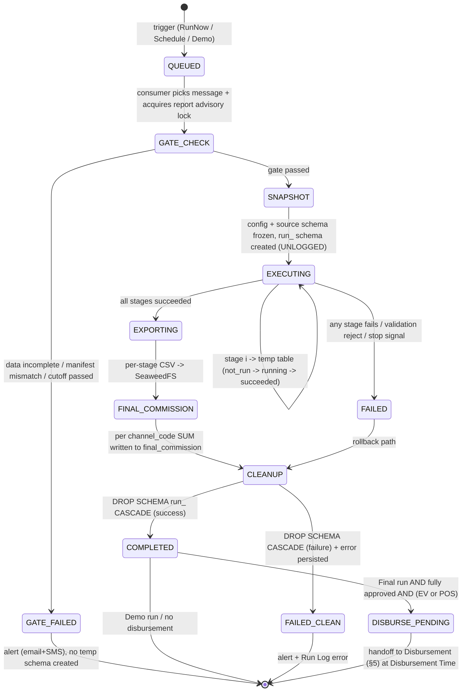

মূল invariants:
- **GATE_CHECK temp schema তৈরির আগে** — gate fail করলে কোনো `run_<uuid>` schema বা DB resource নষ্ট হয় না।
- **SNAPSHOT** state হলো freeze point: config IR-এর approved version + source table schema-র whitelist snapshot নেওয়া হয় (§3 Calc Engine এই snapshot-কে identifier whitelist হিসেবে ব্যবহার করে)। এর পরে কনফিগ edit হলেও চলমান run অপরিবর্তিত।
- **CLEANUP সব path-এ চলে** (success + failure) — `run_<uuid>` schema কখনো leak করে না। এর backstop হিসেবে periodic Hangfire sweeper (§4.8)।
- **Demo run** কখনো DISBURSE_PENDING-এ যায় না — COMPLETED থেকেই terminal।

`report_run` টেবিল (lifecycle-এর authoritative store; §2-এর Module E-এর সাথে একীভূত হবে — §9 CONFIRM):

```sql
CREATE TABLE report_run (
    run_id            UUID PRIMARY KEY,
    report_id         UUID NOT NULL REFERENCES report(report_id),
    run_kind          TEXT NOT NULL CHECK (run_kind IN ('FINAL','DEMO')),
    triggered_by_type TEXT NOT NULL CHECK (triggered_by_type IN ('USER','SYSTEM')),
    triggered_by_user UUID NULL,                 -- BR9: কে trigger করল
    priority          SMALLINT NOT NULL,         -- 30=Low(Schedule) 20=Med(Demo) 10=High(RunNow); ছোট = আগে
    idempotency_key   TEXT NOT NULL,             -- নিচে §4.7
    approved_config_version INT NULL,            -- Final run: কোন approved IR version snapshot হলো
    business_window_start DATE NOT NULL,         -- rolling window (§4.9)
    business_window_end   DATE NOT NULL,
    status            TEXT NOT NULL DEFAULT 'QUEUED',
    temp_schema       TEXT NULL,                 -- 'run_<uuid>' (SNAPSHOT-এ set)
    error_code        TEXT NULL,
    error_detail      TEXT NULL,
    queued_at         TIMESTAMPTZ NOT NULL DEFAULT now(),
    started_at        TIMESTAMPTZ NULL,
    finished_at       TIMESTAMPTZ NULL,
    CONSTRAINT uq_run_idem UNIQUE (idempotency_key)   -- crash/retry-safe trigger
);
CREATE INDEX ix_run_report_active ON report_run(report_id)
    WHERE status NOT IN ('COMPLETED','FAILED_CLEAN','GATE_FAILED');
```

### ৪.৩ Hangfire — Schedule Trigger ও Exactly-Once

Hangfire APP01 **এবং** APP02 — দুই instance-এ চলে (deployment plan)। তাই naïve হলে একটি schedule দুইবার fire হতে পারে। নিয়ম: **Hangfire কোনো run execute করে না; শুধু trigger তৈরি করে RabbitMQ-তে message enqueue করে।** ভারী SQL সবসময় AI01 executor-এ।

Hangfire-এর তিন দায়িত্ব:
1. **Schedule check** — recurrent/scheduled report-এর জন্য cron-style recurring job; due হলে run-trigger তৈরি করে।
2. **Exactly-once dispatch** — দুই instance থাকায় distributed lock + DB-level idempotency দুই layer।
3. **Sweeper** — orphan temp schema cleanup (§4.8) ও demo-cap reset নয় (cap persistent)।

দুই-instance exactly-once trigger (shared lock + idempotency key দুটোই):

```python
# Hangfire recurring job: প্রতি মিনিটে due schedule খোঁজে (APP01+APP02 দুটোই চালায়)
def dispatch_due_schedules():
    # Layer 1: Hangfire distributed lock (PG-backed) — একসাথে এক instance scan করে
    with hangfire_distributed_lock("schedule-dispatch", timeout="55s"):
        for sch in find_due_schedules(now_utc()):   # next_run_at <= now AND active
            window = compute_rolling_window(sch)     # §4.9
            # Layer 2: deterministic idempotency key => DB UNIQUE আটকে দেয় double-enqueue
            idem = f"sched:{sch.report_id}:{window.end.isoformat()}:{sch.occurrence_no}"
            run = try_insert_report_run(             # INSERT ... ON CONFLICT (idempotency_key) DO NOTHING
                report_id=sch.report_id, run_kind="FINAL",
                triggered_by_type="SYSTEM", priority=30,   # Schedule = Low
                idempotency_key=idem, window=window)
            if run.inserted:
                publish_run_message(run.run_id, priority=30, routing_key="run.schedule")
                advance_schedule(sch, window)        # next_run_at = পরের boundary
            # inserted না হলে: অন্য instance/আগের tick ইতিমধ্যে enqueue করেছে → কিছু করি না
```

দুই layer-এর কারণ: distributed lock race কমায়, কিন্তু lock expiry/clock-skew edge case-এ DB `UNIQUE(idempotency_key)` চূড়ান্ত guarantee দেয়। RunNow ও Demo trigger user-action থেকে API-তে আসে (Hangfire নয়), কিন্তু একই `try_insert_report_run` + idempotency path ব্যবহার করে — double-click বা retry আটকাতে।

### ৪.৪ RabbitMQ Topology — Priority Lanes ও Competing Consumer

একটি **durable direct exchange** `salescom.run`, তিনটি লেন আলাদা **quorum queue** (durable, replicated; deployment-এ RabbitMQ DR-এ replicate হয় না বলে — transient broker, failover-এ idempotent re-run, [D3])। মেসেজ `delivery_mode=persistent`, consumer **manual ack**।

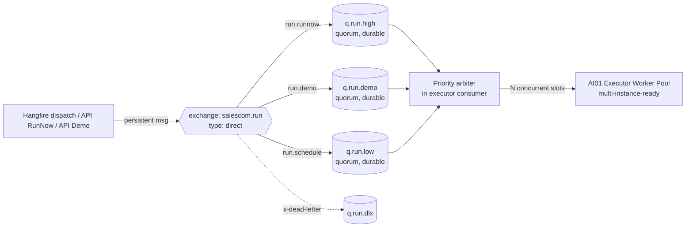

কেন তিনটি আলাদা queue, একটি RabbitMQ priority-field নয়: (১) প্রতি লেনে আলাদা retention/DLX policy দেওয়া যায়, (২) Demo লেনকে read-only constraint দেওয়া সহজ, (৩) starvation আটকাতে weighted draw সরাসরি queue depth দেখে করা যায়। Lane mapping = run priority:

| Lane / queue | Priority | Trigger | Disburse করে? |
|---|---|---|---|
| `q.run.high` | High (10) | Run Report Now | হ্যাঁ (approved হলে) |
| `q.run.demo` | Med (20) | Demo Run | না (read-only) |
| `q.run.low` | Low (30) | Schedule / Recurrent | হ্যাঁ (approved হলে) |

**Competing consumer:** AI01-এ একাধিক executor worker (multi-instance-ready — দরকারে AI01 scale বা দ্বিতীয় AI node) একই তিন queue-তে subscribe করে। RabbitMQ একটি মেসেজ একবারই deliver করে এক consumer-কে; total concurrency = সব worker-এর সম্মিলিত prefetch = N (§4.6)।

**Aging / anti-starvation:** যেহেতু High সবসময় আগে নিলে Low (Schedule) starve হবে, arbiter একটি **weighted + age-aware draw** করে — সরল strict-priority নয়:

```python
# প্রতিবার একটি free slot পেলে arbiter পরের message কোন lane থেকে নেবে ঠিক করে
def pick_next_lane(depths, oldest_age):     # depths/oldest_age প্রতি lane-এ
    # 1) starvation guard: কোনো lane-এ oldest message age > AGING_THRESHOLD হলে সেটাকে promote
    starved = [ln for ln in LANES if depths[ln] > 0 and oldest_age[ln] > AGING_THRESHOLD[ln]]
    if starved:
        return min(starved, key=lambda ln: PRIORITY[ln])   # starved-দের মধ্যে high-priority আগে
    # 2) normal: weighted draw (High:Demo:Low = 6:3:1) কিন্তু খালি lane বাদ
    return weighted_choice({ln: WEIGHT[ln] for ln in LANES if depths[ln] > 0})

AGING_THRESHOLD = {"high": "2m", "demo": "5m", "low": "15m"}  # CONFIRM via load test
```

এতে RunNow সাধারণত আগে চলে, কিন্তু একটি Schedule run 15 মিনিটের বেশি অপেক্ষা করলে সেটি promote হয় — silent starvation হয় না। Threshold load-test-validated (CONFIRM)।

**Dedupe table** (RabbitMQ at-least-once delivery + manual ack ⇒ re-delivery সম্ভব):

```sql
CREATE TABLE run_message_dedupe (
    delivery_idem TEXT PRIMARY KEY,    -- = report_run.idempotency_key
    run_id        UUID NOT NULL,
    consumed_at   TIMESTAMPTZ NOT NULL DEFAULT now()
);
```
Consumer message handle করার শুরুতে এই row INSERT করার চেষ্টা করে; conflict হলে মানে আগেই processed → ack করে drop। নিচের §4.5 pseudocode এটি দেখায়।

### ৪.৫ Executor Worker Pool (AI01) — Per-Report Lock + Bounded Parallelism

Executor হলো AI01-এর Python service (SQLGlot সহ, §3)। এটি stateless ও multi-instance-ready — সব state PG + RabbitMQ-তে, তাই worker process বাড়ানো বা দ্বিতীয় node যোগ করা নিরাপদ। দুই স্তরের lock:

- **Per-report advisory lock** — `pg_try_advisory_lock(hashtext('report:'||report_id))`। একই report-এর দুই run একে অপরকে block করে (serialization)। **try**-lock — পাওয়া না গেলে message nack+requeue করে (busy report)।
- **Platform-wide N** — সব worker-এর সম্মিলিত prefetch + একটি local semaphore = N concurrent execute slot।

Consumer loop (concrete):

```python
def on_run_message(msg):                       # manual-ack consumer, prefetch tuned to slots
    run = load_report_run(msg.run_id)

    # (0) Dedupe — RabbitMQ re-delivery guard
    if not insert_dedupe(run.idempotency_key, run.run_id):   # ON CONFLICT DO NOTHING
        msg.ack(); return                       # আগেই processed

    # (1) Idempotent terminal-state guard (crash recovery)
    if run.status in TERMINAL_STATES:
        msg.ack(); return

    # (2) Platform-wide bound: free slot না থাকলে message ছেড়ে দাও (অন্য worker/পরে নেবে)
    if not GLOBAL_SLOTS.try_acquire(timeout=0):  # local semaphore == prefetch share of N
        msg.nack(requeue=True); return

    conn = pg_connect(role=f"run_exec")          # least-privilege per-run role (§3 [D2])
    try:
        # (3) Per-report serialization — try advisory lock; busy হলে requeue
        if not conn.execute("SELECT pg_try_advisory_lock(hashtext(%s))", [f"report:{run.report_id}"]).scalar():
            msg.nack(requeue=True)               # same report অন্য run চলছে
            return                               # finally GLOBAL_SLOTS release করবে

        set_status(run, "GATE_CHECK")
        if not data_completeness_gate(run):      # §4.6 — temp schema-র আগে
            set_status(run, "GATE_FAILED", error="DATA_INCOMPLETE")
            send_gate_alert(run)                 # email + SMS (§7.11)
            msg.ack(); return

        set_status(run, "SNAPSHOT")
        ir = snapshot_config(run)                # approved_config_version freeze + source schema whitelist
        schema = f"run_{run.run_id.hex}"
        conn.execute(f'CREATE SCHEMA "{schema}"')   # identifier system-controlled, run_id-namespaced
        set_temp_schema(run, schema)

        set_status(run, "EXECUTING")
        run_stages_all_or_nothing(conn, run, ir, schema, read_only=(run.run_kind=="DEMO"))

        set_status(run, "EXPORTING");        export_stage_csvs(run, schema)          # → SeaweedFS
        set_status(run, "FINAL_COMMISSION"); write_final_commission(conn, run, schema) # per channel_code SUM
        set_status(run, "CLEANUP")
        conn.execute(f'DROP SCHEMA "{schema}" CASCADE')
        set_status(run, "COMPLETED")
        if run.run_kind == "FINAL" and is_fully_approved(run.report_id) and has_disbursement(run):
            set_status(run, "DISBURSE_PENDING")  # handoff → §5 (Disbursement Time scheduler)
        msg.ack()

    except StopSignal:                           # explicit cancel of running run
        rollback_run(conn, run, schema_if_any(run), error="STOPPED")
        msg.ack()
    except Exception as e:
        rollback_run(conn, run, schema_if_any(run), error=str(e))   # DROP SCHEMA CASCADE + FAILED_CLEAN
        msg.ack()                                # ack করি কারণ retry idempotency_key দিয়ে নতুন run হিসেবে হবে, blind requeue নয়
    finally:
        try: conn.execute("SELECT pg_advisory_unlock(hashtext(%s))", [f"report:{run.report_id}"])
        finally:
            GLOBAL_SLOTS.release()
            conn.close()
```

মূল নকশা পয়েন্ট:
- **Advisory lock try (block নয়):** busy report-এ message nack+requeue → অন্য report-এর run এগোতে পারে, slot ধরে বসে থাকে না (head-of-line blocking এড়ায়)।
- **Slot release সবসময় `finally`-তে** — crash বা exception-এ N permanently কমে যায় না।
- **Failure পথে blind requeue নয়** — exception-এ message ack করি ও run FAILED_CLEAN করি; re-run চাইলে নতুন trigger (নতুন run_id, একই বা নতুন idempotency policy) আসবে। এতে poison-message infinite loop হয় না; DLX শুধু parse-fail/malformed message-এর জন্য।
- **Demo read-only lane:** `read_only=True` হলে executor connection-এ session `SET TRANSACTION READ ONLY` এবং disbursement/approval path সম্পূর্ণ skip — demo কখনো final_commission disburse করে না (যদিও calculation ও CSV export করে, §3.8)।

### ৪.৬ Run-Gate — Data Completeness Check

Run-gate temp schema তৈরির **আগে** চলে। তিনটি শর্ত একসাথে সত্য হতে হবে (§7.5 ICD-3 এই signal সরবরাহ করে; এখানে gate logic):

```python
def data_completeness_gate(run) -> bool:
    sources = required_sources_of(run.report_id)     # snapshot IR থেকে
    for src in sources:
        # (a) finished table-এ ডেটা End Date পর্যন্ত এসেছে?
        max_bd = q("SELECT max(business_date) FROM finished.%I" % src.table)
        if max_bd is None or max_bd < run.business_window_end:
            return fail(run, src, "MAX_BUSINESS_DATE_SHORT", max_bd)
        # (b) per-source Airflow transform job success?
        if not airflow_transform_succeeded(src, run.business_window_end):
            return fail(run, src, "TRANSFORM_NOT_SUCCEEDED")
        # (c) manifest row-count match (SFTP drop + manifest marker: rowcount+busdate+checksum)
        man = load_manifest(src, run.business_window_end)   # Airflow sensor ইতিমধ্যে wait করেছে
        actual = q("SELECT count(*) FROM finished.%I WHERE business_date=%s" % (src.table, run.business_window_end))
        if man is None or man.row_count != actual or not checksum_ok(man):
            return fail(run, src, "MANIFEST_MISMATCH", (man.row_count if man else None, actual))
    # cutoff পার? → silent skip নয়, hard gate fail + alert
    if now_utc() > run.cutoff_at:
        return fail(run, None, "CUTOFF_PASSED")
    return True
```

Gate condition (locked):
- **`max(business_date) ≥ End Date`** finished table-এ, **AND** per-source transform job success, **AND** manifest row-count + checksum match।
- প্রতি source-এ SFTP drop + manifest marker file (row count + business date + checksum); Airflow sensor সেটির জন্য wait করে (§7.5)।
- **Cutoff পার = hard gate fail** (silent skip নয়) → email/SMS alert (§7.11), run `GATE_FAILED`। recurrent হলে পরের boundary পর্যন্ত backoff-retry (§4.9), কিন্তু cutoff-এর পরে নয়।

### ৪.৭ Idempotency, All-or-Nothing, Crash Recovery

**Idempotency key** — প্রতি run-এ deterministic key (§4.2 `idempotency_key`), `UNIQUE` constraint। Schedule: `sched:<report>:<window_end>:<occurrence>`; RunNow: `runnow:<report>:<config_version>:<client_request_id>`; Demo: `demo:<report>:<demo_ordinal>`। ফলে double-click, Hangfire double-tick, বা API retry — একই run_id-তে collapse হয়, দ্বিতীয় execute হয় না।

**All-or-nothing** — একটি run হয় সম্পূর্ণ সফল (COMPLETED, final_commission লেখা), নয় কিছুই থাকে না (FAILED_CLEAN, কোনো partial final_commission নয়)। stage-গুলো `run_<uuid>` schema-তে চলে; final_commission লেখা হয় শুধু সব stage সফল হলে। মাঝে fail/stop হলে `DROP SCHEMA run_<uuid> CASCADE` — partial output বা partial disbursement কখনো হয় না (locked)।

```python
def run_stages_all_or_nothing(conn, run, ir, schema, read_only):
    for stage in ir.stages:                  # snapshot order
        set_stage_status(run, stage, "RUNNING")
        sql = sqlglot_build_and_validate(stage, ir.whitelist)   # §3 [D2]: AST build → re-parse → allowlist
        conn.execute(f'CREATE UNLOGGED TABLE "{schema}".{stage.out} AS {sql}', params=stage.bound_params)
        set_stage_status(run, stage, "SUCCEEDED")
    # final_commission: per channel_code SUM; unmapped/null/duplicate channel = hard error (§3 Money)
    validate_channels_or_fail(conn, schema, run)
```

**Crash recovery** — executor বা AI01 crash করলে:
- চলমান run-এর message ছিল **unacked** → RabbitMQ অন্য consumer-কে redeliver করে।
- redeliver-এ dedupe + terminal-state guard চলে; run তখনও non-terminal থাকলে, এর orphan `run_<uuid>` schema (যদি SNAPSHOT পার করে থাকে) আগে DROP করে fresh শুরু — কারণ UNLOGGED টেবিল crash-এ অনির্ভরযোগ্য, তাই partial schema পেলে সবসময় rebuild। final_commission শুধু সফল CLEANUP-এর আগে atomically লেখা হয় বলে double-write হয় না।
- crash advisory lock session-bound বলে স্বয়ংক্রিয়ভাবে release হয়।

**Report Stop semantics** (locked, §5.1):
- **Report Stop = future schedule cancel** — recurring schedule নিষ্ক্রিয় হয়, `next_run_at` clear; নতুন run আর enqueue হয় না।
- **চলমান run আলাদা explicit cancel** — Report Stop চলমান run থামায় না। চলমান run থামাতে আলাদা "Cancel Run" action যা executor-এ `StopSignal` পাঠায় (PG NOTIFY বা control table flag executor poll করে stage boundary-তে) → run FAILED_CLEAN, schema DROP CASCADE।

**Demo cap (5)** — প্রতি report সর্বোচ্চ 5 demo run, persistent counter:
```python
def can_demo(report_id) -> bool:
    n = q("SELECT count(*) FROM report_run WHERE report_id=%s AND run_kind='DEMO'", report_id)
    return n < 5            # API trigger-time enforce; cap reset হয় না (clone fresh draft বলে নতুন report নতুন cap)
```
Demo শুধু **Final Saved** বা **Approval Pending** report-এ allowed (Draft-এ নয় — SQL generate হয় না, §3.8)।

### ৪.৮ Temp Schema Lifecycle ও Sweeper

প্রতি run unique `run_<uuid>` schema, ভেতরে **UNLOGGED** টেবিল (WAL overhead নেই, crash-এ যাহোক rebuild হয় — তাই durability দরকার নেই, performance পাওয়া যায়)। শেষে `DROP SCHEMA ... CASCADE` সব path-এ। Backstop = **periodic Hangfire sweeper**:

```python
def sweep_orphan_run_schemas():              # Hangfire recurring (যেমন প্রতি 30 মিনিট)
    for schema in pg("SELECT nspname FROM pg_namespace WHERE nspname LIKE 'run\\_%'"):
        run_id = parse_uuid(schema)
        run = load_report_run(run_id)
        if run is None or run.status in TERMINAL_STATES:    # owner run শেষ/নেই কিন্তু schema রয়ে গেছে
            pg(f'DROP SCHEMA "{schema}" CASCADE')           # orphan — নিরাপদে DROP
```
Sweeper শুধু terminal/নিখোঁজ run-এর schema মোছে — চলমান run-এর schema কখনো ছোঁয় না (status guard)।

> CSV supporting-upload-এর জন্য আলাদা report-lifecycle-bound schema (run_<uuid> নয়) — সেটি §2/§3-এ; sweeper সেটিকে স্পর্শ করে না।

### ৪.৯ Recurrent Run Cadence ও Rolling Window

Recurrency = **Monthly** রাখা (locked default; SRS-এ Daily/Weekly উল্লেখ থাকলেও LLD Monthly সহ — **CONFIRM** যে production-এ Monthly যথেষ্ট নাকি Daily/Weekly-ও লাগবে)। প্রতি occurrence-এ **rolling window**:

| Recurrency | Window start | Window end | উদাহরণ (trigger 2026-06-01) |
|---|---|---|---|
| Daily | আগের দিন | আগের দিন | 2026-05-31 → 2026-05-31 |
| Monthly | আগের মাসের 1 তারিখ | আগের মাসের শেষ দিন | 2026-05-01 → 2026-05-31 |

```python
def compute_rolling_window(sch):
    today = now_dhaka().date()                    # TZ=Asia/Dhaka (deployment)
    if sch.frequency == "MONTHLY":
        first_this = today.replace(day=1)
        end = first_this - timedelta(days=1)       # আগের মাসের শেষ দিন
        start = end.replace(day=1)                 # আগের মাসের 1
    elif sch.frequency == "DAILY":
        start = end = today - timedelta(days=1)
    return Window(start=start, end=end)            # = recurrence boundary; run.business_window_*
```

- **Start/End = recurrence boundary** (report-এর fixed Start/End নয়; প্রতি occurrence rolling)।
- **Gate-fail হলে cutoff পর্যন্ত backoff-retry** — silent skip নয়। অর্থাৎ একটি occurrence-এর ডেটা দেরিতে এলে, gate ব্যর্থ run-কে exponential backoff-এ পুনরায় enqueue করা হয় (একই idempotency window key, তাই duplicate run তৈরি হয় না — একই run_id retry), কিন্তু `cutoff_at` পেরোলে hard fail + alert (§4.6)।
- প্রতিটি occurrence Schedule lane (Low priority) দিয়ে যায়, তাই RunNow/Demo-এর সাথে fair-share + aging-এ অংশ নেয়।

---

**§৪ cross-reference:** SQL generation, SQLGlot AST validation, safe-expression grammar, least-privilege run role — §3 (Calc Engine [D2])। final_commission → EV/POS disbursement, reconciliation, idempotency UNIQUE(run_id, channel_code) — §5 (Disbursement)। data-completeness signal source (SFTP manifest, Airflow sensor) — §7.5 (ICD-3)। DB pooling, partition, read-replica routing, advisory-lock-এর PgBouncer transaction-pool সংগততা — §2।

**§৪ CONFIRM list (build-আগে lock, [D4], consolidated §9):**
1. **N (platform-wide parallel run) = 3** — real 200-user + 3-4 parallel-run load test দিয়ে validate (AI01 4GB/3CPU, DB ≥32GB)।
2. **Aging thresholds** (High 2m / Demo 5m / Low 15m) ও weighted-draw ratio (6:3:1) — load-test-tuned।
3. **Recurrency = Monthly যথেষ্ট** নাকি Daily/Weekly-ও production-এ লাগবে (SRS vs LLD অমিল)।
4. **PgBouncer transaction-pooling + PG session-level advisory lock** — transaction-pool mode-এ session-lock নিরাপদ রাখতে executor run-connection PgBouncer bypass করে সরাসরি/dedicated pool ব্যবহার করবে, নাকি transaction-scoped `pg_advisory_xact_lock` ব্যবহার করবে — চূড়ান্ত করতে হবে (নিচে নোট)।
5. **Cancel Run** mechanism: PG NOTIFY vs control-table poll-at-stage-boundary — চূড়ান্ত করতে হবে।

> **নোট (CONFIRM #4):** উপরের pseudocode session-level `pg_try_advisory_lock` ধরে নিয়েছে যা সংশ্লিষ্ট connection-এর পুরো run জুড়ে ধরে রাখা হয়। PgBouncer transaction-pooling-এ session-lock pinning সমস্যা করে — তাই executor-এর run-connection হয় (ক) PgBouncer-এর session-pool/direct route ব্যবহার করবে (run interactive traffic-এর চেয়ে অনেক কম, N≈3-4), অথবা (খ) প্রতি transaction-এ `pg_advisory_xact_lock` নিয়ে serialization-কে transaction boundary-তে enforce করবে। recommended: (ক) — run-execution আলাদা small dedicated session-pool-এ, interactive load আলাদা transaction-pool-এ (§2-এর "run execution primary-তে" routing-এর সাথে সংগত)।

---

## ৫. Report State Machine, Approval ও Money Integrity

> এই section রিপোর্টের পুরো জীবনচক্র (state machine), maker-checker approval workflow, এবং কমিশন টাকার integrity (idempotency + reconciliation) — এই তিনটি একসাথে আঁটসাঁট (binding) নিয়মে বাঁধে। Run execution-এর internal stage pipeline, IR→SQL generation ও SQLGlot validation §3-এ (Calc Engine); queue/serialization model §4 (Run Orchestration) দেখুন। এখানে আমরা শুধু **state transition, approval gating, ও money correctness** নিয়ে কথা বলছি। (External disbursement interface contract ও reconciliation matrix §7-এ।)

---

### ৫.১ Report State Machine

রিপোর্টের lifecycle দুইটি আলাদা axis-এ চলে যা প্রায়ই গুলিয়ে ফেলা হয় — এদের পরিষ্কার আলাদা রাখা design-এর ভিত্তি:

- **`report.config_state`** — কনফিগারেশনের সম্পাদনা-অবস্থা (Draft / Final Saved / Approval Pending / Locked)। এটি রিপোর্টের কনফিগ object-এর state।
- **`report_run.run_state`** — একটি নির্দিষ্ট run trigger-এর execution state (queued / running / completed / failed / cancelled — §4.2 state machine)। এক রিপোর্টে বহু run থাকতে পারে।

UI-এর listing "Status" কলাম (Save as Draft / Waiting for Running / Waiting for RA L1 / Approved by All / Rejected by RA) আসলে `config_state` + চলমান `approval_request` state-এর একটি **derived composite label** — আলাদা stored column নয় (CONFIRM: composite label rendering rule UI team-এর সাথে lock)।

#### ৫.১.১ config_state mermaid

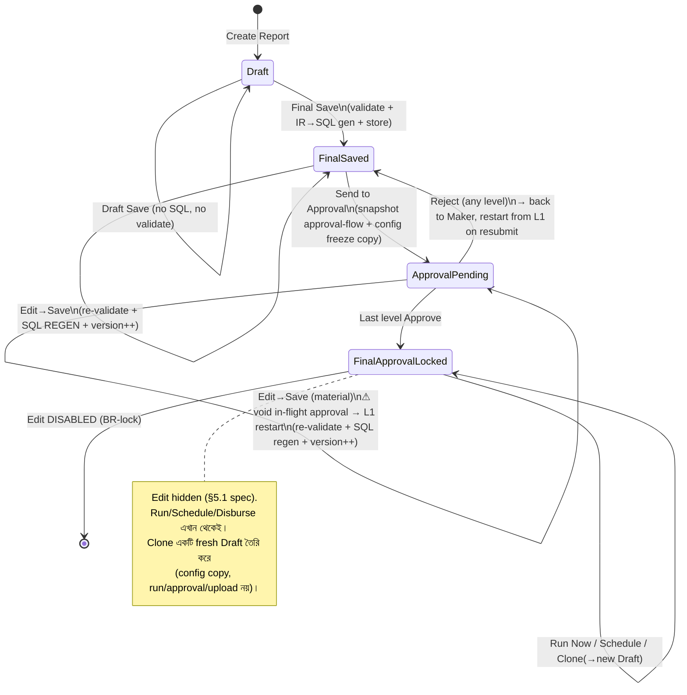

#### ৫.১.২ State-vs-Allowed-Action টেবিল

| Action | Draft | Final Saved | Approval Pending | Final Approval LOCKED |
|---|---|---|---|---|
| **Draft Save** | ✅ (incomplete OK) | ✅ (downgrade নয়; same state re-save) | ❌ | ❌ |
| **Final Save (validate+SQL gen)** | ✅ (Draft→FinalSaved) | ✅ (re-save, regen) | — | ❌ |
| **Edit** (open wizard) | ✅ | ✅ | ✅ (⚠ material edit → approval void) | ❌ **hidden** |
| **Demo Run** | ❌ (no SQL exists) | ✅ (≤5/report) | ✅ (≤5/report) | ✅ |
| **Send to Approval** | ❌ | ✅ | — (already in flow) | — |
| **Approve / Reject (level)** | ❌ | ❌ | ✅ (assigned level user only) | ❌ (flow done) |
| **Run Now (Final)** | ❌ | ❌ | ❌ | ✅ (BR8: full approval) |
| **Schedule for later** | ❌ | ❌ | ❌ | ✅ |
| **Report Stop** (cancel future schedule) | ❌ | ❌ | ❌ | ✅ (যদি scheduled) |
| **Clone** | ✅ | ✅ | ✅ | ✅ (সব state থেকে → fresh Draft) |

মূল gating অপরিবর্তনীয় নিয়মগুলো:
- **Demo Run ≠ Draft** — Draft-এ SQL generate-ই হয়নি, তাই execute করার কিছু নেই (spec §5.5)। Demo lane low-priority read-only (D1); disburse/approve কখনো করে না।
- **Run Now ও Disbursement কেবল `FinalApprovalLocked`** (BR8)। Approval Pending-এ Run Now নেই — মাঝপথের approval দিয়ে টাকা ছাড়া যাবে না।
- **Edit কেবল Locked-এ বন্ধ** (spec §5.1: Final Approval-এর আগ পর্যন্ত সব state-এ Edit খোলা)।

---

### ৫.২ Final Save vs Draft Save, SQL Regeneration, Config Versioning

#### ৫.২.১ দুই save mode-এর আচরণ

| দিক | Draft Save | Final Save |
|---|---|---|
| Config completeness | আংশিক/incomplete গ্রহণযোগ্য | পূর্ণ validation pass আবশ্যক |
| Pipeline pre-validate | না | হ্যাঁ (প্রতি stage: column/calc-field reference, safe-expr grammar parse) |
| IR→SQL generation | **না** | **হ্যাঁ** (SQLGlot AST build + allowlist re-parse validate — §3) |
| Generated SQL stored | না | হ্যাঁ (`report_config_version.generated_sql_bundle`) |
| Demo Run eligible | না | হ্যাঁ |
| Approval-এ পাঠানো যায় | না | হ্যাঁ |

#### ৫.২.২ Config Versioning model

প্রতিবার Final Save (নতুন বা edit-resave) একটি নতুন **immutable** `report_config_version` row তৈরি করে — কখনো in-place mutate নয়। এটি (a) edit-vs-approve race আটকায়, (b) approval কোন config-এর উপর হয়েছে তা auditably bind করে, (c) run কোন config snapshot চালিয়েছে তা freeze করে। (§3-এর `report_config_version` ও §2-এর `report`/`report_stage`-এর সাথে একীভূত config-version model — §9 CONFIRM।)

```sql
CREATE TABLE report (
    report_id            UUID PRIMARY KEY,
    report_name          CITEXT UNIQUE NOT NULL,           -- BR3 system-wide unique (case-insensitive)
    channel_code         TEXT NOT NULL,                    -- §5.6 channel-list (CONFIRM)
    config_state         TEXT NOT NULL                     -- draft|final_saved|approval_pending|locked
                         CHECK (config_state IN ('draft','final_saved','approval_pending','locked')),
    current_version_id   UUID,                             -- → report_config_version (HEAD)
    approval_flow_id     UUID NOT NULL,                    -- selected flow (UI-driven; spec open item #5)
    created_by           UUID NOT NULL,                    -- BR5 maker anchor (creator)
    last_edited_by       UUID NOT NULL,                    -- BR5 maker anchor (last editor)
    row_version          BIGINT NOT NULL DEFAULT 0,        -- optimistic concurrency token
    created_at_utc       TIMESTAMPTZ NOT NULL DEFAULT now(),
    updated_at_utc       TIMESTAMPTZ NOT NULL DEFAULT now()
);

CREATE TABLE report_config_version (
    config_version_id    UUID PRIMARY KEY,
    report_id            UUID NOT NULL REFERENCES report(report_id),
    version_no           INT  NOT NULL,                    -- 1,2,3... monotonic per report
    ir_json              JSONB NOT NULL,                   -- canonical IR (see §5.2.4 sketch)
    generated_sql_bundle JSONB NOT NULL,                   -- per-stage SQLGlot output (validated)
    source_schema_snapshot JSONB NOT NULL,                 -- identifier whitelist snapshot (D2)
    validation_report    JSONB NOT NULL,                   -- pass result + warnings
    created_by           UUID NOT NULL,
    created_at_utc       TIMESTAMPTZ NOT NULL DEFAULT now(),
    UNIQUE (report_id, version_no)
);
```

#### ৫.২.৩ SQL Regeneration on Edit

একটি Final Saved (বা Approval Pending) রিপোর্ট edit করে আবার save করলে:

1. সম্পূর্ণ re-validation চলে (Draft-এ partial state থেকে এলেও)।
2. IR পুরো নতুন করে SQLGlot AST-এ build হয় → allowlist re-parse validate → নতুন `generated_sql_bundle`।
3. নতুন `report_config_version` (version_no++) তৈরি, `report.current_version_id` HEAD update।
4. পুরনো version row **মুছে নয়** — retained (audit + run reproducibility)। চলমান কোনো run তার নিজের frozen version দেখতে থাকে, নতুন HEAD নয়।

> **CONFIRM (spec §5.1 note):** spec-এ SQL regeneration rule-এর শেষ অংশ truncated ছিল। এখানে locked default: **edit→save সবসময় full re-validate + full regen** (incremental/partial regen নয়) — deterministic ও audit-friendly।

#### ৫.২.৪ IR JSON sketch (versioned config-এর core)

```jsonc
{
  "ir_version": "1.0",
  "report_id": "…uuid…",
  "channel_mapping": {                 // §5.6 final mapping — payout তৈরির ভিত্তি
    "channel_code_col": "ACH1.channel_code",
    "commission_amount_col": "INC1.payout"
  },
  "achievements": [
    { "id": "ACH1", "datasource": "recharge_finished",
      "stages": [
        { "type": "filter",  "col": "trx_date", "op": "gte", "value": {"$param": "p_start"} },
        { "type": "summarize", "result_col": "HIT", "calc": "SUM", "form_col": "amount" },
        { "type": "calculate", "result_col": "ach_pct",
          "expr": { "ast": "DIV", "l": "HIT", "r": {"$nullif": ["HIT_TARGET", 0]} } }  // div-by-zero guard
      ] }
  ],
  "incentives": [
    { "id": "INC1", "inputs": ["ACH1"],
      "slabs": [                       // IF/CASE — safe-expr grammar parsed (D2)
        { "when": [{"col":"ach_pct","op":"gte","val":0.8},{"col":"ach_pct","op":"lt","val":1.0}], "then": 50 },
        { "when": [{"col":"ach_pct","op":"gte","val":1.0}], "then": 100 }
      ],
      "map_each_input": { "value_col": "payout", "decimals": 2 } }
  ]
}
```

(IR-এর প্রতিটি `expr`/`when`/`then` literal bound-parameter হয়ে এবং প্রতিটি identifier `source_schema_snapshot`-এর বিরুদ্ধে whitelist হয়ে SQLGlot AST-এ যায় — raw string concat নিষিদ্ধ; বিস্তারিত §3 Calc Engine D2।)

---

### ৫.৩ Approval Workflow (Maker-Checker)

#### ৫.৩.১ Flow / Level / Level-User model

```sql
CREATE TABLE approval_flow (
    flow_id     UUID PRIMARY KEY,
    flow_name   CITEXT UNIQUE NOT NULL,          -- unique flow name
    flow_type   TEXT NOT NULL                    -- 'B2B' | 'B2C'  (§5.4 — routing vs label CONFIRM)
                CHECK (flow_type IN ('B2B','B2C')),
    is_active   BOOLEAN NOT NULL DEFAULT true
);

CREATE TABLE approval_level (
    level_id    UUID PRIMARY KEY,
    flow_id     UUID NOT NULL REFERENCES approval_flow(flow_id),
    level_name  TEXT NOT NULL,
    level_order INT  NOT NULL CHECK (level_order > 0),    -- positive int
    UNIQUE (flow_id, level_order)                         -- per-flow order unique
);

CREATE TABLE approval_level_user (
    level_user_id UUID PRIMARY KEY,
    level_id      UUID NOT NULL REFERENCES approval_level(level_id),
    user_id       UUID NOT NULL,                  -- central-directory verified
    UNIQUE (level_id, user_id)
);
-- একই user একাধিক level/flow-তে থাকতে পারে (spec §6.2)।
```

#### ৫.৩.২ Snapshot freeze at run-create + sequential ascending (BR6)

প্রতিটি approval run-এর শুরুতে selected flow-এর `level` + `level_user` সম্পূর্ণ **copy করে freeze** করা হয় (`approval_run`)। কারণ: Admin পরে flow edit করলেও in-flight approval তার শুরুর rule-ই দেখবে (deterministic, audit-clean)।

```sql
CREATE TABLE approval_run (
    approval_run_id   UUID PRIMARY KEY,
    report_id         UUID NOT NULL REFERENCES report(report_id),
    config_version_id UUID NOT NULL REFERENCES report_config_version(config_version_id), -- কোন config approve হচ্ছে
    flow_snapshot     JSONB NOT NULL,            -- frozen levels + users at create-time
    current_level_ord INT  NOT NULL DEFAULT 1,
    overall_status    TEXT NOT NULL DEFAULT 'pending'   -- pending|approved|rejected|void
                      CHECK (overall_status IN ('pending','approved','rejected','void')),
    started_by        UUID NOT NULL,             -- maker who submitted
    created_at_utc    TIMESTAMPTZ NOT NULL DEFAULT now()
);

CREATE TABLE approval_decision (
    decision_id      UUID PRIMARY KEY,
    approval_run_id  UUID NOT NULL REFERENCES approval_run(approval_run_id),
    level_order      INT  NOT NULL,
    decision         TEXT NOT NULL CHECK (decision IN ('approved','rejected')),
    comment          TEXT,                       -- BR7: rejected হলে NOT NULL enforce (trigger/check)
    approver_user_id UUID NOT NULL,              -- persist approver (default rule)
    decided_at_utc   TIMESTAMPTZ NOT NULL DEFAULT now(),
    UNIQUE (approval_run_id, level_order)        -- per run প্রতি level একবারই decision
);
```

```mermaid
sequenceDiagram
    participant M as Maker
    participant API as API (.NET)
    participant AR as approval_run
    participant Ln as Level n approver
    M->>API: Send to Approval (config vN)
    API->>AR: create approval_run(freeze flow, version=vN, level=1)
    loop ascending level 1..N (BR6)
        Ln->>API: Approve / Reject(+comment)
        API->>API: guard BR5 (not maker, not self prior level)
        alt Approve & level<N
            API->>AR: current_level_ord++ ; notify next level
        else Approve & level==N
            API->>AR: overall_status=approved
            Note over AR: report.config_state → LOCKED (BR8 disburse enabled)
        else Reject (BR7 comment required)
            API->>AR: overall_status=rejected
            API->>M: notify Maker; report → final_saved (back to Maker)
        end
    end
```

#### ৫.৩.৩ Reject → Maker + restart (locked default, spec open item #1)

spec §6.3-এ SRS ("previous level") বনাম LLD ("Maker") মতভেদ ছিল। **Locked decision:** Reject (যেকোনো level থেকে) → run **Maker**-এর কাছে ফেরে; comment **বাধ্যতামূলক** (BR7)। Resubmit করলে approval **L1 থেকে restart** + full re-validation (পুরনো partial approval carry করে না)।

#### ৫.৩.৪ BR5 Segregation enforcement

প্রতিটি Approve/Reject action-এ server-side (JWT claim নয়, live DB check — §6 default) তিনটি guard:

1. **maker ≠ approver:** `approver_user_id ≠ report.created_by` এবং `≠ report.last_edited_by` (maker = creator/last-editor; কোনো level approve করতে পারবে না — Admin override নেই)।
2. **per-run one-level:** এক user এই `approval_run`-এ আগের কোনো level-এ decision দিয়ে থাকলে আবার অন্য level-এ decide করতে পারবে না (UNIQUE(approval_run_id, approver) guard table)।
3. **no self-approve:** উপরের ১+২ মিলেই self-approval সম্পূর্ণ অসম্ভব।

#### ৫.৩.৫ Edit-while-Pending → void + restart (optimistic concurrency)

Approval Pending-এ **material** edit হলে in-flight approval void হয়ে L1 restart হবে। edit-vs-approve race আটকাতে optimistic version:

```sql
-- Maker material edit:
UPDATE report SET current_version_id=:newV, row_version=row_version+1, config_state='approval_pending'
  WHERE report_id=:rid AND row_version=:expectedRowVersion;     -- 0 rows → 409 Conflict, refetch
-- একই tx-এ:
UPDATE approval_run SET overall_status='void'
  WHERE report_id=:rid AND overall_status='pending';

-- Approver approve action (একই token দেখে):
UPDATE approval_run SET current_level_ord=current_level_ord+1
  WHERE approval_run_id=:arid AND overall_status='pending'
    AND config_version_id=:approverSawVersion;                  -- version mismatch → reject stale approve
```

approve action সবসময় তার দেখা `config_version_id` জমা দেয়; edit ততক্ষণে নতুন version+void করে দিয়ে থাকলে approve **stale** হিসেবে reject হয় → approver নতুন config-এর notice পায়। এতে "পুরনো config approve হয়ে গেল কিন্তু আসলে নতুন config disburse হলো" — এই hole বন্ধ। **CONFIRM:** "material" edit-এর সংজ্ঞা (datasource/stage/mapping পরিবর্তন = material; শুধু remark/block-rename = non-material?) lock করতে হবে।

---

### ৫.৪ Approval Type B2B / B2C handling (CONFIRM)

UI-তে Approval Flow-এ `Type = B2B/B2C` field আছে কিন্তু MD spec এর behavior সংজ্ঞায়িত করেনি। দুটি সম্ভাব্য interpretation:

- **(A) Label only** — শুধু categorization/filter; routing-এ প্রভাব নেই। তাহলে `flow_type` শুধু display+filter column।
- **(B) Routing driver** — channel/disbursement type থেকে কোন flow auto-select হবে তা নির্ধারণ করে (যেমন Distributor→B2B flow, Retailer→B2C)।

**Design stance (CONFIRM):** আমরা schema-তে `flow_type` রাখছি (উপরে), কিন্তু **default আচরণ = (A) label/filter**, কারণ report-create-এ Maker explicitly approval_flow select করে (spec open item #5)। যদি client (B) চায়, একটি `channel→flow_type` routing map যোগ হবে এবং report-create-এ flow auto-suggest হবে। এটি D4-এর SRS open-item হিসেবে **Build-আগে lock করতে হবে**।

---

### ৫.৫ Disbursement Integrity

> External provider/POS interface contract (request/response/idempotency/ack file) §7 (ICD-1, ICD-2); reconciliation matrix §7.10। এখানে SalesCom-side integrity rule।

#### ৫.৫.১ EV vs POS

| দিক | EV (Electronic Value) | POS (file handoff) |
|---|---|---|
| Trigger | নির্ধারিত Disbursement Time, auto | CSV dump তৈরি → SeaweedFS |
| টাকা ছাড়ে কে | SalesCom (AI01 EV service) + SMS | POS system (CSV consume করে) |
| Record | `ev_disburse` row per channel + SMS | `pos_dump`/`pos_csv_manifest` row + ack ingest |
| CSV cols | Channel Type, Channel Code, Amount, Time, Status, Message | Channel Code, Amount |
| Gate | full approval (BR8) | full approval (BR8) |

#### ৫.৫.২ Idempotency (locked default)

```sql
-- report_run §4.2-এ; ev_disburse §2.2 Module F-এ (ledger, monthly range-partition)।
-- মূল integrity constraint:
--   ev_disburse: UNIQUE (run_id, channel_code)  ★ per-run per-channel exactly-once
--                + per-disbursement idempotency_key
--   report_run:  UNIQUE (idempotency_key)        — (report_id, schedule_occurrence) → exactly-once
```

- `UNIQUE(run_id, channel_code)` — re-run/retry-এ একই channel দুবার disburse করা DB-স্তরেই অসম্ভব।
- RabbitMQ consumer dedupe table + Hangfire shared-locked exactly-once schedule trigger (§4 Idempotency) — broker redelivery double-disburse করতে পারে না; failover-এ idempotent re-run নিরাপদ (D3: RabbitMQ replicate করা হয় না)।

#### ৫.৫.৩ Reconciliation (per run, প্রতি disbursement-এর পর)

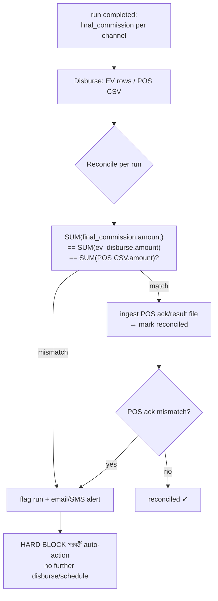

invariant: প্রতি `run_id`-এর জন্য `SUM(final_commission) == SUM(ev_disburse) == SUM(POS CSV)`। mismatch → flag + alert + পরবর্তী auto-action **hard block** (silent continue নয়)। POS-এর ক্ষেত্রে ack/result file ingest করে দ্বিতীয় reconciliation (§7.4 ICD-2)।

#### ৫.৫.৪ All-or-nothing channel rule

unmapped / null / duplicate `channel_code` = **hard validation error → run fail** (partial disbursement কখনো নয়)। final_commission লেখার আগেই channel mapping validate হয়; এক channel-ও invalid হলে পুরো run fail করে run_<uuid> temp schema DROP CASCADE (§4)। ledger টেবিলে (final_commission/ev_disburse) generated SQL কখনো write করে না — system-controlled trusted path (D2, §3.7)।

---

### ৫.৬ Money Correctness Rules সারসংক্ষেপ

| নিয়ম | প্রয়োগ |
|---|---|
| Compute precision | `NUMERIC(18,4)` সব intermediate calc |
| Final rounding | চূড়ান্ত **2 dp, round half-up** (display+disburse) |
| Div-by-zero | `NULLIF(denominator,0)` guard (IR-এ `$nullif`, §5.2.4) |
| Aggregation | per `channel_code` `SUM` (final mapping, §3) |
| Channel validity | unmapped/null/duplicate channel = **hard error → run fail** (no partial) |
| All-or-nothing | failure/stop-এ run_<uuid> temp schema **DROP SCHEMA CASCADE** |
| Idempotency | `UNIQUE(run_id, channel_code)` + per-run/per-disbursement idempotency key |
| Reconciliation | `SUM(final_commission)==ev==POS` per run; mismatch → hard block |
| Ledger integrity | append-only; UPDATE/DELETE privilege blocked; hash-chain (§6.8) |
| Currency | BDT implicit (spec §2.2) |

> **মুদ্রা ও channel sizing assumption নয়:** unmapped channel ও money invariant-এর behavior real 200-user concurrency সহ load test-এ verify করতে হবে (§4 run-concurrency, §8.6); ধরে নেওয়া যাবে না।

---

#### ৫.৭ Build-আগে lock করতে হবে (D4 open items এই section-এর, consolidated §9)

1. **B2B/B2C type semantics** — label/filter (default A) নাকি routing driver (B) — §5.4।
2. **"Material edit" সংজ্ঞা** — কোন edit approval void করবে, কোনটা non-material — §5.3.5।
3. **Channel fixed-list vs configurable** — Distributor/RSO/RSO Sup/Retailer/COPS fixed নাকি Data-Source-driven configurable list (final_commission channel_code domain) — §5.5.4/§5.6।
4. **Composite "Status" label rule** — listing-এর derived label কীভাবে config_state + approval state থেকে render হবে — §5.1।
5. **Reject restart scope confirm** — L1-restart + full re-validation locked default (open item #1) client sign-off।
6. **Approval flow select vs auto** — report-create-এ Maker explicit select (default) নাকি channel-driven auto — §5.4 (spec open item #5)।

---

**§৫ cross-references:** IR→SQL generation, SQLGlot AST/allowlist validation, safe-expr grammar, least-privilege per-run role — §3 (Calc Engine, D2)। Run queue/serialization, priority+aging, demo lane, temp schema lifecycle — §4 (Run Orchestration, D1)। Run-gate (manifest/business-date/cutoff) — §4.6/§7.5। External disbursement contract + reconciliation matrix + notification matrix — §7। Audit hash-chain/WORM, retention — §6.8/§2.6/§2.7। JWT/live-role-check — §6।

---

## ৬. Security, Authentication ও Audit (নিরাপত্তা, প্রমাণীকরণ ও অডিট)

> এই section টি SalesCom-এর end-to-end নিরাপত্তা posture বর্ণনা করে: কীভাবে user প্রমাণিত হয় (auth), কী করতে পারে (authorization/RBAC), secret/key কীভাবে রক্ষিত হয়, object storage ও disbursement artifact কীভাবে নিরাপদ থাকে, এবং প্রতিটি sensitive action কীভাবে tamper-evident ভাবে audit হয়। যেহেতু SalesCom প্রকৃত টাকা হিসাব ও বিতরণ করে (EV auto-SMS + POS CSV handoff), নিরাপত্তা মূলত একটি **money-fraud control surface** — তাই প্রতিটি subsection-এ সংশ্লিষ্ট fraud risk আলাদা করে call out করা হয়েছে।
>
> Cross-reference: Approval/Maker-Checker state machine §5.3; Disbursement reconciliation §5.5 + §7.10; run-execution trust path §3.7; calc-engine SQL safety §3 (D2); infra/HA §8। এখানে শুধু **security mechanics, threat model ও control** বিস্তারিত করা হলো; ওই section-গুলোর কাজ পুনরাবৃত্তি করা হয়নি।

---

### ৬.১ Threat Model ও নিরাপত্তা নীতি (Security Principles)

SalesCom **internal-only** হলেও threat model "trusted internal user"-কে নিরাপদ ধরে নেয় না, কারণ এখানে আসল মুদ্রা (BDT) বিতরণ হয়। মূল আক্রমণ-পৃষ্ঠ (attack surface):

| # | Threat | কোথায় | প্রাথমিক control |
|---|---|---|---|
| T1 | SQL injection / arbitrary SQL execution | Calc engine (IR→SQL) | §৬.৬ — AST allowlist, bound params, least-privilege role (D2) |
| T2 | Privilege escalation / self-approval | Approval + RBAC | §৬.৩, §৬.৪ — BR5, live DB role check |
| T3 | Disbursement tampering (amount/channel/recipient) | final_commission → ev_disburse/POS CSV | §৬.৭, §৬.৯ — system-controlled trusted path, immutable CSV+checksum, reconciliation |
| T4 | Token theft / replay (authToken, JWT, refresh) | Auth flow | §৬.২ — single-use authToken, httpOnly cookie, revocation |
| T5 | Audit tampering / repudiation | audit_log | §৬.৮ — append-only + hash-chain + WORM |
| T6 | Secret leakage (Central Login appKey, DB creds, SMS gateway) | config/.env | §৬.৫ — Vault/Docker secrets, mTLS, rotation |
| T7 | Cross-report data leakage (one report reads another's CSV) | SeaweedFS objects + temp schema | §৬.৭, §৩.৭ — per-report namespacing, signed short-lived URL |
| T8 | Stale authorization (deactivated user still acting) | Central Login ↔ POS hourly sync | §৬.৩ — fail-closed reconciliation, immediate revoke |

নীতি: (১) **defense-in-depth** — কোনো একটি control fail করলেও দ্বিতীয় layer থাকে; (২) **least privilege** — প্রতিটি service/role/DB-role শুধু প্রয়োজনীয় access পায়; (৩) **deny by default + fail-closed** — অনিশ্চয়তা থাকলে access বন্ধ, run fail (partial disbursement কখনো নয়); (৪) **tamper-evident** — যা ঘটেছে তা পরে অস্বীকার বা মুছে ফেলা যায় না।

---

### ৬.২ Authentication Flow (Central Login SSO+OTP → authToken → SalesCom JWT)

SalesCom নিজে password বা OTP যাচাই করে না — তা সম্পূর্ণ **Central Login (SSO)**-এর দায়িত্ব (§৩.৩ spec)। SalesCom-এর কাজ দুই জায়গায়: (ক) callback-এ ফেরত আসা **single-use authToken** hardened ভাবে যাচাই করা, এবং (খ) তার নিজের **short-lived JWT + rotating refresh token** issue ও manage করা। Central Login-এর কোনো token কখনো ব্রাউজারে যায় না। (Central↔SalesCom interface contract §7.8 ICD-6।)

#### ৬.২.১ End-to-end sequence

```mermaid
sequenceDiagram
    autonumber
    participant B as Browser (Next.js)
    participant API as SalesCom API (.NET)
    participant CL as Central Login (SSO)
    participant V as Vault/Secrets
    participant DB as PostgreSQL

    B->>API: POST /auth/login {username, password, rememberMe}
    Note over API: frontend Central Login-এ সরাসরি কথা বলে না
    API->>V: fetch applicationName + applicationKey (never to browser)
    API->>API: generate state + nonce (CSPRNG)
    API->>DB: INSERT auth_handshake {state, nonce_hash, expires_at=now+90s, used=false}
    API->>CL: authenticate(appName, appKey, user, state, nonce)
    CL-->>API: SSO required → authorize URL (state echoed)
    API-->>B: 302 redirect → Central Login OTP page
    B->>CL: OTP challenge (owned 100% by Central Login: countdown, resend, 3-fail lock)
    CL-->>B: 302 → SalesCom callback?authToken=...&state=...&nonce=...
    B->>API: GET /auth/callback?authToken&state&nonce
    Note over API: callback hardening (all must pass, else 401 + audit DENIED)
    API->>DB: SELECT auth_handshake WHERE state=? FOR UPDATE
    API->>API: assert not expired (<=90s), not used, nonce matches, callback host allowlisted, TLS only
    API->>DB: UPDATE auth_handshake SET used=true  (single-use, atomic)
    API->>CL: verify(authToken) → userInfo {userId, userName, userGroupId, isLocked, userStatus}
    API->>API: assert isLocked='N' AND userStatus='Y' else reject
    API->>DB: load role/rights (source-of-truth §6.3), resolve SalesCom role
    API->>V: fetch current JWT signing key (active kid)
    API->>API: mint access JWT (RS256, kid, 15–30min) + refresh token (opaque, rotating)
    API->>DB: INSERT refresh_token {hash, user_id, family_id, expires, revoked=false}
    API-->>B: Set-Cookie: access + refresh (httpOnly, Secure, SameSite=Strict)
    API->>DB: audit_log: LOGIN_SUCCESS {userId, IP, UTC}

    rect rgb(235,245,255)
    Note over B,API: পরবর্তী প্রতিটি request — JWT verify
    B->>API: API call (cookie auto-attached)
    API->>V: JWKS (kid→public key, cached, rotation-aware)
    API->>API: verify signature + exp + aud + iss; check revocation list (jti/family)
    alt sensitive action (approve/disburse/admin)
        API->>DB: LIVE role re-check (JWT claim নয় — §6.4)
    end
    API-->>B: 200 / 401
    end

    rect rgb(255,245,235)
    Note over B,API: access expiry → refresh rotation
    B->>API: POST /auth/refresh (refresh cookie)
    API->>DB: lookup refresh hash; detect reuse → revoke whole family + audit
    API->>API: issue new access + new refresh (old marked rotated)
    API-->>B: new Set-Cookie pair
    end
```

#### ৬.২.২ authToken callback hardening (T4)

callback হলো সবচেয়ে নাজুক বিন্দু — এখানে একটি token URL query-তে আসে। প্রতিটি control বাধ্যতামূলক, একটিও fail করলে 401 + `LOGIN_DENIED` audit:

- **state** — handshake শুরুতে server-side CSPRNG দিয়ে তৈরি, DB-তে stored; callback-এ ফেরত state row-এর সাথে exact match হতে হবে (CSRF/login-fixation আটকায়)।
- **nonce** — আলাদা single-use value; DB-তে `nonce_hash` (SHA-256) রাখা হয়, callback-এ raw nonce hash করে মেলানো হয়।
- **single-use** — `auth_handshake` row `FOR UPDATE` lock নিয়ে `used=true` atomic ভাবে set; দ্বিতীয়বার একই authToken/state replay করলে row already-used → reject (replay আটকায়)।
- **TTL ~90s** — `expires_at = created + 90s`; দেরিতে এলে reject।
- **callback allowlist** — শুধু pre-registered SalesCom callback host(s) গ্রহণযোগ্য; open-redirect/host-injection আটকায়।
- **TLS-only** — plain HTTP callback reject; cookie শুধু Secure।
- authToken নিজে SalesCom verify করে নিতে যায় Central Login-এ (signature নয়, server-to-server verify) — token-এর সত্যতা client-trust-এর উপর নির্ভর করে না।

> **CONFIRM:** authToken-এর exact format (opaque vs JWT), Central Login-এর verify endpoint contract, এবং 90s TTL — এই তিনটি **External Integration ICD (Central Login, §7.8)**-এ lock হবে (D4)। 90s একটি recommended default; Central Login-এর প্রকৃত token lifetime অনুযায়ী adjust হতে পারে।

#### ৬.২.৩ SalesCom JWT ও session

| বিষয় | সিদ্ধান্ত |
|---|---|
| Signing | **RS256** (asymmetric) — API private key দিয়ে sign, public key JWKS দিয়ে verify; symmetric secret share করতে হয় না |
| `kid` rotation | প্রতিটি token-এ `kid` header; Vault-এ একাধিক active key (overlap window) যাতে rotation-এ live session না ভাঙে; 90-day rotation (§৬.৫) |
| Access token | 15–30 min, claims: `sub(userId)`, `userName`, `role`, `iat`, `exp`, `aud=salescom`, `iss`, `jti` |
| Refresh token | opaque random (JWT নয়), DB-তে শুধু hash; rotating — প্রতি use-এ নতুন issue, পুরোনো rotated mark; **reuse-detection**: rotated/used refresh আবার এলে পুরো `family_id` revoke + audit (token theft signal) |
| Transport | httpOnly + Secure + **SameSite=Strict** cookie; JS access নেই (XSS token-theft কমায়); `Remember-me` → refresh token lifetime দীর্ঘ, access সবসময় short |
| Revocation | server-side `revoked_token` list (jti/family); logout, deactivation (§৬.৩), reuse-detection — সব immediate revoke; sensitive action JWT claim-এ নির্ভর করে না (§৬.৪) |
| Expiry behavior | refresh fail হলে full re-login (§৩.২ ধাপ ৮) |

**Money-fraud surface:** চুরি হওয়া long-lived token = অননুমোদিত approve/disburse। প্রতিকার — access token short, refresh rotating+reuse-detection, sensitive action-এ live DB role check (claim নয়), এবং deactivation immediate revoke (নিচে §৬.৩)।

---

### ৬.৩ Authorization Source-of-Truth Reconciliation (T8)

SalesCom-এ authorization-এর দুটি সম্ভাব্য উৎস: (ক) login-এ Central Login-এর `userGroupId` (§৩.৩), এবং (খ) প্রতি ঘণ্টায় POS থেকে user/rights sync (§৩.৩, §৩.৪ spec; interface §7.9 ICD-7)। এই দুটি divergent হতে পারে — কোনটি authoritative তা স্পষ্ট না হলে fraud-window তৈরি হয় (deactivated user এক ঘণ্টা পর্যন্ত কাজ করতে পারে)।

**Recommended model (CONFIRM):**

```
Central Login userGroupId  →  AUTHORITATIVE for: identity + base role at login-time
POS hourly sync            →  AUTHORITATIVE for: org membership / active-status / channel-rights
Effective access           =  intersection (least-privilege): user must be active+valid in BOTH
```

- **Login-time:** Central Login `userGroupId` → SalesCom role resolve (Maker/Checker/Admin)। এটি base entitlement।
- **Per-hour POS sync:** user active-status ও rights update। একটি active user POS-এ deactivate হলে — পরবর্তী sync-এ SalesCom-এ flag হয়।
- **Deactivation → immediate revoke:** শুধু sync-এর জন্য ১ ঘণ্টা অপেক্ষা করা **নিরাপদ নয়**। তাই:
  - sync deactivation detect করলে সঙ্গে সঙ্গে user-এর সব refresh token + active jti **revoke** (§৬.২.৩) → পরবর্তী request 401।
  - পাশাপাশি একটি **out-of-band immediate-revoke hook** (CONFIRM: Central Login push বা admin action) যাতে গুরুতর ক্ষেত্রে ১-ঘণ্টা window-ও না লাগে।
- **Sync fail-closed:** POS sync ব্যর্থ/বিলম্বিত হলে stale-but-permissive থাকা যাবে না। নীতি — sync staleness একটি threshold (CONFIRM: যেমন 2× sync interval) ছাড়ালে **নতুন sensitive action (approve/disburse/admin) block** + alert (§8 Observability)। existing read access চলতে পারে, কিন্তু money-action fail-closed।

**Money-fraud surface:** চাকরিচ্যুত/role-পরিবর্তিত approver যদি stale authorization-এ approve বা disburse trigger করতে পারে — সরাসরি fraud। তাই deactivation immediate revoke + sensitive action-এ live check (§৬.৪) উভয়ই বাধ্যতামূলক।

> **CONFIRM (D4 — Build-আগে fill):** (১) divergence-এ কোনটি wins (এখানে intersection ধরা হয়েছে); (২) immediate-revoke push channel Central Login দেয় কিনা, নাকি শুধু hourly POS sync; (৩) sync-fail staleness threshold ও fail-closed scope। এগুলো **Central Login + POS ICD (§7.8/§7.9)**-তে lock হবে।

---

### ৬.৪ RBAC / Action-Based Access Control (T2)

তিনটি role (Maker/Checker/Admin); প্রতিটি user-এর ঠিক একটি role (§১.৩ spec)। নিচের matrix §৩.৪-এর business view-কে **enforce-able action level**-এ নামিয়ে আনে। প্রতিটি API endpoint একটি action-permission-এর সাথে bound; UI শুধু hint, প্রকৃত enforcement **server-side**।

| Action (endpoint-bound) | Maker | Checker | Admin | Enforcement note |
|---|---|---|---|---|
| Login / OTP / Dashboard (own-scope) | ✓ | ✓ | ✓ | JWT claim যথেষ্ট |
| Data Source view | ✓ | ✓ | ✓ | |
| Data Source create/edit/deactivate | ✗ | ✗ | ✓ | **live DB role check** (BR2) |
| Report create/edit/clone | ✓ | ✗ | ✓ | edit শুধু non-final (§৫.১) |
| Report list / detail view | ✓ | ✓ | ✓ | |
| Demo Run | ✓ | ✗ | ✓ | read-only lane (D1), disburse করে না |
| Submit to approval | ✓ | ✗ | ✓ | |
| **Approve / Reject (assigned level)** | ✓* | ✓* | ✓* | **live DB role check + BR5 + assigned-level check** |
| **Run Now (Final)** | ✓ | ✗ | ✓ | full-approval gate (BR8) |
| Report Stop / schedule manage | ✓ (Maker only) | ✗ | ✓ | BR9; Maker = creator/last-editor |
| Approval Flow/Level/User config | ✗ | ✗ | ✓ | **live DB role check** |

*Approve/Reject: শুধু সেই user যাকে ঐ flow-এর ঐ level-এ assign করা হয়েছে (§5.3 Approval module), এবং **BR5** — ঐ run-এর Maker (report creator/last-editor) কোনো level approve করতে পারবে না, কোনো Admin override নয়, per-run এক user সর্বোচ্চ এক level (locked default)।

**Sensitive-action live DB role check (D-default, money-critical):** approve/reject, run-now, disburse trigger, admin config — এসব action-এ JWT-এর `role` claim **trust করা হয় না** (token issue-এর পর role পাল্টে যেতে পারে — §৬.৩)। প্রতিটি sensitive request-এ server live PostgreSQL থেকে user-এর বর্তমান active-status + role + assigned-level পড়ে যাচাই করে। mismatch → 403 + `ACCESS_DENIED` audit।

```text
function authorizeSensitive(request, action):
    user = liveLoadUser(jwt.sub)            # DB, not JWT claim
    assert user.active and user.role_valid  # §6.3 reconciliation
    assert hasPermission(user.role, action) # matrix above
    if action in {APPROVE, REJECT}:
        run = loadRun(request.runId)
        assert user.id != run.maker_id              # BR5: no self-approve
        assert userAssignedToLevel(user, run.flow, request.level)
        assert not userAlreadyActedAnyLevel(user, run)  # one level per user per run
        assertOptimisticVersion(run.approved_config_version, request.version) # race guard
    audit(action, user, request, allowed=true)
```

**Money-fraud surface:** self-approval (Maker নিজের report approve করে disbursement trigger) — sales-commission fraud-এর ক্লাসিক রূপ। BR5 + live check + "এক user এক level per run" এটি বন্ধ করে। edit-vs-approve race (approval pending-এ চুপিচুপি amount edit) optimistic version + approved-config-version persist দিয়ে আটকানো (default; cross-ref §৫.৩)।

---

### ৬.৫ Secrets Management ও Inter-Service Security (T6)

কোনো secret কখনো plaintext `.env`/`docker-compose.yml`/image layer-এ নয় (D-default)। সংরক্ষিত secret: Central Login `applicationName`/`applicationKey`, DB credentials (per-service least-privilege role), JWT RS256 private keys, SMS gateway creds, SeaweedFS access keys, SFTP creds, inter-service mTLS certs।

| বিষয় | সিদ্ধান্ত |
|---|---|
| Store | **HashiCorp Vault** (preferred) বা **Docker file-based secrets** (`/run/secrets/...`, tmpfs, image-এ নয়) |
| Injection | runtime-এ file/Vault-agent দিয়ে; env var-এ secret রাখা পরিহার্য (env process-listing-এ leak হয়) |
| Rotation | **90-day** key/credential rotation; JWT signing key overlap-window সহ (§৬.২.৩) যাতে live session না ভাঙে |
| Per-service DB role | প্রতিটি service আলাদা least-privilege DB role; **executor per-run ephemeral role** (D2, §৬.৬) — ledger টেবিলে write নেই |
| Inter-service | service-to-service **mTLS** (বা অন্তত mutual auth token); RabbitMQ/SeaweedFS/DB সবগুলো auth + TLS; (cross-ref §1.5 — IP/hostname routing-এর উপর TLS layer) |
| DC→DR | replication channel TLS; DR site-এ একই Vault/secret material (replicated বা DR Vault) |

**Money-fraud surface:** SMS gateway creds বা EV disbursement service creds leak হলে আক্রমণকারী fake disbursement/SMS পাঠাতে পারে। তাই disbursement-path creds আলাদা vault path, কঠোর least-privilege, এবং rotation।

> **CONFIRM (D4):** Vault vs Docker file-secrets-এর চূড়ান্ত পছন্দ (client infra-নির্ভর); inter-service mTLS-এর CA/cert distribution মডেল। SMS gateway, Central Login, POS — তিনটির creds **External Integration ICD (§7)**-তে lock হবে।

---

### ৬.৬ Calc Engine Security — Trusted SQL Generation Path (T1)

Calc engine হলো একমাত্র জায়গা যেখানে user-config থেকে SQL তৈরি হয়ে real DB-তে চলে — তাই সবচেয়ে বড় injection surface। D2 অনুযায়ী এর নিরাপত্তা multi-layer; এর engine-mechanics বিস্তারিত §3-এ, এখানে শুধু **security control** summary:

- **No raw string concat** — IR(JSON) → **SQLGlot AST builder**; SQL কখনো string concatenation দিয়ে বানানো হয় না।
- **Pre-execute re-parse + allowlist** — execute-এর ঠিক আগে generated SQL আবার SQLGlot দিয়ে parse করে শুধু allowlisted node-type অনুমোদিত: `SELECT/CTE/JOIN/aggregate/CASE`। কোনো DDL/DML/multi-statement node থাকলে reject (defense-in-depth — builder bug থাকলেও execution বন্ধ)।
- **Bound parameters** — সব literal bound-parameter হিসেবে যায়, কখনো inline নয়।
- **Identifier whitelist** — সব table/column identifier **run snapshot করা source schema**-র বিরুদ্ধে whitelist-match (§৩.৩ snapshot); unknown identifier reject।
- **Safe expression grammar** — user Math Formula ও IF/CASE value (§৩.৪) একটি সীমিত safe grammar দিয়ে parse হয়ে AST-এ যায়; unknown identifier/function reject।
- **Least-privilege per-run DB role** — executor প্রতি run-এ ephemeral role পায় যার শুধু run-namespaced temp schema (`run_<uuid>`) ও snapshot source-এ read/write আছে; **ledger টেবিল (final_commission/audit_log/notification_log/ev_disburse)-এ generated SQL কখনো write করে না** — final_commission system-controlled trusted path দিয়ে লেখা হয় (§৩.৭, §৬.৭)।
- **Column alias (UI delta) impact (CONFIRM):** Data Source-এ column alias SQL-gen-এ identifier হিসেবে যায় — তাই alias-ও whitelist/grammar-এর অধীন, যাতে alias দিয়ে injection না হয়।

**Money-fraud surface:** যদি user একটি malicious formula দিয়ে অন্য report-এর data পড়তে বা final_commission-এ সরাসরি লিখতে পারত — amount জালিয়াতি হতো। allowlist + identifier whitelist + ledger-write-নিষেধ এটি বন্ধ করে। cross-ref §৩.৭ (run trust path), §3।

---

### ৬.৭ Object Storage Security — SeaweedFS (T7, T3)

SeaweedFS-এ থাকে: supporting CSV (ধাপ ২), প্রতি stage-এর output detail CSV, এবং disbursement CSV (EV/POS)। এর মধ্যে disbursement CSV **money artifact** — সর্বোচ্চ সুরক্ষা প্রয়োজন।

| Control | বিবরণ |
|---|---|
| **Signed short-lived URL** | কোনো object publicly readable নয়; প্রতিটি download (Run Log, Supporting Uploads, Disbursement tab) API থেকে per-request **signed URL** (short TTL, যেমন 1–5 min) দিয়ে; URL কখনো long-lived/shareable নয় |
| **Authorization at issue-time** | signed URL issue করার আগে API live RBAC + report-ownership check করে (user-এর ঐ report দেখার অধিকার আছে?) — তাই URL guess করেও cross-report read সম্ভব নয় |
| **Cross-report isolation** | object key report-id + run-id দিয়ে namespaced; CSV upload report-lifecycle-bound আলাদা schema/prefix (D-default); এক report-এর key অন্য report-এর scope-এ resolve হয় না |
| **Encryption-at-rest** | SeaweedFS volume encryption (বা OS/disk-level); DR cross-site replication-ও encrypted channel-এ (§৬.৫, §8) |
| **CSV upload safety** | straight-to-SeaweedFS streaming (API in-memory full-file নয়), COPY bulk load; per file ≤30 col, ≤500MB (D-default) — large-file DoS ও memory-exhaustion আটকায় |
| **Disbursement CSV immutable + checksum** | EV/POS CSV একবার generate হলে **immutable** (overwrite/delete নয়); generate-এর সময় **checksum (SHA-256)** নেওয়া হয় ও DB-তে stored; POS handoff-এর আগে ও reconciliation-এ checksum verify (§5.5, §৬.৯) |

**Money-fraud surface (T3):** POS disbursement file-based — কেউ যদি handoff-এর আগে CSV-তে amount/channel পাল্টে দেয়, POS ভুল টাকা দেবে। immutable + checksum + reconciliation (final_commission SUM == POS CSV SUM) এটি detect ও block করে। signed-URL ও isolation নিশ্চিত করে এক report-এর commission CSV অন্য কেউ পড়তে/বদলাতে না পারে।

> **CONFIRM (UI delta):** "Download Summary" (Run Log) এবং "Download All" — এগুলোও per-request signed URL দিয়ে, এবং authorization issue-time-এ যাচাই হবে।

---

### ৬.৮ Audit Trail — Append-Only, Tamper-Evident (T5)

audit_log হলো repudiation ও tampering-এর বিরুদ্ধে শেষ defense — বিশেষত money ও auth event-এ। এটি **append-only** এবং **tamper-evident (hash-chain/WORM)** (D-default)। (Schema DDL §2.2 Module H; এখানে security control + coverage।)

#### ৬.৮.১ Schema sketch

```sql
-- (§2 Module H-এর audit_log; security-relevant অংশ:)
-- id BIGINT GENERATED ALWAYS AS IDENTITY, occurred_at TIMESTAMPTZ (UTC),
-- actor_user_id (NULL = system/trusted path), actor_ip INET,
-- action (LOGIN_SUCCESS/LOGIN_DENIED/APPROVE/REJECT/RUN_TRIGGER/DISBURSE_EV/DISBURSE_POS/
--          REPORT_EDIT/FLOW_CONFIG/ACCESS_DENIED ...),
-- entity_type, entity_id, before_state JSONB, after_state JSONB,
-- prev_hash BYTEA, row_hash BYTEA = SHA256(canonical(this row) || prev_hash),
-- PARTITION BY RANGE (occurred_at) — monthly range-partition (D-default).
```

- **Append-only enforcement:** application DB role-এর audit_log-এ শুধু `INSERT` privilege; `UPDATE`/`DELETE` **revoke** (DB-level, application bug-এও tamper অসম্ভব)। কোনো trigger row পরিবর্তন করতে পারে না।
- **Hash-chain (tamper-evident):** প্রতি row-এর `row_hash = SHA256(canonical_serialize(row_fields) || prev_hash)`। একটি row পরে পরিবর্তন/মুছে ফেললে chain ভেঙে যায় — periodic verifier job mismatch detect করে alert (§8 Observability)। বিকল্প/পরিপূরক: WORM storage বা পর্যায়ক্রমে hash anchor archive।
- **Retention:** default **7 বছর** (D-default; money + regulatory); monthly partition পুরোনো হলে archive partition-এ detach (delete নয়)।

#### ৬.৮.২ Coverage (কোন event অবশ্যই audit হবে)

| Category | Events |
|---|---|
| **Money** | RUN_TRIGGER (Final), final_commission write, DISBURSE_EV, DISBURSE_POS, reconciliation result/mismatch, before/after amount+channel |
| **Auth** | LOGIN_SUCCESS, LOGIN_DENIED (state/nonce/expiry/lock fail), token refresh-reuse-detection, logout, deactivation-revoke |
| **Authorization** | ACCESS_DENIED (যেকোনো 403), sensitive-action live-check fail, BR5 self-approve attempt |
| **Approval** | APPROVE/REJECT (level, actor, remarks, approved-config-version), flow/level/user config change (BR9) |
| **Config** | Report create/edit (before/after), schedule create/edit/cancel, Data Source change |

প্রতিটি entry-তে: **actor userId, actor IP, before-after state, UTC timestamp**। system-controlled trusted path (final_commission write, disbursement) `actor_user_id=NULL` কিন্তু run-id/idempotency-key সহ যাতে কোন run দায়ী তা trace করা যায়।

**Money-fraud surface:** fraud তদন্তে "কে, কখন, কোন IP থেকে, কোন amount কী থেকে কীতে বদলাল, কে approve করল" — সব hash-chained audit থেকে অখণ্ডভাবে পাওয়া যায়। UPDATE/DELETE block + hash-chain নিশ্চিত করে অপরাধী নিজের চিহ্ন মুছতে পারে না।

---

### ৬.৯ Disbursement Integrity ও Reconciliation (T3)

money-fraud-এর সবচেয়ে সরাসরি পৃষ্ঠ — তাই multiple control একসাথে (বিস্তারিত §5.5, §7.10; এখানে security-relevant অংশ):

- **System-controlled trusted path:** final_commission ও ev_disburse/POS CSV কখনো user-supplied SQL/path দিয়ে লেখা হয় না (§৬.৬)। per-channel_code SUM; **unmapped/null/duplicate channel = hard validation error → run fail** (partial disbursement কখনো নয় — D-default)।
- **Idempotency:** report_run + প্রতি disbursement-এ unique idempotency key; `UNIQUE(run_id, channel_code)` constraint ev_disburse-এ → একই run double-disburse অসম্ভব; RabbitMQ consumer dedupe table (D-default)।
- **Money math integrity:** NUMERIC(18,4) compute, চূড়ান্ত 2dp round half-up, div-by-zero NULLIF-guard (D-default) — rounding/overflow দিয়ে amount manipulate করা যায় না।
- **Reconciliation (mandatory):** প্রতি disbursement-এর পর `final_commission SUM == ev_disburse SUM == POS CSV SUM` per run; POS ack/result file ingest; mismatch → flag + email alert + **পরবর্তী auto-action hard block** (D-default)। CSV checksum (§৬.৭) reconciliation-এ verify।

---

### ৬.১০ Build-আগে Lock করতে হবে (Open Items — D4, consolidated §9)

নিচের security-সংশ্লিষ্ট বিষয়গুলো development শুরুর আগে অবশ্যই lock হবে (SRS open item + ICD), design-এ recommended default ধরা হয়েছে:

| # | Item | Default ধরা হয়েছে | কোথায় lock |
|---|---|---|---|
| 1 | authToken format + verify contract + TTL | opaque, server-verify, 90s | Central Login ICD (§7.8) |
| 2 | Authorization divergence (Central Login vs POS) | intersection / least-privilege | Central Login + POS ICD |
| 3 | Immediate-revoke push channel | hourly sync + revoke hook | Central Login ICD |
| 4 | Sync-fail staleness threshold + fail-closed scope | 2× interval, sensitive-action block | POS ICD (§7.9) |
| 5 | Secrets backend (Vault vs Docker secrets) + mTLS CA model | Vault preferred | Infra/DevOps (§8) |
| 6 | Approval Flow Type B2B/B2C — routing vs label | (CONFIRM — affects whose access routes where) | Approval SRS item |
| 7 | Channel fixed-list vs configurable (affects channel-validation in disbursement) | fixed-list (Distributor/RSO/RSO Sup/Retailer/COPS) | SRS item |
| 8 | SMS gateway / POS / SeaweedFS creds + endpoints | — | External Integration ICDs (§7) |

---

**§৬ সারাংশ ও cross-references:** SalesCom-এর নিরাপত্তা মূলত একটি money-control architecture — auth দুর্বলতা, privilege escalation, calc-injection, disbursement tampering, audit tampering প্রতিটি আলাদা control layer দিয়ে আবৃত, এবং অনিশ্চয়তায় সর্বত্র **fail-closed**। চূড়ান্ত control-effectiveness real 200-user load + security test (penetration + injection fuzzing) দিয়ে validate করার সুপারিশ — assumption নয়। Cross-ref: §3 (Calc Engine D2), §3.7 (run trust path), §5.3 (Approval), §5.5/§7.10 (Disbursement reconciliation), §8 (Infra/secrets wiring), §7 (ICD)।

---

## ৭. External Integration ও ICD (Interface Control Document) Templates

### ৭.১ ওভারভিউ — কেন এই section critical path

SalesCom নিজে একটি **island নয়** — এর প্রতিটি core function (run-gate, disbursement, notification, auth, provisioning) একটি বা একাধিক external system-এর উপর নির্ভর করে। কিন্তু এই external interface-গুলোর exact contract এখনও **lock হয়নি** ([D4] অনুযায়ী এগুলো development শুরুর আগে lock করতে হবে)। তাই এই section কোনো "ফাইনাল API spec" দেয় না — বরং প্রতিটি interface-এর জন্য একটি **fill-in-the-blank ICD template** দেয়, যা owning team (EV provider, POS team, ETL/DWH team, SMS vendor, infra/SMTP team, Central Login team, POS provisioning team) **sign-off** করবে।

> **নীতি:** প্রতিটি `«FILL»` placeholder = owning team-এর সাথে confirm করার একটি field। কোনো `«FILL»` খালি থাকলে সেই interface-এর সাথে যুক্ত feature **build শুরু হবে না**। এই section-এর ICD-গুলো §9 ("Build-আগে fill করতে হবে") backlog-এর অংশ।

এই ৭টি interface এবং SalesCom-এর কোন module তাদের consume করে:

| # | Interface | Owning team | SalesCom consumer | Sync/Async | Criticality |
|---|---|---|---|---|---|
| ICD-1 | EV Disbursement Provider API | EV/Payment team | AI01 EV Disbursement worker (§5.5) | Async (submit→callback/poll) | Money path — highest |
| ICD-2 | POS CSV Handoff | POS team | AI01 + SeaweedFS (§5.5) | Async (file + ack) | Money path — highest |
| ICD-3 | 5 Source Systems (DWH/In-house/POS/DMS/vPeople) | Each source owner | Airflow ingestion + Run-gate (§4.6) | Batch/async (SFTP drop) | Run-gate — high |
| ICD-4 | SMS Gateway | Telecom/SMS vendor | Notification service (§7.11) | Sync submit + async DLR | Notification — high |
| ICD-5 | SMTP Relay | Infra/mail team | Notification service (§7.11) | Sync | Notification — medium |
| ICD-6 | Central Login SSO | Central Login/IAM team | API auth (§6.2) | Sync (server-side) | Auth — highest |
| ICD-7 | POS User-Provisioning Feed | POS/HR team | Hourly sync job (§6.3) | Batch/pull | Auth/RBAC — high |

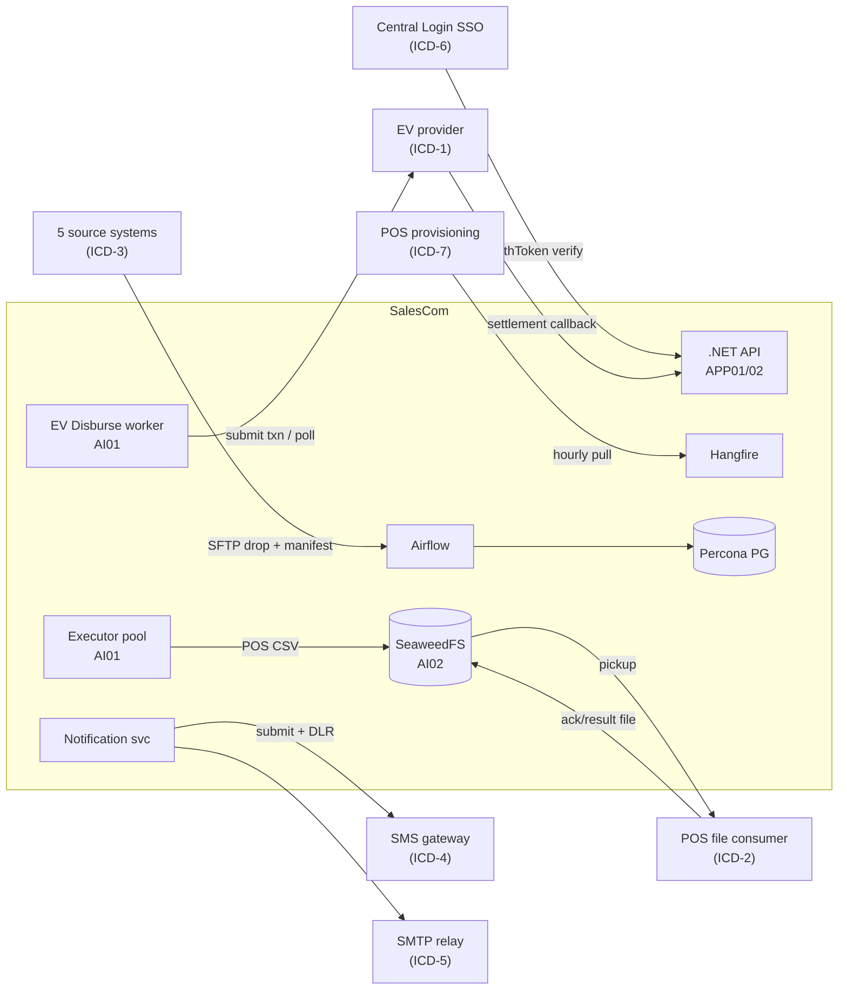

> **Security baseline (সব interface-এ প্রযোজ্য, প্রতি ICD-তে repeat নয়):** সব external call **TLS-only** (≥1.2)। Inter-service credential **Vault বা Docker file-secret** থেকে আসে, কখনো plaintext `.env`/compose নয়; **90-day key rotation**। যেখানে possible সেখানে **mTLS**। সব integration-এ outbound IP allowlist + inbound (callback) IP/path allowlist। বিস্তারিত secret/transport নিয়ম §6 (Security)-এ; এখানে শুধু per-interface auth model।

---

### ৭.২ ICD Template — সাধারণ কাঠামো (প্রতিটি ICD এই sections follow করে)

প্রতিটি ICD নিচের ১৪টি field দিয়ে গঠিত। owning team প্রতিটি `«FILL»` পূরণ করে এবং **document version + sign-off date + signatory name** যোগ করে।

```
ICD-ID            : ICD-x
Interface Name    : ...
Owning Team       : «FILL — team + named contact + escalation»
SalesCom Owner    : «FILL — SalesCom-side module owner»
Direction         : SalesCom→External | External→SalesCom | Bidirectional
Transport         : HTTPS REST | SFTP | SMPP | SMTP | ...
Auth Model        : «FILL»
Endpoint(s)/Path  : «FILL — prod + UAT, separate»
Sync/Async        : «FILL + callback/poll mechanism»
Request Schema    : «FILL — field-by-field, type, required, example»
Response Schema   : «FILL — success + each error shape»
Idempotency       : «FILL — key field, dedup window, replay semantics»
Error/Retry       : «FILL — retryable vs terminal codes, backoff, max attempts, DLQ»
Rate Limit        : «FILL — req/sec, burst, throttle response (429?)»
SLA               : «FILL — latency p50/p99, availability %, settlement time»
UAT/Test          : «FILL — sandbox env, test data, ack criteria, sign-off owner»
Version/Sign-off  : «FILL — vX.Y, date, signatory»
```

---

### ৭.৩ ICD-1 — EV Disbursement Provider API

EV হলো **money path** — তাই এই ICD-তে সবচেয়ে কড়া idempotency ও reconciliation প্রয়োজন। SalesCom-এর AI01 EV Disbursement worker `final_commission` থেকে **per `channel_code` এক row** নিয়ে provider-কে submit করে। Disbursement **শুধু full approval-এর পর** ([BR8])।

**Async model (decision):** EV provider real-time settle করে ধরে নেওয়া **নিরাপদ নয়** — তাই design **submit → settlement callback (preferred) বা poll (fallback)** ধরে। SalesCom একটি `ev_disburse` row লেখে status=`SUBMITTED`, তারপর callback/poll-এ `SETTLED`/`FAILED`-এ আপডেট হয়। Provider txn-id **persist** হয়।

#### ৭.৩.১ ev_disburse টেবিল (SalesCom side — money ledger, monthly range-partition)

> §2.2 Module F-এর `ev_disburse`-এর interface-সমৃদ্ধ রূপ (provider_txn_id, status lifecycle, sms_status যোগ করা); final migration-এ একীভূত হবে।

```sql
CREATE TABLE ev_disburse (
  ev_disburse_id   UUID        PRIMARY KEY DEFAULT gen_random_uuid(),
  run_id           UUID        NOT NULL REFERENCES report_run(run_id),
  channel_code     TEXT        NOT NULL,
  amount           NUMERIC(18,4) NOT NULL CHECK (amount >= 0),  -- compute 4dp; submit 2dp
  amount_disbursed NUMERIC(18,2),                               -- 2dp half-up at submit
  idempotency_key  TEXT        NOT NULL,   -- = hash(run_id, channel_code) — stable across retry
  provider_txn_id  TEXT,                   -- provider-issued, persisted on accept
  status           TEXT        NOT NULL DEFAULT 'SUBMITTED',
                   -- SUBMITTED → ACCEPTED → SETTLED | FAILED | UNKNOWN(needs reconcile)
  status_detail    TEXT,
  submitted_at     TIMESTAMPTZ NOT NULL DEFAULT now(),
  settled_at       TIMESTAMPTZ,
  sms_status       TEXT,                   -- ties to ICD-4 (per-recipient SMS)
  created_at       TIMESTAMPTZ NOT NULL DEFAULT now(),
  CONSTRAINT uq_ev_run_channel UNIQUE (run_id, channel_code)   -- idempotency at DB level
) PARTITION BY RANGE (created_at);
```

> **Locked invariants:** `UNIQUE(run_id, channel_code)` ([Idempotency default])। amount compute NUMERIC(18,4), submit-এ **2dp round half-up** ([Money default])। `final_commission` SUM-এর সাথে `ev_disburse` SUM **প্রতি disbursement-এর পর reconcile** হয় — mismatch → flag + email alert + **পরবর্তী auto-action hard block** (§5.5 reconciliation)। **Partial disbursement নয়** — কোনো channel submit-এ fail হলে run-level handling (নিচে error model)।

#### ৭.৩.২ ICD-1 fill-in template

```
ICD-1  EV Disbursement Provider API
Owning Team   : «FILL — EV/payment platform team + 24x7 escalation contact»
Direction     : SalesCom → EV provider (submit) ; EV provider → SalesCom (callback)
Transport     : HTTPS REST (assume) | «CONFIRM — SOAP? proprietary?»
Auth Model    : «FILL — OAuth2 client-creds? mutual TLS? API key+HMAC signature?»
                 → SalesCom recommends mTLS + per-request HMAC over body (replay-proof)
Endpoint      : POST «FILL /disburse»   (prod)  /  «FILL» (sandbox)
                 Callback (provider→us): POST https://salescom/api/v1/ev/callback
                   — server-side, IP-allowlisted, signature-verified, single-use per txn
Sync/Async    : Async. Submit returns ACCEPTED + provider_txn_id (NOT final settle).
                 Settlement via: (pref) signed callback ; (fallback) GET «FILL /status/{txn}»
                 «CONFIRM with owner: callback supported? else poll interval = «FILL»s»
Request       : { idempotency_key, channel_code, msisdn|account «FILL», 
                  amount (2dp), currency="BDT", run_ref, requested_at, signature }
                 «FILL — exact recipient identifier field; per-txn vs batch submit?»
Response      : 2xx { provider_txn_id, status:"ACCEPTED" }
                 4xx { error_code, error_msg }  (terminal — do NOT retry)
                 5xx / timeout → retryable
                 «FILL — full error_code enum + which are terminal vs retryable»
Idempotency   : key = hash(run_id, channel_code), stable across ALL retries.
                 Provider MUST dedupe on this key (same key → same txn, no double-pay).
                 «FILL — confirm provider honours idempotency key + dedup window (≥ run TTL)»
Error/Retry   : retryable (5xx/timeout): exp backoff 2s→4s→8s… max «FILL» attempts → DLQ.
                 terminal (4xx): mark channel FAILED, DO NOT silent-skip.
                 Any FAILED channel → run disbursement = INCOMPLETE → hard block next auto-
                 action + email/SMS alert (no partial disbursement).
                 UNKNOWN (timeout after submit): query status before re-submit — never blind retry.
Rate Limit    : «FILL — max txn/sec; burst; does provider 429? back-pressure handling»
                 → AI01 worker must throttle fan-out to ≤ provider limit.
SLA           : «FILL — submit ACK latency p99; settlement window (mins/hrs);
                 availability %; cutoff time for same-day settlement»
UAT/Test      : «FILL — sandbox URL, test MSISDNs/accounts, test amounts,
                 callback simulation, reconciliation test (SUM match), sign-off owner»
Version/Sign  : «FILL»
```

> **CONFIRM (UI-driven):** SMS text + disbursement time Basic wizard-এ set হয় (§5 ধাপ-১)। EV SMS per-recipient — fan-out burst handling ICD-4-এ। EV CSV columns (Channel Type, Channel Code, Amount, Disbursement Time, Status, Message) §5.5 Disbursement tab অনুযায়ী।

#### ৭.৩.৩ EV submit pseudocode (idempotent, no partial)

```python
def disburse_ev(run_id):
    rows = fetch_final_commission(run_id)          # per channel_code, SUM, 2dp half-up
    assert_reconcile(rows, final_commission_sum(run_id))   # hard pre-check
    for r in rows:
        key = sha256(f"{run_id}:{r.channel_code}")
        upsert_ev_disburse(run_id, r.channel_code, r.amount, key, status="SUBMITTED")  # UNIQUE guard
    for r in rows:
        try:
            resp = ev_api.submit(key=row.key, channel=r.channel_code,
                                 amount=round_half_up(r.amount, 2), sig=hmac(...))
            persist_txn(row.key, resp.provider_txn_id, status="ACCEPTED")
        except Terminal4xx as e:
            mark(row.key, "FAILED", e.code)        # NOT skipped
        except Retryable5xx:
            requeue_with_backoff(row.key)          # → DLQ after max attempts
    if any_channel_failed(run_id):
        flag_incomplete(run_id); alert_email_sms(run_id); BLOCK_next_auto_action(run_id)
    # SETTLED transition happens later via callback/poll, then reconcile again
```

---

### ৭.৪ ICD-2 — POS CSV Handoff (+ MANDATORY ack/result feedback)

POS disbursement **file-based** — SalesCom টাকা দেয় না, একটি CSV hand off করে; POS system সেই ফাইল থেকে আসল payment process করে (§5.5)। গুরুত্বপূর্ণ delta: **ack/result feedback file বাধ্যতামূলক** — না হলে reconciliation সম্ভব নয় (`final_commission SUM == POS CSV SUM` যাচাই করতে POS-এর processed result লাগে)।

#### ৭.৪.১ Handoff CSV schema (SalesCom → POS)

| Column | Type | Note |
|---|---|---|
| `channel_code` | TEXT | per channel, unmapped/null/dup = run fail upstream |
| `amount` | NUMERIC(18,2) | 2dp half-up |

> §5.5 POS CSV = (Channel Code, Amount) — minimal। **CONFIRM** POS team-এর কি বেশি column লাগে (run_ref, currency, settlement_date)?

#### ৭.৪.২ ack/result feedback file schema (POS → SalesCom) — MANDATORY

| Column | Type | Note |
|---|---|---|
| `channel_code` | TEXT | handoff row-এর সাথে map |
| `amount_processed` | NUMERIC(18,2) | POS যা actually process করল |
| `status` | TEXT | PROCESSED / FAILED / PARTIAL |
| `reason` | TEXT | FAILED হলে |
| `pos_ref` | TEXT | POS-side txn ref (persist) |

#### ৭.৪.৩ ICD-2 fill-in template

```
ICD-2  POS CSV Handoff + Result Feedback
Owning Team   : «FILL — POS team + named contact»
Direction     : SalesCom → POS (handoff CSV) ; POS → SalesCom (result CSV) — MANDATORY both
Transport     : «CONFIRM pickup medium — SFTP pull (preferred) | S3/object bucket | push API?»
                 → SalesCom writes CSV to SeaweedFS, exposes via «FILL» for POS pickup
Pickup/Path   : Handoff path  : «FILL — e.g. /pos/outgoing/{yyyymmdd}/»
                 Filename conv : «FILL — e.g. salescom_pos_{run_id}_{yyyymmddHHmm}.csv»
                 Result path   : «FILL — e.g. /pos/incoming/{yyyymmdd}/»
                 Result name   : «FILL — e.g. {original_basename}_result.csv»
                 + checksum/manifest sidecar (.sha256) per file «CONFIRM»
Notify        : «FILL — how is POS told a file is ready? (file-ready marker .done | notify API
                 call | SFTP event | polling by POS). And how is SalesCom told result ready?»
Sync/Async    : Async, file-based. Handoff written at approved disbursement time.
                 Result file ingested by Airflow/Hangfire sensor (polls result path).
                 «FILL — expected max turnaround handoff→result (SLA)»
Auth Model    : «FILL — SFTP key auth | S3 IAM | API key. Separate creds per direction.»
Idempotency   : Handoff filename namespaced by run_id (one file per run, all-or-nothing).
                 Re-handoff for same run_id MUST overwrite/version, not duplicate.
                 Result ingest dedup on (run_id, channel_code).
Error/Retry   : Missing/late result file past SLA → flag + email alert + block next auto-action.
                 Malformed result → quarantine + alert, no silent accept.
                 «FILL — POS-side: what if handoff file malformed? reject channel + notify?»
Reconciliation: final_commission SUM(run) == handoff CSV SUM == Σ amount_processed(result).
                 Mismatch → flag + email + HARD BLOCK next auto-action (no auto-proceed).
Rate Limit    : N/A (batch file). File size: «FILL — expected max rows / size».
SLA           : «FILL — file availability time; POS processing window; result-back deadline»
UAT/Test      : «FILL — test SFTP/bucket, sample handoff, sample result incl FAILED/PARTIAL,
                 reconciliation mismatch test, sign-off owner»
Version/Sign  : «FILL»
```

> **Open-item note:** MD spec POS handoff describe করেছে কিন্তু **result/ack file mention করেনি** — এটি একটি UI-driven/operational delta যা এখানে mandatory করা হলো। reconciliation এই feedback ছাড়া অসম্ভব।

---

### ৭.৫ ICD-3 — ৫টি Source System (DWH / In-house / POS / DMS / vPeople)

এগুলো **run-gate**-এর ভিত্তি (§4.6)। প্রতিটি source আলাদা owner, আলাদা extract mechanism — কিন্তু SalesCom সবগুলোর কাছ থেকে একই **completeness contract** দাবি করে: **per-source SFTP drop + manifest marker file (row count + business date + checksum)**, যা Airflow sensor wait করে। Cutoff পার হলে = **hard gate fail** ([Run-gate default])।

#### ৭.৫.১ Manifest marker file schema (প্রতিটি source-এর জন্য, প্রতি drop-এ একটি)

```json
{
  "source": "DWH",                       // DWH|InHouse|POS|DMS|vPeople
  "feed_name": "recharge_daily",
  "business_date": "2026-06-13",          // rolling: Daily=prev day, Monthly=prev month
  "file_name": "recharge_20260613.csv.gz",
  "row_count": 4821993,                   // gate: manifest row_count == loaded row_count
  "checksum_sha256": "ab12…",
  "generated_at_utc": "2026-06-14T01:05:00Z",
  "extract_window": { "from": "2026-06-13T00:00:00Z", "to": "2026-06-13T23:59:59Z" },
  "schema_version": "1.0"
}
```

> Gate পাস = **(a)** finished table-এ `max(business_date) ≥ End Date`, **AND (b)** per-source transform job success, **AND (c)** manifest `row_count` == loaded `row_count` + checksum match। যেকোনোটি fail বা cutoff পার = hard gate fail + email/SMS alert; gate-fail হলে cutoff পর্যন্ত **backoff-retry, silent skip নয়** ([Recurrency default])।

#### ৭.৫.২ ICD-3 fill-in template (প্রতিটি source-এর জন্য আলাদা copy fill হবে)

```
ICD-3.{DWH|InHouse|POS|DMS|vPeople}  Source Ingestion
Owning Team   : «FILL — source system owner + contact per source»
Direction     : Source → SalesCom (Airflow ingestion)
Extract Mech  : «FILL — DB dump? SFTP push by source? SalesCom pull? CDC? API?»
                 → SalesCom expects: source PUSHES to SFTP drop dir + writes manifest marker
Drop Path     : «FILL — /data/sftp/{source}/incoming/»  (Airflow bind-mounted, deployment plan)
File Format   : «FILL — CSV? gz? delimiter? encoding (UTF-8)? header row? date format?»
Manifest      : marker file per drop (schema §7.5.1). REQUIRED — no manifest = gate fail.
                 «FILL — confirm source can emit row_count + checksum + business_date»
Cutoff SLA    : «FILL — daily latest-arrival time (e.g. 02:00 Asia/Dhaka) per feed.
                 Past cutoff = HARD gate fail + alert. Confirm source's committed SLA.»
Completeness  : gate = finished.max(business_date) ≥ End Date
                       AND transform job success
                       AND manifest row_count == loaded row_count (+ checksum match)
Schema/Columns: «FILL — full column list + types per feed; which feed→which finished table»
                 → finished tables drive achievement/incentive datasource picker (§5 step3)
Retry         : Airflow sensor waits till cutoff w/ backoff; fail → alert, no silent skip.
                 «FILL — can source re-drop on correction? versioned filename?»
Owner SLA     : «FILL — who is paged if feed late/missing? escalation path»
Retention     : finished data 3 months active → archive (§2.6); raw dump 30d → purge.
UAT/Test      : «FILL — test drop, deliberately-late drop, row-count-mismatch drop,
                 checksum-fail drop; verify gate fails correctly; sign-off owner»
Version/Sign  : «FILL»
```

> **Note — POS appears twice:** POS একটি **source** (ICD-3, achievement data আনে) এবং একটি **disbursement target** (ICD-2)। দুটো আলাদা interface, আলাদা owner সম্ভব — fill-এ আলাদা রাখো।

#### ৭.৫.৩ Airflow DAG structure (ingestion + gate)

প্রতিটি source-এর একটি **ingestion DAG**, এবং প্রতিটি report-run-এর gate একটি **gate-check** যা শুধু relevant source-এর finished state যাচাই করে। ভারী parsing PG-তে (Airflow শুধু byte-pump — deployment plan §Airflow, §8)।

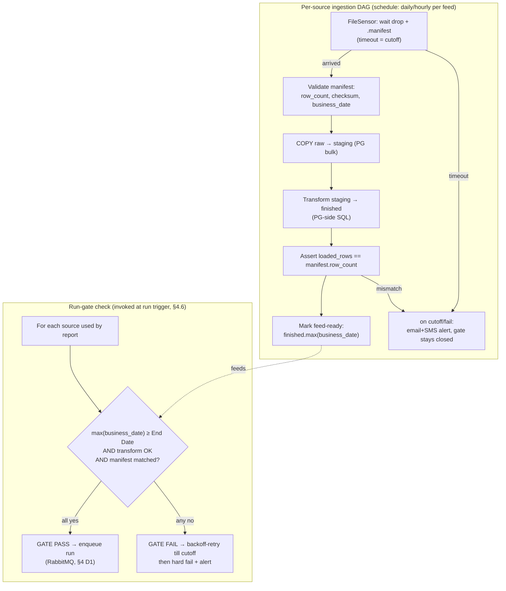

> **DAG নীতি:** ingestion DAG ও run execution **decoupled** — Airflow ডেটা landing/gate করে, run execution Executor pool (AI01)-এ RabbitMQ competing-consumer দিয়ে চলে ([D1])। Gate-check Run model-এর অংশ; বিস্তারিত run lifecycle §4.2 ও §4.6 — এখানে repeat নয়।

---

### ৭.৬ ICD-4 — SMS Gateway

প্রতিটি সফল EV disbursement-এর পর প্রতি recipient-কে SMS ([BR8], §7.11)। মূল চ্যালেঞ্জ: **fan-out burst** — একটি বড় run হাজার-হাজার recipient-এ একসাথে SMS trigger করতে পারে, যা gateway rate-limit ছাড়িয়ে যাবে। তাই Notification service **token-bucket throttle + queue** করে, সরাসরি burst করে না।

```
ICD-4  SMS Gateway
Owning Team   : «FILL — telecom/SMS vendor + contact»
Direction     : SalesCom → gateway (submit) ; gateway → SalesCom (DLR callback)
Transport     : «CONFIRM — HTTPS REST | SMPP | SOAP?»
Auth Model    : «FILL — API key | username/password | IP-whitelist | token»
Endpoint      : Submit : «FILL»   Single  /  Bulk : «FILL — bulk submit supported?»
                 DLR callback (gateway→us): «FILL» → POST https://salescom/api/v1/sms/dlr
Sender Mask   : «FILL — approved sender ID / mask (e.g. "SALESCOM"); approval lead time?»
Unicode/Bangla: «FILL — confirm Bangla (UCS-2/UTF-16) support; per-SMS char limit
                 (70 unicode / 160 GSM-7); multipart concatenation behaviour & billing»
Request       : { to (msisdn, E.164/local «FILL»), text, sender_mask, 
                  client_msg_id (idempotency), is_unicode }
                 Bulk: array of above «FILL — max batch size»
Response      : 2xx { gateway_msg_id, status:"QUEUED" }
                 error { code, msg }  «FILL — full error enum»
DLR/Delivery  : async DLR → status DELIVERED|FAILED|EXPIRED per gateway_msg_id.
                 Persist in notification_log (channel=SMS, status, gateway_msg_id, dlr_at).
                 «FILL — DLR push to our callback OR poll? format?»
Idempotency   : client_msg_id unique per (run_id, channel_code, recipient).
                 Dedup table prevents double-send on retry (RabbitMQ consumer dedupe).
Rate Limit    : «FILL — gateway max SMS/sec + burst ceiling».
                 → Notification svc: token-bucket throttle to ≤ limit; overflow queued in
                   RabbitMQ, drained at allowed rate (NEVER blind fan-out).
Fan-out Burst : Large run → enqueue ALL SMS to RabbitMQ first, then drain at throttle rate.
                 Backpressure: if gateway 429/slows, slow consumer, don't drop.
SLA           : «FILL — submit ACK latency; delivery success %; DLR latency»
UAT/Test      : «FILL — test endpoint, test MSISDNs, Bangla text round-trip test,
                 bulk burst test (N>1000), DLR simulation, sign-off owner»
Version/Sign  : «FILL»
```

> **Reconciliation tie-in:** EV SMS send result `ev_disburse.sms_status`-এ reflect হয় না money-reconcile করতে — money reconcile final_commission/ev_disburse SUM দিয়ে (§5.5)। SMS DLR শুধু notification audit; failed SMS = notify-failure, money-failure নয়।

---

### ৭.৭ ICD-5 — SMTP Relay

Email notification (approval requested/rejected, এবং recommended: disbursement complete, run failed — §7.11 conflict resolution নিচে)। তুলনামূলক simple, sync।

```
ICD-5  SMTP Relay
Owning Team   : «FILL — infra/mail team»
Direction     : SalesCom → SMTP relay
Transport     : SMTP/SMTPS (TLS) «FILL — port 587 STARTTLS | 465 implicit»
Auth Model    : «FILL — SMTP AUTH (user/pass) | IP-allowlist relay | OAuth»
Relay Host    : «FILL — host:port (prod + UAT)»
From/Reply    : «FILL — approved From address + display name; SPF/DKIM/DMARC aligned?»
Recipients    : To + CC from approval-level users (email from Approval Level User config §5.3)
Request        : standard MIME; subject + HTML/text body per event template «FILL templates»
Idempotency   : notification_log row per (event, entity_id, recipient); resend guarded.
Error/Retry   : transient (4xx/5xx SMTP, timeout) → Hangfire retry w/ backoff, max «FILL»;
                 hard bounce → mark FAILED, no infinite retry; log to notification_log.
Rate Limit    : «FILL — relay msgs/min cap? throttle on bulk approval events»
SLA           : «FILL — delivery latency; availability»
Attachments    : «CONFIRM — does any email carry CSV attachment? (recommend link to
                 SeaweedFS, not large attach) — affects size limits»
UAT/Test      : «FILL — test relay, test mailbox, SPF/DKIM verify, bounce test, sign-off»
Version/Sign  : «FILL»
```

---

### ৭.৮ ICD-6 — Central Login SSO Contract

Auth-এর ভিত্তি (§6.2)। SalesCom backend **secret `applicationName`+`applicationKey`** দিয়ে Central Login call করে; OTP Central Login-এর; success-এ **single-use `authToken`** callback-এ আসে যা backend verify করে, তারপর SalesCom নিজের JWT issue করে। **Login-storm** (200 user একসাথে peak login) handle করতে throttle দরকার।

```
ICD-6  Central Login SSO
Owning Team   : «FILL — Central Login / IAM team»
Direction     : SalesCom backend ⇄ Central Login (server-side only; no token in browser)
Transport     : HTTPS REST «CONFIRM»
Auth Model    : applicationName + applicationKey (backend secret, NEVER to frontend).
                 «FILL — exact header/body field names; key rotation procedure (90d)»
Endpoints     : Login init   : «FILL — POST /login (user/pass + appName/appKey)»
                 → returns SSO redirect to Central Login OTP page (Central owns OTP UI)
                 authToken verify : «FILL — POST /verifyToken {authToken, appKey}»
                 → returns userInfo { userId, userName, userGroupId(role), isLocked,
                                       userStatus, email, mobile }
Callback flow : Central → SalesCom callback URL with authToken.
                 GUARDS (locked defaults): state + nonce; server-side single-use ~90s TTL;
                 strict callback URL allowlist; TLS-only. Replay/forged authToken rejected.
Sync/Async    : Sync, server-to-server.
Request/Resp  : «FILL — exact request & response schemas for login-init & verifyToken,
                 incl every userInfo field + role mapping (userGroupId → SalesCom role)»
Role Mapping  : userGroupId → {Business User | Approver | Administrator}
                 «FILL — exact group-id ↔ role map». Sensitive actions re-check role
                 against live DB, NOT JWT claim (locked default).
Lockout/OTP   : OTP, 3-fail lockout, 2-min OTP expiry all enforced by Central Login.
                 isLocked=Y or userStatus≠Y → reject login.
Throttle      : Login-storm (200 users at shift start): SalesCom rate-limits login-init
                 per-IP + global; «FILL — Central Login's own throttle/req limit so we
                 don't exceed it». 429 → graceful retry-after, no hammering.
Error/Retry   : Central down → fail login gracefully (no local bypass); «FILL — error codes»
SLA           : «FILL — verifyToken latency p99; Central Login availability % (auth is
                 single point — confirm HA on their side)»
UAT/Test      : «FILL — sandbox Central Login, test users per role, locked-user test,
                 expired-authToken test, replay test, login-storm load test, sign-off»
Version/Sign  : «FILL»
```

> **JWT side (SalesCom-issued, not Central's):** short-lived access (15–30min) + rotating refresh, httpOnly+Secure+SameSite cookie, RS256+kid rotation, server-side revocation list (locked defaults)। JWT internals = §6, এখানে repeat নয় — ICD-6 শুধু **Central↔SalesCom contract**।

---

### ৭.৯ ICD-7 — POS User-Provisioning Feed

§6.3 অনুযায়ী একটি job **প্রতি ঘণ্টায়** POS থেকে user + rights sync করে — rights change ১ ঘণ্টায় কার্যকর। এটি RBAC-এর source of truth feed। গুরুত্বপূর্ণ: **revocation** (লকড/অপসারিত user) অবশ্যই propagate হতে হবে।

```
ICD-7  POS User-Provisioning Feed
Owning Team   : «FILL — POS / HR identity team»
Direction     : POS → SalesCom (hourly pull by Hangfire job)
Transport     : «FILL — REST pull? DB view? SFTP file? full snapshot vs delta?»
Auth Model    : «FILL — API key | service account | mTLS»
Endpoint/Path : «FILL — e.g. GET /users?changed_since=… OR /users/snapshot»
Schedule      : Hourly (Hangfire, shared-locked exactly-once trigger — locked default).
                 «CONFIRM frequency 1h acceptable for revocation latency»
Schema         : per user: { user_id, username, full_name, mobile, email,
                  user_group_id (role), is_locked, user_status (active flag),
                  effective_from, changed_at }
                 «FILL — exact field names + types; snapshot or delta?»
Role Mapping  : user_group_id → SalesCom role (must match ICD-6 mapping — single source).
                 «FILL — confirm same mapping table as Central Login»
Revocation    : is_locked=Y / user_status≠Y / user absent-from-snapshot →
                 DEACTIVATE in SalesCom (block login + sensitive actions).
                 «FILL — is removal signalled explicitly (tombstone) or by absence?
                 If delta-only, how is a deletion communicated?»  ← critical for security
Idempotency   : upsert on user_id; sync is idempotent (re-run = same state).
Error/Retry   : feed unreachable → keep last-known state + alert; do NOT mass-revoke on
                 empty/failed pull (avoid lockout-storm). «FILL — confirm failure semantics»
Audit         : every role/status change → audit_log (actor=SYSTEM, before/after, UTC).
SLA           : «FILL — feed availability; max staleness; revocation propagation ≤ 1h»
UAT/Test      : «FILL — test feed, new-user test, role-change test, lock/revoke test,
                 feed-down test (no mass revoke), sign-off owner»
Version/Sign  : «FILL»
```

> **Security CONFIRM (high priority):** "absence = revoke" risky যদি feed delta-only/transient হয় — একটি partial/failed pull সবাইকে lock করে দিতে পারে। তাই **explicit tombstone preferred**, এবং failed/empty pull-এ mass-revoke নয় (last-known-good ধরে রাখে + alert)। owning team-এর সাথে এটি অবশ্যই lock করতে হবে।

---

### ৭.১০ Reconciliation matrix (money path — কোন SUM কোনটার সমান)

প্রতি disbursement-এর পর (locked Reconciliation default):

| Run type | যা মিলবে | mismatch হলে |
|---|---|---|
| EV | `Σ final_commission(run)` == `Σ ev_disburse.amount_disbursed(run)` == `Σ settled callback amount` | flag + email alert + **next auto-action hard block** |
| POS | `Σ final_commission(run)` == `Σ handoff CSV amount` == `Σ result.amount_processed` (ICD-2 feedback) | flag + email + hard block |
| Both | উভয় চেক pass করতে হবে | যেকোনো fail = block |

> Unmapped/null/duplicate `channel_code` = **hard validation error → run fail** (partial disbursement কখনো নয় — locked Money default)। তাই reconciliation-এ সব channel-ই থাকবে, কোনো silent drop নেই।

---

### ৭.১১ Notification event matrix (SRS V1.6 vs LLD conflict — RESOLVED)

SRS-এ documented conflict: **SRS V1.6** Email কে শুধু `approval requested` + `approval rejected`-এ সীমাবদ্ধ করেছে; **LLD** `disbursement complete` + `run failed`-ও রেখেছে। এখানে business user-এর জন্য এই দুটো **ফেরত আনার সুপারিশ** করা হয়েছে। নিচের matrix সেই সুপারিশ অনুযায়ী conflict resolve করে (default: LLD-superset রাখা, কারণ "run failed"/"disbursement complete" না জানালে maker silent-fail-এ অন্ধ থাকে — যা locked "silent skip নয়" নীতির বিরুদ্ধে)।

| Event | SMS | Email | Recipients | Trigger point | ICD | Resolution |
|---|---|---|---|---|---|---|
| OTP / login | (Central Login) | — | logging-in user | login | ICD-6 | Central owns; SalesCom logs attempt only |
| Approval **requested** | — | ✓ | next-level approver(s) | run submitted / level advance | ICD-5 | V1.6 ✓ keep |
| Approval **rejected** | — | ✓ | maker (+ creator) | reject (comment mandatory BR7) | ICD-5 | V1.6 ✓ keep |
| **Run failed** | optional | ✓ | maker | run/stage failure or gate fail | ICD-5(+4) | **LLD — RESTORE** (CONFIRM) |
| **Run-gate fail** (data late) | ✓ | ✓ | maker + data owners | cutoff passed, data missing (§4.6) | ICD-4/5 | locked Run-gate default: alert, not silent |
| **Disbursement complete** | — | ✓ | maker | EV settled / POS handoff done | ICD-5 | **LLD — RESTORE** (CONFIRM) |
| EV per-recipient SMS | ✓ | — | each commission recipient | after successful EV disburse (BR8) | ICD-4 | core requirement |
| **Reconciliation mismatch** | ✓ | ✓ | maker + ops/admin | SUM mismatch (§7.10, §5.5) | ICD-4/5 | locked: flag+alert+hard block |
| **Replication lag / broker down / disk full / DB saturation / queue backlog** | ✓ | ✓ | ops/admin | observability alert (§8) | ICD-4/5 | locked: critical alerts wired day-1 |

> **CONFIRM (business sign-off):** "Run failed" ও "Disbursement complete" email maker-কে যাবে কিনা — recommends YES; final business decision লাগবে। Critical ops/infra alerts (নিচের সারি) decision নয়, locked Observability default — existing email/SMS-এ wired থাকবেই।

> **notification_log:** প্রতিটি send (matrix-এর প্রতিটি ✓) `notification_log`-এ record হয় — channel, status (PENDING/SENT/FAILED), attempt_count, scheduled_at, sent_at, error_message (§2.2 Module H)। এই টেবিল ledger হিসেবে **monthly range-partition** ও append-style audit; schema বিস্তারিত §2, এখানে repeat নয়।

---

### ৭.১২ UAT ও sign-off gate (process)

প্রতিটি ICD owning team-এর **named signatory** দ্বারা sign-off হবে; sign-off-এর শর্ত:

1. সব `«FILL»` resolved (কোনো TBD নয়)।
2. একটি working **sandbox/UAT endpoint** আছে যা SalesCom integration-test করতে পারে।
3. নিচের test case **মিনিমাম** pass (per interface, ICD UAT row-এ detailed):
   - **happy path** + প্রতিটি **error code** round-trip।
   - **idempotency**: একই key/file দুইবার পাঠালে double-effect নেই।
   - **failure injection**: timeout/late-file/mismatch ঠিকমতো flag+alert+block করে (silent pass নয়)।
   - **load** (money/auth path): 200-user login-storm (ICD-6), EV/SMS fan-out burst (ICD-1/4) — **real load test দিয়ে validate** (assumption নয়)।

> **[D4] gate:** এই ৭টি ICD (এবং §9-এর ৬টি SRS open item) **development শুরুর আগে lock** — কোনো ICD unsigned থাকলে সংশ্লিষ্ট feature scope থেকে বাদ বা blocked।

---

**§৭ Cross-references:**
- Run model / queue / advisory-lock / aging — §4 ([D1]); §৭.৫.৩ DAG শুধু gate-হস্তান্তর দেখায়।
- Calc/SQLGlot/validation — §3 ([D2]); ICD এর বাইরে।
- Security/Vault/mTLS/JWT internals — §6; ICD শুধু per-interface auth model।
- Data model (ev_disburse/notification_log/final_commission partitioning) — §2; এখানে শুধু interface-relevant column।
- Disbursement business flow + reconciliation — §5.5; এখানে interface contract।
- HA/DR (DC→DR async, SeaweedFS cross-site, RabbitMQ non-replicate) — §8 ([D3]); POS/EV file failover idempotent re-run-এর উপর নির্ভর।

---

## ৮. DevOps, DR, Observability ও Capacity

> এই section টি SalesCom-এর runtime operations-এর মেরুদণ্ড: কীভাবে container deploy হয়, কীভাবে নতুন version যায়, ডেটা হারালে কী হয়, এবং 200-user load বাস্তবে handle হবে কিনা তা প্রমাণ করার plan। Run model (RabbitMQ competing-consumer + advisory lock), executor security model, JWT/secrets, এবং reconciliation logic অন্য section-এ বিস্তারিত আছে — এখানে শুধু cross-reference করা হলো (§4 Run Model, §3 Calc Engine, §6 Security, §5 Disbursement)। Locked decision [D3] এই section-এর ভিত্তি; deployment plan-এর সংখ্যাগুলো **starting point**, এখানে 200-user-এর জন্য re-tune করা হয়েছে।

---

### ৮.১ Topology: 6-server DC + 6-server DR (12 মেশিন)

[D3] অনুযায়ী primary DC-তে ৬টি মেশিন, DR site-এ তার hostname-by-hostname mirror (active-passive standby) = মোট ১২ মেশিন। Load Balancer client-এর existing network LB/F5 (redundant + TLS termination) — SalesCom নিজে LB host করে না। (placement detail §1.2।)

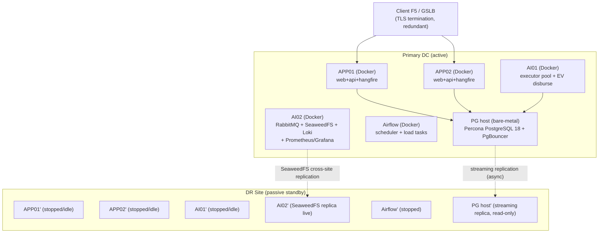

**মূল নীতি:** DC→DR replication async (DB streaming + SeaweedFS cross-site)। **RabbitMQ replicate হয় না** — queue transient; failover-এ in-flight run idempotent re-run হবে (§4-এর idempotency key + advisory lock এই re-run safe করে)। DR-এর APP/AI01/Airflow container গুলো normally stopped; failover-এ `docker compose up -d` দিয়ে আসে।

---

### ৮.২ (a) Per-host Docker Compose Layout

#### সাধারণ নিয়ম (প্রতি service-এ বাধ্যতামূলক)

প্রতিটি service block-এ নিচের anchor merge হবে (DRY-এর জন্য YAML anchor):

```yaml
x-common: &common
  restart: unless-stopped
  environment:
    TZ: Asia/Dhaka
  logging:
    driver: json-file
    options: { max-size: "50m", max-file: "3" }
  # image সবসময় versioned tag — কখনো :latest নয় (CONFIRM: registry host)
```

- **Image versioning:** `registry.internal.salescom/<svc>:x.y.z` (semver, immutable)। deploy-এ `:latest` সম্পূর্ণ নিষিদ্ধ — rollback ও "কোনটা চলছে" tracking-এর জন্য।
- **Healthcheck:** প্রতি service-এ; unhealthy হলে Docker restart + LB drain (APP-এর ক্ষেত্রে)।
- **Named volumes:** stateful service (RabbitMQ, SeaweedFS, Loki, Grafana, Prometheus TSDB) — anonymous volume কখনো নয়।
- **Memory limit:** প্রতি container-এ `mem_limit`/`deploy.resources.limits.memory` — বিশেষত .NET (limit না দিলে whole-host RAM ধরে নেয়)। নিচের সংখ্যাগুলো 200-user re-tuned (deployment plan-এর 50-user baseline starting point ছিল)।

#### APP01 / APP02 (একই compose — LB-এর পিছনে)

| Service | RAM (50u→200u) | CPU | Healthcheck | Volume |
|---|---|---|---|---|
| web (Next.js) | 1G → 1.5G | 1 → 2 | `GET /healthz` 200 | — (stateless) |
| api (.NET) | 4G → **8G** | 3 → 4 | `GET /api/v1/health/ready` | — (stateless) |
| hangfire | 2G → 2G | 1 → 2 | `GET /hangfire/health` | — (state PG-তে) |

> API node-এর RAM 4G→8G বাড়ানো হলো কারণ 200 concurrent session (~40-60 heavy) + .NET GC headroom। **CONFIRM:** আসল সংখ্যা §৮.৬ load-test থেকে আসবে — এটি assumption নয়।

```yaml
# APP01/APP02: docker-compose.yml (সংক্ষিপ্ত)
services:
  web:
    <<: *common
    image: registry.internal.salescom/web:1.0.0
    deploy: { resources: { limits: { memory: 1536M, cpus: "2" } } }
    healthcheck:
      test: ["CMD", "wget", "-qO-", "http://localhost:3000/healthz"]
      interval: 15s; timeout: 5s; retries: 4; start_period: 30s
  api:
    <<: *common
    image: registry.internal.salescom/api:1.0.0
    deploy: { resources: { limits: { memory: 8192M, cpus: "4" } } }
    environment:
      TZ: Asia/Dhaka
      ConnectionStrings__Pg: "Host=pgbouncer-vip;Port=6432;..."   # PgBouncer transaction pool
      RabbitMq__Uri: "amqps://AI02-vip:5671"                       # mTLS, §6
    healthcheck:
      test: ["CMD", "curl", "-fsS", "http://localhost:8080/api/v1/health/ready"]
      interval: 15s; timeout: 5s; retries: 4; start_period: 40s
  hangfire:
    <<: *common
    image: registry.internal.salescom/hangfire:1.0.0
    deploy: { resources: { limits: { memory: 2048M, cpus: "2" } } }
```

`/health/ready` (DB+RabbitMQ reachable, migration applied) ও `/health/live` (process alive) আলাদা — rolling deploy-এ ready check ছাড়া LB rejoin করানো হয় না।

#### AI01 — Executor pool + EV disbursement

| Service | RAM | CPU | Note |
|---|---|---|---|
| executor (Python+SQLGlot) | 4G → **6G** | 3 → 4 | competing-consumer; multi-instance ready (§4)। N≈3-4 Final run concurrent। |
| ev-disburse | 2G → 2G | 2 | আলাদা process; idempotency key per disbursement (§5.5) |

Executor বেশিরভাগ সময় PG-র উত্তরের জন্য I/O-wait — তাই CPU কম, কিন্তু per-run temp schema + SQLGlot AST build-এ RAM লাগে। `replicas: 2` দিয়ে একই host-এ ২টি executor consumer চালানো যায় (queue থেকে competing pull); platform-wide concurrency cap PG advisory lock + RabbitMQ prefetch দিয়ে enforce হয় (§4)।

```yaml
# AI01
services:
  executor:
    <<: *common
    image: registry.internal.salescom/executor:1.0.0
    deploy:
      replicas: 2
      resources: { limits: { memory: 6144M, cpus: "4" } }
    environment:
      TZ: Asia/Dhaka
      EXECUTOR_DB_ROLE: salescom_run_exec        # least-privilege per-run role (§3)
      RABBITMQ_PREFETCH: "1"                      # one run per consumer at a time
    healthcheck:
      test: ["CMD", "python", "-c", "import socket; socket.create_connection(('AI02-vip',5671),3)"]
  ev-disburse:
    <<: *common
    image: registry.internal.salescom/ev-disburse:1.0.0
    deploy: { resources: { limits: { memory: 2048M, cpus: "2" } } }
```

#### AI02 — Infrastructure (broker + storage + observability)

| Service | RAM | CPU | Volume |
|---|---|---|---|
| rabbitmq | 1G → 2G | 1 → 2 | `rmq-data` (mnesia) |
| seaweedfs (master+volume+filer) | 2G → 3G | 2 → 3 | `swfs-data` |
| loki | 1G → 2G | 1 → 2 | `loki-data` |
| prometheus | — → 2G | — → 2 | `prom-tsdb` (15d retention) |
| grafana | 512M → 1G | 1 | `grafana-data` |

Observability stack day-1 চালু (deployment plan-এ "পরে দরকারে" ছিল — [D3]/Recommended default অনুযায়ী day-1-এ promote করা হলো)।

```yaml
# AI02
services:
  rabbitmq:
    <<: *common
    image: registry.internal.salescom/rabbitmq:3.13-mgmt
    deploy: { resources: { limits: { memory: 2048M, cpus: "2" } } }
    volumes: ["rmq-data:/var/lib/rabbitmq"]
    healthcheck: { test: ["CMD","rabbitmq-diagnostics","-q","ping"] }
  seaweedfs:
    <<: *common
    image: registry.internal.salescom/seaweedfs:3.x
    deploy: { resources: { limits: { memory: 3072M, cpus: "3" } } }
    volumes: ["swfs-data:/data"]
  loki:    { <<: *common, image: registry.internal.salescom/loki:3.x, volumes: ["loki-data:/loki"] }
  prometheus: { <<: *common, image: registry.internal.salescom/prometheus:2.x, volumes: ["prom-tsdb:/prometheus"] }
  grafana: { <<: *common, image: registry.internal.salescom/grafana:11.x, volumes: ["grafana-data:/var/lib/grafana"] }
volumes: { rmq-data: , swfs-data: , loki-data: , prom-tsdb: , grafana-data: }
```

#### Airflow server

| Service | RAM | CPU | Note |
|---|---|---|---|
| airflow (scheduler+web) | 2G → 3G | 1 → 2 | metadata DB = PG (আলাদা schema/instance — CONFIRM) |
| load-tasks (worker) | 3G → 4G | 2 → 3 | byte-pump only; ভারী parse PG-তে |

**Bind mount বাধ্যতামূলক:** `/data/sftp:/data/sftp` — per-source SFTP drop + manifest marker file (row count + business date + checksum) এখানে আসে; Airflow sensor wait করে (§4.6/§7.5)। heavy CSV parse PG `COPY`-তে, Airflow শুধু file move করে।

#### Database host (Docker ছাড়া — bare-metal Percona PG 18)

Container নয় (full resource + page-cache control)। 200-user-এর জন্য **DB host ≥32GB** (50-user baseline ছিল 15GB — undersized, [DB recommended default])। PgBouncer transaction-pooling বাধ্যতামূলক, একই host-এ বা sidecar (sizing detail §2.8):

```
shared_buffers      = 8GB        (≈25% of 32GB)
effective_cache_size= 22GB
max_connections     = 180        (cap 150-200; PgBouncer-এর পিছনে)
work_mem            = 32MB       (run-time aggregate-heavy → load-test থেকে tune)
maintenance_work_mem= 1GB
wal_level           = replica    (streaming replication-এর জন্য)
max_wal_senders     = 5
archive_mode        = on         (WAL archiving → off-site, §৮.৪)
```

UNLOGGED temp table per `run_<uuid>` schema → WAL pressure কমে, কিন্তু crash-এ lost (run all-or-nothing বলে acceptable, §4)। Ledger table (`audit_log`, `notification_log`, `final_commission`) monthly range-partition; dashboard/listing read → read-replica, run execution → primary (§2 default)।

---

### ৮.৩ (b) CI/CD Pipeline ও DB Migration

#### Pipeline: build → scan → test → tag → push → deploy

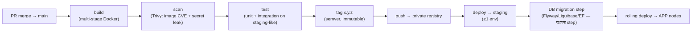

- **Private registry** — কোনো public push নয়; image scan pass না হলে push block।
- **Versioned image** `:x.y.z` — `:latest` নিষিদ্ধ (rollback determinism)।
- **≥1 staging environment** — production-এ যাওয়ার আগে full pipeline + migration এখানে validate।

#### Rolling deploy with LB drain (APP node)

Two APP node বলে zero-downtime rolling:

```
for node in APP01, APP02:
    1. LB drain(node)                 # F5-এ node-কে "no new conn" mark
    2. wait until in-flight requests = 0  (max 60s graceful)
    3. docker compose pull <svc>:x.y.z; docker compose up -d <svc>
    4. poll GET /health/ready until 200 (timeout 90s)
    5. LB rejoin(node)
    6. soak 2 min, watch error-rate/p95
# একটার deploy fail হলে: পরেরটায় যেও না → rollback
```

**Rollback:** image immutable বলে instant — `docker compose up -d <svc>:x.y.z-prev`। যদি migration-এর কারণে fail, §৮.৩ migration নিয়ম প্রযোজ্য।

#### DB migration strategy (আলাদা step, version-controlled)

- Tool: **Flyway / Liquibase / EF migration** — version-controlled, app deploy থেকে আলাদা pipeline step (app rollback ≠ schema rollback)।
- **Expand-contract (backward-compatible) pattern বাধ্যতামূলক** rolling deploy-এর জন্য: একই মুহূর্তে old+new app version DB-র সাথে কথা বলে, তাই:
  - Step 1 (expand): শুধু additive — `ADD COLUMN nullable`, `CREATE TABLE`, নতুন index `CONCURRENTLY`। কোনো `DROP`/rename নয়।
  - Step 2 (deploy app যা নতুন column ব্যবহার করে)।
  - Step 3 (contract): পুরোনো app সরে যাওয়ার পর পরের release-এ old column drop।
- **Ledger/audit table-এ DROP/UPDATE migration কখনো নয়** — `audit_log` append-only (UPDATE/DELETE privilege block + hash-chain, §6.8)। migration role-এর সেই table-এ ALTER-only।
- Migration `salescom_migrator` role দিয়ে — runtime app/executor role-এর DDL নেই (§3 least-privilege)।
- **CONFIRM:** long migration (large partition rewrite) এর জন্য maintenance window নাকি online `pg_repack` — load-test data volume থেকে নির্ধারণ।

---

### ৮.৪ (c) Backup, DR ও Failover

#### Backup layers

| কী | কৌশল | কোথায় | RPO contribution |
|---|---|---|---|
| DB full | nightly `pg_basebackup` / Percona xbackup | off-site (DR + cold storage) | ≤24h (full) |
| DB WAL | continuous WAL archiving → off-site | off-site object store | PITR → seconds (last archived WAL) |
| DB live | streaming replication (async) | DR PG host (warm standby) | seconds (replication lag) |
| SeaweedFS | cross-site replication (filer) + nightly snapshot | DR AI02' | minutes |
| Config/compose/migration | git (already versioned) | git remote | — |

**PITR:** nightly full + continuous WAL → যেকোনো point-in-time-এ restore (যেমন accidental bad run বা corruption)। WAL off-site shipped, তাই DC সম্পূর্ণ হারালেও last-archived-WAL পর্যন্ত recover।

#### DC→DR replication mechanics

- **DB:** PostgreSQL streaming replication async (`wal_level=replica`, DR = hot standby read-only)। Async কারণ cross-site sync latency interactive path-কে ধীর করবে; trade-off = small RPO window (replication lag — monitored, §৮.৫ alert)।
- **SeaweedFS:** filer cross-site replication (CSV upload, run detail, POS handoff file, EV CSV — সব object)।
- **RabbitMQ:** replicate **নয়** (transient)। failover-এ যে run মাঝপথে ছিল তা idempotency key + advisory lock-এর কারণে নিরাপদে re-enqueue/re-run হয় (§4)। run all-or-nothing হওয়ায় partial-state DR-এ ধরে রাখার দরকার নেই — temp schema DROP CASCADE হয়ে যায়।

#### Failover runbook (GSLB/F5 + manual confirm)

Async + manual confirm কারণ split-brain (দুই site একসাথে write করা) এড়াতে — auto-failover async replication-এ ঝুঁকিপূর্ণ।

```
RUNBOOK — DC → DR failover
0. ALERT: DC unreachable (GSLB health + replication-lag alert fire)
1. CONFIRM (human): DC সত্যিই down, transient blip নয় (5-min observe)
2. FENCE: পুরোনো DC PG-কে split-brain রোধে fence (network isolate / STONITH)
3. PROMOTE: DR PG standby → primary  (pg_ctl promote)  — last WAL replay verify
4. বাকি WAL gap থাকলে off-site archive থেকে replay (PITR)
5. START DR services: APP01'/APP02'/AI01'/Airflow' → docker compose up -d
   (SeaweedFS replica আগে থেকেই live)
6. RabbitMQ: DR broker fresh start (empty queue ঠিক আছে)
7. REPOINT: GSLB/F5 → DR APP VIP; PgBouncer → DR PG
8. VERIFY: /health/ready সব node; একটি Demo Run (read-only lane) দিয়ে smoke test
9. RECONCILE: in-flight ছিল এমন run re-trigger (idempotent); reconciliation check (§5.5)
10. ANNOUNCE: DR active; failback plan (DC ফিরলে reverse-replicate তারপর planned switchback)
```

#### Periodic DR drill ও RPO/RTO

- **DR drill ত্রৈমাসিক (CONFIRM frequency):** non-prod traffic দিয়ে full failover রিহার্সাল, runbook step timing রেকর্ড, RTO measure।
- **RPO/RTO target — CONFIRM (client-এর approval দরকার):**
  - প্রস্তাবিত **RPO ≤ 5 মিনিট** (async streaming lag + WAL archive interval-এর সমন্বয়ে অর্জনযোগ্য)। SalesCom batch-commission nature-এ কয়েক মিনিট data-loss tolerable, কারণ run idempotent re-run হয়।
  - প্রস্তাবিত **RTO ≤ 1 ঘণ্টা** (manual confirm + promote + service start + verify)। drill-এর actual timing দিয়ে validate ও adjust করতে হবে।

---

### ৮.৫ (d) Observability

#### Stack

Prometheus (scrape) + exporter set + Grafana (dashboard+alert) + Loki (log) — সব AI02-তে, day-1 চালু।

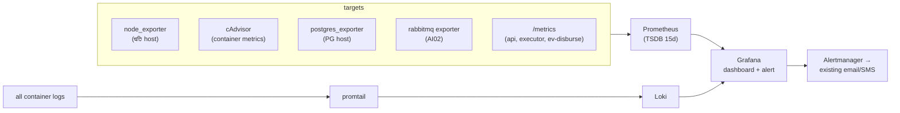

App/executor `/metrics` custom counter expose করবে: `salescom_run_total{type,status}`, `salescom_run_duration_seconds`, `salescom_queue_depth{lane}`, `salescom_disbursement_mismatch_total`, `salescom_active_sessions`।

#### Grafana dashboard (panel set)

1. **Run pipeline:** active Final-run gauge (target N≈3-4), per-lane queue depth (Schedule/Demo/RunNow), run success/fail rate, run p50/p95/p99 duration।
2. **DB:** connection count vs cap (180), PgBouncer pool saturation, query latency p95, replication lag (bytes/seconds), cache hit ratio, partition size growth।
3. **Broker:** RabbitMQ ready/unacked message, consumer count, publish/ack rate।
4. **API:** request rate, error rate (5xx), p95 latency, active session count, .NET GC/memory।
5. **Host/container:** CPU, RAM vs limit, disk free %, container restart count।
6. **Disbursement:** reconciliation status, mismatch count, EV SMS send rate, POS CSV handoff status।

#### Alert rule list (critical — existing email/SMS-এ wired)

| Alert | শর্ত (উদাহরণ) | Severity |
|---|---|---|
| DB saturation | `pg_connections > 0.9 * 180` for 2m | critical |
| DB replication lag | `pg_replication_lag_seconds > 300` (RPO breach) | critical |
| Queue backlog | `rabbitmq_queue_messages_ready{lane!="demo"} > 50` for 5m | critical |
| Broker down | `rabbitmq_up == 0` for 1m | critical |
| Disk full | `node_filesystem_avail % < 10` (PG/SeaweedFS/Loki) | critical |
| Disbursement mismatch | `salescom_disbursement_mismatch_total > 0` | critical (+ next auto-action hard block, §5.5) |
| Run failure spike | `rate(salescom_run_total{status="failed"}[15m]) > threshold` | warning→critical |
| Schedule starvation | `salescom_queue_oldest_age_seconds{lane="schedule"} > cutoff` | warning (aging, §4.4) |
| Run-gate fail | gate-fail event (data না এলে cutoff পার) | warning + email/SMS (§4.6) |
| API p95 high | `http_request_duration p95 > 2s` for 5m | warning |
| Container restart loop | `increase(restart_count[10m]) > 3` | warning |
| Audit hash-chain break | verifier job chain integrity fail (§6.8) | critical |

#### Loki log

সব container json-file log → promtail → Loki; label: `host, service, run_id`। `run_id` label-এ filter করে এক run-এর full executor trace (per stage) এক জায়গায় দেখা যায় — debugging-এর core tool। `TZ=Asia/Dhaka` সব container-এ, তাই log timestamp consistent (audit_log কিন্তু UTC, §6.8)। Retention align: Loki 30-day (object-file retention-এর সাথে), audit_log DB-তে 7y।

---

### ৮.৬ (e) Capacity Plan ও 200-User Load Test

#### Per-component re-calc (50-user baseline → 200-user target)

| Component | 50u baseline | 200u target | যুক্তি |
|---|---|---|---|
| **DB host** | 15GB (undersized) | **≥32GB**, 8GB shared_buffers, max_conn≤180 | 200 session × PgBouncer pool + run execution primary; partition + read-replica offload |
| **API** | 2 inst × 4GB | **3-4 instance** (APP01/02 + scale-out option), 8GB each | 200 active session, ~40-60 heavy; stateless বলে horizontal scale সহজ |
| **Executor pool** | 1 × 4GB | **2 replica × 6GB** (AI01), N≈3-4 concurrent Final | run concurrency interactive load থেকে decoupled; competing-consumer |
| **SeaweedFS** | ~100GB | **300-500GB** | CSV upload (≤500MB/file) + run detail CSV + EV/POS handoff; 30-day retention তারপর purge |
| **RabbitMQ** | 1GB | 2GB | transient; depth ছোট (run আলাদা, ছোট lane) |
| **Hangfire** | 2GB | 2GB | schedule trigger only; state PG-তে |
| **Airflow** | 2+3GB | 3+4GB | byte-pump; parse PG-তে |

> সব সংখ্যা **starting point** — নিচের load test দিয়ে validate করতে হবে, assumption হিসেবে ship করা যাবে না।

#### 200-Concurrent Load-Test Plan

**লক্ষ্য:** উপরের sizing assumption প্রমাণ করা — কোথায় প্রথম bottleneck আসে তা খুঁজে বের করা, তারপর resize।

**Workload model (peak emulate):**
- 200 virtual user concurrent interactive session; ~40-60 "heavy" (5-step wizard navigation, Achievement/Incentive config save, Report Detail Run Log + CSV download, dashboard aggregate load)।
- বাকি ~140 "light" (listing, filter/pagination, dashboard view, approval listing)।
- পাশাপাশি run concurrency আলাদা ও ছোট: N≈3-4 Final run একসাথে (RunNow=High) + Schedule (Low) + Demo (Med, read-only lane) — aging behaviour verify।
- Tool: k6 / Locust (API path) + একটি run-generator যা RabbitMQ-তে Final/Demo/Schedule mix push করে।

**Measure (pass/fail gate সহ):**

| Metric | কোথায় measure | প্রস্তাবিত target (CONFIRM) |
|---|---|---|
| **Single-lane queue depth** | Prometheus `salescom_queue_depth{lane}` | RunNow lane steady-state < N; Schedule lane aging কাজ করছে (oldest-age bounded) |
| **PG connection saturation** | postgres_exporter, PgBouncer stats | active conn < 180 cap; PgBouncer wait-time ≈ 0; pool exhaustion নেই |
| **API p95 latency** | api `/metrics`, F5 | interactive endpoint p95 < 2s @ 200 user |
| **RabbitMQ depth/lag** | rabbitmq exporter | ready message backlog drain হচ্ছে; consumer keep up করছে |
| **Run duration under load** | `salescom_run_duration_seconds` | N=3-4 concurrent run interactive p95-কে regress করছে না (run primary, listing replica — isolation প্রমাণ) |
| **Executor RAM** | cAdvisor | 6GB limit-এ OOM নেই (SQLGlot AST + temp schema peak) |
| **Read-replica offload** | replica vs primary query split | dashboard/listing replica-তে যাচ্ছে; primary শুধু run + write |

**Test stages:**
1. **Baseline** — 50 user, current sizing confirm।
2. **Ramp** — 50→200 user step-load, প্রতি step-এ saturation point note।
3. **Soak** — 200 user টানা 1-2h (memory leak, connection leak, partition growth দেখা)।
4. **Mixed-run stress** — 200 user + 4 concurrent Final run + Demo flood, isolation ও aging verify।
5. **Failover-under-load** — load চলাকালীন DR drill (RTO/RPO real load-এ measure)।

**Outcome:** প্রতিটি bottleneck-এ resize iteration (যেমন PG conn cap hit → work_mem/pool tune বা DB RAM↑; executor OOM → limit↑ বা replica↑)। Final sizing = load test থেকে derived সংখ্যা, এই table-এর starting point নয়।

---

### ৮.৭ Open Items (Build-আগে fill করতে হবে) [D4, consolidated §9]

এই section-এর CONFIRM-mark করা সিদ্ধান্তগুলো development শুরুর আগে lock করতে হবে:

| # | Open item | Default ধরা হয়েছে |
|---|---|---|
| O8.1 | RPO/RTO target client approval | RPO ≤5min, RTO ≤1h |
| O8.2 | DR drill frequency | ত্রৈমাসিক |
| O8.3 | Private registry host + image signing | internal registry, semver immutable |
| O8.4 | Long DB migration window vs online repack | expand-contract + online preferred |
| O8.5 | Airflow metadata DB placement (shared PG vs আলাদা) | আলাদা schema |
| O8.6 | Final per-component sizing | §৮.৬ load-test থেকে |
| O8.7 | 7 external integration ICD (SFTP drop, manifest, POS ack/result, Central Login callback) | §4.6/§6 default; ICD lock pending (§7) |

Secrets (Vault বা Docker file-secrets, inter-service mTLS, 90-day rotation), JWT/authToken, idempotency, reconciliation, run-gate detail — §6 ও §4-এ; এখানে শুধু compose/observability wiring-এ reference করা হলো।

---

**§৮ cross-references:** Run model / queue / advisory lock — §4 (D1)। Calc engine least-privilege role / SQLGlot — §3 (D2)। Secrets / JWT / mTLS / audit hash-chain — §6। Disbursement reconciliation / mismatch hard block — §5.5/§7.10। DB partition / PgBouncer / sizing param — §2। External SFTP/manifest/ICD — §7।

---

## ৯. Build শুরুর আগে যা LOCK করতে হবে (Consolidated Checklist) [D4]

> [D4] অনুযায়ী development শুরুর আগে এই সব item lock হবে। প্রতিটির পাশে এই design-এ ধরা **recommended default**, **owner placeholder**, এবং কোন section-এ বিস্তারিত আছে তা দেওয়া হলো। default ধরে design সম্পূর্ণ — কিন্তু কোনো item unlocked থাকলে সংশ্লিষ্ট feature scope থেকে blocked (§7.12 gate)। এটি §১–§৮-এ ছড়িয়ে থাকা সব CONFIRM-mark-এর single authoritative roll-up।

### ৯.১ ৬টি SRS Open Item (spec থেকে)

| # | Open item | Recommended default (এই design-এ ধরা) | Section | Owner placeholder |
|---|---|---|---|---|
| SRS-1 | **Reject routing** — reject কোথায় ফেরে | Reject → **Maker** (previous-level নয়); resubmit-এ L1 থেকে restart + full re-validation | §5.3.3 | «Business/Product owner» |
| SRS-2 | **Approval Pending-এ material edit** behavior | existing approval **void → L1 restart**; approve-এ approved-config-version persist; optimistic version দিয়ে edit-vs-approve race guard; "material" edit-এর সংজ্ঞা lock | §5.2.3, §5.3.5 | «Business/Product owner» |
| SRS-3 | **BR5 segregation** scope | maker = report creator/last-editor, কোনো level approve নয় (Admin override নয়); per-run এক user সর্বোচ্চ এক level; approver userId persist | §5.3.4, §6.4 | «Business/Product owner» |
| SRS-4 | **Recurrency** model | **Monthly** রাখা; rolling window (Daily=আগের দিন, Monthly=আগের মাস), Start/End = recurrence boundary; gate-fail-এ cutoff পর্যন্ত backoff-retry (silent skip নয়) — Daily/Weekly-ও production-এ লাগবে কিনা confirm | §4.9, §3.6 | «Business + Data owner» |
| SRS-5 | **ESI / report retention** policy | placeholder = financial **7y** (final_commission/ev_disburse/audit); finished ETL 3-month active → archive; detail object 30-day | §2.6 | «Compliance owner» |
| SRS-6 | **Half-up rounding** implementation | NUMERIC(18,4) compute → চূড়ান্ত 2dp **round half-up**; Postgres `ROUND` vs compute-side explicit half-up — একটি নির্ধারণ; div-by-zero NULLIF-guard; per-channel SUM; unmapped/null/duplicate = hard run fail | §3.6, §5.6, §2.1 | «Finance owner» |

### ৯.২ ৭টি External Integration ICD (§7)

| ICD | Interface | সবচেয়ে high-risk «FILL»/CONFIRM | Owner placeholder |
|---|---|---|---|
| **ICD-1** | EV Disbursement Provider API (§7.3) | provider idempotency-key honour করে কিনা (double-pay risk); settlement callback vs poll; error-code terminal-vs-retryable enum; rate-limit | «EV / Payment team» |
| **ICD-2** | POS CSV Handoff (§7.4) | **result/ack feedback file** (MD-তে নেই, এখানে mandatory করা — reconciliation এটি ছাড়া অসম্ভব); pickup medium (SFTP/bucket); file-ready notify mechanism | «POS team» |
| **ICD-3** | 5 Source Systems DWH/In-house/POS/DMS/vPeople (§7.5) | per-source extract mechanism; manifest (row_count+checksum+business_date) emit করতে পারে কিনা; cutoff SLA; column schema → finished table map | «প্রতি source owner» |
| **ICD-4** | SMS Gateway (§7.6) | transport (REST/SMPP); Bangla/Unicode support + multipart; rate-limit + fan-out burst throttle; DLR push vs poll; sender mask approval | «Telecom / SMS vendor» |
| **ICD-5** | SMTP Relay (§7.7) | relay host + auth; From + SPF/DKIM/DMARC; CSV attachment vs SeaweedFS link | «Infra / mail team» |
| **ICD-6** | Central Login SSO (§7.8) | authToken format (opaque vs JWT) + verify endpoint + 90s TTL; userGroupId → role map; login-storm throttle; Central Login HA | «Central Login / IAM team» |
| **ICD-7** | POS User-Provisioning Feed (§7.9) | **revocation semantics** — "absence = revoke" বিপজ্জনক যদি feed delta/transient; explicit tombstone preferred + failed-pull-এ mass-revoke নয়; snapshot vs delta; role-map ICD-6-এর সাথে single source | «POS / HR identity team» |

> উপরন্তু **F5/GSLB integration contract** (health-check probe path, drain API, TLS cert ownership, GSLB failover trigger) — client-এর existing LB-এর সাথে একটি অতিরিক্ত integration হিসেবে lock করতে হবে (§1.2/§1.7, §8.4)। «Owner: Client network/infra team»।

### ৯.৩ UI-Driven Delta CONFIRM (MD spec-এ নেই — PDF থেকে)

| Delta | এই design-এ ধরা default | Section | নোট |
|---|---|---|---|
| **Approval Flow Type = B2B/B2C** | label/categorization + filter (routing নয়); routing চাইলে channel→flow_type map যোগ | §5.4, §2.2-G | routing-vs-label business decision |
| **Data Source column alias** | IR alias দিয়ে রেফার, SQL-gen alias→real_column resolve; per-source unique; reserved-word reject; uploaded CSV header→real | §2.2-B, §3.3 | SQL-gen-এ সরাসরি প্রভাব |
| **Achievement block Duplicate** action | নতুন `report_stage` row, পরের block_ordinal, stage_ir deep-copy, new id | §2.9 | — |
| **Run Log Download Summary** | per-run `final_commission` per-channel roll-up CSV (signed URL); সব-stage manifest নাকি roll-up confirm | §2.9, §3.6, §6.7 | — |
| **Combined Approve/Reject modal** | একই `approval_decision` row; decision enum + mandatory remarks-on-reject CHECK (BR7) | §2.2-G, §5.3 | — |
| **Channel fixed-list vs configurable** | free TEXT + allowlist validation (Distributor/RSO/RSO Sup/Retailer/COPS); fixed enum vs `channel(code,name,is_active)` lookup টেবিল confirm | §2.9, §3.9, §5.5.4 | unmapped/null/duplicate = hard fail (locked) |

### ৯.৪ Architecture / Infra / Sizing CONFIRM (load-test-derived)

| # | Item | Recommended default | Section |
|---|---|---|---|
| INF-1 | **RPO / RTO target** | RPO ≤ 5 min, RTO ≤ 60 min (async streaming + manual-confirm failover); sync চাইলে RPO=0 কিন্তু write-latency↑ — business decision | §1.4, §8.4 |
| INF-2 | **Read-replica host placement** | DR standby reuse vs ৭ম DB host vs primary-only-with-cap | §1.2 |
| INF-3 | **Final resource sizing** (APP/Executor/DB/PgBouncer/SeaweedFS) | deployment plan starting point; DB ≥32GB target; সব real 200-user load test দিয়ে validate (§8.6) | §1.1, §2.5, §2.8, §8.6 |
| INF-4 | **N (platform-wide parallel Final run)** | N=3 (load-test-validate; AI01 + DB ≥32GB) | §4.1 |
| INF-5 | **Aging thresholds + weighted-draw ratio** | High 2m / Demo 5m / Low 15m; 6:3:1 (load-test-tuned) | §4.4 |
| INF-6 | **PgBouncer txn-pool + session advisory lock সংগততা** | executor run-connection আলাদা session-pool/direct (recommended) | §4 CONFIRM-নোট, §2.5 |
| INF-7 | **Cancel Run mechanism** | PG NOTIFY vs control-table poll-at-stage-boundary | §4.7 |
| INF-8 | **ev_disburse partition vs plain** | plain recommended (cross-time DB-level UNIQUE(run_id,channel_code) exactly-once পেতে) | §2.3, §2.2-F |
| INF-9 | **money scale (NUMERIC 18,4)** | scale 4 যথেষ্ট (sub-paisa FX নেই ধরা) | §2.1 |
| INF-10 | **safe-expr function allowlist** | ROUND/FLOOR/CEIL/ABS/DIVZ/COALESCE/MIN/MAX/GREATEST/LEAST যথেষ্ট কিনা | §3.4, §3.9 |
| INF-11 | **config-version model একীকরণ** | §2 (report_stage.stage_ir + report.approved_config_version), §3 (report_config_version), §5 (report_config_version) — final migration-এ একীভূত করা | §2.2-C/E, §3.1, §5.2.2 |
| INF-12 | **Secrets backend** (Vault vs Docker file-secrets) + mTLS CA model | Vault preferred | §6.5, §8.7 |
| INF-13 | **Composite listing "Status" label rule** | config_state + approval state থেকে derived render | §5.1 |
| INF-14 | **Notification matrix restore** ("Run failed" + "Disbursement complete" email) | LLD-superset restore (recommended); business sign-off | §7.11 |
| INF-15 | **Private registry host + image signing; Airflow metadata DB placement; long-migration window** | internal registry / semver immutable; আলাদা schema; expand-contract + online | §8.3, §8.7 |

> **মূল নীতি (পুনরাবৃত্তি):** উপরের সব sizing/threshold/N সংখ্যা **starting point, assumption নয়** — staging-এ real 200-concurrent-user + 3-4 parallel-run load test দিয়ে validate করে production sizing চূড়ান্ত হবে (§8.6)।

---

## ১০. Glossary (পরিভাষা)

| Term | অর্থ |
|---|---|
| **Maker** | Business User যে report তৈরি/edit করে; report-এর creator/last-editor (BR5)। কোনো level approve করতে পারে না। |
| **Checker** | Approver — approval flow-এর কোনো level-এ assigned user; Approve/Reject করে। |
| **Admin** | Administrator — Data Source ও Approval Flow/Level/User config করে। |
| **IR (Intermediate Representation)** | wizard-এর no-code config-এর version-করা declarative JSON; calc engine-এর input contract। Raw SQL নয় (§3)। |
| **SQLGlot** | Python SQL parser/AST library — IR→SQL build ও execute-আগে re-parse allowlist validation-এ ব্যবহৃত (D2)। |
| **Achievement (ACH)** | wizard ধাপ-৩ block — source data থেকে hit/percentage ইত্যাদি compute (Filter/Combine/Summarize/Calculate/Modify stage)। |
| **Incentive (INC)** | wizard ধাপ-৪ block — achievement-এর উপর IF/CASE slab + final per-channel payout mapping। |
| **Stage** | একটি block-এর ভেতরের একক pipeline operation; execution-এ একটি temp table। |
| **final_commission** | per-channel computed commission ledger — run-এর terminal output, trusted path দিয়ে লেখা (§3.7)। |
| **EV (Electronic Value)** | auto disbursement + per-recipient SMS (AI01 EV worker → ICD-1/ICD-4)। |
| **POS handoff** | file-based disbursement — SalesCom CSV লেখে, POS system process করে; ack/result file mandatory (§7.4)। |
| **Demo Run** | read-only calculation run (low-priority lane); disburse/approve করে না; per report ≤5 (D1, §3.8)। |
| **Final Run** | disbursement-eligible run (full approval-এর পর); RunNow=High বা Schedule=Low lane। |
| **Run-gate** | run শুরুর আগে data-completeness check (business_date ≥ End AND transform success AND manifest match; cutoff = hard fail) (§4.6)। |
| **Manifest marker** | per-source SFTP drop-এর সাথে row_count + business_date + checksum marker file; Airflow sensor wait করে (§7.5)। |
| **Advisory lock** | PG `pg_advisory_lock` keyed on report_id — per-report run serialization (D1, §4.5)। |
| **Competing consumer** | একাধিক executor worker একই RabbitMQ queue থেকে pull করে; একটি message একবারই deliver (D1)। |
| **Idempotency key** | deterministic key যা double-trigger/retry/failover-এ একই run/disbursement-এ collapse করে (§4.7, §5.5)। |
| **Reconciliation** | per run `SUM(final_commission) == EV SUM == POS CSV SUM`; mismatch → flag + alert + next auto-action hard block (§5.5, §7.10)। |
| **Config version** | report config-এর immutable version (Final Save-এ নতুন version); approval ও run এর snapshot ধরে (§5.2.2)। |
| **Ledger table** | append-only / financial table (audit_log, notification_log, final_commission, ev_disburse) — monthly range-partition; generated SQL কখনো লেখে না। |
| **Trusted path** | system-controlled code path যা ledger-এ লেখে (executor hard-coded parameterized statement, SQLGlot pipeline-এর বাইরে) (§3.7, D2)। |
| **Temp schema (`run_<uuid>`)** | per-run isolated PG schema with UNLOGGED stage tables; run শেষে DROP SCHEMA CASCADE (D1, §2.4)। |
| **authToken** | Central Login SSO callback-এ আসা single-use token; state+nonce, ~90s TTL, server-verify (§6.2, ICD-6)। |
| **JWT (SalesCom-issued)** | short-lived access (15-30min) + rotating refresh, RS256+kid, httpOnly cookie, server-side revocation (§6.2)। |
| **PgBouncer** | PostgreSQL connection pooler (transaction-pooling বাধ্যতামূলক; max_connections ~150-200 cap) (§2.5)। |
| **DC / DR** | Data Center (primary, active) / Disaster Recovery site (mirror, active-passive warm standby) (D3, §8.1)। |
| **F5 / GSLB** | client-এর existing network Load Balancer / Global Server Load Balancing — TLS termination + failover routing (D3)। |
| **RPO / RTO** | Recovery Point Objective (data-loss window) / Recovery Time Objective (downtime); proposed ≤5min / ≤60min CONFIRM (§8.4)। |
| **ICD** | Interface Control Document — external integration contract template (§7)। |
| **BR1–BR9** | spec-এর Business Rules (যেমন BR5 segregation, BR6 sequential ascending approval, BR7 reject-comment-mandatory, BR8 disburse-after-full-approval, BR9 maker-only schedule)। |
| **Channel** | commission recipient category (Distributor/RSO/RSO Sup/Retailer/COPS — fixed-list vs configurable CONFIRM)। |

---

## ১১. Schema Reconciliation & Errata (v1.0 Review — Canonical Schema Decisions)

> **এই section-এর কর্তৃত্ব:** v1.0 draft-এ specialist section-গুলো কয়েকটি core টেবিল আলাদাভাবে সংজ্ঞায়িত করেছিল, যার ফলে DDL-level contradiction ছিল। নিচের সংজ্ঞা ও সিদ্ধান্তগুলো **canonical** — §1–§8-এর কোনো in-body DDL/IR/enum এর সাথে বিরোধ করলে **এই §11 প্রাধান্য পাবে**। Schema migration (Flyway/Liquibase/EF) এই section থেকে লেখা হবে। মোট core টেবিল গণনা **22 → 23** (নতুন `channel_master`)।

### ১১.১ Canonical `report` (resolves: report দুইবার সংজ্ঞা, §2.2-C1 vs §5.2.2)

PK ও column-name সর্বত্র এক: **PK = `report_id`**, name = `report_name`। Lifecycle column = **`config_state`** (persisted) ∈ `{draft, final_saved, approval_pending, locked}`। Report Listing-এর "Status" (Approved / Rejected by RA / Stopped / Waiting for RA L1 ইত্যাদি) একটি **derived display label** — `config_state` + latest `approval_run.overall_status` + schedule state থেকে compute হয়, persist করা হয় **না**।

```sql
CREATE TABLE report (
  report_id            UUID PRIMARY KEY,                       -- app UUIDv7 (§11.11)
  report_name          CITEXT NOT NULL UNIQUE,                 -- BR3 system-wide unique
  channel_code         TEXT NOT NULL REFERENCES channel_master(code),  -- §11.6
  commission_cycle     TEXT NOT NULL,
  start_date           DATE NOT NULL,
  end_date             DATE NOT NULL,
  config_state         TEXT NOT NULL DEFAULT 'draft'
                         CHECK (config_state IN ('draft','final_saved','approval_pending','locked')),
  current_version_id   UUID REFERENCES report_config_version(version_id),
  approved_version_id  UUID REFERENCES report_config_version(version_id),
  row_version          BIGINT NOT NULL DEFAULT 0,              -- optimistic lock: edit-vs-approve race guard
  is_recurrent         BOOLEAN NOT NULL DEFAULT FALSE,
  recurrence_freq      TEXT CHECK (recurrence_freq IN ('DAILY','WEEKLY','MONTHLY')),  -- §11.8
  ev_enabled           BOOLEAN NOT NULL DEFAULT FALSE,
  pos_enabled          BOOLEAN NOT NULL DEFAULT FALSE,
  approval_flow_id     UUID REFERENCES approval_flow(flow_id),
  created_by           UUID NOT NULL,
  created_at           TIMESTAMPTZ NOT NULL DEFAULT now(),
  CHECK (start_date <= end_date)                               -- BR4
);
```
§2.2-C1-এর `id`/`name`/`status`/`version`/`approved_config_version` এবং §5.2.2-এর variant — উভয়ই এই সংজ্ঞা দ্বারা superseded। সব FK `report(report_id)` ধরে।

### ১১.২ Canonical `report_run` (resolves: report_run দুইবার সংজ্ঞা §2.2-E vs §4.2; + `cutoff_at` gap §4.6/§4.9)

§4.2-এর richer lifecycle গ্রহণ করা হলো; §2.2-E-এর সংক্ষিপ্ত সংজ্ঞা বাতিল। **PK = `run_id`**, FK = `report(report_id)`।

```sql
CREATE TABLE report_run (
  run_id                UUID PRIMARY KEY,                      -- app UUIDv7 (§11.11)
  report_id             UUID NOT NULL REFERENCES report(report_id),
  config_version_id     UUID NOT NULL REFERENCES report_config_version(version_id),
  run_kind              TEXT NOT NULL CHECK (run_kind IN ('FINAL','DEMO')),
  run_ordinal           INT  NOT NULL,                         -- "Final Run 2" / "Demo Run 3"
  status                TEXT NOT NULL DEFAULT 'QUEUED'
                          CHECK (status IN ('QUEUED','GATE_CHECK','GATE_FAILED','SNAPSHOT',
                                 'EXECUTING','EXPORTING','FINAL_COMMISSION','CLEANUP',
                                 'COMPLETED','FAILED','FAILED_CLEAN','CANCELLED','DISBURSE_PENDING')),
  priority              SMALLINT NOT NULL,                     -- 10=Schedule(Low) 20=Demo(Med) 30=RunNow(High)
  triggered_by_type     TEXT NOT NULL CHECK (triggered_by_type IN ('USER','SYSTEM')),
  triggered_by_user     UUID,                                  -- NULL when SYSTEM (recurrent)
  business_window_start DATE NOT NULL,
  business_window_end   DATE NOT NULL,
  cutoff_at             TIMESTAMPTZ,                           -- §11.2 note: computed at SNAPSHOT
  idempotency_key       TEXT NOT NULL UNIQUE,                  -- report_id|business_window_end|occurrence_no|run_kind
  error_message         TEXT,
  queued_at             TIMESTAMPTZ NOT NULL DEFAULT now(),
  started_at            TIMESTAMPTZ,
  completed_at          TIMESTAMPTZ
);
```
**`cutoff_at` rule:** SNAPSHOT phase-এ compute হয় = `business_window_end` + `MAX(per-required-source cutoff SLA)` (cutoff SLA আসে ICD-3 per-source config থেকে, §7.5)। `data_completeness_gate` ও §4.9 rolling-window retry এই persisted column ব্যবহার করে — আর undefined নয়। §2-এর CHECK-এর সংক্ষিপ্ত status set বাতিল; উপরের full set canonical।

### ১১.৩ Canonical `report_schedule` সংশোধন (resolves: `next_run_at` vs `next_fire_at`, missing `occurrence_no`, §4.3)

- Column নাম canonical = **`next_fire_at TIMESTAMPTZ`** (§4.3 pseudocode-এর `next_run_at` → `next_fire_at` পড়তে হবে)।
- নতুন column: **`occurrence_no BIGINT NOT NULL DEFAULT 0`** — প্রতিটি `advance_schedule`-এ `+1`; এটি `report_run.idempotency_key`-এর উপাদান (exactly-once scheduled-trigger guarantee এর উপর নির্ভর করে)। তাই idempotency key-এর সব অংশ (`report_id`, `business_window_end`, `occurrence_no`) persisted column থেকে derivable।

### ১১.৪ Canonical Approval state (resolves: `approval_request` §2.2-G4 vs `approval_run` §5.3.2)

`approval_run` (flow-snapshot freeze সহ) canonical; `approval_request` বাতিল। সব enum **lowercase**। Level reference = **`level_order INT`** (UUID `level_id` নয়)।

```sql
CREATE TABLE approval_run (
  approval_run_id    UUID PRIMARY KEY,
  run_id             UUID NOT NULL REFERENCES report_run(run_id),
  report_id          UUID NOT NULL REFERENCES report(report_id),
  config_version_id  UUID NOT NULL REFERENCES report_config_version(version_id),  -- approved config pin
  flow_snapshot      JSONB NOT NULL,                          -- flow+levels+users frozen at submit
  current_level_ord  INT  NOT NULL DEFAULT 1,
  overall_status     TEXT NOT NULL DEFAULT 'pending'
                       CHECK (overall_status IN ('pending','approved','rejected','void')),
  submitted_by       UUID NOT NULL,
  submitted_at       TIMESTAMPTZ NOT NULL DEFAULT now(),
  closed_at          TIMESTAMPTZ
);

CREATE TABLE approval_decision (
  decision_id        UUID PRIMARY KEY,
  approval_run_id    UUID NOT NULL REFERENCES approval_run(approval_run_id),
  level_order        INT  NOT NULL,
  decided_by         UUID NOT NULL,
  decision           TEXT NOT NULL CHECK (decision IN ('approved','rejected')),
  comment            TEXT,                                    -- mandatory on reject (BR7)
  decided_at         TIMESTAMPTZ NOT NULL DEFAULT now(),
  CHECK (decision <> 'rejected' OR comment IS NOT NULL),
  UNIQUE (approval_run_id, level_order, decided_by)           -- BR5: per-run এক user এক level
);
```
§2.2-G4 (`approval_request` + uppercase `APPROVE/REJECT` + `level_id`/`config_version_at_submit INT`) superseded। Reject → Maker (resubmit-এ নতুন `approval_run`, level 1 থেকে — SRS-1 CONFIRM)।

### ১১.৫ `ev_disburse` ও `final_commission` — exactly-once idempotency (resolves: missing `amount_disbursed`; partition + created_at-in-UNIQUE breaks exactly-once, §2.2-F1/F2, §7.3.1, §4.7)

দুটি ledger টেবিলেই **partition বাদ**, এবং **UNIQUE-এ `created_at` থাকবে না** — তবেই redeliver/failover re-run-এ duplicate per-channel row বসবে না (D1/INF-8 এর প্রকৃত উদ্দেশ্য)।

```sql
CREATE TABLE final_commission (
  fc_id          UUID PRIMARY KEY,                            -- app UUIDv7
  run_id         UUID NOT NULL REFERENCES report_run(run_id),
  channel_code   TEXT NOT NULL,
  commission_amount NUMERIC(18,2) NOT NULL,                   -- 2dp round half-up (§3.6)
  created_at     TIMESTAMPTZ NOT NULL DEFAULT now(),
  UNIQUE (run_id, channel_code)                               -- NO created_at; plain (non-partitioned)
);

CREATE TABLE ev_disburse (
  ev_id            UUID PRIMARY KEY,                          -- app UUIDv7
  run_id           UUID NOT NULL REFERENCES report_run(run_id),
  channel_code     TEXT NOT NULL,
  amount           NUMERIC(18,4) NOT NULL,                    -- compute precision
  amount_disbursed NUMERIC(18,2) NOT NULL,                    -- 2dp submitted value = reconciliation basis (§7.10)
  provider_txn_id  TEXT,                                      -- from EV provider (ICD-1), persisted for recon
  status           TEXT NOT NULL DEFAULT 'PENDING'
                     CHECK (status IN ('PENDING','SUBMITTED','SETTLED','FAILED')),
  message          TEXT,
  disbursed_at     TIMESTAMPTZ,
  created_at       TIMESTAMPTZ NOT NULL DEFAULT now(),
  UNIQUE (run_id, channel_code)                               -- exactly-once DB guarantee
);
```
- §3.7 `write_final_commission`: `INSERT ... ON CONFLICT (run_id, channel_code) DO NOTHING` — এখন নির্ভরযোগ্য (key-এ created_at নেই)।
- **INF-8 সম্প্রসারিত:** ev_disburse **এবং** final_commission — উভয়ই plain (non-partitioned) + `UNIQUE(run_id,channel_code)`। ledger archival দরকার হলে partition-detach নয়, আলাদা archive টেবিলে move (retention §8); uniqueness partitioning-এ participate করবে না।
- §2.2-F1/F2 ও §7.3.1-এর `PARTITION BY RANGE` ও `UNIQUE(run_id,channel_code,created_at)` — বাতিল।

### ১১.৬ নতুন টেবিল `channel_master` (resolves: §3.6/§3.9 undefined reference)

`final_mapping` validation ও `report.channel_code` এই lookup-এর বিরুদ্ধে resolve হয়; **unmapped channel = hard fail** (locked rule) এখন concrete schema পেল।

```sql
CREATE TABLE channel_master (
  code          TEXT PRIMARY KEY,             -- e.g. 'DIST','RSO','RSO_SUP','RETAILER','COPS'
  display_name  TEXT NOT NULL,
  channel_type  TEXT,                          -- B2B/B2C grouping (UI-delta CONFIRM, §9)
  is_active     BOOLEAN NOT NULL DEFAULT TRUE
);
```
Channel fixed-list (CONFIRM) হলে এই টেবিল seed হবে (Distributor/RSO/RSO Sup/Retailer/COPS); configurable হলে Admin UI থেকে maintain। §3.6-এর `LEFT JOIN channel_master` valid।

### ১১.৭ Canonical IR field-naming (resolves: §3.2 vs §5.2.4 মতবিরোধ)

§3 (Calc Engine) authoritative। Final block:
- top-level key = **`final_mapping`** (`channel_mapping` নয়)
- fields = `{ source_block_id, channel_code_col, commission_col, decimals, rounding }` (`commission_amount_col` নয় → **`commission_col`**)
- top-level scope = **`channel_scope`**
- column reference format = **qualified** `BLOCK.column` (যেমন `"INC1.payout"`, `"ACH1.channel_code"`) — bare নয়।

§5.2.4-এর IR sketch এই নামে আপডেট হবে।

### ১১.৮ Recurrency enum বনাম window logic (resolves: WEEKLY enum আছে, logic নেই — §2.2-C1/C3 vs §4.9, SRS-4)

Enum `{DAILY, WEEKLY, MONTHLY}` রাখা হলো (forward-compat)। কিন্তু `compute_rolling_window()` অবশ্যই **তিনটি branch + unknown-এ explicit raise** handle করবে — silent `(None, None)` নিষিদ্ধ:
- `DAILY` → আগের দিন; `WEEKLY` → আগের ISO week (সোম–রবি); `MONTHLY` → আগের calendar month;
- `else: raise UnsupportedFrequencyError`।

SRS-4 CONFIRM: launch scope = Daily + Monthly; WEEKLY enum ও window branch present রইল যাতে পরে চালু করলে dead value না থাকে।

### ১১.৯ Run-vs-Approval ordering (resolves: §4.5 শেষে approval check vs §5.1 "Run Now only Locked", BR8)

Canonical = §5 (BR8): **Final run কেবল `report.config_state = 'locked'` (full approval-এর পর) enqueue হয়।**
- §4.5 executor: run-শেষে `is_fully_approved` check **বাদ**; পরিবর্তে enqueue precondition হিসেবে `config_state='locked'` assert, এবং `is_fully_approved` (defence-in-depth) **GATE_CHECK**-এ (শুরুতে) যাচাই।
- Demo run: `final_saved` বা `approval_pending` হলেই চলে (approval লাগে না), কিন্তু কখনো disburse/approve করে না।
- §4.2 state machine-এ এই precondition explicit।

### ১১.১০ "Duplicate channel_code = hard fail" intent (resolves: §5.5.4/§6.9 rule vs §3.6 GROUP BY)

দুই ভিন্ন জিনিস আলাদা করা হলো:
- **Config-time validation (hard fail):** `final_mapping`-এ একাধিক mapping entry যদি একই `channel_code`-এ **ভিন্ন `commission_col`** নিয়ে resolve করে (ambiguous mapping) → validation error → run fail। এটি pre-aggregation, mapping-config check।
- **Runtime (normal):** একটি single mapped-set-এর মধ্যে একই channel-এর একাধিক row → §3.6-এর `GROUP BY channel_code ... SUM(...)` দিয়ে স্বাভাবিকভাবে aggregate (এটি error নয়)।

অর্থাৎ §3.6-এর GROUP BY SUM ঠিক আছে; "duplicate hard fail" শুধু ambiguous final_mapping config-এ প্রযোজ্য। §5.5.4/§6.9 wording এ অনুযায়ী সংশোধিত।

### ১১.১১ ছোট সংশোধন (low severity)

1. **Demo lane priority label (§5.1.2):** "Demo lane low-priority" → **"Demo lane medium-priority read-only"** (Schedule=Low, **Demo=Med**, RunNow=High — D1)। §3.8/§4.4 ইতিমধ্যে সঠিক।
2. **RabbitMQ queue type (§4.4, D3):** single-node AI02-তে "quorum/replicated queue"-এর intra-broker replication অর্থহীন (quorum-এ ≥3 node লাগে)। তাই → **classic durable queue** (persistent message + manual ack; transient + idempotent re-run মডেলের সাথে সংগত)। "replicated/quorum" শুধু future multi-broker scaling-এর note হিসেবে রইল, বর্তমানে durability-only।
3. **UUIDv7 (§2.1):** high-write **ledger টেবিল** (`report_run`, `final_commission`, `ev_disburse`, `audit_log`, `notification_log`)-এ **app-layer UUIDv7 বাধ্যতামূলক** (time-ordered, B-tree-friendly — random UUIDv4 PK index fragmentation এড়াতে)। low-write config টেবিলে `gen_random_uuid()` / PG18 native `uuidv7()` default চলবে। এই বিভাজন §2.1-এ explicit।

### ১১.১২ INF-11 সম্প্রসারণ (reconciliation log)

v1.0-এর INF-11 শুধু config-version dual-definition ধরেছিল। এখন reconciliation-এ অন্তর্ভুক্ত: **report** (§11.1), **report_run** + status-domain + cutoff_at (§11.2), **report_schedule** (next_fire_at/occurrence_no, §11.3), **approval_run vs approval_request** (§11.4), **ev_disburse** + amount_disbursed + de-partition (§11.5), **final_commission** idempotency (§11.5)। Migration লেখার সময় §1–§8-এর সংশ্লিষ্ট in-body DDL block-গুলো এই canonical সংজ্ঞা দিয়ে replace হবে।

---

**ডকুমেন্ট শেষ।** এই System Design Document SalesCom platform-এর authoritative spec (`Salescom_System_Documentation_Bangla.md`), deployment plan, UI PDF ও locked decision D1–D4-এর ভিত্তিতে ৮টি specialist section একীভূত করে তৈরি। §9-এর সব item development শুরুর আগে lock হবে; সব resource sizing real 200-user load test দিয়ে validate হবে।
